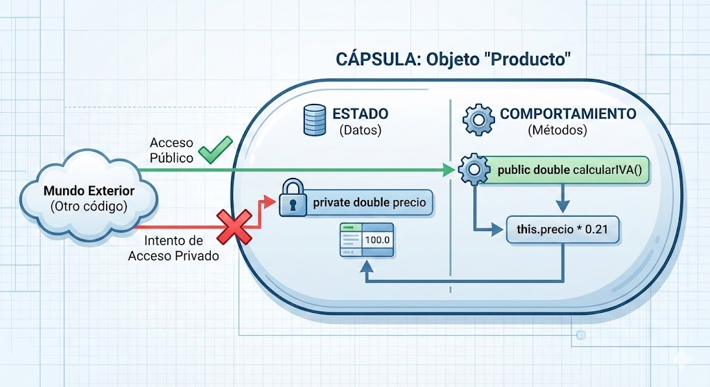
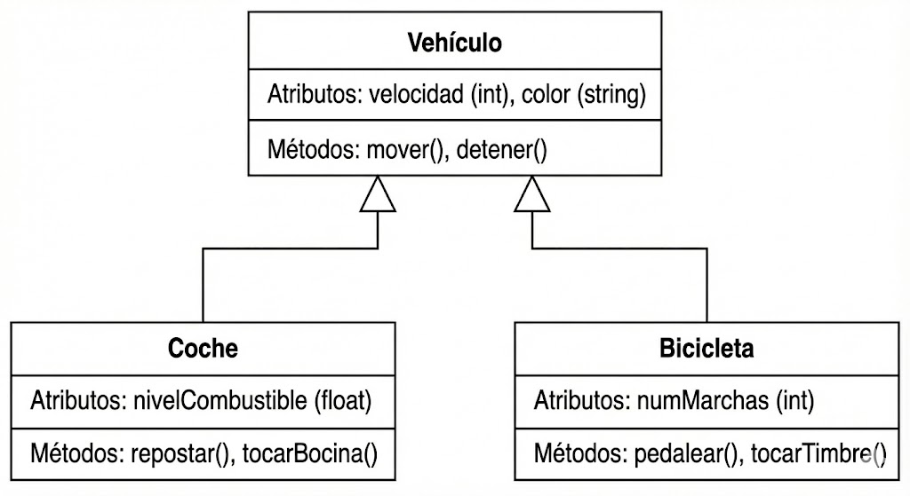

# UP07: Diseño Orientado a Objetos

## Índice

- [1. Introducción](#1-introducción)
- [2. Clases y Objetos](#2-clases-y-objetos)
  - [2.1. Clases (El Plano)](#21-clases-el-plano)
  - [2.2. Objetos (La Realidad)](#22-objetos-la-realidad)
  - [2.3. Ampliación Kotlin (Para futuros androides)](#23-ampliación-kotlin-para-futuros-androides)
- [3. Encapsulamiento y Visibilidad](#3-encapsulamiento-y-visibilidad)
  - [3.1. Modificadores de Visibilidad](#31-modificadores-de-visibilidad)
  - [3.2. Getters y Setters: La Puerta de Entrada Controlada](#32-getters-y-setters-la-puerta-de-entrada-controlada)
  - [3.3. Ampliación Kotlin (La magia de las propiedades)](#33-ampliación-kotlin-la-magia-de-las-propiedades)
- [4. Herencia](#4-herencia)
  - [4.1. Superclases y Subclases](#41-superclases-y-subclases)
  - [4.2. Implementación en Java (`extends` y `super`)](#42-implementación-en-java-extends-y-super)
  - [4.3. Sobrescritura de Métodos (`@Override`)](#43-sobrescritura-de-métodos-override)
  - [4.4. Ampliación Kotlin (Herencia con `open` y `:`)](#44-ampliación-kotlin-herencia-con-open-y-)
- [5. Clases Abstractas](#5-clases-abstractas)
  - [5.1. Métodos Abstractos](#51-métodos-abstractos)
  - [5.2. Implementación en Java (`abstract`)](#52-implementación-en-java-abstract)
  - [5.3. Ampliación Kotlin (Misma palabra clave `abstract`)](#53-ampliación-kotlin-misma-palabra-clave-abstract)
- [6. Polimorfismo e Interfaces](#6-polimorfismo-e-interfaces)
  - [6.1. La Solución: Interfaces](#61-la-solución-interfaces)
  - [6.2. Polimorfismo en Acción](#62-polimorfismo-en-acción)
  - [6.3. Ampliación Kotlin (Interfaces y Polimorfismo)](#63-ampliación-kotlin-interfaces-y-polimorfismo)
- [Recursos Complementarios](#recursos-complementarios)
- [Actividad Propuesta: Los empleados de Temeria. Orden y Orens](#actividad-propuesta-los-empleados-de-temeria-orden-y-orens)
- [Ampliación Orden y Orens. Interfaces](#ampliación-orden-y-orens-interfaces)
- [Ampliación Principios SOLID](#ampliación-principios-solid)

## 1. Introducción

*Hágase la luz, y fue la luz.* Al principio de los tiempos, los programas eran simples secuencias de instrucciones. Este paradigma, conocido como **Programación Estructurada**, permitió a los desarrolladores crear software funcional y eficiente. En este paradigma, el enfoque principal estaba en las **funciones** y **procedimientos** que manipulaban datos. Datos entraban, se procesaban y salían, todo en un flujo lineal de *instrucciones / sentencias*.

Por ejemplo, un programa para calcular el IVA de una lista de productos en un fichero de texto contendría funciones para leer el fichero, calcular el IVA y escribir los resultados en otro fichero:

```java
public class ProgramaIVA {
    // Función para calcular el IVA
    public static double calcularIVA(double[] precios) {
        double totalIVA = 0;
        for (double precio : precios) {
            totalIVA += precio * 0.21;
        }
        return totalIVA;
    }

    // Función para leer un fichero (simulada)
    public static double[] leerFichero(String nombreFichero) {
        // Aquí iría la lógica de lectura
        return new double[]{100, 200, 50}; // ejemplo
    }

    // Función para escribir un fichero (simulada)
    public static void escribirFichero(String nombreFichero, double resultado) {
        System.out.println("IVA total: " + resultado);
    }

    // Punto de entrada: flujo principal
    public static void main(String[] args) {
        double[] productos = leerFichero("productos.txt");
        double ivaTotal = calcularIVA(productos);
        escribirFichero("resultados.txt", ivaTotal);
    }
}
```

Pero a medida que los sistemas crecían en complejidad, surgió la necesidad de una nueva forma de pensar sobre el diseño del software. Esto era especialmente evidente a la hora de querer **modificar o ampliar funcionalidades** sin afectar otras partes del sistema, te obligaba a estar familiarizado con todo el código y su lógica interna, lo cual es muy difícil en *codebases* grandes además de ser propenso a **errores**. Imagínate que ahora te piden que algunos productos tienen un IVA reducido o están exentos, tendrías que modificar la función de cálculo del IVA y posiblemente otras partes del código, lo que aumenta el riesgo de introducir errores.

Así nació el paradigma de la **Programación Orientada a Objetos (POO)**, una revolución que transformó la manera en que concebimos y construimos aplicaciones. La POO introduce conceptos fundamentales como **clases**, **objetos**, **encapsulamiento**, **herencia** y **polimorfismo**, que permiten a los desarrolladores modelar el mundo real de una manera más intuitiva y manejable. Al encapsular datos y comportamientos dentro de objetos, la POO facilita la **reutilización del código**, mejora la **mantenibilidad** y permite una mayor **modularidad** en el diseño del software. En este capítulo, exploraremos los principios básicos de la POO y cómo aplicarlos para crear sistemas más robustos y flexibles. Por ejemplo, el mismo programa de cálculo de IVA podría ser reestructurado utilizando POO de la siguiente manera:

```java
// Clase que representa un producto
class Producto {
    // ESTADO (Datos)
    private double precio;

    public Producto(double precio) {
        this.precio = precio;
    }

    // COMPORTAMIENTO (Métodos)
    // El producto es responsable de saber su propio impuesto
    public double calcularIVA() {
        return this.precio * 0.21;
    }
}

// Clase que maneja la lógica del programa
public class ProgramaIVA {
    // Método para leer productos desde un fichero (simulado)
    public static Producto[] leerFichero(String nombreFichero) {
        // Aquí iría la lógica de lectura
        return new Producto[]{new Producto(100), new Producto(200), new Producto(50)}; // ejemplo
    }

    // Método para escribir resultados en un fichero (simulado)
    public static void escribirFichero(String nombreFichero, double resultado) {
        System.out.println("IVA total: " + resultado);
    }

    // Punto de entrada: flujo principal
    public static void main(String[] args) {
        Producto[] productos = leerFichero("productos.txt");
        double ivaTotal = 0;
        for (Producto producto : productos) {
            ivaTotal += producto.calcularIVA();
        }
        escribirFichero("resultados.txt", ivaTotal);
    }
}
```

En este enfoque orientado a objetos, cada producto es una instancia de la clase `Producto`, que encapsula tanto el precio como el método para calcular el IVA. Esto no solo mejora la **claridad del código**, sino que también facilita la **extensión y modificación** del programa en el futuro. Gracias a otras características de la POO, como la **herencia** y el **polimorfismo**, podemos crear jerarquías de clases y comportamientos dinámicos que se adaptan a las necesidades cambiantes del software moderno, por ejemplo para productos con diferentes tipos de IVA (exento, reducido, general, etc.), lo cual sería mucho más complicado de manejar en un enfoque estructurado.

> [!NOTE]
> En este enfoque, cada producto es una **instancia** de la **clase** `Producto`, que encapsula tanto el **estado** (precio) como el **comportamiento** (método para calcular el IVA). Estos viajan junto en una *cápsula* llamada objeto. Esto facilita que si mañana cambia la ley del IVA, sólo tengamos que modificar la clase `Producto` sin prestar atención al resto del código.



Es esta **facilidad para modelar sistemas complejos** por analogía con la realidad y **adaptarse a cambios** lo que ha hecho de la Programación Orientada a Objetos un pilar fundamental en el desarrollo de software contemporáneo.

> [!TIP]
> En inglés se utiliza el acrónimo **OOP** (*Object-Oriented Programming*) para referirse a la Programación Orientada a Objetos.

## 2. Clases y Objetos

En la Programación Orientada a Objetos, los **objetos** son las unidades fundamentales que representan entidades del mundo real o conceptos abstractos dentro de un programa. Un objeto es una instancia de una **clase**, que actúa como un molde o plantilla que define las características y comportamientos comunes de esos objetos.

### 2.1. Clases (El Plano)

Una **clase** es una definición que agrupa datos y métodos relacionados. No es el objeto en sí, sino las instrucciones para crearlo.

- **Atributos (Datos):** Representan el estado (color, marca, velocidad).
- **Métodos (Comportamiento):** Representan lo que el objeto sabe hacer (arrancar, frenar).

Por ejemplo, la clase `Coche`:

```java
class Coche {
    // Atributos (estado)
    private String marca;
    private String modelo;
    private int año;

    // CONSTRUCTOR: El método especial que se ejecuta al "nacer" el objeto
    public Coche(String marca, String modelo, int año) {
        this.marca = marca;
        this.modelo = modelo;
        this.año = año;
    }

    // Métodos (comportamiento)
    public void arrancar() {
        System.out.println("El coche " + marca + " " + modelo + " está arrancando.");
    }

    public void detener() {
        System.out.println("El coche " + marca + " " + modelo + " se ha detenido.");
    }
}
```

**Nota importante:** Una clase no ocupa memoria de ejecución por sí misma; es simplemente papel mojado hasta que usamos la palabra mágica: `new`.

### 2.2. Objetos (La Realidad)

Un **objeto** es una instancia concreta creada a partir de la clase. Aquí es donde ocurre la magia:

1. La palabra clave **`new`** reserva espacio real en la memoria del ordenador.
2. Se llama al **constructor** para rellenar los datos iniciales.

De una sola clase `Coche`, podemos fabricar infinitos objetos distintos:

```java
public class Main {
    public static void main(String[] args) {
        // 1. Instanciación: 'new' crea el objeto en memoria
        // 'miCoche' es la variable que nos permite controlarlo
        Coche miCoche = new Coche("Opel", "Corsa", 2008);
        Coche tuCoche = new Coche("Honda", "Civic", 2019);

        // 2. Interacción: Usamos el punto (.) para pedirle al objeto que haga cosas
        miCoche.arrancar(); // El Opel arranca
        tuCoche.arrancar(); // El Honda arranca

        miCoche.detener();
    }
}
```

### 2.3. Ampliación Kotlin (Para futuros androides)

Kotlin es un lenguaje moderno que simplifica enormemente la escritura de código (boilerplate). Es el lenguaje oficial de Android y, aunque es tan potente como Java, tiene una sintaxis limpia y concisa que recuerda a Python.

Fíjate cómo todo el código anterior se reduce drásticamente porque el constructor y la declaración de propiedades se fusionan en la misma línea:

```kotlin
// En una sola línea definimos clase, atributos y constructor
class Coche(private val marca: String, private val modelo: String, private val año: Int) {
    
    fun arrancar() {
        // Usamos $ para insertar variables directamente en el texto (String Templates)
        println("El coche $marca $modelo está arrancando.")
    }

    fun detener() {
        println("El coche $marca $modelo se ha detenido.")
    }
}

fun main() {
    // No necesitamos 'new', Kotlin es listo
    val miCoche = Coche("Opel", "Corsa", 2008)
    val tuCoche = Coche("Honda", "Civic", 2019)

    miCoche.arrancar()
    tuCoche.arrancar()
}
```

Si te interesa Kotlin, no olvides consultar su web oficial: [kotlinlang.org](https://kotlinlang.org/). Es la evolución natural que veréis en el módulo de PMDM (Programación Multimedia y Dispositivos Móviles).

## 3. Encapsulamiento y Visibilidad

El **encapsulamiento** es uno de los pilares de la POO y se puede resumir en una idea muy simple: **proteger los datos de un objeto**. La idea es tratar a los objetos como "cajas negras": conocemos su interfaz pública (los botones que podemos pulsar), pero no necesitamos saber (ni nos debe importar) cómo funcionan por dentro.

> [!NOTE]
> El objetivo del encapsulamiento es **proteger la integridad del estado interno de un objeto** y **controlar cómo se accede y modifica ese estado**. Al desarrollador le reduce la carga cognitiva, ya que no necesita entender los detalles internos de cada objeto para usarlo correctamente, solo su interfaz pública (qué métodos puede llamar y lo que éstos devuelven). No confundir con la encriptación ni la seguridad informática, no es ese tipo de protección.

Imagina un coche. Tú no inyectas gasolina directamente en el pistón con una jeringuilla. En su lugar, pisas el pedal del acelerador (un método público), y el coche se encarga internamente de gestionar el motor, la inyección y la combustión (lógica privada). Esto protege la integridad del motor y simplifica su uso.

En programación, esto se logra ocultando el estado interno de un objeto (sus atributos) y exponiendo solo los métodos necesarios para interactuar con él. Para controlar quién puede ver o modificar qué, usamos los **modificadores de visibilidad**.

### 3.1. Modificadores de Visibilidad

Estos son los "permisos" que le damos a nuestro código. Los más comunes son:

| Modificador | Visibilidad                                                              |
| :---------- | :------------------------------------------------------------------------ |
| `public`    | Accesible desde cualquier parte del programa.                             |
| `private`   | Accesible **solo** desde dentro de la propia clase.                       |
| `protected` | Accesible desde la propia clase y desde las clases que hereden de ella. |
| *default*   | (Si no se especifica) Accesible solo desde clases del mismo paquete.      |

> [!IMPORTANT]
> Por norma general, **todos los atributos de una clase deben ser `private`**. El acceso a ellos se debe gestionar a través de métodos públicos.

Un paquete es como una carpeta que agrupa clases relacionadas. Por ejemplo `ui` en la imagen de abajo que contendría todas las clases relacionadas con la interfaz de usuario.


### 3.2. Getters y Setters: La Puerta de Entrada Controlada

Si los atributos deben ser privados, ¿cómo los leemos o modificamos? --> A través de métodos públicos diseñados específicamente para ello:

- **Getters:** Métodos para *obtener* el valor de un atributo (solo lectura). Suelen empezar por `get...`.
- **Setters:** Métodos para *establecer* el valor de un atributo (escritura). Permiten añadir lógica de validación. Suelen empezar por `set...`.

Veamos un ejemplo con una cuenta bancaria. Queremos asegurarnos de que el saldo nunca sea negativo y que solo se puedan ingresar cantidades positivas.

```java
public class CuentaBancaria {
    private double saldo; // Atributo privado. Nadie puede modificarlo directamente.

    // CONSTRUCTOR
    public CuentaBancaria() {
        this.saldo = 0.0; // Saldo inicial
    }

    // GETTER: Permite consultar el saldo desde fuera
    public double getSaldo() {
        return this.saldo;
    }

    // MÉTODO PÚBLICO que modifica el estado (similar a un setter)
    public void ingresar(double cantidad) {
        if (cantidad > 0) {
            this.saldo += cantidad;
        } else {
            System.out.println("Error: La cantidad a ingresar debe ser positiva.");
        }
    }

    // OTRO MÉTODO PÚBLICO que modifica el estado
    public void retirar(double cantidad) {
        if (cantidad > 0 && this.saldo >= cantidad) {
            this.saldo -= cantidad;
        } else {
            System.out.println("Error: Cantidad inválida o saldo insuficiente.");
        }
    }
}

// Uso desde otra clase
CuentaBancaria miCuenta = new CuentaBancaria();
miCuenta.ingresar(100.0); // Correcto
System.out.println("Saldo actual: " + miCuenta.getSaldo()); // Imprime 100.0

miCuenta.retirar(30.0); // Correcto
System.out.println("Saldo actual: " + miCuenta.getSaldo()); // Imprime 70.0

miCuenta.retirar(80.0); // Incorrecto, saldo insuficiente. El método lo impide.
System.out.println("Saldo final: " + miCuenta.getSaldo()); // Sigue siendo 70.0
```

> [!TIP]
> ¡No escribas los getters y setters a mano! Todos los IDEs modernos (IntelliJ, Eclipse, VS Code) pueden generarlos automáticamente. En IntelliJ, haz clic derecho en la clase -> `Generate...` -> `Getter and Setter`.

### 3.3. Ampliación Kotlin (La magia de las propiedades)

Aquí es donde Kotlin brilla por su concisión. En Kotlin, los getters y setters se generan automáticamente para las propiedades declaradas con `var` (variable) o `val` (constante). Son invisibles, pero existen.

```kotlin
class CuentaBancaria {
    var saldo: Double = 0.0
        private set // El setter es privado, solo se puede modificar desde dentro de la clase

    // Método público para ingresar dinero
    fun ingresar(cantidad: Double) {
        if (cantidad > 0) {
            saldo += cantidad
        } else {
            println("Error: La cantidad a ingresar debe ser positiva.")
        }
    }

    // Método público para retirar dinero
    fun retirar(cantidad: Double) {
        if (cantidad > 0 && saldo >= cantidad) {
            saldo -= cantidad
        } else {
            println("Error: Cantidad inválida o saldo insuficiente.")
        }
    }
}

// Uso desde otra parte
fun main() {
    val miCuenta = CuentaBancaria()
    miCuenta.ingresar(100.0)
    println("Saldo actual: ${miCuenta.saldo}") // Imprime 100.0

    miCuenta.retirar(30.0)
    println("Saldo actual: ${miCuenta.saldo}") // Imprime 70.0

    miCuenta.retirar(80.0) // Incorrecto, saldo insuficiente
    println("Saldo final: ${miCuenta.saldo}") // Sigue siendo 70.0
}
```

----

## 4. Herencia

La **herencia** es un mecanismo que permite a una clase (llamada **clase hija** o **subclase**) adquirir los atributos y métodos de otra clase (llamada **clase padre** o **superclase**). Es la forma que tiene la POO de representar la relación **"es un..."**.

- Un `Coche` **es un** `Vehiculo`.
- Un `Perro` **es un** `Animal`.
- Un `Guerrero` **es un** `Personaje`.

El objetivo principal es la **reutilización de código**. En lugar de reescribir las mismas propiedades y comportamientos una y otra vez, los defines una vez en la clase padre y las clases hijas los heredan automáticamente.



### 4.1. Superclases y Subclases

- **Superclase (Padre):** La clase general que contiene los atributos y métodos comunes. Ejemplo: `Vehiculo`.
- **Subclase (Hija):** La clase especializada que hereda de la superclase y puede añadir sus propios atributos y métodos, o modificar los heredados. Ejemplo: `Coche`, `Bicicleta`.

### 4.2. Implementación en Java (`extends` y `super`)

En Java, usamos la palabra clave `extends` para indicar que una clase hereda de otra.

```java
// CLASE PADRE (Superclase)
public class Vehiculo {
    protected String marca; // 'protected' es visible para la clase y sus hijas
    protected String modelo;

    // Constructor de la clase padre
    public Vehiculo(String marca, String modelo) {
        this.marca = marca;
        this.modelo = modelo;
    }

    public void arrancar() {
        System.out.println("El vehículo " + marca + " " + modelo + " ha arrancado.");
    }
}

// CLASE HIJA (Subclase)
public class Coche extends Vehiculo {
    private int numeroPuertas; // Atributo específico de Coche

    // Constructor de la clase hija
    public Coche(String marca, String modelo, int numeroPuertas) {
        // 1. La primera llamada DEBE ser a 'super()' para construir la parte "Vehiculo"
        super(marca, modelo); 
        // 2. Luego, inicializamos los atributos propios de Coche
        this.numeroPuertas = numeroPuertas;
    }
}

// USO
Coche miCoche = new Coche("Seat", "Ibiza", 5);
miCoche.arrancar(); // -> "El vehículo Seat Ibiza ha arrancado." (Método heredado)
```

> [!IMPORTANT]
> La palabra clave `super()` llama al constructor de la clase padre. Es obligatorio llamarlo y debe ser la **primera instrucción** en el constructor de la clase hija.

### 4.3. Sobrescritura de Métodos (`@Override`)

Una clase hija puede proporcionar su propia implementación de un método que ya existe en la clase padre. Esto se llama **sobrescritura** (*overriding*). Para ello, se utiliza la anotación `@Override`, que le indica al compilador nuestra intención y nos avisa si cometemos un error (por ejemplo, si el nombre del método no coincide).

```java
public class CocheElectrico extends Coche {

    public CocheElectrico(String marca, String modelo, int numeroPuertas) {
        super(marca, modelo, numeroPuertas);
    }

    // Sobrescribimos el método arrancar() para que sea diferente
    @Override
    public void arrancar() {
        // Podríamos llamar al método original del padre si queremos con 'super'
        // super.arrancar(); 
        System.out.println("El coche eléctrico " + marca + " " + modelo + " arranca en silencio.");
    }
}

// USO
CocheElectrico miTesla = new CocheElectrico("Tesla", "Model 3", 5);
miTesla.arrancar(); // -> "El coche eléctrico Tesla Model 3 arranca en silencio."
```

### 4.4. Ampliación Kotlin (Herencia con `open` y `:`)

En Kotlin, la herencia es más explícita para evitar errores. Por defecto, todas las clases son `final` (no se puede heredar de ellas). Para permitir la herencia, debes marcar la clase padre con la palabra clave `open`. Lo mismo ocurre con los métodos que quieras sobrescribir.

- **`open class`**: Permite que otras clases hereden de esta.
- **`open fun`**: Permite que las clases hijas sobrescriban este método.
- **`:`**: Reemplaza a `extends` de Java.
- **`override`**: Reemplaza a la anotación `@Override`.

```kotlin
// CLASE PADRE (debe ser 'open')
open class Vehiculo(protected val marca: String, protected val modelo: String) {
    
    // El método también debe ser 'open' para poder ser sobrescrito
    open fun arrancar() {
        println("El vehículo $marca $modelo ha arrancado.")
    }
}

// CLASE HIJA (hereda con ':')
// También la marcamos como 'open' para que CocheElectrico pueda heredar de ella
open class Coche(
    marca: String, 
    modelo: String, 
    private val numeroPuertas: Int
) : Vehiculo(marca, modelo) { // Llama al constructor del padre
    // No necesita cuerpo si no añade más lógica
}

// OTRA CLASE HIJA. No se podrá heredar de Bicicleta porque no es 'open'
class Bicicleta(
    marca: String, 
    modelo: String
) : Vehiculo(marca, modelo) {
    // Bicicleta no añade nada más por ahora
}

// CLASE NIETA que sobrescribe un método
class CocheElectrico(
    marca: String, 
    modelo: String, 
    numeroPuertas: Int
) : Coche(marca, modelo, numeroPuertas) {

    // Sobrescribimos el método arrancar() con la palabra clave 'override'
    override fun arrancar() {
        println("El coche eléctrico $marca $modelo arranca en silencio.")
    }
}

// USO
fun main() {
    val miCoche = Coche("Seat", "Ibiza", 5)
    miCoche.arrancar() // -> "El vehículo Seat Ibiza ha arrancado."

    val miTesla = CocheElectrico("Tesla", "Model 3", 5)
    miTesla.arrancar() // -> "El coche eléctrico Tesla Model 3 arranca en silencio."
}
```

## 5. Clases Abstractas

A veces, en la jerarquía de la herencia, existen clases que son tan generales que no tiene sentido crear objetos de ellas. Por ejemplo, ¿has visto alguna vez un "Animal" genérico paseando por la calle? No. Ves un perro, un gato o una paloma, que son tipos específicos de animales. En POO, "Animal" sería un concepto, una plantilla, no un objeto real.

Una **clase abstracta** es una clase que sirve como plantilla para otras clases, pero de la cual **no se pueden crear instancias** (objetos). Su propósito es definir una estructura y un comportamiento comunes que sus clases hijas deben seguir.

> [!IMPORTANT]
> Regla de oro: Si una clase es `abstract`, **no puedes hacer `new ClaseAbstracta()`**. Su única finalidad es ser heredada por otras clases.

### 5.1. Métodos Abstractos

La verdadera potencia de las clases abstractas reside en los **métodos abstractos**. Un método abstracto es una declaración de un método sin implementación (sin cuerpo, sin `{...}`). Es como un contrato que obliga a todas las clases hijas a proporcionar su propia versión de ese método.

- Si una clase contiene uno o más métodos abstractos, la clase entera **debe** ser declarada como `abstract`.
- Una clase hija que hereda de una clase abstracta está **obligada** a implementar (sobrescribir) todos los métodos abstractos de su padre.

### 5.2. Implementación en Java (`abstract`)

Usemos el ejemplo de un juego de rol. Todos los personajes (`Personaje`) tienen un nombre y vida, pero cada uno ataca de forma diferente. `Personaje` es un candidato perfecto para ser una clase abstracta.

```java
// CLASE ABSTRACTA: No se puede instanciar new Personaje()
public abstract class Personaje {
    protected String nombre;
    protected int vida;

    public Personaje(String nombre, int vida) {
        this.nombre = nombre;
        this.vida = vida;
    }

    // MÉTODO ABSTRACTO: Sin implementación. Obliga a las hijas a definirlo.
    public abstract void atacar();

    // MÉTODO CONCRETO: Comportamiento común que se hereda directamente.
    public void recibirDaño(int daño) {
        this.vida -= daño;
        System.out.println(nombre + " recibe " + daño + " puntos de daño. Vida restante: " + vida);
    }
}

// CLASE HIJA CONCRETA: Implementa el método abstracto
public class Guerrero extends Personaje {
    private int fuerza;

    public Guerrero(String nombre, int vida, int fuerza) {
        super(nombre, vida);
        this.fuerza = fuerza;
    }

    // Implementación obligatoria del método abstracto
    @Override
    public void atacar() {
        System.out.println(nombre + " ataca con su espada, causando " + fuerza + " de daño físico.");
    }
}

// OTRA CLASE HIJA CONCRETA
public class Mago extends Personaje {
    private int poderMagico;

    public Mago(String nombre, int vida, int poderMagico) {
        super(nombre, vida);
        this.poderMagico = poderMagico;
    }

    // Implementación obligatoria, pero diferente a la del Guerrero
    @Override
    public void atacar() {
        System.out.println(nombre + " lanza un hechizo, causando " + poderMagico + " de daño mágico.");
    }
}

// USO
// Personaje p = new Personaje("Genérico", 100); // ¡ERROR DE COMPILACIÓN! No se puede instanciar.
Guerrero conan = new Guerrero("Conan", 150, 25);
Mago gandalf = new Mago("Gandalf", 80, 40);

conan.atacar();   // -> "Conan ataca con su espada..."
gandalf.atacar(); // -> "Gandalf lanza un hechizo..."
```

### 5.3. Ampliación Kotlin (Misma palabra clave `abstract`)

Kotlin utiliza la misma palabra clave `abstract` tanto para clases como para métodos, manteniendo la lógica de Java pero con una sintaxis más limpia.

```kotlin
// CLASE ABSTRACTA
abstract class Personaje(protected val nombre: String, protected var vida: Int) {
    
    // MÉTODO ABSTRACTO
    abstract fun atacar()

    // MÉTODO CONCRETO
    fun recibirDaño(daño: Int) {
        vida -= daño
        println("$nombre recibe $daño puntos de daño. Vida restante: $vida")
    }
}

// CLASE HIJA CONCRETA
class Guerrero(nombre: String, vida: Int, private val fuerza: Int) : Personaje(nombre, vida) {
    
    override fun atacar() {
        println("$nombre ataca con su espada, causando $fuerza de daño físico.")
    }
}

// OTRA CLASE HIJA CONCRETA
class Mago(nombre: String, vida: Int, private val poderMagico: Int) : Personaje(nombre, vida) {

    override fun atacar() {
        println("$nombre lanza un hechizo, causando $poderMagico de daño mágico.")
    }
}

fun main() {
    // val p = Personaje("Genérico", 100) // ¡ERROR! No se puede instanciar
    val conan = Guerrero("Conan", 150, 25)
    val gandalf = Mago("Gandalf", 80, 40)

    conan.atacar()
    gandalf.atacar()
}
```

En resumen, las clases abstractas son la herramienta perfecta para definir una "idea" o "concepto" base que comparte código común pero que necesita que sus especializaciones completen los detalles.

## Recursos Complementarios

- Playlist Curso POO (Youtube): [https://www.youtube.com/watch?v=L8ywM1BQwT0&list=PLU8oAlHdN5Bmfy5fL2-ByDUGa9cMagEXK&index=1](https://www.youtube.com/watch?v=L8ywM1BQwT0&list=PLU8oAlHdN5Bmfy5fL2-ByDUGa9cMagEXK&index=1)

## Actividad Propuesta: Los empleados de Temeria. Orden y Orens

En el universo de Andrzej Sapkowski, Temeria es un reino próspero conocido por su diversidad cultural y su compleja estructura social. Nos situamos en un momento en el que el rey Foltest sigue gobernando, y la administración del reino está en pleno auge. Para gestionar eficientemente los recursos humanos del reino, se ha decidido implementar un sistema de gestión de empleados utilizando los principios de la Programación Orientada a Objetos (POO).

A continuación encontrarás el mensaje del rey Foltest solicitando tu ayuda:

**DE:** Su Majestad el Rey Foltest, Señor de Temeria, Pontar y Mahakam.
**PARA:** El Gran Maestro de la Lógica (Tú, el alumno).
**ASUNTO:** Proyecto "Orden y Orens".

Las arcas de Temeria son un desastre. Mi chambelán mezcla las nóminas de mis leales caballeros con los pagos a esos brujos mutantes que vagan por los caminos. Ayer casi le pagamos vacaciones pagadas a un mercenario borracho, y la hechicera Triss Merigold está furiosa porque le hemos pagado por horas como si fuera una jornalera.

Necesito que pongas orden en este caos. Debes diseñar el **Sistema de Gestión de Súbditos (SGS)** utilizando tus artes arcanas (Java y POO).

El sistema debe distinguir claramente entre quienes sirven en mi corte y quienes trabajan bajo contrato temporal. Aquí tienes las especificaciones del escriba real:

----

### 1. El Registro Único (`Empleado`)

Todo aquel que reciba un Oren de mis arcas debe estar registrado. No importa si es noble o plebeyo, todos comparten:

- Un **Nombre** y una **Edad**.
- Todos deben **`trabajar()`**, aunque cada uno lo haga a su manera.
- Todos deben **`calcularSalario()`**, pues nadie trabaja gratis.
- *Nota del Escriba:* Como no existe un "trabajador genérico" (nadie cobra por respirar), este registro debe ser **Abstracto**.

### 2. Las Dos Castas

Mi corte se divide en dos grandes grupos. Debes crear una distinción clara (Clases Intermedias):

#### A. La Nobleza de Palacio (`EmpleadoCorte`)

Son mis leales servidores fijos. Viven en el castillo y comen de mi mesa.

- Gozan de un **Sueldo Fijo** mensual, pase lo que pase.
- Tienen el privilegio de **`solicitarVacaciones()`**. Cuando lo hacen, deben presentar una solicitud formal ante el chambelán.

#### B. Los Caminantes (`EmpleadoExterno`)

Son profesionales libres. Hoy están aquí, mañana en Redania.

- No tienen sueldo fijo. Cobran una **Tarifa** acordada multiplicada por los **Trabajos/Monstruos** realizados ese mes.
- No tienen vacaciones, pero el sistema debe permitir **`renovarContrato()`** cuando su servicio ha sido satisfactorio.

----

### 3. Los Oficios (Clases Concretas)

Finalmente, debes implementar los roles específicos que deambulan por Temeria:

- ⚔️ **El Caballero:** Pertenece a la Corte. Porta un **Arma** distintiva (como una Espada Bastarda o una Lanza). Cuando trabaja, **patrulla las murallas** protegiendo el reino.
- ✨ **El Mago:** Pertenece a la Corte. Se le clasifica por su **Nivel de Magia** (entero). Cuando trabaja, **conjura hechizos** acordes a su nivel para proteger la corona.
- 💰 **El Mercenario:** Es un Externo. Cobra por día. Cuando trabaja, **acepta encargos de escolta** o defensa de caravanas.
- 🐺 **El Brujo:** Es un Externo, un mal necesario. Pertenece a una **Escuela** (Lobo, Gato, Grifo...). Cuando trabaja, **medita y rastrea bestias** peligrosas.

----

### 4. La Prueba de Fuego (`GestionTemeria`)

Para demostrar que tu sistema funciona, debes convocar una asamblea (Clase Main) donde:

1. Reclutes una cuadrilla variada (un Array) con al menos:
    - *Vernon Roche* (Caballero).
    - *Triss Merigold* (Maga).
    - *Geralt de Rivia* (Brujo).
2. Pases revista a todos ellos:
    - Deben decirte quiénes son.
    - Debes ordenarles que trabajen.
    - Debes calcular cuánto oro debo pagarles este mes.
    - **¡Importante!** Si es alguien de la corte, verifica si quiere vacaciones. Si es un externo, renueva su contrato. Para esto necesitarás usar `instanceof` y casting.

*¡Hazlo bien, y serás recompensado! Falla, y te enviaremos a las mazmorras con los nekkers.*

----

### Guía Técnica Rápida

*Por si el decreto real te confunde, aquí tienes la traducción a "Lenguaje Java":*

1. **Herencia de 3 Niveles:** `Empleado` (Abuelo) -> `EmpleadoCorte`/`EmpleadoExterno` (Padres) -> `Caballero`/`Brujo`... (Nietos).
2. **Abstracción:** Las clases `Empleado`, `EmpleadoCorte` y `EmpleadoExterno` deben ser `abstract`. No queremos instanciar un "Empleado de Corte" genérico, queremos un Caballero o un Mago.
3. **Polimorfismo:** En el Main, usa un `ArrayList<Empleado>`.
4. **Casting (`instanceof`):** En el bucle, tendrás que preguntar `if (e instanceof EmpleadoCorte)` para poder llamar al método `solicitarVacaciones()`, ya que la clase padre `Empleado` no conoce ese método.

----

No es preciso entregar esta actividad, en un mundo asolado por la inteligencia artificial no tiene sentido que os pida entregar esto como tarea evaluable. Sí que os animo a hacerla porque es un buen ejercicio para afianzar los conceptos de POO vistos en este capítulo, y va alineado con lo que preguntaré en el examen del **segundo** semestre, pues está relacionado con todo el tema de POO / UML. Si alguien quiere compartir su solución conmigo, estaré encantado de verla y darle feedback, tanto en Java como en Kotlin (especialmente Kotlin, que es el futuro). Probablemente suba mi solución a GitHub próximamente, en Kotlin.

Por ajustarme al tema de la calificación, sí que subiré un cuestionario en los próximos días cuya calificación corresponderá a la contribución de la UP07 a la evaluación continua del módulo EDE.

## 6. Polimorfismo e Interfaces

El **polimorfismo** es otro de los pilares fundamentales de la Programación Orientada a Objetos. La palabra "polimorfismo" proviene del griego y significa "muchas formas". En términos simples, el polimorfismo permite que una misma interfaz o método se comporte de diferentes maneras según el objeto que lo esté utilizando. Esto es especialmente útil cuando se trabaja con jerarquías de clases y herencia, ya que permite tratar objetos de diferentes clases de manera uniforme.

Sin embargo, el polimorfismo encuentra una limitación cuando, por efecto de una hipotética herencia múltiple, encontramos una ambigüedad. Vamos a verlo con un ejemplo sencillo. Supongamos que tenemos una clase base `Animal` y algunos de estos animales son `Mamíferos`.
Ahora, pensemos en un `Delfin`. Un delfín **es un** `Mamifero`, pero también **es un** animal `Acuatico`. Si quisiéramos modelar esto con herencia, nos encontraríamos con un problema:

```text
    Animal
    /    \
 Mamifero  Acuatico
    \    /
    Delfin
```

Este esquema se conoce como el **"Problema del Diamante"**. Imagina que tanto `Mamifero` como `Acuatico` tienen un método con el mismo nombre, por ejemplo, `desplazarse()`.

- `Mamifero.desplazarse()` podría decir: "Me desplazo por tierra".
- `Acuatico.desplazarse()` podría decir: "Me desplazo por agua".

Cuando creamos un objeto `Delfin`, ¿cuál de los dos métodos `desplazarse()` debería heredar? ¿El de `Mamifero` o el de `Acuatico`? Esta ambigüedad es la razón por la que **Java prohíbe la herencia múltiple de clases**, lo mismo sucede en Kotlin. Una clase en Java solo puede `extends` de una única superclase.

### 6.1. La Solución: Interfaces

Para resolver este problema, Java introduce el concepto de **interfaces**. Una interfaz es como un contrato que define un conjunto de métodos que una clase debe implementar. A diferencia de una clase (incluso abstracta), una interfaz no contiene estado (atributos) ni implementación para sus métodos (aunque desde Java 8 pueden tener métodos `default` con implementación).

La regla clave es:
> Una clase puede **extender** solo **una** superclase, pero puede **implementar** **múltiples** interfaces.

Así, podemos rediseñar nuestro ejemplo de la siguiente manera:

- `Animal` sigue siendo nuestra clase base (posiblemente abstracta).
- `Mamifero` es una clase que `extends Animal`.
- `Acuatico` se convierte en una **interfaz** que define el comportamiento de "ser acuático", como el método `nadar()`.

Ahora, la clase `Delfin` puede heredar su naturaleza de mamífero y, al mismo tiempo, firmar el contrato para ser acuático:

```java
// INTERFAZ: Define un contrato de comportamiento
public interface Acuatico {
    void nadar(); // Las clases que implementen Acuatico DEBEN definir este método
}

// CLASE ABSTRACTA PADRE
public abstract class Animal {
    protected String nombre;

    public Animal(String nombre) {
      this.nombre = nombre;
    }

    // Comportamiento común
    public void respirar() {
      System.out.println(nombre + " está respirando.");
    }

    // Método que todas las subclases deben definir
    public abstract void emitirSonido();
}

// CLASE HIJA
public class Mamifero extends Animal {
    public Mamifero(String nombre) {
      super(nombre);
    }

    public void amamantar() {
      System.out.println(nombre + " está amamantando a sus crías.");
    }

    @Override
    public void emitirSonido() {
      System.out.println(nombre + " emite un sonido de mamífero.");
    }
}

// CLASE QUE USA HERENCIA E INTERFACES
public class Delfin extends Mamifero implements Acuatico {

    public Delfin(String nombre) {
      super(nombre);
    }

    // Implementación obligatoria del método de la interfaz Acuatico
    @Override
    public void nadar() {
      System.out.println(nombre + " está nadando elegantemente.");
    }

    // Sobrescritura del método de Animal/Mamifero para especializarlo
    @Override
    public void emitirSonido() {
      System.out.println(nombre + " hace clics y silbidos.");
    }
}
```

De esta forma, un `Delfin` hereda todo lo de `Mamifero` (que a su vez hereda de `Animal`) y además cumple con el contrato de `Acuatico`, resolviendo el problema del diamante de forma elegante.

### 6.2. Polimorfismo en Acción

Ahora que tenemos nuestra jerarquía, veamos el polimorfismo. Podemos crear una lista de `Animal` y añadir objetos de diferentes subclases. Aunque la lista es de tipo `Animal`, cada objeto se comportará según su tipo real en tiempo de ejecución.

```java
public class Zoologico {
    public static void main(String[] args) {
      // La lista es de tipo Animal, pero contiene objetos de clases hijas.
      Animal[] animales = new Animal[2];
      animales[0] = new Delfin("Flipper");
      animales[1] = new Mamifero("Simba"); // Un mamífero genérico (si no fuera abstracta)

      for (Animal animal : animales) {
        System.out.println("--- Procesando a " + animal.nombre + " ---");
        animal.respirar();
        animal.emitirSonido(); // ¡POLIMORFISMO! Se llama al método de la clase real (Delfin o Mamifero)

        // Si queremos usar un método específico de una subclase, necesitamos hacer un casting
        if (animal instanceof Delfin) {
            Delfin delfin = (Delfin) animal; // Casting: le decimos al compilador "confía en mí, esto es un Delfin"
            delfin.nadar();
        }
      }
    }
}
```

La salida de este programa sería:

```text
--- Procesando a Flipper ---
Flipper está respirando.
Flipper hace clics y silbidos.
Flipper está nadando elegantemente.
--- Procesando a Simba ---
Simba está respirando.
Simba emite un sonido de mamífero.
```

Como puedes ver, la llamada a `animal.emitirSonido()` se comporta de forma diferente dependiendo de si el `animal` es un `Delfin` o un `Mamifero`. Esto es el polimorfismo: una misma llamada (`emitirSonido()`) tiene "muchas formas" de ejecutarse.

### 6.3. Ampliación Kotlin (Interfaces y Polimorfismo)

Kotlin también soporta interfaces y polimorfismo de manera similar a Java, pero con una sintaxis más concisa. Aquí tienes el mismo ejemplo adaptado a Kotlin:

```kotlin
// INTERFAZ
interface Acuatico {
    fun nadar()
}
// CLASE ABSTRACTA PADRE
abstract class Animal(protected val nombre: String) {
    fun respirar() {
        println("$nombre está respirando.")
    }

    abstract fun emitirSonido()
}
// CLASE HIJA
open class Mamifero(nombre: String) : Animal(nombre) {
    fun amamantar() {
        println("$nombre está amamantando a sus crías.")
    }

    override fun emitirSonido() {
        println("$nombre emite un sonido de mamífero.")
    }
}
// CLASE QUE USA HERENCIA E INTERFACES
class Delfin(nombre: String) : Mamifero(nombre), Acuatico {
    override fun nadar() {
        println("$nombre está nadando elegantemente.")
    }

    override fun emitirSonido() {
        println("$nombre hace clics y silbidos.")
    }
}
fun main() {
    val animales: Array<Animal> = arrayOf(Delfin("Flipper"), Mamifero("Simba"))

    for (animal in animales) {
        println("--- Procesando a ${animal.nombre} ---")
        animal.respirar()
        animal.emitirSonido() // POLIMORFISMO

        if (animal is Delfin) {
            animal.nadar() // No necesita casting explícito. Kotlin lo infiere.
        }
    }
} 
```

## Ampliación Orden y Orens. Interfaces

El rey Foltest ha detectado que hay un abuso de las pociones mágicas por lo que obligará a todos los empleados internos y externos de Temeria a registrarse como usuarios de pociones. Para ello, ha decidido que tanto los empleados de la corte como los externos deben implementar una interfaz llamada `UsuarioPociones` para gestionar las siguientes cuestiones:

- `MAX_POCIONES`: Una constante que define el número máximo de pociones que un usuario puede llevar (valor 3). Más de tres pociones sería sospechoso de contrabando de objetos mágicos.
- `usarPocion()`: Un método que permite al usuario consumir una poción.
- `comprarPocion()`: Un método que permite al usuario comprar una siempre y cuando no haya alcanzado el límite máximo.

Los únicas clases de empleados autorizadas a usar pociones son los `Magos` y los `Brujos`, por lo que solo estas clases deben implementar la interfaz `UsuarioPociones`.

Deberás modificar las clases concretas correspondientes para llevar la cuenta del número de pociones que cada usuario tiene y asegurarte de que no puedan comprar más de las permitidas ni usar una poción si no tienen ninguna.

De nuevo esto cambia un poco entre Kotlin y Java. En Java no puedes definir atributos en una interfaz, solo constantes (atributos `static final`), mientras que en Kotlin puedes definir propiedades en una interfaz, pero no pueden tener estado (no puedes inicializarlas directamente, solo declararlas).

## Ampliación Principios SOLID

Los principios SOLID son un conjunto de cinco principios de diseño de software orientado a objetos que buscan mejorar la calidad, mantenibilidad y escalabilidad del código. Estos principios fueron popularizados por Robert C. Martin (también conocido como "Uncle Bob") y son ampliamente utilizados en el desarrollo de software profesional. A continuación, se describen brevemente cada uno de los principios SOLID:

1. **S - Principio de Responsabilidad Única (Single Responsibility Principle - SRP):**
   - Una clase debe tener una única razón para cambiar, lo que significa que debe tener una sola responsabilidad o función. Esto facilita la comprensión y el mantenimiento del código.
2. **O - Principio de Abierto/Cerrado (Open/Closed Principle - OCP):**
   - Las entidades de software (clases, módulos, funciones, etc.) deben estar abiertas para la extensión, pero cerradas para la modificación. Esto significa que puedes agregar nuevas funcionalidades sin alterar el código existente, lo que reduce el riesgo de introducir errores.
3. **L - Principio de Sustitución de Liskov (Liskov Substitution Principle - LSP):**
   - Los objetos de una clase derivada deben poder sustituir a los objetos de la clase base sin alterar el correcto funcionamiento del programa. Esto asegura que las subclases mantengan el comportamiento esperado de la superclase.
4. **I - Principio de Segregación de Interfaces (Interface Segregation Principle - ISP):**
   - Los clientes no deben verse obligados a depender de interfaces que no utilizan. En lugar de una interfaz grande y monolítica, es mejor tener varias interfaces específicas y pequeñas que se adapten a las necesidades de los clientes.
5. **D - Principio de Inversión de Dependencias (Dependency Inversion Principle - DIP):**
   - Los módulos de alto nivel no deben depender de módulos de bajo nivel; ambos deben depender de abstracciones. Además, las abstracciones no deben depender de los detalles; los detalles deben depender de las abstracciones. Esto promueve un diseño desacoplado y facilita la reutilización del código.

Estos principios son fundamentales para el diseño de software orientado a objetos y ayudan a crear sistemas que son más fáciles de entender, mantener y escalar con el tiempo. Aplicar los principios SOLID puede conducir a un código más limpio y robusto, lo que es especialmente importante en proyectos de software grandes y complejos.
