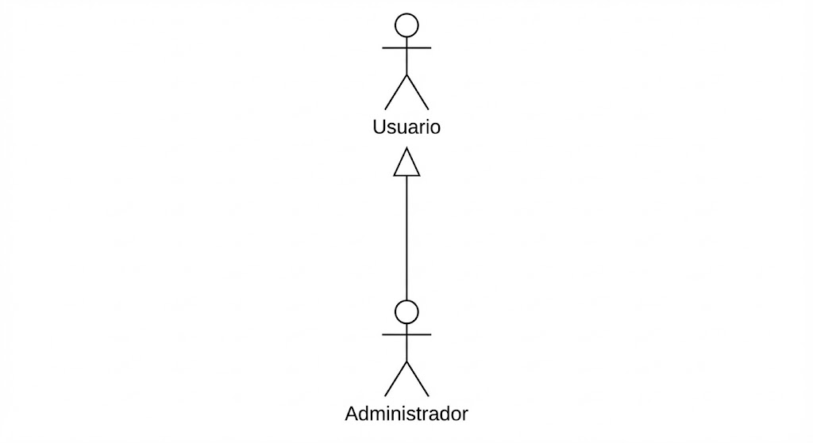
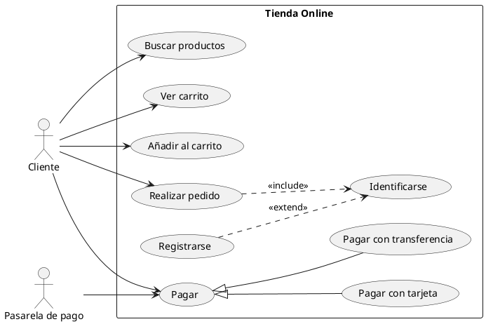
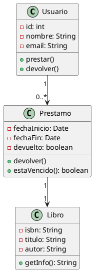
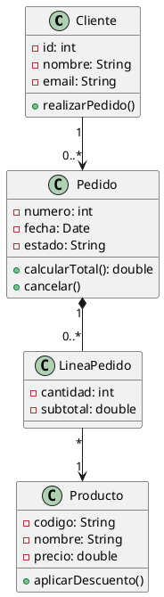
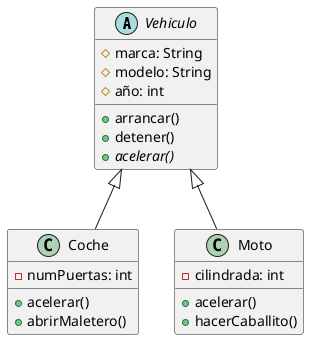
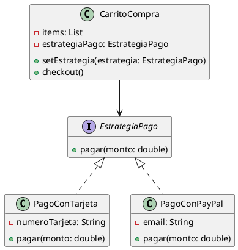
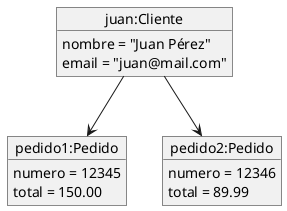

# UP8: UML. FUNDAMENTOS Y ESTRUCTURA

## ÍNDICE

- [OBJETIVOS](#objetivos)
- [1. INTRODUCCIÓN A UML](#1-introducción-a-uml)
  - [1.1. ¿Qué es UML?](#11-qué-es-uml)
  - [1.2. Breve historia de UML](#12-breve-historia-de-uml)
  - [1.3. ¿Por qué modelar software?](#13-por-qué-modelar-software)
  - [1.4. Tipos de diagramas UML](#14-tipos-de-diagramas-uml)
  - [1.5. Herramientas para crear diagramas UML](#15-herramientas-para-crear-diagramas-uml)
- [2. DIAGRAMAS DE CASOS DE USO](#2-diagramas-de-casos-de-uso)
  - [2.1. Propósito y contexto de uso](#21-propósito-y-contexto-de-uso)
  - [2.2. Elementos del diagrama](#22-elementos-del-diagrama)
  - [2.3. Relaciones entre casos de uso](#23-relaciones-entre-casos-de-uso)
  - [2.4. Ejemplos de diagramas de casos de uso](#24-ejemplos-de-diagramas-de-casos-de-uso)
  - [2.5. El dilema del formato: ¿Dibujos o Texto?](#25-el-dilema-del-formato-dibujos-o-texto)
- [3. DIAGRAMAS DE CLASES](#3-diagramas-de-clases)
  - [3.1. Propósito y contexto de uso](#31-propósito-y-contexto-de-uso)
  - [3.2. Elementos básicos: La clase](#32-elementos-básicos-la-clase)
  - [3.3. Relaciones entre clases](#33-relaciones-entre-clases)
  - [3.4. Multiplicidad](#34-multiplicidad)
  - [3.5. Clases abstractas e interfaces](#35-clases-abstractas-e-interfaces)
  - [3.6. Ejemplos de diagramas de clases](#36-ejemplos-de-diagramas-de-clases)
- [4. DIAGRAMAS DE OBJETOS](#4-diagramas-de-objetos)
  - [4.1. Propósito](#41-propósito)
  - [4.2. Elementos del diagrama](#42-elementos-del-diagrama)
  - [4.3. Ejemplo de diagrama de objetos](#43-ejemplo-de-diagrama-de-objetos)
  - [4.4. Uso práctico y alternativas](#44-uso-práctico-y-alternativas)

---

## OBJETIVOS

Al finalizar esta unidad, el alumno será capaz de:

- Comprender qué es UML y su importancia en el desarrollo de software.
- Identificar los distintos tipos de diagramas UML y cuándo usar cada uno.
- Reconocer el significado y los elementos de los diagramas de casos de uso.
- Interpretar y elaborar diagramas de casos de uso sencillos.
- **Interpretar y elaborar diagramas de clases**, identificando clases, atributos, métodos y relaciones.
- Comprender los diferentes tipos de relaciones entre clases (asociación, agregación, composición, herencia, dependencia).
- Aplicar correctamente la multiplicidad en las relaciones entre clases.
- Distinguir entre clases concretas, abstractas e interfaces.
- Interpretar diagramas de objetos y comprender su relación con los diagramas de clases.
- Conocer herramientas para la creación de diagramas UML.

---

## 1. INTRODUCCIÓN A UML

### 1.1. ¿Qué es UML?

**UML** (*Unified Modeling Language* o Lenguaje Unificado de Modelado) es un **lenguaje gráfico estandarizado** para visualizar, especificar, construir y documentar los artefactos de un sistema de software. No es un lenguaje de programación, sino un **lenguaje de modelado**: una notación visual con reglas precisas para representar sistemas.

Piensa en UML como los **planos de un arquitecto**. Si vas a construir una casa, no llamas a los albañiles para darles instrucciones sobre la marcha; primero se dibujan planos que detallan la estructura, las dimensiones y las relaciones entre los espacios. De manera similar, antes de escribir código (o durante el proceso), el equipo de desarrollo utiliza UML para visualizar y planificar la estructura y el comportamiento del software, asegurando que todos entiendan qué se va a construir.

**Características principales de UML:**

- **Estándar**: Está mantenido por el OMG (*Object Management Group*), lo que garantiza que sea un lenguaje común y reconocido internacionalmente.
- **Independiente de la tecnología**: Se puede usar para modelar sistemas en cualquier lenguaje de programación o plataforma.
- **Versátil**: Ofrece múltiples tipos de diagramas para representar diferentes aspectos de un sistema.
- **Visual**: Facilita la comunicación entre desarrolladores, analistas, clientes y otros stakeholders.

### 1.2. Breve historia de UML

En los años 80 y principios de los 90, existían múltiples metodologías de modelado orientado a objetos, cada una con su propia notación:

- **Booch** (Grady Booch)
- **OMT** - *Object Modeling Technique* (James Rumbaugh)
- **OOSE** - *Object-Oriented Software Engineering* (Ivar Jacobson)

Esta fragmentación causaba confusión: cada equipo usaba una notación diferente, dificultando la comunicación entre proyectos y organizaciones.

En 1994, Rumbaugh se unió a Booch en Rational Software, y en 1995 se les unió Jacobson. Juntos, conocidos como "los tres amigos", unificaron sus metodologías creando UML. La versión 1.0 se presentó en 1997 y fue adoptada por el OMG como estándar.

Desde entonces, UML ha evolucionado:

- **UML 1.x** (1997-2004): Versiones iniciales.
- **UML 2.0** (2005): Revisión mayor con nuevos diagramas y mejor semántica.
- **UML 2.5** (2015): Versión actual, con clarificaciones y simplificaciones.

### 1.3. ¿Por qué modelar software?

Modelar software antes o durante su desarrollo ofrece varios beneficios:

**1. Comunicación**:

Un diagrama bien hecho vale más que mil palabras. Los modelos UML permiten que desarrolladores, analistas, diseñadores y clientes compartan una visión común del sistema. Un cliente puede no entender código Java, pero probablemente pueda entender un diagrama de casos de uso que muestre qué podrá hacer con el sistema.

**2. Documentación**:

Los diagramas sirven como documentación técnica que perdura más allá de las personas que crearon el sistema. Cuando un nuevo desarrollador se incorpora al equipo, los diagramas le ayudan a entender la arquitectura y el funcionamiento del sistema.

**3. Análisis y diseño**:

**Modelar obliga a pensar antes de codificar**. Al dibujar un diagrama, pueden detectarse problemas de diseño, requisitos incompletos o inconsistencias antes de escribir una sola línea de código, cuando corregirlos es más barato. En esta era donde el uso de la Inteligencia Artificial para programación es casi imperativo, el pensar antes de codificar cobra si cabe aún más relevancia.

**4. Abstracción**:

Los diagramas permiten ver el sistema a diferentes niveles de detalle. Podemos tener una vista de alto nivel para directivos y una vista detallada para desarrolladores, todo usando el mismo lenguaje.

> **Nota importante**: El modelado debe ser **pragmático**. No se trata de crear diagramas por el mero hecho de tenerlos, sino de usarlos cuando aporten valor. Un diagrama que nadie lee o que está desactualizado no sirve para nada.

### 1.4. Tipos de diagramas UML

UML 2.5 define **14 tipos de diagramas**, organizados en dos grandes categorías:

#### Diagramas estructurales

Muestran la **estructura estática** del sistema: qué elementos existen y cómo se relacionan. No representan el paso del tiempo.

| Diagrama | Descripción |
| -------- | ----------- |
| **Diagrama de clases** | Muestra las clases del sistema, sus atributos, métodos y relaciones. Es el diagrama más utilizado. |
| **Diagrama de objetos** | Muestra instancias concretas de clases en un momento dado. |
| **Diagrama de componentes** | Muestra los componentes de software y sus dependencias. |
| **Diagrama de despliegue** | Muestra la distribución física del sistema en nodos de hardware. |
| **Diagrama de paquetes** | Muestra la organización de elementos en paquetes. |
| **Diagrama de estructuras compuestas** | Muestra la estructura interna de un clasificador. |
| **Diagrama de perfiles** | Muestra extensiones al metamodelo UML. |

#### Diagramas de comportamiento

Muestran el **comportamiento dinámico** del sistema: qué ocurre cuando el sistema se ejecuta, cómo interactúan los elementos, cómo cambian los estados.

| Diagrama | Descripción |
| -------- | ----------- |
| **Diagrama de casos de uso** | Muestra las funcionalidades del sistema desde el punto de vista del usuario. |
| **Diagrama de actividades** | Muestra el flujo de control o de datos, similar a un diagrama de flujo avanzado. |
| **Diagrama de máquina de estados** | Muestra los estados de un objeto y las transiciones entre ellos. |
| **Diagrama de secuencia** | Muestra la interacción entre objetos a lo largo del tiempo. |
| **Diagrama de comunicación** | Similar al de secuencia, pero enfatiza las relaciones entre objetos. |
| **Diagrama de tiempos** | Muestra el comportamiento de objetos a lo largo de una línea temporal. |
| **Diagrama de interacción global** | Combina diagramas de actividades y secuencia. |

En esta unidad nos centraremos en los **diagramas de comportamiento** más utilizados: casos de uso, secuencia, actividades y estados. Los diagramas estructurales (especialmente el diagrama de clases) se tratarán en la siguiente unidad.

### 1.5. Herramientas para crear diagramas UML

Existen múltiples herramientas para crear diagramas UML, desde aplicaciones de escritorio hasta servicios en la nube:

#### Herramientas gráficas tradicionales

| Herramienta | Tipo | Descripción |
| ----------- | ------ | ------------- |
| **Visual Paradigm** | Comercial (versión Community gratuita) | Herramienta completa de modelado. Muy usada en entornos educativos y profesionales. |
| **StarUML** | Comercial (versión de evaluación) | Herramienta ligera y fácil de usar. |
| **Lucidchart** | SaaS (freemium) | Herramienta online colaborativa. No específica de UML pero muy versátil. |
| **draw.io / diagrams.net** | Gratuita | Herramienta online gratuita, integrable con Google Drive y GitHub. |
| **Enterprise Architect** | Comercial | Herramienta empresarial muy completa, usada en grandes organizaciones. |
| **Modelio** | Open Source | Herramienta gratuita y de código abierto. |

#### Herramientas integradas en IDEs

Muchos IDEs incluyen soporte para diagramas UML:

- **IntelliJ IDEA** (Ultimate): Incluye soporte para diagramas de clases y puede generar diagramas a partir del código (ingeniería inversa).
- **Eclipse**: Con plugins como ObjectAid o Papyrus.
- **Visual Studio**: Con herramientas de arquitectura y modelado.

#### Herramientas basadas en texto (Ampliación)

Una tendencia moderna es escribir los diagramas como código de texto, lo que permite versionarlos con Git:

- **PlantUML**: Sintaxis de texto que genera diagramas. Se integra con muchos editores e IDEs.
- **Mermaid**: Similar a PlantUML, muy usado en documentación Markdown (GitHub, GitLab, Notion).

Estas herramientas se tratarán con más detalle en la sección de Ampliación.

---

## 2. DIAGRAMAS DE CASOS DE USO

//TODO: Añadir imágenes de ejemplo de diagramas de casos de uso. ASCII es bastante limitado para este propósito.

### 2.1. Propósito y contexto de uso

El **diagrama de casos de uso** describe las funcionalidades de un sistema desde el punto de vista del usuario. Responde a la pregunta: *"¿Qué puede hacer alguien con este sistema?"*

**Características principales:**

- Se crean en las **fases iniciales** del proyecto, durante el análisis de requisitos.
- Describen el comportamiento del sistema **sin entrar en detalles de implementación**.
- Son fáciles de entender por personas no técnicas, lo que facilita la comunicación con clientes.
- Definen los **requisitos funcionales** del sistema.
- Sirven como base para diseñar **pruebas de aceptación**.

**¿Cuándo se usan?**

Los diagramas de casos de uso son especialmente útiles:

- En reuniones con clientes para validar que se entienden sus necesidades.
- Para definir el alcance de un sistema o de una iteración.
- Como punto de partida para otros diagramas más detallados.
- Para organizar y priorizar el trabajo de desarrollo.

### 2.2. Elementos del diagrama

#### Actor

Un **actor** representa a alguien o algo externo al sistema que interactúa con él. Puede ser:

- Una persona (usuario, administrador, cliente).
- Otro sistema (pasarela de pago, servicio de correo).
- Un dispositivo (sensor, lector de códigos).
- El tiempo (para procesos programados).

Se representa con una figura de "monigote":

```text
    O
   /|\
   / \
  Actor
```

> **Importante**: Un actor representa un **rol**, no una persona concreta. Una misma persona puede actuar con diferentes roles (por ejemplo, un empleado puede ser "Usuario" cuando usa el sistema y "Administrador" cuando lo configura). Además, aunque la figura sea humana, un actor puede ser cualquier entidad externa.

#### Caso de uso

Un **caso de uso** representa una funcionalidad completa que el sistema ofrece a los actores. Se representa como una elipse con el nombre del caso de uso dentro.

```text
(  Realizar pedido  )
```

**Consejos para nombrar casos de uso:**

- Usa verbos en infinitivo: "Realizar pedido", "Consultar saldo", "Generar informe".
- Sé específico pero no demasiado detallado.
- El nombre debe tener sentido desde el punto de vista del actor.

#### Sistema

El **sistema** (también llamado *subject*) se representa como un rectángulo que contiene los casos de uso. Los actores se sitúan fuera del rectángulo.

```text
+---------------------------+
|      Sistema de Ventas    |
|                           |
|   (  Realizar pedido  )   |
|                           |
|   (  Consultar stock  )   |
|                           |
+---------------------------+
```


#### Asociación

Una línea simple conecta un actor con un caso de uso, indicando que el actor participa en ese caso de uso.

```text
Actor ——————— (Caso de uso)
```

### 2.3. Relaciones entre casos de uso

Además de la asociación actor-caso de uso, existen relaciones entre casos de uso:

#### Inclusión (`<<include>>`)

Se usa cuando un caso de uso **siempre incluye** el comportamiento de otro. Es como "llamar a una función" que siempre se ejecuta.

```text
(Realizar pedido) - - - - <<include>> - - - -> (Validar usuario)
```


El caso de uso base (Realizar pedido) **siempre** ejecuta el caso incluido (Validar usuario). La flecha va del caso base hacia el caso incluido.

**Uso típico**: Factorizar comportamiento común que se repite en varios casos de uso.

#### Extensión (`<<extend>>`)

Se usa cuando un caso de uso **opcionalmente extiende** el comportamiento de otro, bajo ciertas condiciones.

```text
(Realizar pedido) <- - - - <<extend>> - - - - (Aplicar descuento)
```


El caso extendido (Aplicar descuento) **puede o no** ejecutarse como parte del caso base (Realizar pedido), dependiendo de una condición (ej: "si el cliente tiene cupón"). La flecha va del caso extendido hacia el caso base.

> [!TIP] Fíjate en la dirección de la flecha: en `<<include>>` va del caso base al incluido, y en `<<extend>>` va del caso extendido hacia el caso base. Este es un detalle importante para no confundir ambas relaciones.

**Uso típico**: Modelar comportamiento opcional o excepcional.

#### Generalización

Se usa cuando un caso de uso es una **especialización** de otro más general.

```text
        (Pagar)
         ∧  ∧
        /    \
       /      \
(Pagar con   (Pagar en
 tarjeta)    efectivo)
```


Los casos especializados heredan el comportamiento del caso general y pueden añadir o modificar comportamiento.

**Uso típico**: Cuando hay varias formas de realizar una misma acción.

#### Generalización entre actores

También se puede usar la generalización entre actores:

```text
    Usuario
       △
       |
  Administrador
```



Esto indica que el Administrador tiene todos los permisos del Usuario más los suyos propios.

### 2.4. Ejemplos de diagramas de casos de uso

#### Ejemplo 1: Máquina expendedora de café

Una máquina de café permite:

- Introducir dinero
- Seleccionar producto
- Seleccionar nivel de azúcar
- Recoger producto y cambio
- Cancelar la operación (devuelve el dinero)

```text
+----------------------------------------+
|        Máquina de Café                 |
|                                        |
|    (Introducir dinero)                 |
|           |                            |
|    (Seleccionar producto)              |
|           |         \                  |
|    (Seleccionar azúcar) <<include>>    |
|           |              \             |
|    (Dispensar producto)   (Devolver    |
|                            cambio)     |
|    (Cancelar)  <<include>>   /         |
|                    ---------           |
+----------------------------------------+
        |
      Cliente
```

En este ejemplo, tanto "Dispensar producto" como "Cancelar" incluyen "Devolver cambio".

#### Ejemplo 2: Sistema de tienda online

```text
+--------------------------------------------------+
|              Tienda Online                        |
|                                                   |
|  (Buscar productos)     (Ver carrito)            |
|                                                   |
|  (Añadir al carrito)    (Realizar pedido)        |
|                              |                    |
|                         <<include>>               |
|                              ↓                    |
|                      (Identificarse)              |
|                              ↑                    |
|                         <<extend>>                |
|                              |                    |
|                        (Registrarse)              |
|                                                   |
|                      (Pagar)                      |
|                      ∧     ∧                      |
|                     /       \                     |
|            (Pagar con    (Pagar con              |
|             tarjeta)    transferencia)            |
+--------------------------------------------------+
         |                      |
      Cliente            Pasarela de pago
```

**Código PlantUML:**



#### Ejemplo 3: Sistema con roles

```text
+----------------------------------------+
|         Sistema de Gestión             |
|                                        |
|    (Iniciar sesión)                    |
|    (Cerrar sesión)                     |
|    (Cambiar contraseña)                |
|    (Consultar datos)                   |
|                                        |
|    (Crear usuario)                     |
|    (Eliminar usuario)                  |
|    (Generar informes)                  |
+----------------------------------------+
        |              |
     Usuario      Administrador
        △              |
        |______________|
```

El Administrador hereda de Usuario, por lo que puede hacer todo lo que hace un Usuario más las funciones exclusivas de administración.

### 2.5. El dilema del formato: ¿Dibujos o Texto?

La captura de requisitos funcionales es una de las tareas más críticas y complejas en el desarrollo de software. No existe un formato único o "bala de plata"; la elección de la herramienta adecuada depende del contexto, del riesgo del proyecto y, sobre todo, de la audiencia a la que nos dirigimos.

A continuación, se exploran los diagramas de casos de uso y sus alternativas modernas, no como competidores, sino como herramientas en el "kit del analista".

#### A. El Diagrama de Casos de Uso (UML): El Mapa de Alto Nivel

Un diagrama de casos de uso es, en esencia, un **mapa de funcionalidades**. Su propósito no es detallar el *cómo*, sino inventariar el *qué*.

**Cuándo es útil**:

- **Para definir fronteras (System Boundary)**: Es excelente para visualizar qué funcionalidades están dentro de nuestro sistema y cuáles pertenecen a sistemas externos (una pasarela de pago, un servicio de correo). Ayuda a delimitar el alcance.
- **Como índice visual del sistema**: Serve como un mapa conceptual para organizar la documentación funcional. Cada caso de uso puede ser un enlace a una especificación más detallada.

- **Cuándo es peligroso (o insuficiente)**:

- **Para explicar flujos de interacción**: Un diagrama estático no cuenta una historia. No muestra el orden de los pasos ni la experiencia de usuario.
- **Para comunicar con stakeholders no técnicos**: A menudo, un cliente o un responsable de marketing ve un diagrama de este tipo como "algo de informáticos". Entienden la relación básica, pero **no visualizan el producto final**, lo que puede llevar a malentendidos.

#### B. Alternativas Modernas: El Kit del Analista Ágil

En los equipos modernos, especialmente los que siguen metodologías ágiles, se prefieren formatos que conectan de manera más directa con la experiencia de usuario y las pruebas.

1. **User Story Mapping (La Visión Global)**
    En lugar de una lista plana de requisitos, las *User Stories* se organizan en un mapa bidimensional que representa el viaje del usuario a través del producto.
    - **Ventaja**: Permite ver el "esqueleto" completo del producto, identificar lagunas y priorizar el trabajo en versiones o *releases* (por ejemplo, definir un Producto Mínimo Viable o MVP). Facilita la conversación sobre el flujo de usuario.

2. **User Stories con Criterios de Aceptación (Gherkin)**
    Es el estándar de facto en muchos equipos ágiles. Combina la necesidad del usuario con la especificación técnica de la prueba, usando un lenguaje casi natural.

    ```gherkin
    # Feature: Proceso de pago
    
    Historia: Como cliente, quiero poder pagar con tarjeta de crédito
              para completar mi compra de forma segura.
    
    Escenario: Pago con tarjeta válida
      DADO que tengo un producto en mi carrito con un total mayor a 0
      Y estoy en la pantalla de pago
      CUANDO introduzco los datos de una tarjeta de crédito válida
      Y pulso "Confirmar Pago"
      ENTONCES se procesa el cobro correctamente
      Y recibo un email de confirmación del pedido.
    ```

    - **Ventaja**: Conecta directamente los requisitos del negocio con el desarrollo (código) y la calidad (pruebas). Es un "contrato ejecutable" que reduce la ambigüedad.

3. **Wireflows (El Híbrido Visual)**

    Son la evolución natural de los casos de uso para el diseño de interfaces. En lugar de elipses y texto, se conectan **wireframes** (bocetos de pantallas) para mostrar un flujo de usuario.
    - **Ventaja**: Es la herramienta más eficaz para validar la experiencia de usuario. El cliente **entiende la interfaz y el flujo** porque lo está viendo, y el desarrollador tiene una guía visual clara de la interacción.

#### Reflexión: El Formato como Herramienta de Negociación

La teoría nos ofrece un abanico de herramientas, pero la experiencia enseña que **el formato es, ante todo, una herramienta de negociación y comunicación** que debe adaptarse a la audiencia:

- **Para Negocio/Cliente (Venta y Definición de Alcance)**: Los diagramas UML de casos de uso suelen ser demasiado abstractos. Es más efectivo usar **User Story Mapping** o **Wireflows**, ya que permiten al cliente "ver" el producto antes de que se construya, alineando expectativas y evitando el peligroso "yo pensaba que esto funcionaría de otra manera...".

- **Para Contratos y Documentación Formal (Límites)**: En un contrato cerrado, la claridad y la falta de ambigüedad son cruciales. Aquí, una **Lista de Funcionalidades** detallada, con un apartado explícito de "Funcionalidades Fuera de Alcance", es insuperable. Las *User Stories* pueden ser demasiado abiertas si no se acompañan de criterios de aceptación muy estrictos.

- **Para el Equipo de Desarrollo (Construcción):** Aquí la elección depende del nivel de riesgo y formalidad del proyecto.
  - En **sistemas complejos o críticos** (bancarios, sanitarios, aeronáutica, etc.), un caso de uso narrativo detallado (estilo Larman) es una herramienta muy potente. Aporta una claridad sin ambigüedades que previene errores costosos, y su rigor justifica el coste de mantenimiento, que es elevado. Es la marca de un análisis funcional exhaustivo.
  - En **contextos más ágiles** o con alta incertidumbre, donde el cambio es constante, este nivel de detalle puede ser contraproducente. En esos casos, una combinación de **Wireflows** y **Criterios de Aceptación en Gherkin** suele ser más efectiva para mantener la flexibilidad.

## 3. DIAGRAMAS DE CLASES

### 3.1. Propósito y contexto de uso

El **diagrama de clases** es el diagrama más utilizado de UML y el corazón del modelado orientado a objetos. Muestra la **estructura estática** del sistema: qué clases existen, qué atributos y métodos tienen, y cómo se relacionan entre sí.

**Características principales:**

- Describe la **estructura del código** en términos de clases y objetos.
- Muestra **atributos** (datos) y **métodos** (comportamiento) de cada clase.
- Representa **relaciones** entre clases: asociación, herencia, dependencia, etc.
- Es la base para el **diseño orientado a objetos**.
- Puede generarse automáticamente desde el código (ingeniería inversa) o usarse para generar código (ingeniería directa).

**¿Cuándo se usan?**

- Durante el **diseño** del sistema, para planificar la estructura de clases.
- Para **documentar** la arquitectura del código.
- En **revisiones de diseño** técnicas entre desarrolladores.
- Para **comunicar** el modelo de dominio del negocio.
- Como base para generar código automáticamente en herramientas CASE.

### 3.2. Elementos básicos: La clase

Una **clase** se representa como un rectángulo dividido en tres compartimentos:

```text
┌───────────────────────┐
│     NombreClase       │  ← Nombre de la clase
├───────────────────────┤
│ - atributo1: tipo     │  ← Atributos (datos)
│ - atributo2: tipo     │
├───────────────────────┤
│ + método1(): tipo     │  ← Métodos (comportamiento)
│ + método2(param): tipo│
└───────────────────────┘
```

**Ejemplo: Clase Producto**

```text
┌───────────────────────┐
│      Producto         │
├───────────────────────┤
│ - codigo: String      │
│ - nombre: String      │
│ - precio: double      │
│ - stock: int          │
├───────────────────────┤
│ + getPrecio(): double │
│ + aplicarDescuento()  │
│ + hayStock(): boolean │
└───────────────────────┘
```

#### Visibilidad

Los símbolos delante de atributos y métodos indican su **visibilidad** (nivel de acceso):

| Símbolo | Visibilidad | Significado |
| ------- | ----------- | ----------- |
| `+` | **public** | Accesible desde cualquier parte |
| `-` | **private** | Solo accesible desde dentro de la clase |
| `#` | **protected** | Accesible desde la clase y sus subclases |
| `~` | **package** | Accesible solo dentro del mismo paquete |

**Buenas prácticas:**

- Los **atributos** suelen ser **privados** (`-`) para encapsular los datos.
- Los **métodos** públicos (`+`) son la interfaz de la clase.
- Usar **getters/setters** para acceder a atributos privados.

#### Tipos de datos

Los atributos y métodos tienen **tipos de datos**:

```text
- nombre: String
- edad: int
- activo: boolean
+ calcularTotal(): double
```

Si no se especifica el tipo de retorno de un método, se puede omitir o usar `void` para indicar que no devuelve nada.

#### Atributos y métodos estáticos

Se indican **subrayados**:

```text
┌───────────────────────┐
│   Configuracion       │
├───────────────────────┤
│ - instancia: Config   │  ← Subrayado = static
├───────────────────────┤
│ + getInstance(): Config│  ← Subrayado = static
└───────────────────────┘
```
### 3.3. Relaciones entre clases

Las clases no existen aisladas, sino que se relacionan entre sí. UML define varios tipos de relaciones, cada una con un significado específico.

#### 1. Asociación

Una **asociación** indica que dos clases están relacionadas: los objetos de una clase "conocen" o "usan" objetos de la otra.

Se representa con una **línea simple**:

```text
┌──────────┐              ┌──────────┐
│ Persona  │─────────────│ Empresa  │
└──────────┘              └──────────┘
     trabaja en
```

**Navegabilidad:**

La flecha indica la dirección de la relación:

```text
┌──────────┐              ┌──────────┐
│ Persona  │─────────────>│ Empresa  │
└──────────┘              └──────────┘
```

Esto significa que `Persona` conoce a `Empresa`, pero `Empresa` no necesariamente conoce a `Persona`.

**Roles:**

Se pueden etiquetar los extremos de la asociación:

```text
┌──────────┐  empleado    ┌──────────┐
│ Persona  │─────────────>│ Empresa  │
└──────────┘  empleador   └──────────┘
```

#### 2. Agregación

La **agregación** es una asociación especial que indica una relación "todo-parte" donde las partes pueden existir independientemente del todo.

Se representa con un **rombo blanco**:

```text
┌──────────┐  ◇           ┌──────────┐
│ Equipo   │──────────────│ Jugador  │
└──────────┘              └──────────┘
   tiene
```

**Ejemplo:** Un equipo de fútbol tiene jugadores, pero los jugadores pueden exist exist sin el equipo (pueden cambiar de equipo).

**Diferencia con asociación simple:** La agregación enfatiza semánticamente que es una relación todo-parte, pero técnicamente es similar a una asociación.

#### 3. Composición

La **composición** es una agregación **fuerte** donde las partes NO pueden existir sin el todo. Si se destruye el todo, se destruyen las partes.

Se representa con un **rombo negro**:

```text
┌──────────┐  ◆           ┌──────────┐
│ Pedido   │──────────────│LineaPedido│
└──────────┘              └──────────┘
   contiene
```

**Ejemplo:** Un pedido contiene líneas de pedido. Si se elimina el pedido, las líneas también desaparecen (no tienen sentido sin el pedido).

**Diferencia clave:**
- **Agregación (◇)**: Las partes pueden existir independientemente
- **Composición (◆)**: Las partes no pueden existir sin el todo

#### 4. Herencia (Generalización)

La **herencia** indica que una clase (subclase) hereda de otra (superclase). La subclase "es un" tipo de la superclase.

Se representa con una **flecha de triángulo blanco**:

```text
        ┌──────────┐
        │ Vehiculo │
        └─────△────┘
              │
        ┌─────┴─────┐
        │           │
┌───────┴──┐   ┌────┴──────┐
│   Coche  │   │   Moto    │
└──────────┘   └───────────┘
```

La flecha apunta desde la subclase hacia la superclase.

**Ejemplo:** `Coche` y `Moto` heredan de `Vehiculo`, por lo que tienen todos los atributos y métodos de `Vehiculo` más los suyos propios.

#### 5. Dependencia

La **dependencia** indica que una clase usa o depende de otra temporalmente, pero no mantiene una relación permanente.

Se representa con una **flecha discontinua**:

```text
┌──────────┐             ┌──────────┐
│ Servicio │- - - - - - >│   DTO    │
└──────────┘   <<use>>   └──────────┘
```

**Ejemplos de dependencia:**
- Un método recibe un parámetro de otro tipo
- Un método crea temporalmente un objeto de otro tipo
- Una clase usa métodos estáticos de otra

**Diferencia con asociación:** La asociación implica una relación permanente (un atributo), la dependencia es temporal (un parámetro de método).

#### 6. Realización (Implementación de interfaces)

La **realización** indica que una clase implementa una interfaz.

Se representa con una **flecha de triángulo blanco discontinua**:

```text
     ┌─────────────┐
     │<<interface>>│
     │  Volador    │
     └──────△──────┘
            ┊
            ┊ (implements)
     ┌──────┴──────┐
     │   Pajaro    │
     └─────────────┘
```

**Resumen visual de relaciones:**

| Relación | Notación | Significado | Ejemplo |
| -------- | -------- | ----------- | ------- |
| **Asociación** | `────────` | "conoce a" | Persona - Dirección |
| **Agregación** | `◇────────` | "tiene" (débil) | Equipo - Jugador |
| **Composición** | `◆────────` | "contiene" (fuerte) | Pedido - LineaPedido |
| **Herencia** | `────△` | "es un" | Coche - Vehículo |
| **Dependencia** | `- - - - ->` | "usa temporalmente" | Servicio - DTO |
| **Realización** | `┄┄┄△` | "implementa" | Clase - Interfaz |

### 3.4. Multiplicidad

La **multiplicidad** indica cuántos objetos de una clase pueden estar relacionados con un objeto de otra clase.

Se anota en los extremos de las asociaciones:

```text
┌──────────┐  1        *  ┌──────────┐
│ Cliente  │─────────────>│  Pedido  │
└──────────┘              └──────────┘
```

**Lectura:** "Un Cliente puede tener cero o muchos Pedidos"

**Notaciones comunes de multiplicidad:**

| Notación | Significado | Ejemplo |
| -------- | ----------- | ------- |
| `1` | Exactamente uno | Cada pedido tiene exactamente un cliente |
| `0..1` | Cero o uno | Una persona puede tener cero o una licencia de conducir |
| `*` o `0..*` | Cero o muchos | Un cliente puede tener cero o muchos pedidos |
| `1..*` | Uno o muchos | Un pedido debe tener al menos una línea de pedido |
| `n` | Exactamente n | Un triángulo tiene exactamente 3 vértices |
| `n..m` | Entre n y m | Un equipo de fútbol tiene entre 11 y 23 jugadores |

**Ejemplos completos:**

```text
┌──────────┐  1        *  ┌───────────┐
│ Empresa  │◆────────────>│ Empleado  │
└──────────┘              └───────────┘
```
"Una Empresa tiene uno o más Empleados (composición)"

```text
┌──────────┐  1      0..1 ┌──────────┐
│ Persona  │─────────────>│ Pasaporte│
└──────────┘              └──────────┘
```
"Una Persona puede tener cero o un Pasaporte"

```text
┌──────────┐  *        *  ┌──────────┐
│Estudiante│─────────────>│  Curso   │
└──────────┘              └──────────┘
```
"Un Estudiante puede estar matriculado en muchos Cursos, y un Curso puede tener muchos Estudiantes" (relación muchos a muchos)

**Importancia de la multiplicidad:**

La multiplicidad es crucial para:
- Entender las **reglas de negocio** (¿puede un cliente no tener pedidos?)
- Diseñar correctamente las **bases de datos** (claves foráneas, tablas intermedias)
- Implementar correctamente las **relaciones en código** (listas, referencias simples, etc.)

### 3.5. Clases abstractas e interfaces

#### Clases abstractas

Una **clase abstracta** es una clase que no se puede instanciar directamente. Se usa como plantilla para otras clases.

Se indica escribiendo el nombre en *cursiva* o con el estereotipo `<<abstract>>`:

```text
┌──────────────────┐
│   <<abstract>>   │
│     Figura       │
├──────────────────┤
│ - color: String  │
├──────────────────┤
│ + calcularArea() │  ← Método abstracto
└────────△─────────┘
         │
    ┌────┴────┐
    │         │
┌───┴───┐ ┌───┴──────┐
│Círculo│ │Rectángulo│
└───────┘ └──────────┘
```

Los **métodos abstractos** también se escriben en cursiva. Las subclases deben implementarlos.

**Uso típico:** Cuando varias clases comparten comportamiento común pero cada una tiene implementaciones diferentes de ciertos métodos.

#### Interfaces

Una **interfaz** define un contrato: métodos que las clases que la implementan deben proporcionar.

Se indica con el estereotipo `<<interface>>`:

```text
┌──────────────────┐
│  <<interface>>   │
│   Comparable     │
├──────────────────┤
│ + compareTo()    │
└────────△─────────┘
         ┊
    ┌────┴────┐
    │         │
┌───┴───┐ ┌───┴──────┐
│Persona│ │ Producto │
└───────┘ └──────────┘
```

**Diferencias clave:**

| Aspecto | Clase abstracta | Interfaz |
| ------- | --------------- | -------- |
| **Herencia** | Solo se puede heredar de una | Se pueden implementar varias |
| **Métodos** | Pueden tener métodos implementados | Tradicionalmente solo firmas (Java 8+ permite default methods) |
| **Atributos** | Pueden tener atributos normales | Solo constantes (public static final) |
| **Uso** | Para compartir código común | Para definir contratos/capacidades |

### 3.6. Ejemplos de diagramas de clases

#### Ejemplo 1: Sistema de biblioteca

```text
┌───────────────────┐  1      0..*  ┌───────────────────┐
│     Usuario       │───────────────>│    Prestamo       │
├───────────────────┤                ├───────────────────┤
│ - id: int         │                │ - fechaInicio     │
│ - nombre: String  │                │ - fechaFin        │
│ - email: String   │                │ - devuelto: bool  │
├───────────────────┤                ├───────────────────┤
│ + prestar()       │                │ + devolver()      │
│ + devolver()      │                │ + estaVencido()   │
└───────────────────┘                └───────────────────┘
                                              │
                                              │ 1
                                              │
                                              │ 1
                                              ▼
                                     ┌────────────────────┐
                                     │       Libro        │
                                     ├────────────────────┤
                                     │ - isbn: String     │
                                     │ - titulo: String   │
                                     │ - autor: String    │
                                     ├────────────────────┤
                                     │ + getInfo()        │
                                     └────────────────────┘
```

**Código PlantUML:**



**Lectura del diagrama:**
- Un Usuario puede tener 0 o muchos Préstamos
- Cada Préstamo está asociado a exactamente 1 Usuario y 1 Libro

#### Ejemplo 2: Sistema de e-commerce

```text
┌───────────────┐  1       0..*  ┌───────────────┐  0..*      1  ┌──────────────┐
│    Cliente    │──────────────>│    Pedido     │◆─────────────>│ LineaPedido  │
├───────────────┤                ├───────────────┤                ├──────────────┤
│ - id          │                │ - numero      │                │ - cantidad   │
│ - nombre      │                │ - fecha       │                │ - subtotal   │
│ - email       │                │ - estado      │                └──────┬───────┘
├───────────────┤                ├───────────────┤                       │
│ + realizarPedido()             │ + calcularTotal()                     │ *
└───────────────┘                │ + cancelar()  │                       │
                                 └───────────────┘                       │ 1
                                                                          ▼
                                                                 ┌──────────────┐
                                                                 │   Producto   │
                                                                 ├──────────────┤
                                                                 │ - codigo     │
                                                                 │ - nombre     │
                                                                 │ - precio     │
                                                                 ├──────────────┤
                                                                 │ + aplicarDescuento()
                                                                 └──────────────┘
```

**Código PlantUML:**



**Puntos clave:**
- Composición (*--) entre Pedido y LineaPedido: si se elimina el pedido, las líneas también
- Asociación entre LineaPedido y Producto: la línea "conoce" al producto

#### Ejemplo 3: Jerarquía de vehículos (herencia)

```text
                    ┌────────────────────┐
                    │   <<abstract>>     │
                    │     Vehiculo       │
                    ├────────────────────┤
                    │ # marca: String    │
                    │ # modelo: String   │
                    │ # año: int         │
                    ├────────────────────┤
                    │ + arrancar()       │
                    │ + detener()        │
                    │ + acelerar()       │ ← abstracto
                    └──────────△─────────┘
                               │
                 ┌─────────────┴─────────────┐
                 │                           │
        ┌────────┴────────┐         ┌────────┴────────┐
        │      Coche      │         │      Moto       │
        ├─────────────────┤         ├─────────────────┤
        │ - numPuertas    │         │ - cilindrada    │
        ├─────────────────┤         ├─────────────────┤
        │ + acelerar()    │         │ + acelerar()    │
        │ + abrirMaletero()│        │ + hacerCaballito()
        └─────────────────┘         └─────────────────┘
```

**Código PlantUML:**



**Características:**
- `Vehiculo` es abstracta (no se pueden crear instancias)
- `acelerar()` es abstracto en `Vehiculo`, cada subclase lo implementa
- Atributos `#` (protected): accesibles desde las subclases

#### Ejemplo 4: Patrón de diseño Strategy con interfaces

```text
┌────────────────────┐               ┌──────────────────┐
│  CarritoCompra     │               │  <<interface>>   │
├────────────────────┤    usa        │ EstrategiaPago   │
│ - items: List      │───────────────>──────────────────┤
│ - estrategiaPago   │               │ + pagar(monto)   │
├────────────────────┤               └────────△─────────┘
│ + setEstrategia()  │                        ┊
│ + checkout()       │                        ┊ implements
└────────────────────┘              ┌─────────┴──────────┐
                                    │                    │
                          ┌─────────┴────────┐  ┌────────┴──────────┐
                          │  PagoConTarjeta  │  │ PagoConPayPal     │
                          ├──────────────────┤  ├───────────────────┤
                          │ - numeroTarjeta  │  │ - email           │
                          ├──────────────────┤  ├───────────────────┤
                          │ + pagar(monto)   │  │ + pagar(monto)    │
                          └──────────────────┘  └───────────────────┘
```

**Código PlantUML:**



**Características:**
- Uso de interfaz para definir contrato
- Varias implementaciones de la estrategia de pago
- Dependencia (usa) entre CarritoCompra y la interfaz

---

## 4. DIAGRAMAS DE OBJETOS

### 4.1. Propósito

El **diagrama de objetos** muestra una **instantánea** del sistema en un momento determinado: objetos concretos con valores específicos y sus relaciones.

**Características:**

- Muestra **instancias** de clases, no las clases en sí
- Representa un **momento específico** en la ejecución
- Útil para **ilustrar** casos complejos de un diagrama de clases
- Muestra **valores concretos** de atributos

**¿Cuándo se usan?**

- Para aclarar relaciones complejas de un diagrama de clases con ejemplos concretos
- Para documentar el estado del sistema en un momento dado
- Para validar que el modelo de clases puede representar situaciones reales

> **Nota práctica:** En la industria, los diagramas de objetos se usan muy raramente. Para depurar y ver el estado de objetos en tiempo de ejecución, se usa directamente el debugger del IDE, que ofrece mucha más información y es interactivo.

### 4.2. Elementos del diagrama

Un **objeto** se representa como un rectángulo con el nombre subrayado:

```text
┌───────────────────────────┐
│  nombreObjeto:NombreClase │  ← Subrayado
├───────────────────────────┤
│  atributo1 = valor1       │  ← Valores concretos
│  atributo2 = valor2       │
└───────────────────────────┘
```

**Diferencias con diagrama de clases:**

| Aspecto | Diagrama de clases | Diagrama de objetos |
| ------- | ------------------ | ------------------- |
| **Representa** | Clases (plantillas) | Objetos (instancias) |
| **Nombre** | `Clase` | `objeto:Clase` (subrayado) |
| **Atributos** | Tipos (`nombre: String`) | Valores (`nombre = "Juan"`) |
| **Métodos** | Sí, se muestran | No se muestran |
| **Momento** | Estructura estática | Snapshot temporal |

### 4.3. Ejemplo de diagrama de objetos

**Diagrama de clases (modelo):**

```text
┌───────────────┐  1     0..*  ┌───────────────┐
│    Cliente    │──────────────>│    Pedido     │
├───────────────┤                ├───────────────┤
│ - nombre      │                │ - numero      │
│ - email       │                │ - total       │
└───────────────┘                └───────────────┘
```

**Diagrama de objetos (snapshot de un momento concreto):**

```text
┌──────────────────────────┐          ┌─────────────────────────┐
│  juan:Cliente            │          │  pedido1:Pedido         │
├──────────────────────────┤          ├─────────────────────────┤
│  nombre = "Juan Pérez"   │─────────>│  numero = 12345         │
│  email = "juan@mail.com" │          │  total = 150.00         │
└──────────────────────────┘          └─────────────────────────┘
                                               │
                                               │
                                               ▼
                                      ┌─────────────────────────┐
                                      │  pedido2:Pedido         │
                                      ├─────────────────────────┤
                                      │  numero = 12346         │
                                      │  total = 89.99          │
                                      └─────────────────────────┘
```

**Código PlantUML:**



**Lectura:** En este momento, existe un cliente llamado Juan que tiene dos pedidos con números 12345 y 12346.

### 4.4. Uso práctico y alternativas

**En la práctica real:**

Los diagramas de objetos se crean raramente porque:

1. **El debugger es mejor**: Todos los IDEs modernos tienen debuggers visuales que muestran el estado completo de los objetos, con navegación interactiva.

2. **Se quedan obsoletos rápidamente**: Representan un momento muy específico, que cambia constantemente durante la ejecución.

3. **Son redundantes con tests**: Los tests unitarios ya documentan estados concretos del sistema.

**Cuándo SÍ pueden ser útiles:**

- En **documentación pedagógica** para explicar conceptos de POO
- Para **validar modelos complejos** mostrando casos de uso concretos
- En **reuniones con stakeholders** para aclarar escenarios con ejemplos reales

**Alternativas modernas:**

```java
// En lugar de dibujar un diagrama de objetos,
// se escribe un test que documenta el estado:

@Test
public void ejemploEstadoConcreto() {
    Cliente juan = new Cliente("Juan Pérez", "juan@mail.com");
    Pedido pedido1 = new Pedido(12345, 150.00);
    Pedido pedido2 = new Pedido(12346, 89.99);

    juan.añadirPedido(pedido1);
    juan.añadirPedido(pedido2);

    assertEquals(2, juan.getPedidos().size());
}
```

Este código es ejecutable, verificable y se mantiene actualizado con el sistema.

---

## RESUMEN

En esta unidad hemos aprendido:

1. **UML** es un lenguaje estándar para modelar sistemas de software, con 14 tipos de diagramas organizados en estructurales y de comportamiento.

2. **Diagramas de casos de uso**:
   - Muestran qué puede hacer el usuario con el sistema
   - Útiles en fase de requisitos
   - Elementos: actores, casos de uso, relaciones (include, extend, generalización)
   - Existen alternativas modernas como user stories con Gherkin

3. **Diagramas de clases** (el más importante de UML):
   - Muestran la estructura del código: clases, atributos, métodos
   - Tipos de relaciones: asociación, agregación, composición, herencia, dependencia, realización
   - Multiplicidad para indicar cardinalidad
   - Clases abstractas e interfaces
   - Base del diseño orientado a objetos

4. **Diagramas de objetos**:
   - Muestran instancias concretas en un momento dado
   - Poco usados en la práctica (se prefiere debugger o tests)
   - Útiles para documentación pedagógica o validación de modelos

5. **Herramientas**: Existen herramientas gráficas (Visual Paradigm, StarUML) y enfoques modernos de "diagrams as code" (PlantUML, Mermaid).

6. **Enfoque pragmático**: No se trata de hacer todos los diagramas posibles, sino usar los que aporten valor real al proyecto. El diagrama de clases y el de secuencia (que veremos en la próxima unidad) son los más utilizados en la industria.

