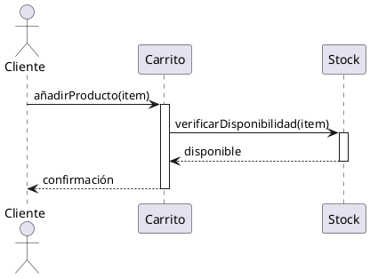
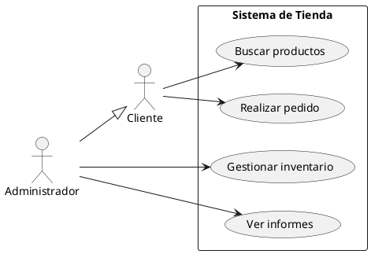
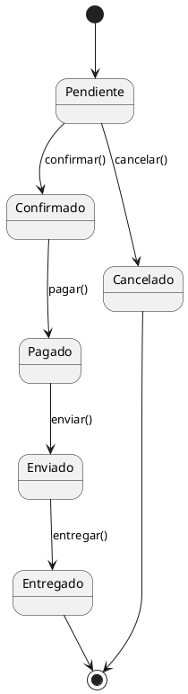
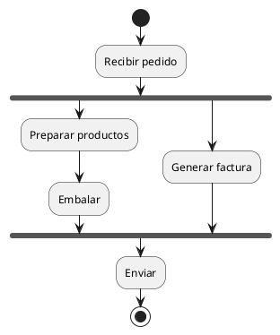
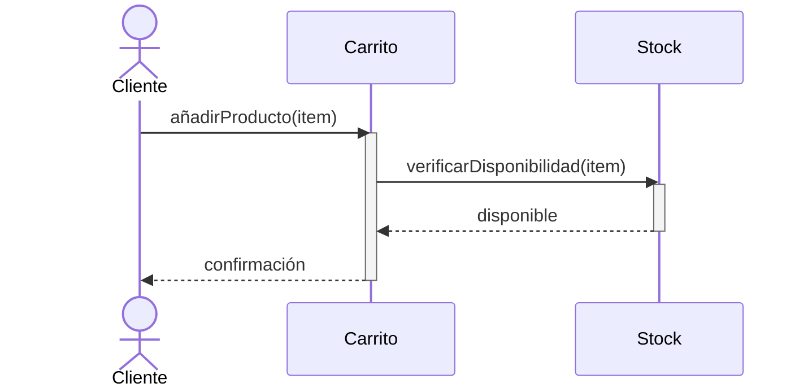
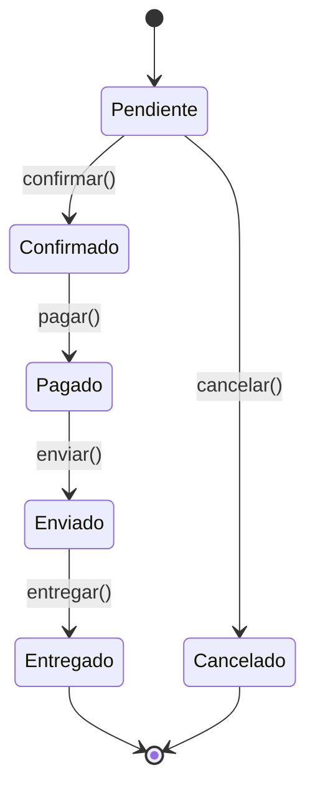
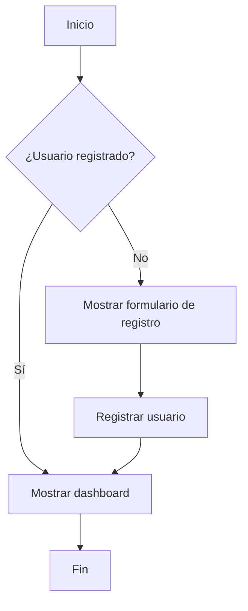

# UP8: UML. DIAGRAMAS DE COMPORTAMIENTO

## ÍNDICE

- [OBJETIVOS](#objetivos)
- [1. INTRODUCCIÓN A UML](#1-introducción-a-uml)
  - [1.1. ¿Qué es UML?](#11-qué-es-uml)
  - [1.2. Breve historia de UML](#12-breve-historia-de-uml)
  - [1.3. ¿Por qué modelar software?](#13-por-qué-modelar-software)
  - [1.4. Tipos de diagramas UML](#14-tipos-de-diagramas-uml)
  - [1.5. Herramientas para crear diagramas UML](#15-herramientas-para-crear-diagramas-uml)
- [2. DIAGRAMAS DE COMPORTAMIENTO: VISIÓN GENERAL](#2-diagramas-de-comportamiento-visión-general)
- [3. DIAGRAMAS DE CASOS DE USO](#3-diagramas-de-casos-de-uso)
  - [3.1. Propósito y contexto de uso](#31-propósito-y-contexto-de-uso)
  - [3.2. Elementos del diagrama](#32-elementos-del-diagrama)
  - [3.3. Relaciones entre casos de uso](#33-relaciones-entre-casos-de-uso)
  - [3.4. Ejemplos de diagramas de casos de uso](#34-ejemplos-de-diagramas-de-casos-de-uso)
  - [3.5. El dilema del formato: ¿Dibujos o Texto?](#35-el-dilema-del-formato-dibujos-o-texto)
- [4. DIAGRAMAS DE SECUENCIA](#4-diagramas-de-secuencia)
  - [4.1. Propósito](#41-propósito)
  - [4.2. Elementos del diagrama](#42-elementos-del-diagrama)
  - [4.3. Fragmentos combinados](#43-fragmentos-combinados)
  - [4.4. Ejemplos de diagramas de secuencia](#44-ejemplos-de-diagramas-de-secuencia)
- [5. DIAGRAMAS DE ACTIVIDADES](#5-diagramas-de-actividades)
  - [5.1. Propósito](#51-propósito)
  - [5.2. Elementos del diagrama](#52-elementos-del-diagrama)
  - [5.3. Calles (Swimlanes)](#53-calles-swimlanes)
  - [5.4. Ejemplos de diagramas de actividades](#54-ejemplos-de-diagramas-de-actividades)
- [6. DIAGRAMAS DE ESTADOS](#6-diagramas-de-estados)
  - [6.1. Propósito](#61-propósito)
  - [6.2. Elementos del diagrama](#62-elementos-del-diagrama)
  - [6.3. Estados compuestos](#63-estados-compuestos)
  - [6.4. Ejemplos de diagramas de estados](#64-ejemplos-de-diagramas-de-estados)
- [7. AMPLIACIÓN: DIAGRAMAS COMO CÓDIGO](#7-ampliación-diagramas-como-código)
  - [7.1. PlantUML](#71-plantuml)
  - [7.2. Mermaid](#72-mermaid)
  - [7.3. Ventajas del enfoque "diagrams as code"](#73-ventajas-del-enfoque-diagrams-as-code)

---

## OBJETIVOS

Al finalizar esta unidad, el alumno será capaz de:

- Comprender qué es UML y su importancia en el desarrollo de software.
- Identificar los distintos tipos de diagramas de comportamiento UML.
- Reconocer el significado y los elementos de los diagramas de casos de uso.
- Interpretar y elaborar diagramas de secuencia sencillos.
- Interpretar y elaborar diagramas de actividades sencillos.
- Interpretar y elaborar diagramas de estados sencillos.
- Conocer herramientas para la creación de diagramas UML.

---

## 1. INTRODUCCIÓN A UML

### 1.1. ¿Qué es UML?

**UML** (*Unified Modeling Language* o Lenguaje Unificado de Modelado) es un **lenguaje gráfico estandarizado** para visualizar, especificar, construir y documentar los artefactos de un sistema de software. No es un lenguaje de programación, sino un **lenguaje de modelado**: una notación visual con reglas precisas para representar sistemas.

Piensa en UML como los **planos de un arquitecto**. Si vas a construir una casa, no llamas a los albañiles para darles instrucciones sobre la marcha; primero se dibujan planos que detallan la estructura, las dimensiones y las relaciones entre los espacios. De manera similar, antes de escribir código (o durante el proceso), el equipo de desarrollo utiliza UML para visualizar y planificar la estructura y el comportamiento del software, asegurando que todos entiendan qué se va a construir.

**Características principales de UML:**

- **Estándar**: Está mantenido por el OMG (*Object Management Group*), lo que garantiza que sea un lenguaje común y reconocido internacionalmente.
- **Independiente de la tecnología**: Se puede usar para modelar sistemas en cualquier lenguaje de programación o plataforma.
- **Versátil**: Ofrece múltiples tipos de diagramas para representar diferentes aspectos de un sistema.
- **Visual**: Facilita la comunicación entre desarrolladores, analistas, clientes y otros stakeholders.

### 1.2. Breve historia de UML

En los años 80 y principios de los 90, existían múltiples metodologías de modelado orientado a objetos, cada una con su propia notación:

- **Booch** (Grady Booch)
- **OMT** - *Object Modeling Technique* (James Rumbaugh)
- **OOSE** - *Object-Oriented Software Engineering* (Ivar Jacobson)

Esta fragmentación causaba confusión: cada equipo usaba una notación diferente, dificultando la comunicación entre proyectos y organizaciones.

En 1994, Rumbaugh se unió a Booch en Rational Software, y en 1995 se les unió Jacobson. Juntos, conocidos como "los tres amigos", unificaron sus metodologías creando UML. La versión 1.0 se presentó en 1997 y fue adoptada por el OMG como estándar.

Desde entonces, UML ha evolucionado:

- **UML 1.x** (1997-2004): Versiones iniciales.
- **UML 2.0** (2005): Revisión mayor con nuevos diagramas y mejor semántica.
- **UML 2.5** (2015): Versión actual, con clarificaciones y simplificaciones.

### 1.3. ¿Por qué modelar software?

Modelar software antes o durante su desarrollo ofrece varios beneficios:

**1. Comunicación**:

Un diagrama bien hecho vale más que mil palabras. Los modelos UML permiten que desarrolladores, analistas, diseñadores y clientes compartan una visión común del sistema. Un cliente puede no entender código Java, pero probablemente pueda entender un diagrama de casos de uso que muestre qué podrá hacer con el sistema.

**2. Documentación**:

Los diagramas sirven como documentación técnica que perdura más allá de las personas que crearon el sistema. Cuando un nuevo desarrollador se incorpora al equipo, los diagramas le ayudan a entender la arquitectura y el funcionamiento del sistema.

**3. Análisis y diseño**:

**Modelar obliga a pensar antes de codificar**. Al dibujar un diagrama, pueden detectarse problemas de diseño, requisitos incompletos o inconsistencias antes de escribir una sola línea de código, cuando corregirlos es más barato. En esta era donde el uso de la Inteligencia Artificial para programación es casi imperativo, el pensar antes de codificar cobra si cabe aún más relevancia.

**4. Abstracción**:

Los diagramas permiten ver el sistema a diferentes niveles de detalle. Podemos tener una vista de alto nivel para directivos y una vista detallada para desarrolladores, todo usando el mismo lenguaje.

> **Nota importante**: El modelado debe ser **pragmático**. No se trata de crear diagramas por el mero hecho de tenerlos, sino de usarlos cuando aporten valor. Un diagrama que nadie lee o que está desactualizado no sirve para nada.

### 1.4. Tipos de diagramas UML

UML 2.5 define **14 tipos de diagramas**, organizados en dos grandes categorías:

#### Diagramas estructurales

Muestran la **estructura estática** del sistema: qué elementos existen y cómo se relacionan. No representan el paso del tiempo.

| Diagrama | Descripción |
| -------- | ----------- |
| **Diagrama de clases** | Muestra las clases del sistema, sus atributos, métodos y relaciones. Es el diagrama más utilizado. |
| **Diagrama de objetos** | Muestra instancias concretas de clases en un momento dado. |
| **Diagrama de componentes** | Muestra los componentes de software y sus dependencias. |
| **Diagrama de despliegue** | Muestra la distribución física del sistema en nodos de hardware. |
| **Diagrama de paquetes** | Muestra la organización de elementos en paquetes. |
| **Diagrama de estructuras compuestas** | Muestra la estructura interna de un clasificador. |
| **Diagrama de perfiles** | Muestra extensiones al metamodelo UML. |

#### Diagramas de comportamiento

Muestran el **comportamiento dinámico** del sistema: qué ocurre cuando el sistema se ejecuta, cómo interactúan los elementos, cómo cambian los estados.

| Diagrama | Descripción |
| -------- | ----------- |
| **Diagrama de casos de uso** | Muestra las funcionalidades del sistema desde el punto de vista del usuario. |
| **Diagrama de actividades** | Muestra el flujo de control o de datos, similar a un diagrama de flujo avanzado. |
| **Diagrama de máquina de estados** | Muestra los estados de un objeto y las transiciones entre ellos. |
| **Diagrama de secuencia** | Muestra la interacción entre objetos a lo largo del tiempo. |
| **Diagrama de comunicación** | Similar al de secuencia, pero enfatiza las relaciones entre objetos. |
| **Diagrama de tiempos** | Muestra el comportamiento de objetos a lo largo de una línea temporal. |
| **Diagrama de interacción global** | Combina diagramas de actividades y secuencia. |

En esta unidad nos centraremos en los **diagramas de comportamiento** más utilizados: casos de uso, secuencia, actividades y estados. Los diagramas estructurales (especialmente el diagrama de clases) se tratarán en la siguiente unidad.

### 1.5. Herramientas para crear diagramas UML

Existen múltiples herramientas para crear diagramas UML, desde aplicaciones de escritorio hasta servicios en la nube:

#### Herramientas gráficas tradicionales

| Herramienta | Tipo | Descripción |
| ----------- | ------ | ------------- |
| **Visual Paradigm** | Comercial (versión Community gratuita) | Herramienta completa de modelado. Muy usada en entornos educativos y profesionales. |
| **StarUML** | Comercial (versión de evaluación) | Herramienta ligera y fácil de usar. |
| **Lucidchart** | SaaS (freemium) | Herramienta online colaborativa. No específica de UML pero muy versátil. |
| **draw.io / diagrams.net** | Gratuita | Herramienta online gratuita, integrable con Google Drive y GitHub. |
| **Enterprise Architect** | Comercial | Herramienta empresarial muy completa, usada en grandes organizaciones. |
| **Modelio** | Open Source | Herramienta gratuita y de código abierto. |

#### Herramientas integradas en IDEs

Muchos IDEs incluyen soporte para diagramas UML:

- **IntelliJ IDEA** (Ultimate): Incluye soporte para diagramas de clases y puede generar diagramas a partir del código (ingeniería inversa).
- **Eclipse**: Con plugins como ObjectAid o Papyrus.
- **Visual Studio**: Con herramientas de arquitectura y modelado.

#### Herramientas basadas en texto (Ampliación)

Una tendencia moderna es escribir los diagramas como código de texto, lo que permite versionarlos con Git:

- **PlantUML**: Sintaxis de texto que genera diagramas. Se integra con muchos editores e IDEs.
- **Mermaid**: Similar a PlantUML, muy usado en documentación Markdown (GitHub, GitLab, Notion).

Estas herramientas se tratarán con más detalle en la sección de Ampliación.

---

## 2. DIAGRAMAS DE COMPORTAMIENTO: VISIÓN GENERAL

Los **diagramas de comportamiento** modelan los aspectos dinámicos de un sistema: qué hace el sistema, cómo responde a eventos, cómo interactúan sus componentes a lo largo del tiempo.

Cada tipo de diagrama de comportamiento tiene un propósito específico:

| Diagrama | Pregunta que responde | Cuándo usarlo |
| -------- | ---------------------- | --------------- |
| **Casos de uso** | ¿Qué puede hacer el usuario con el sistema? | En las fases iniciales, para capturar requisitos funcionales. |
| **Secuencia** | ¿Cómo interactúan los objetos para realizar una función? | Para diseñar o documentar la lógica de un escenario concreto. |
| **Actividades** | ¿Cuál es el flujo de trabajo o algoritmo? | Para modelar procesos de negocio, flujos de trabajo o algoritmos complejos. |
| **Estados** | ¿Qué estados puede tener un objeto y cómo transiciona entre ellos? | Para objetos con ciclo de vida complejo (pedidos, usuarios, conexiones). |

Estos diagramas se complementan entre sí. Por ejemplo:

- Un **caso de uso** describe *qué* funcionalidad ofrece el sistema.
- Un **diagrama de secuencia** detalla *cómo* se implementa ese caso de uso internamente.
- Un **diagrama de estados** puede mostrar cómo un objeto cambia de estado durante ese proceso.
- Un **diagrama de actividades** puede detallar el flujo de un proceso de negocio relacionado.

---

## 3. DIAGRAMAS DE CASOS DE USO

//TODO: Añadir imágenes de ejemplo de diagramas de casos de uso. ASCII es bastante limitado para este propósito.

### 3.1. Propósito y contexto de uso

El **diagrama de casos de uso** describe las funcionalidades de un sistema desde el punto de vista del usuario. Responde a la pregunta: *"¿Qué puede hacer alguien con este sistema?"*

**Características principales:**

- Se crean en las **fases iniciales** del proyecto, durante el análisis de requisitos.
- Describen el comportamiento del sistema **sin entrar en detalles de implementación**.
- Son fáciles de entender por personas no técnicas, lo que facilita la comunicación con clientes.
- Definen los **requisitos funcionales** del sistema.
- Sirven como base para diseñar **pruebas de aceptación**.

**¿Cuándo se usan?**

Los diagramas de casos de uso son especialmente útiles:

- En reuniones con clientes para validar que se entienden sus necesidades.
- Para definir el alcance de un sistema o de una iteración.
- Como punto de partida para otros diagramas más detallados.
- Para organizar y priorizar el trabajo de desarrollo.

### 3.2. Elementos del diagrama

#### Actor

Un **actor** representa a alguien o algo externo al sistema que interactúa con él. Puede ser:

- Una persona (usuario, administrador, cliente).
- Otro sistema (pasarela de pago, servicio de correo).
- Un dispositivo (sensor, lector de códigos).
- El tiempo (para procesos programados).

Se representa con una figura de "monigote":

```text
    O
   /|\
   / \
  Actor
```

> **Importante**: Un actor representa un **rol**, no una persona concreta. Una misma persona puede actuar con diferentes roles (por ejemplo, un empleado puede ser "Usuario" cuando usa el sistema y "Administrador" cuando lo configura). Además, aunque la figura sea humana, un actor puede ser cualquier entidad externa.

#### Caso de uso

Un **caso de uso** representa una funcionalidad completa que el sistema ofrece a los actores. Se representa como una elipse con el nombre del caso de uso dentro.

```text
(  Realizar pedido  )
```

**Consejos para nombrar casos de uso:**

- Usa verbos en infinitivo: "Realizar pedido", "Consultar saldo", "Generar informe".
- Sé específico pero no demasiado detallado.
- El nombre debe tener sentido desde el punto de vista del actor.

#### Sistema

El **sistema** (también llamado *subject*) se representa como un rectángulo que contiene los casos de uso. Los actores se sitúan fuera del rectángulo.

```text
+---------------------------+
|      Sistema de Ventas    |
|                           |
|   (  Realizar pedido  )   |
|                           |
|   (  Consultar stock  )   |
|                           |
+---------------------------+
```


#### Asociación

Una línea simple conecta un actor con un caso de uso, indicando que el actor participa en ese caso de uso.

```text
Actor ——————— (Caso de uso)
```

### 3.3. Relaciones entre casos de uso

Además de la asociación actor-caso de uso, existen relaciones entre casos de uso:

#### Inclusión (`<<include>>`)

Se usa cuando un caso de uso **siempre incluye** el comportamiento de otro. Es como "llamar a una función" que siempre se ejecuta.

```text
(Realizar pedido) - - - - <<include>> - - - -> (Validar usuario)
```


El caso de uso base (Realizar pedido) **siempre** ejecuta el caso incluido (Validar usuario). La flecha va del caso base hacia el caso incluido.

**Uso típico**: Factorizar comportamiento común que se repite en varios casos de uso.

#### Extensión (`<<extend>>`)

Se usa cuando un caso de uso **opcionalmente extiende** el comportamiento de otro, bajo ciertas condiciones.

```text
(Realizar pedido) <- - - - <<extend>> - - - - (Aplicar descuento)
```


El caso extendido (Aplicar descuento) **puede o no** ejecutarse como parte del caso base (Realizar pedido), dependiendo de una condición (ej: "si el cliente tiene cupón"). La flecha va del caso extendido hacia el caso base.

> [!TIP] Fíjate en la dirección de la flecha: en `<<include>>` va del caso base al incluido, y en `<<extend>>` va del caso extendido hacia el caso base. Este es un detalle importante para no confundir ambas relaciones.

**Uso típico**: Modelar comportamiento opcional o excepcional.

#### Generalización

Se usa cuando un caso de uso es una **especialización** de otro más general.

```text
        (Pagar)
         ∧  ∧
        /    \
       /      \
(Pagar con   (Pagar en
 tarjeta)    efectivo)
```


Los casos especializados heredan el comportamiento del caso general y pueden añadir o modificar comportamiento.

**Uso típico**: Cuando hay varias formas de realizar una misma acción.

#### Generalización entre actores

También se puede usar la generalización entre actores:

```text
    Usuario
       △
       |
  Administrador
```


Esto indica que el Administrador tiene todos los permisos del Usuario más los suyos propios.

### 3.4. Ejemplos de diagramas de casos de uso

#### Ejemplo 1: Máquina expendedora de café

Una máquina de café permite:

- Introducir dinero
- Seleccionar producto
- Seleccionar nivel de azúcar
- Recoger producto y cambio
- Cancelar la operación (devuelve el dinero)

```text
+----------------------------------------+
|        Máquina de Café                 |
|                                        |
|    (Introducir dinero)                 |
|           |                            |
|    (Seleccionar producto)              |
|           |         \                  |
|    (Seleccionar azúcar) <<include>>    |
|           |              \             |
|    (Dispensar producto)   (Devolver    |
|                            cambio)     |
|    (Cancelar)  <<include>>   /         |
|                    ---------           |
+----------------------------------------+
        |
      Cliente
```

En este ejemplo, tanto "Dispensar producto" como "Cancelar" incluyen "Devolver cambio".

#### Ejemplo 2: Sistema de tienda online

```text
+--------------------------------------------------+
|              Tienda Online                        |
|                                                   |
|  (Buscar productos)     (Ver carrito)            |
|                                                   |
|  (Añadir al carrito)    (Realizar pedido)        |
|                              |                    |
|                         <<include>>               |
|                              ↓                    |
|                      (Identificarse)              |
|                              ↑                    |
|                         <<extend>>                |
|                              |                    |
|                        (Registrarse)              |
|                                                   |
|                      (Pagar)                      |
|                      ∧     ∧                      |
|                     /       \                     |
|            (Pagar con    (Pagar con              |
|             tarjeta)    transferencia)            |
+--------------------------------------------------+
         |                      |
      Cliente            Pasarela de pago
```

#### Ejemplo 3: Sistema con roles

```text
+----------------------------------------+
|         Sistema de Gestión             |
|                                        |
|    (Iniciar sesión)                    |
|    (Cerrar sesión)                     |
|    (Cambiar contraseña)                |
|    (Consultar datos)                   |
|                                        |
|    (Crear usuario)                     |
|    (Eliminar usuario)                  |
|    (Generar informes)                  |
+----------------------------------------+
        |              |
     Usuario      Administrador
        △              |
        |______________|
```

El Administrador hereda de Usuario, por lo que puede hacer todo lo que hace un Usuario más las funciones exclusivas de administración.

### 3.5. El dilema del formato: ¿Dibujos o Texto?

La captura de requisitos funcionales es una de las tareas más críticas y complejas en el desarrollo de software. No existe un formato único o "bala de plata"; la elección de la herramienta adecuada depende del contexto, del riesgo del proyecto y, sobre todo, de la audiencia a la que nos dirigimos.

A continuación, se exploran los diagramas de casos de uso y sus alternativas modernas, no como competidores, sino como herramientas en el "kit del analista".

#### A. El Diagrama de Casos de Uso (UML): El Mapa de Alto Nivel

Un diagrama de casos de uso es, en esencia, un **mapa de funcionalidades**. Su propósito no es detallar el *cómo*, sino inventariar el *qué*.

**Cuándo es útil**:

- **Para definir fronteras (System Boundary)**: Es excelente para visualizar qué funcionalidades están dentro de nuestro sistema y cuáles pertenecen a sistemas externos (una pasarela de pago, un servicio de correo). Ayuda a delimitar el alcance.
- **Como índice visual del sistema**: Serve como un mapa conceptual para organizar la documentación funcional. Cada caso de uso puede ser un enlace a una especificación más detallada.

- **Cuándo es peligroso (o insuficiente)**:

- **Para explicar flujos de interacción**: Un diagrama estático no cuenta una historia. No muestra el orden de los pasos ni la experiencia de usuario.
- **Para comunicar con stakeholders no técnicos**: A menudo, un cliente o un responsable de marketing ve un diagrama de este tipo como "algo de informáticos". Entienden la relación básica, pero **no visualizan el producto final**, lo que puede llevar a malentendidos.

#### B. Alternativas Modernas: El Kit del Analista Ágil

En los equipos modernos, especialmente los que siguen metodologías ágiles, se prefieren formatos que conectan de manera más directa con la experiencia de usuario y las pruebas.

1. **User Story Mapping (La Visión Global)**
    En lugar de una lista plana de requisitos, las *User Stories* se organizan en un mapa bidimensional que representa el viaje del usuario a través del producto.
    - **Ventaja**: Permite ver el "esqueleto" completo del producto, identificar lagunas y priorizar el trabajo en versiones o *releases* (por ejemplo, definir un Producto Mínimo Viable o MVP). Facilita la conversación sobre el flujo de usuario.

2. **User Stories con Criterios de Aceptación (Gherkin)**
    Es el estándar de facto en muchos equipos ágiles. Combina la necesidad del usuario con la especificación técnica de la prueba, usando un lenguaje casi natural.

    ```gherkin
    # Feature: Proceso de pago
    
    Historia: Como cliente, quiero poder pagar con tarjeta de crédito
              para completar mi compra de forma segura.
    
    Escenario: Pago con tarjeta válida
      DADO que tengo un producto en mi carrito con un total mayor a 0
      Y estoy en la pantalla de pago
      CUANDO introduzco los datos de una tarjeta de crédito válida
      Y pulso "Confirmar Pago"
      ENTONCES se procesa el cobro correctamente
      Y recibo un email de confirmación del pedido.
    ```

    - **Ventaja**: Conecta directamente los requisitos del negocio con el desarrollo (código) y la calidad (pruebas). Es un "contrato ejecutable" que reduce la ambigüedad.

3. **Wireflows (El Híbrido Visual)**

    Son la evolución natural de los casos de uso para el diseño de interfaces. En lugar de elipses y texto, se conectan **wireframes** (bocetos de pantallas) para mostrar un flujo de usuario.
    - **Ventaja**: Es la herramienta más eficaz para validar la experiencia de usuario. El cliente **entiende la interfaz y el flujo** porque lo está viendo, y el desarrollador tiene una guía visual clara de la interacción.

#### Reflexión: El Formato como Herramienta de Negociación

La teoría nos ofrece un abanico de herramientas, pero la experiencia enseña que **el formato es, ante todo, una herramienta de negociación y comunicación** que debe adaptarse a la audiencia:

- **Para Negocio/Cliente (Venta y Definición de Alcance)**: Los diagramas UML de casos de uso suelen ser demasiado abstractos. Es más efectivo usar **User Story Mapping** o **Wireflows**, ya que permiten al cliente "ver" el producto antes de que se construya, alineando expectativas y evitando el peligroso "yo pensaba que esto funcionaría de otra manera...".

- **Para Contratos y Documentación Formal (Límites)**: En un contrato cerrado, la claridad y la falta de ambigüedad son cruciales. Aquí, una **Lista de Funcionalidades** detallada, con un apartado explícito de "Funcionalidades Fuera de Alcance", es insuperable. Las *User Stories* pueden ser demasiado abiertas si no se acompañan de criterios de aceptación muy estrictos.

- **Para el Equipo de Desarrollo (Construcción):** Aquí la elección depende del nivel de riesgo y formalidad del proyecto.
  - En **sistemas complejos o críticos** (bancarios, sanitarios, aeronáutica, etc.), un caso de uso narrativo detallado (estilo Larman) es una herramienta muy potente. Aporta una claridad sin ambigüedades que previene errores costosos, y su rigor justifica el coste de mantenimiento, que es elevado. Es la marca de un análisis funcional exhaustivo.
  - En **contextos más ágiles** o con alta incertidumbre, donde el cambio es constante, este nivel de detalle puede ser contraproducente. En esos casos, una combinación de **Wireflows** y **Criterios de Aceptación en Gherkin** suele ser más efectiva para mantener la flexibilidad.

## 4. DIAGRAMAS DE SECUENCIA

### 4.1. Propósito

El **diagrama de secuencia** muestra cómo los objetos de un sistema interactúan entre sí a lo largo del tiempo para realizar una funcionalidad específica. Responde a la pregunta: *"¿Cómo colaboran los objetos para implementar este caso de uso?"*

**Características principales:**

- Muestra la **secuencia temporal** de mensajes entre objetos.
- Representa **un escenario concreto**, no todas las posibilidades.
- Es muy útil para **diseñar** la lógica interna del sistema.
- Ayuda a identificar **qué métodos** necesita cada clase.

**¿Cuándo se usan?**

- Para detallar cómo se implementa un caso de uso.
- Para diseñar la interacción entre componentes de un sistema.
- Para documentar flujos complejos.
- Para comunicar diseños técnicos entre desarrolladores.

### 4.2. Elementos del diagrama

#### Participantes (Lifelines)

Los **participantes** son los objetos o actores que intervienen en la interacción. Se representan como rectángulos en la parte superior, con una línea vertical discontinua (la *línea de vida*) que desciende.

```text
  ┌─────────┐      ┌─────────┐      ┌─────────┐
  │ :Cliente│      │ :Carrito│      │ :Stock  │
  └────┬────┘      └────┬────┘      └────┬────┘
       │                │                │
       │                │                │
       │                │                │
       ▼                ▼                ▼
```

El nombre puede ser:

- Solo la clase: `:Carrito`
- Objeto con nombre: `miCarrito:Carrito`
- Actor: `Usuario`

#### Mensajes

Los **mensajes** representan la comunicación entre participantes. Se dibujan como flechas horizontales entre **líneas de vida**.

**Tipos de mensajes:**

| Tipo | Representación | Descripción |
| ---- | -------------- | ----------- |
| Síncrono | ——▶ (flecha rellena) | El emisor espera la respuesta |
| Respuesta | ◀- - - (flecha discontinua) | Retorno de un mensaje síncrono |
| Asíncrono | ——> (flecha abierta) | El emisor no espera respuesta |
| Creación | - - - ▶ hacia un rectángulo | Crea un nuevo objeto |
| Destrucción | X al final de la línea de vida | Destruye el objeto |

#### Activación (Focus of control)

Un **rectángulo sobre la línea de vida** indica que el objeto está activo (ejecutando código). Comienza cuando recibe un mensaje y termina cuando devuelve el control.

```text
  ┌─────────┐          ┌─────────┐
  │ :Cliente│          │ :Carrito│
  └────┬────┘          └────┬────┘
       │   añadir(item)     │
       │──────────────────▶┌┴┐
       │                   │ │  (activación)
       │◀ - - - - - - - - -└┬┘
       │                    │
```

#### Mensajes a uno mismo (Self-call)

Un objeto puede enviarse mensajes a sí mismo:

```text  
       ┌─────────┐
       │:Validador│
       └────┬────┘
            │
       ┌────┴────┐
       │         │ validarFormato()
       │    ┌────┴───┐
       │    │        │
       │    └────┬───┘
       │         │
       └─────────┘
```

### 4.3. Fragmentos combinados

Los **fragmentos combinados** permiten representar flujos de control como condiciones, bucles o alternativas.

#### alt (alternativa)

Representa una elección condicional (if-else):

```text
┌─────────────────────────────────────┐
│ alt  [saldo >= importe]            │
│ ├───────────────────────────────────┤
│ │     realizarPago()                │
│ │◀──────────────────                │
│ ├───────────────────────────────────┤
│ │ [else]                            │
│ │     mostrarError()                │
│ │◀──────────────────                │
└─────────────────────────────────────┘
```

#### opt (opcional)

Representa código que puede ejecutarse o no (if sin else):

```text
┌─────────────────────────────────────┐
│ opt  [usuario.esPremium()]         │
│ ├───────────────────────────────────┤
│ │     aplicarDescuento()            │
│ │◀──────────────────                │
└─────────────────────────────────────┘
```

#### loop (bucle)

Representa repetición:

```text
┌─────────────────────────────────────┐
│ loop  [para cada item en carrito]  │
│ ├───────────────────────────────────┤
│ │     calcularPrecio(item)          │
│ │◀──────────────────                │
└─────────────────────────────────────┘
```

#### ref (referencia)

Hace referencia a otro diagrama de secuencia:

```text
┌─────────────────────────────────────┐
│ ref                                 │
│                                     │
│      Proceso de autenticación       │
│                                     │
└─────────────────────────────────────┘
```

### 4.4. Ejemplos de diagramas de secuencia

#### Ejemplo 1: Autenticación de usuario

```text
┌────────┐     ┌────────────┐     ┌──────────┐     ┌─────────┐
│:Usuario│     │:LoginForm  │     │:AuthService│   │:Database│
└───┬────┘     └─────┬──────┘     └─────┬─────┘    └────┬────┘
    │                │                  │               │
    │ introducir     │                  │               │
    │ credenciales   │                  │               │
    │───────────────▶│                  │               │
    │                │                  │               │
    │                │  login(user,pwd) │               │
    │                │─────────────────▶│               │
    │                │                  │               │
    │                │                  │ findUser(user)│
    │                │                  │──────────────▶│
    │                │                  │               │
    │                │                  │◀- - usuario - │
    │                │                  │               │
    │                │                  │               │
    │                │    ┌─────────────┴────────┐      │
    │                │    │ alt [pwd correcta]   │      │
    │                │    │ ├────────────────────┤      │
    │                │    │ │ crearSesión()      │      │
    │                │◀ - │ │ - - sesión - - - - │      │
    │                │    │ ├────────────────────┤      │
    │                │    │ │ [else]             │      │
    │                │◀ - │ │ - - error - - - - -│      │
    │                │    └─────────────┬────────┘      │
    │                │                  │               │
    │◀─ resultado ───│                  │               │
    │                │                  │               │
```

#### Ejemplo 2: Añadir producto al carrito

```text
┌────────┐     ┌──────────┐     ┌─────────┐     ┌────────┐
│:Cliente│     │:Catalogo │     │:Producto│     │:Carrito│
└───┬────┘     └────┬─────┘     └────┬────┘     └───┬────┘
    │               │                │              │
    │ buscar("café")│                │              │
    │──────────────▶│                │              │
    │               │                │              │
    │◀─ productos ──│                │              │
    │               │                │              │
    │ seleccionar   │                │              │
    │ producto      │                │              │
    │───────────────────────────────▶│              │
    │               │                │              │
    │◀─ detalles ───────────────────│              │
    │               │                │              │
    │ añadir al     │                │              │
    │ carrito       │                │              │
    │─────────────────────────────────────────────▶│
    │               │                │              │
    │               │                │              │ verificar
    │               │                │◀─────────────│ stock
    │               │                │              │
    │               │                │─────────────▶│
    │               │                │   [hay stock]│
    │◀─ confirmación ─────────────────────────────│
    │               │                │              │
```

---

## 5. DIAGRAMAS DE ACTIVIDADES

### 5.1. Propósito

El **diagrama de actividades** modela el flujo de control o de datos en un proceso. Es similar a un diagrama de flujo tradicional, pero con más expresividad para representar concurrencia y responsabilidades.

**Características principales:**

- Muestra el **flujo de trabajo** paso a paso.
- Puede representar **paralelismo** y **sincronización**.
- Útil tanto para **procesos de negocio** como para **algoritmos**.
- Permite asignar actividades a diferentes **responsables** mediante calles.

**¿Cuándo se usan?**

- Para modelar procesos de negocio.
- Para documentar flujos de trabajo complejos.
- Para detallar algoritmos antes de implementarlos.
- Para entender y optimizar procesos existentes.

**Actividades vs Secuencia: ¿Cuándo usar cada uno?**

Existe un **solape** entre estos dos tipos de diagramas: ambos pueden modelar flujos de trabajo. La diferencia principal está en la **óptica** o perspectiva:

| Aspecto | Diagrama de Secuencia | Diagrama de Actividades |
| ------- | -------------------- | ---------------------- |
| **Enfoque** | Interacción entre **objetos/componentes** | Flujo del **proceso/algoritmo** |
| **Eje temporal** | El tiempo fluye de **arriba a abajo** (explícito) | El tiempo es implícito en el flujo |
| **Mejor para** | Casos de uso específicos, interacciones API, protocolos | Procesos de negocio, workflows, algoritmos |
| **Muestra quién** | Objetos/actores concretos que colaboran | Actividades abstractas (a veces con swimlanes) |
| **Paralelismo** | Difícil de representar | Natural con fork/join |
| **Decisiones** | Fragmentos `alt` (más pesado) | Diamantes de decisión (más ligero) |

**Regla práctica:**

- **Secuencia**: cuando importa **quién** hace **qué** y en **qué orden** se intercambian mensajes.
- **Actividades**: cuando importa **qué pasos** ocurren, con qué **decisiones** y **paralelismo**, independientemente de los objetos concretos.

### 5.2. Elementos del diagrama

#### Nodo inicial y final

- **Nodo inicial**: Un círculo negro relleno. Indica dónde comienza el flujo.
- **Nodo final (de actividad)**: Un círculo con un punto negro dentro. Indica dónde termina todo el flujo.
- **Nodo final (de flujo)**: Un círculo con una X. Indica que ese camino termina pero otros pueden continuar.

```text
  ●       Nodo inicial

  ◉       Nodo final (actividad)

  ⊗       Nodo final (flujo)
```

#### Acción/Actividad

Representa una acción o paso del proceso. Se dibuja como un rectángulo con esquinas redondeadas.

```text
┌─────────────────────┐
│  Procesar pedido    │
└─────────────────────┘
```

#### Flujo (transición)

Una flecha que conecta elementos, indicando el paso de uno a otro.

```text
┌──────────┐         ┌──────────┐
│ Acción A │────────▶│ Acción B │
└──────────┘         └──────────┘
```

#### Decisión y fusión

Un **rombo** representa un punto de decisión (con varias salidas) o de fusión (con varias entradas).

**Decisión:**

```text
                    ┌──────────┐
         [sí]      │ Aprobar  │
       ┌──────────▶│ pedido   │
       │           └──────────┘
    ◇──┤
       │           ┌──────────┐
       │  [no]     │ Rechazar │
       └──────────▶│ pedido   │
                   └──────────┘
```

**Fusión:**

```text
    ┌──────────┐       ┌──────────┐
    │ Camino A │       │ Camino B │
    └────┬─────┘       └────┬─────┘
         │                  │
         └────────┬─────────┘
                  ▼
                  ◇
                  │
                  ▼
           ┌──────────┐
           │ Continuar│
           └──────────┘
```

#### Bifurcación y unión (fork/join)

Una **barra horizontal** representa bifurcación (el flujo se divide en paralelo) o unión (los flujos paralelos se sincronizan). Sincronizarse significa que todas las ramas deben completarse antes de continuar.

**Bifurcación (fork):**

```text
                  │
         ═════════╪═════════
         │        │        │
         ▼        ▼        ▼
      Tarea A  Tarea B  Tarea C
      (paralelo)
```

**Unión (join):**

```text
      Tarea A  Tarea B  Tarea C
         │        │        │
         ═════════╪═════════
                  │
                  ▼
```

### 5.3. Calles (Swimlanes)

Las **calles** (o *swimlanes*) dividen el diagrama en zonas, cada una asignada a un responsable (actor, departamento, sistema). Permiten ver claramente quién hace qué.

```text
│       Cliente      │      Sistema      │      Almacén     │
│                    │                   │                  │
│        ●           │                   │                  │
│        │           │                   │                  │
│        ▼           │                   │                  │
│  ┌───────────┐     │                   │                  │
│  │  Realizar │     │                   │                  │
│  │  pedido   │─────┼──────▶            │                  │
│  └───────────┘     │  ┌───────────┐    │                  │
│                    │  │ Procesar  │    │                  │
│                    │  │ pedido    │────┼────▶             │
│                    │  └───────────┘    │  ┌───────────┐   │
│                    │                   │  │ Preparar  │   │
│                    │                   │  │ envío     │   │
│                    │                   │  └───────────┘   │
```

### 5.4. Ejemplos de diagramas de actividades

#### Ejemplo 1: Proceso de compra online

```text
                    ●
                    │
                    ▼
           ┌───────────────┐
           │ Buscar        │
           │ productos     │
           └───────┬───────┘
                   │
                   ▼
           ┌───────────────┐
           │ Añadir al     │◀──────┐
           │ carrito       │       │
           └───────┬───────┘       │
                   │               │
                   ▼               │
                   ◇───────────────┘
                   │ [seguir comprando]
                   │
                   │ [finalizar]
                   ▼
           ┌───────────────┐
           │ Ir al checkout│
           └───────┬───────┘
                   │
                   ▼
           ┌───────────────┐
           │ Identificarse │
           └───────┬───────┘
                   │
                   ▼
           ┌───────────────┐
           │ Elegir envío  │
           └───────┬───────┘
                   │
                   ▼
           ┌───────────────┐
           │ Pagar         │
           └───────┬───────┘
                   │
                   ▼
                   ◇
          [ok]┌────┴────┐[error]
              ▼         ▼
     ┌─────────────┐ ┌─────────────┐
     │ Confirmar   │ │ Mostrar     │
     │ pedido      │ │ error       │
     └──────┬──────┘ └──────┬──────┘
            │               │
            ▼               │
            ◉               │
                            │
            ┌───────────────┘
            ▼
    ┌───────────────┐
    │ Reintentar    │
    │ pago          │
    └───────────────┘
```

#### Ejemplo 2: Proceso con paralelismo (preparar pedido en almacén)

```text
                    ●
                    │
                    ▼
           ┌───────────────┐
           │ Recibir       │
           │ pedido        │
           └───────┬───────┘
                   │
          ═════════╪═════════    (fork)
          │                 │
          ▼                 ▼
  ┌───────────────┐ ┌───────────────┐
  │ Preparar      │ │ Generar       │
  │ productos     │ │ factura       │
  └───────┬───────┘ └───────┬───────┘
          │                 │
  ┌───────────────┐         │
  │ Embalar       │         │
  └───────┬───────┘         │
          │                 │
          ═════════╪═════════    (join)
                   │
                   ▼
           ┌───────────────┐
           │ Enviar        │
           └───────┬───────┘
                   │
                   ▼
                   ◉
```

---

## 6. DIAGRAMAS DE ESTADOS

### 6.1. Propósito

El **diagrama de estados** (o *diagrama de máquina de estados*) modela el comportamiento de un objeto a lo largo de su ciclo de vida, mostrando los estados por los que puede pasar y las transiciones entre ellos.

**Características principales:**

- Se centra en **un solo objeto** o entidad.
- Muestra cómo el objeto **responde a eventos** cambiando de estado.
- Útil para objetos con **comportamiento dependiente del estado**.

**¿Cuándo se usan?**

- Para objetos con ciclo de vida complejo: pedidos, reservas, cuentas de usuario.
- Para protocolos de comunicación: estados de una conexión TCP.
- Para interfaces de usuario: estados de un formulario o pantalla.
- Para sistemas reactivos: dispositivos que responden a eventos.

### 6.2. Elementos del diagrama

#### Estado

Un **estado** representa una situación estable en la vida de un objeto. Se dibuja como un rectángulo con esquinas redondeadas.

```text
┌───────────────┐
│   Pendiente   │
└───────────────┘
```

Un estado puede tener compartimentos para:

- **Nombre** del estado (obligatorio).
- **Acciones internas**: entry (al entrar), exit (al salir), do (mientras está en el estado).

```text
┌─────────────────────┐
│      En proceso     │
├─────────────────────┤
│ entry/ notificar()  │
│ do/ procesar()      │
│ exit/ limpiar()     │
└─────────────────────┘
```

#### Pseudoestados inicial y final

- **Estado inicial**: Círculo negro relleno. Indica el estado por defecto al crear el objeto.
- **Estado final**: Círculo con punto negro. Indica que el objeto ha terminado su ciclo de vida.

```
  ●       Estado inicial

  ◉       Estado final
```

#### Transición

Una **flecha** entre estados representa una transición. Puede incluir:

- **Evento** que dispara la transición.
- **Condición** (guarda) entre corchetes.
- **Acción** que se ejecuta durante la transición.

Formato: `evento [condición] / acción`

```text
┌──────────┐    evento [condición] / acción    ┌──────────┐
│ Estado A │─────────────────────────────────▶│ Estado B │
└──────────┘                                   └──────────┘
```

Ejemplos:

- `click / mostrarMenu` - al hacer click, mostrar menú.
- `timeout [reintentos < 3] / reintentar` - si hay timeout y quedan reintentos.
- `pagar` - simplemente el evento, sin condición ni acción.

### 6.3. Estados compuestos

Un **estado compuesto** contiene subestados dentro. Permite modelar comportamiento jerárquico.

```text
┌─────────────────────────────────────────┐
│              En proceso                 │
│  ┌────────────┐        ┌────────────┐   │
│  │ Validando  │───────▶│ Procesando │   │
│  └────────────┘        └────────────┘   │
│                                         │
└─────────────────────────────────────────┘
```

Si ocurre un evento que saca del estado compuesto, se sale independientemente del subestado actual.

### 6.4. Ejemplos de diagramas de estados

#### Ejemplo 1: Ciclo de vida de un pedido

```text
                         ●
                         │
                         │ crearPedido()
                         ▼
                  ┌─────────────┐
                  │  Pendiente  │
                  └──────┬──────┘
                         │
            ┌────────────┼────────────┐
            │            │            │
            │ confirmar()│            │ cancelar()
            ▼            │            ▼
     ┌─────────────┐     │     ┌─────────────┐
     │  Confirmado │     │     │  Cancelado  │
     └──────┬──────┘     │     └──────┬──────┘
            │            │            │
            │ pagar()    │            ▼
            ▼            │            ◉
     ┌─────────────┐     │
     │   Pagado    │     │
     └──────┬──────┘     │
            │            │
            │ enviar()   │
            ▼            │
     ┌─────────────┐     │
     │  Enviado    │     │
     └──────┬──────┘     │
            │            │
            │ entregar() │
            ▼            │
     ┌─────────────┐     │
     │  Entregado  │     │
     └──────┬──────┘     │
            │            │
            ▼            │
            ◉            │
```

#### Ejemplo 2: Estados de una conexión de red

```text
                   ●
                   │
                   │ iniciar
                   ▼
            ┌─────────────┐
            │ Desconectado│◀───────────────────────┐
            └──────┬──────┘                        │
                   │                               │
                   │ conectar()                    │
                   ▼                               │
            ┌─────────────┐      timeout          │
            │ Conectando  │─────────────────────▶│
            └──────┬──────┘                        │
                   │                               │
                   │ conexiónEstablecida           │
                   ▼                               │
            ┌─────────────┐                        │
            │  Conectado  │───────────────────────┤
            └──────┬──────┘     error /           │
                   │            reintentar        │
                   │                               │
                   │ cerrar()                      │
                   ▼                               │
            ┌─────────────┐                        │
            │ Cerrando    │────────────────────────┘
            └─────────────┘      cerradoOk
```

#### Ejemplo 3: Estados de un reproductor de música

```text
                   ●
                   │
                   ▼
            ┌─────────────┐
            │   Parado    │◀──────────────┐
            └──────┬──────┘               │
                   │                      │
                   │ play [hayCanción]    │
                   ▼                      │
            ┌─────────────┐               │
        ┌──▶│ Reproduciendo│───────────────┤
        │   └──────┬──────┘    stop       │
        │          │                      │
        │          │ pause                │
        │          ▼                      │
        │   ┌─────────────┐               │
        │   │   Pausado   │───────────────┘
        │   └──────┬──────┘    stop
        │          │
        │          │ play
        └──────────┘
```

---

## 7. AMPLIACIÓN: DIAGRAMAS COMO CÓDIGO

Una tendencia moderna en el desarrollo de software es tratar los diagramas como código: en lugar de usar herramientas gráficas, se escriben en formato de texto usando una sintaxis específica. Este enfoque se conoce como **"Diagrams as Code"** o **"Documentation as Code"**.

### 7.1. PlantUML

**PlantUML** es una herramienta que genera diagramas UML a partir de descripciones textuales. Soporta todos los tipos de diagramas UML y muchos otros.

**Instalación y uso:**

- Se puede usar online en [plantuml.com](https://www.plantuml.com/plantuml)
- Se integra con IDEs (VS Code, IntelliJ) mediante plugins
- Se puede usar desde línea de comandos

**Ejemplo: Diagrama de secuencia**



**Ejemplo: Diagrama de casos de uso**



**Ejemplo: Diagrama de estados**



**Ejemplo: Diagrama de actividades**



### 7.2. Mermaid

**Mermaid** es similar a PlantUML pero se integra nativamente con muchas plataformas de documentación como GitHub, GitLab, Notion, y Markdown en general. La verdadera potencia de Mermaid se manifiesta en ecosistemas de documentación empresarial como Confluence o Notion. Estas plataformas transforman la documentación en un sistema de hipertexto vivo, centralizado y accesible para toda la organización. En este contexto, la integración nativa de Mermaid lo convierte en la elección natural para mantener los diagramas sincronizados y fáciles de consumir.

**Ejemplo: Diagrama de secuencia**:



**Ejemplo: Diagrama de estados**:



**Ejemplo: Diagrama de flujo (similar a actividades)**:



### 7.3. Ventajas del enfoque "Diagrams as Code"

El enfoque de diagramas como código ofrece múltiples beneficios:

**1. Control de versiones**:

Al ser archivos de texto, los diagramas pueden versionarse con Git igual que el código fuente. Esto permite:

- Ver el historial de cambios del diagrama.
- Hacer diff entre versiones.
- Incluir cambios de diagramas en los mismos commits que los cambios de código.
- Revisiones de código que incluyan los diagramas.

**2. Consistencia con el código**:

Los diagramas viven junto al código, en el mismo repositorio. Esto hace más probable que se mantengan actualizados, ya que:

- Están visibles para los desarrolladores.
- Se pueden actualizar en el mismo pull request que el código.
- Herramientas de CI/CD pueden generar los diagramas automáticamente.

**3. Facilidad de edición**:

No se necesita una herramienta gráfica específica:

- Se pueden editar con cualquier editor de texto.
- Se integran fácilmente en documentación Markdown.
- Son más fáciles de modificar que reorganizar elementos gráficos.

**4. Generación automática**:

Algunas herramientas pueden generar diagramas automáticamente:

- A partir del código fuente (ingeniería inversa).
- A partir de logs o trazas de ejecución.
- Actualizándose cuando cambia el código.

**5. Reproducibilidad**:

El mismo código de diagrama siempre genera el mismo resultado visual. No hay ambigüedad ni dependencia de la configuración de una herramienta gráfica.

### 7.4. Modelo C4: Una alternativa pragmática a UML

> **Nota sobre clasificación:** Aunque mencionamos C4 en esta unidad dedicada a diagramas de comportamiento, el modelo C4 **se centra en la arquitectura y estructura del sistema**, por lo que está más alineado con los **diagramas estructurales de UML** (como diagramas de componentes, paquetes y despliegue). Lo incluimos aquí por su relevancia práctica y como alternativa moderna que todo desarrollador debe conocer, pero conviene recordar que C4 modela la **estructura estática** del sistema, no su comportamiento dinámico.

El **modelo C4**, creado por Simon Brown, es un enfoque moderno para la visualización de arquitectura de software que ha ganado gran popularidad en la industria. A diferencia de UML, que ofrece 14 tipos de diagramas con notación específica, C4 propone solo 4 niveles de abstracción con una notación deliberadamente simple.

**Los 4 niveles de C4:**

**Nivel 1: Diagrama de Contexto (Context)**:

Muestra el sistema como una caja negra y sus relaciones con:

- **Usuarios** que interactúan con el sistema.
- **Sistemas externos** con los que se comunica.

Es el "zoom out" máximo: ideal para explicar el sistema a personas no técnicas o nuevos miembros del equipo.

```text
┌─────────────────────────────────────────────────────────────────┐
│                      Diagrama de Contexto                       │
├─────────────────────────────────────────────────────────────────┤
│                                                                 │
│         ┌─────────┐                                             │
│         │ Cliente │                                             │
│         │[Persona]│                                             │
│         └────┬────┘                                             │
│              │ Usa                                              │
│              ▼                                                  │
│    ┌──────────────────┐         ┌──────────────────┐            │
│    │    Sistema de    │────────▶│  Sistema de      │            │
│    │    E-commerce    │         │  Pagos (Externo) │            │
│    │   [Software]     │         │   [Software]     │            │
│    └────────┬─────────┘         └──────────────────┘            │
│             │                                                   │
│             │ Envía emails                                      │
│             ▼                                                   │
│    ┌──────────────────┐                                         │
│    │  Servidor Email  │                                         │
│    │   [Software]     │                                         │
│    └──────────────────┘                                         │
│                                                                 │
└─────────────────────────────────────────────────────────────────┘
```

**Nivel 2: Diagrama de Contenedores (Containers)**

"Contenedor" en C4 no significa Docker, sino una **unidad desplegable** que ejecuta código o almacena datos:
- Aplicaciones web, APIs, microservicios
- Bases de datos
- Sistemas de archivos
- Colas de mensajes

Muestra las decisiones tecnológicas de alto nivel.

```
┌─────────────────────────────────────────────────────────────────┐
│                    Diagrama de Contenedores                     │
├─────────────────────────────────────────────────────────────────┤
│                                                                 │
│    ┌─────────────────────────────────────────────────────┐      │
│    │              Sistema de E-commerce                  │      │
│    │  ┌─────────────┐    ┌─────────────┐    ┌─────────┐  │      │
│    │  │   Web App   │───▶│   API REST  │───▶│   BD    │  │      │
│    │  │   [React]   │    │ [Spring Boot]│    │[Postgres]│ │      │
│    │  └─────────────┘    └──────┬──────┘    └─────────┘  │      │
│    │                            │                        │      │
│    │                            ▼                        │      │
│    │                     ┌─────────────┐                 │      │
│    │                     │    Redis    │                 │      │
│    │                     │   [Cache]   │                 │      │
│    │                     └─────────────┘                 │      │
│    └─────────────────────────────────────────────────────┘      │
│                                                                 │
└─────────────────────────────────────────────────────────────────┘
```

**Nivel 3: Diagrama de Componentes (Components)**

Hace zoom dentro de un contenedor para mostrar sus **componentes internos**: controladores, servicios, repositorios, etc.

```
┌─────────────────────────────────────────────────────────────────┐
│              API REST (Diagrama de Componentes)                 │
├─────────────────────────────────────────────────────────────────┤
│  ┌──────────────┐    ┌──────────────┐    ┌──────────────┐       │
│  │   Pedidos    │───▶│   Pedidos    │───▶│   Pedidos    │       │
│  │  Controller  │    │   Service    │    │  Repository  │       │
│  └──────────────┘    └──────┬───────┘    └──────────────┘       │
│                             │                                   │
│                             ▼                                   │
│                      ┌──────────────┐                           │
│                      │   Stock      │                           │
│                      │   Service    │                           │
│                      └──────────────┘                           │
└─────────────────────────────────────────────────────────────────┘
```

**Nivel 4: Código (Code)**

El nivel más detallado, equivalente a diagramas de clases UML. Simon Brown recomienda **no crear estos diagramas manualmente**, sino generarlos automáticamente desde el código cuando sea necesario.

**¿Cuándo usar C4 vs UML?**

| Aspecto | C4 | UML |
|---------|-----|-----|
| **Audiencia** | Equipos de desarrollo, stakeholders | Equipos de desarrollo, documentación formal |
| **Curva de aprendizaje** | Baja (4 diagramas, notación simple) | Alta (14 tipos, notación específica) |
| **Formalidad** | Informal, pragmático | Estándar formal (OMG) |
| **Enfoque** | Arquitectura de software | Modelado completo del sistema |
| **Adopción industria** | Creciente, especialmente en DevOps/Agile | Establecido, especialmente en grandes empresas |

**C4 como código:**

El modelo C4 también puede escribirse como código. Existe una extensión de PlantUML llamada **C4-PlantUML** y soporte nativo en **Structurizr** (herramienta creada por Simon Brown). Confieso que todavía no lo he probado, pero aquí un ejemplo con C4-PlantUML:

```plantuml
@startuml
!include https://raw.githubusercontent.com/plantuml-stdlib/C4-PlantUML/master/C4_Container.puml

Person(cliente, "Cliente", "Usuario de la tienda")
System_Boundary(sistema, "Sistema E-commerce") {
    Container(webapp, "Aplicación Web", "React", "Interfaz de usuario")
    Container(api, "API", "Spring Boot", "Lógica de negocio")
    ContainerDb(db, "Base de datos", "PostgreSQL", "Almacena pedidos")
}
System_Ext(pagos, "Sistema de Pagos", "Procesa pagos con tarjeta")

Rel(cliente, webapp, "Usa", "HTTPS")
Rel(webapp, api, "Llama", "JSON/HTTPS")
Rel(api, db, "Lee/Escribe", "JDBC")
Rel(api, pagos, "Procesa pagos", "HTTPS")
@enduml
```

**Conclusión sobre C4:**

En la práctica profesional, es común ver equipos que usan C4 para documentar arquitectura a alto nivel y UML (especialmente diagramas de secuencia y clases) para detalles de diseño. No son excluyentes sino complementarios.

---

**Nota sobre herramientas empresariales**: En entornos corporativos es común encontrar herramientas como **Enterprise Architect**, **IBM Rational**, **MagicDraw** o **Visual Paradigm** en sus versiones comerciales. Estas herramientas ofrecen funcionalidades avanzadas como:

- Gestión de requisitos integrada.
- Generación de código a partir de modelos.
- Ingeniería inversa completa.
- Colaboración en equipo y gestión de versiones de modelos.
- Trazabilidad entre requisitos, modelos y código.
- Informes y documentación automática.

La elección de herramienta depende del contexto del proyecto: para proyectos pequeños o documentación técnica, PlantUML o Mermaid son excelentes opciones; para proyectos empresariales grandes con requisitos de trazabilidad y auditoría, las herramientas comerciales pueden justificar su coste.

---

## 8. ¿QUÉ DIAGRAMAS UML SE USAN REALMENTE?

Una pregunta honesta que todo estudiante debería conocer: **no todos los diagramas UML se usan por igual en la práctica profesional**. Algunos son omnipresentes, otros se usan ocasionalmente, y algunos casi nunca se ven fuera de entornos muy formales.

### 8.1. Frecuencia de uso en la industria

**Diagramas que se usan CONSTANTEMENTE:**

1. **Diagramas de clases** (veremos en UP09)
   - El rey indiscutible de UML
   - Se usa en diseño detallado, documentación, generación automática de código
   - Prácticamente todos los desarrolladores orientados a objetos lo conocen
   - A menudo se genera automáticamente desde el código (ingeniería inversa)

2. **Diagramas de secuencia**
   - Muy popular para documentar APIs, microservicios, flujos de autenticación
   - Excelente para entender sistemas existentes
   - Se usa mucho en revisiones de diseño y documentación técnica
   - Común en arquitectura de software

**Diagramas que se usan REGULARMENTE:**

3. **Diagramas de actividades**
   - Popular en análisis de procesos de negocio
   - Se usa menos para algoritmos (los desarrolladores prefieren pseudocódigo o tests)
   - Útil cuando hay paralelismo o flujos complejos

4. **Diagramas de estados**
   - Se usa cuando hay objetos con ciclo de vida complejo
   - Común en sistemas embebidos, protocolos, máquinas de estado
   - Menos frecuente en aplicaciones web típicas (CRUD)

**Diagramas que se usan OCASIONALMENTE:**

5. **Diagramas de casos de uso**
   - Se ve en fase inicial de proyectos, sobre todo en entornos formales
   - En equipos ágiles se prefieren user stories o casos de uso narrativos
   - Útil para comunicación con stakeholders no técnicos
   - Poco detalle técnico, más conceptual

6. **Diagramas de componentes** (estructural, veremos en UP09)
   - Para arquitectura de alto nivel, módulos del sistema
   - Compite con C4 (que está ganando tracción)

7. **Diagramas de despliegue** (estructural, veremos en UP09)
   - Para mostrar infraestructura física/virtual
   - Hoy en día compite con diagramas de arquitectura cloud específicos (AWS, Azure)

**Diagramas que CASI NUNCA se usan:**

8. **Diagramas de comunicación** (alternativa a secuencia)
   - Prácticamente obsoleto, el de secuencia hace lo mismo mejor

9. **Diagramas de interacción general** (overview de secuencias)
   - Demasiado complejo, poca adopción

10. **Diagramas de temporización** (timing diagrams)
    - Solo en sistemas de tiempo real muy específicos

11. **Otros diagramas estructurales** menos comunes
    - Diagramas de objetos, diagramas de paquetes, diagramas compuestos

### 8.2. El "stack" de diagramas más común

En un proyecto típico de desarrollo de software, el conjunto de diagramas que realmente se crean suele ser:

**Stack mínimo (startup, equipo pequeño):**
```
- Diagramas de clases (para el modelo de dominio)
- Diagramas de secuencia (para flujos críticos: login, pago, etc.)
- C4 o diagrama de componentes (arquitectura general)
```

**Stack completo (empresa mediana/grande):**
```
- Casos de uso (fase de requisitos, opcional)
- Diagramas de clases (diseño del modelo)
- Diagramas de secuencia (interacciones importantes)
- Diagramas de componentes o C4 (arquitectura)
- Diagramas de actividades (procesos de negocio complejos)
- Diagramas de estados (si hay objetos con ciclo de vida complejo)
- Diagramas de despliegue (infraestructura)
```

**Entorno formal (banca, defensa, aeroespacial):**
```
- Todos los anteriores
- Trazabilidad requisitos → diseño → código
- Generación automática de documentación
- Herramientas CASE de pago (Enterprise Architect, etc.)
```

### 8.3. Consejos pragmáticos

**1. No te sientas obligado a usar todos los diagramas:**

UML ofrece 14 tipos de diagramas, pero usar todos sería contraproducente. El objetivo es **comunicar**, no cumplir un checklist.

**2. La documentación que no se mantiene es peor que no tener documentación:**

Un diagrama desactualizado puede confundir más que ayudar. Es mejor:

- Tener pocos diagramas actualizados que muchos obsoletos
- Usar "diagrams as code" versionados con el código
- Generar diagramas automáticamente cuando sea posible

**3. Adapta según tu audiencia:**

- **Stakeholders de negocio**: Casos de uso, C4 nivel 1-2, actividades de proceso
- **Arquitectos**: C4, componentes, secuencia de alto nivel
- **Desarrolladores**: Clases, secuencia detallada, estados
- **DevOps**: Despliegue, componentes

**4. El contexto importa:**

- **Proyecto nuevo**: más diagramas de diseño antes de codificar
- **Proyecto existente**: diagramas de ingeniería inversa para entender
- **Documentación de API**: secuencia es rey
- **Sistema legacy complejo**: diagramas de estados para entender el comportamiento

**5. Combina UML con otras herramientas:**

En la práctica, es común usar:

- UML (clases, secuencia) para diseño detallado
- C4 para arquitectura
- Diagramas de arquitectura específicos de cloud (AWS architecture diagrams)
- User stories en lugar de casos de uso formales
- Swagger/OpenAPI para documentar APIs
- ERD (Entity-Relationship Diagrams) para bases de datos

### 8.4. Conclusión: pragmatismo sobre formalismo

UML es una **caja de herramientas**, no una religión. Usa los diagramas que aporten valor al proyecto:

- Si el equipo entiende mejor el sistema con un diagrama de secuencia, créalo.
- Si nadie va a leer un diagrama de casos de uso, no lo hagas.
- Si generar automáticamente diagramas de clases desde el código es más mantenible, hazlo.
- Si C4 comunica mejor que UML componentes, úsalo.

El **mejor diagrama es el que se entiende, se mantiene y aporta valor**. El resto es burocracia.

---

## RESUMEN

En esta unidad hemos aprendido:

1. **UML** es un lenguaje estándar para modelar sistemas de software, útil para comunicación, documentación y diseño.

2. Los **diagramas de comportamiento** modelan aspectos dinámicos del sistema:
   - **Casos de uso**: Qué puede hacer el usuario con el sistema.
   - **Secuencia**: Cómo interactúan los objetos en el tiempo.
   - **Actividades**: Flujos de trabajo y procesos.
   - **Estados**: Ciclo de vida de un objeto.

3. Cada tipo de diagrama tiene su propósito y momento de uso adecuado:
   - Casos de uso en análisis de requisitos.
   - Secuencia para diseño de interacciones.
   - Actividades para procesos de negocio.
   - Estados para objetos con comportamiento complejo.

4. Existen múltiples herramientas para crear diagramas UML, desde herramientas gráficas tradicionales hasta enfoques modernos de "diagramas como código" (PlantUML, Mermaid).

5. El modelado debe ser **pragmático**: usar diagramas cuando aporten valor, no por obligación.
