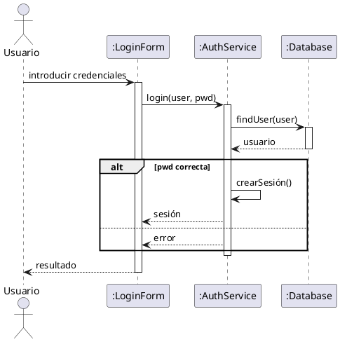
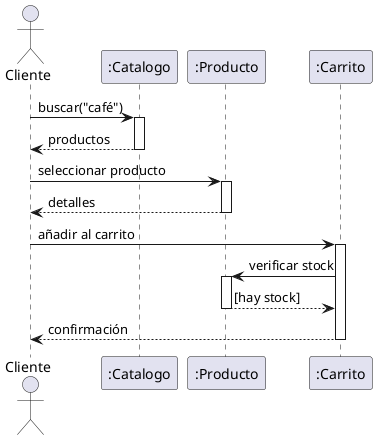
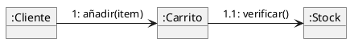
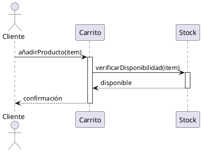
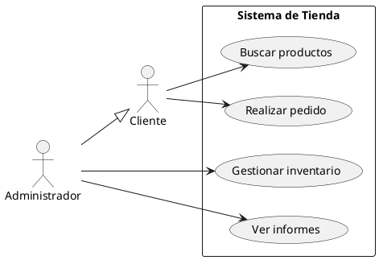
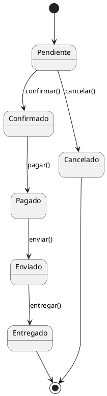
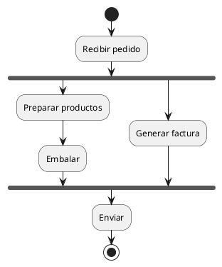
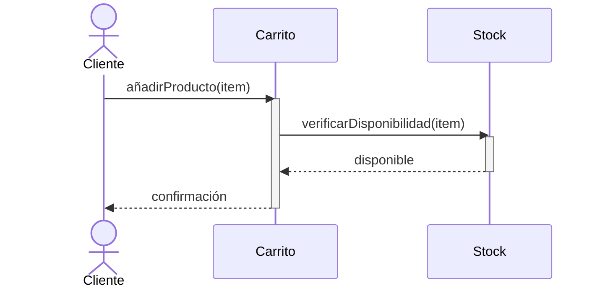
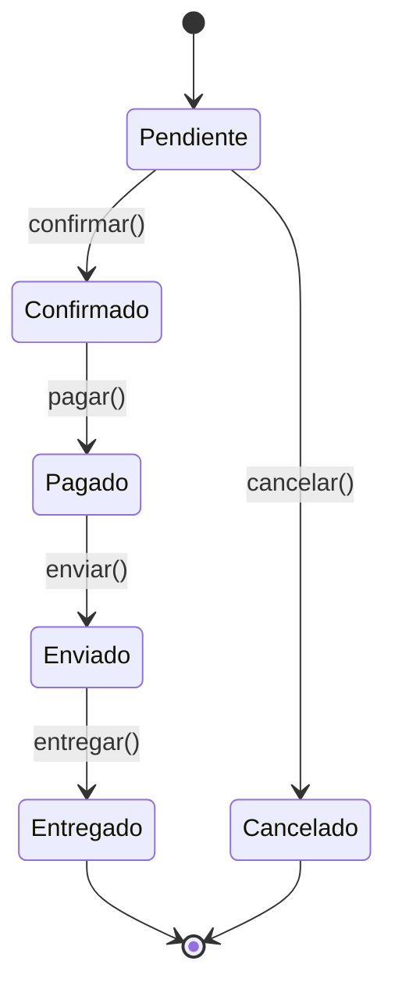
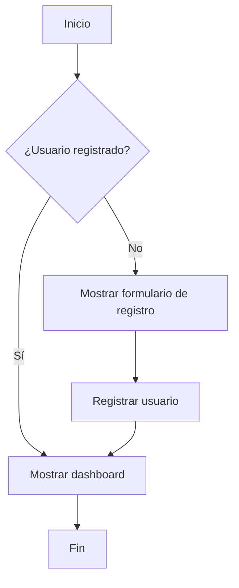

# UP9: UML. COMPORTAMIENTO E INTERACCIÓN

## ÍNDICE

- [OBJETIVOS](#objetivos)
- [1. INTRODUCCIÓN](#1-introducción)
- [2. DIAGRAMAS DE SECUENCIA](#2-diagramas-de-secuencia)
  - [2.1. Propósito](#21-propósito)
  - [2.2. Elementos del diagrama](#22-elementos-del-diagrama)
  - [2.3. Fragmentos combinados](#23-fragmentos-combinados)
  - [2.4. Ejemplos de diagramas de secuencia](#24-ejemplos-de-diagramas-de-secuencia)
- [3. DIAGRAMAS DE COMUNICACIÓN](#3-diagramas-de-comunicación)
  - [3.1. Propósito](#31-propósito)
  - [3.2. Elementos del diagrama](#32-elementos-del-diagrama)
  - [3.3. Comparación con diagramas de secuencia](#33-comparación-con-diagramas-de-secuencia)
  - [3.4. Uso práctico y alternativas](#34-uso-práctico-y-alternativas)
- [4. DIAGRAMAS DE ACTIVIDADES](#4-diagramas-de-actividades)
  - [4.1. Propósito](#41-propósito)
  - [4.2. Elementos del diagrama](#42-elementos-del-diagrama)
  - [4.3. Calles (Swimlanes)](#43-calles-swimlanes)
  - [4.4. Ejemplos de diagramas de actividades](#44-ejemplos-de-diagramas-de-actividades)
- [5. DIAGRAMAS DE ESTADOS](#5-diagramas-de-estados)
  - [5.1. Propósito](#51-propósito)
  - [5.2. Elementos del diagrama](#52-elementos-del-diagrama)
  - [5.3. Estados compuestos](#53-estados-compuestos)
  - [5.4. Ejemplos de diagramas de estados](#54-ejemplos-de-diagramas-de-estados)
- [6. AMPLIACIÓN: DIAGRAMAS COMO CÓDIGO](#6-ampliación-diagramas-como-código)
  - [6.1. PlantUML](#61-plantuml)
  - [6.2. Mermaid](#62-mermaid)
  - [6.3. Ventajas del enfoque "diagrams as code"](#63-ventajas-del-enfoque-diagrams-as-code)
  - [6.4. Modelo C4](#64-modelo-c4)
- [7. ¿QUÉ DIAGRAMAS UML SE USAN REALMENTE?](#7-qué-diagramas-uml-se-usan-realmente)
  - [7.1. Frecuencia de uso en la industria](#71-frecuencia-de-uso-en-la-industria)
  - [7.2. El "stack" de diagramas más común](#72-el-stack-de-diagramas-más-común)
  - [7.3. Consejos pragmáticos](#73-consejos-pragmáticos)
  - [7.4. Conclusión: pragmatismo sobre formalismo](#74-conclusión-pragmatismo-sobre-formalismo)

---

## OBJETIVOS

Al finalizar esta unidad, el alumno será capaz de:

- **Interpretar y elaborar diagramas de secuencia**, mostrando la interacción entre objetos a lo largo del tiempo.
- Comprender y aplicar fragmentos combinados en diagramas de secuencia (alt, opt, loop, ref).
- Conocer los diagramas de comunicación y entender por qué se usan raramente en la práctica.
- **Interpretar y elaborar diagramas de actividades**, modelando flujos de trabajo y procesos.
- Aplicar el concepto de swimlanes (calles) para asignar responsabilidades en procesos.
- **Interpretar y elaborar diagramas de estados**, modelando el ciclo de vida de objetos con comportamiento complejo.
- Comprender qué diagramas UML se utilizan realmente en la industria y cuándo usarlos.
- Conocer herramientas modernas de "diagrams as code" (PlantUML, Mermaid) y el modelo C4.

---

## 1. INTRODUCCIÓN

En la unidad anterior (UP08) estudiamos los **fundamentos de UML** y los diagramas estructurales básicos:

- **Casos de uso**: para capturar requisitos funcionales desde la perspectiva del usuario
- **Diagramas de clases**: para diseñar la estructura del código (el diagrama más importante de UML)
- **Diagramas de objetos**: para mostrar instancias concretas en un momento dado

En esta unidad nos centramos en los **diagramas de comportamiento e interacción**, que modelan los aspectos dinámicos del sistema:

| Diagrama | Pregunta que responde | Cuándo usarlo |
| -------- | ---------------------- | --------------- |
| **Secuencia** | ¿Cómo interactúan los objetos para realizar una función? | Para diseñar o documentar la lógica de un escenario concreto |
| **Comunicación** | ¿Qué objetos colaboran y cómo se relacionan? | Raramente (el de secuencia es mejor) |
| **Actividades** | ¿Cuál es el flujo de trabajo o algoritmo? | Para modelar procesos de negocio o flujos complejos |
| **Estados** | ¿Qué estados puede tener un objeto y cómo transiciona? | Para objetos con ciclo de vida complejo |

**Importante**: Ahora que ya conocemos las **clases y objetos** (de UP08), podemos entender cómo estos objetos **interactúan y colaboran** en tiempo de ejecución, lo que es exactamente lo que muestran los diagramas de comportamiento.

---

## 2. DIAGRAMAS DE SECUENCIA

### 2.1. Propósito

El **diagrama de secuencia** muestra cómo los objetos de un sistema interactúan entre sí a lo largo del tiempo para realizar una funcionalidad específica. Responde a la pregunta: *"¿Cómo colaboran los objetos para implementar este caso de uso?"*

**Características principales:**

- Muestra la **secuencia temporal** de mensajes entre objetos.
- Representa **un escenario concreto**, no todas las posibilidades.
- Es muy útil para **diseñar** la lógica interna del sistema.
- Ayuda a identificar **qué métodos** necesita cada clase.

**¿Cuándo se usan?**

- Para detallar cómo se implementa un caso de uso.
- Para diseñar la interacción entre componentes de un sistema.
- Para documentar flujos complejos.
- Para comunicar diseños técnicos entre desarrolladores.

### 2.2. Elementos del diagrama

#### Participantes (Lifelines)

Los **participantes** son los objetos o actores que intervienen en la interacción. Se representan como rectángulos en la parte superior, con una línea vertical discontinua (la *línea de vida*) que desciende.

```text
  ┌─────────┐      ┌─────────┐      ┌─────────┐
  │ :Cliente│      │ :Carrito│      │ :Stock  │
  └────┬────┘      └────┬────┘      └────┬────┘
       │                │                │
       │                │                │
       │                │                │
       ▼                ▼                ▼
```

El nombre puede ser:

- Solo la clase: `:Carrito`
- Objeto con nombre: `miCarrito:Carrito`
- Actor: `Usuario`

#### Mensajes

Los **mensajes** representan la comunicación entre participantes. Se dibujan como flechas horizontales entre **líneas de vida**.

**Tipos de mensajes:**

| Tipo | Representación | Descripción |
| ---- | -------------- | ----------- |
| Síncrono | ——▶ (flecha rellena) | El emisor espera la respuesta |
| Respuesta | ◀- - - (flecha discontinua) | Retorno de un mensaje síncrono |
| Asíncrono | ——> (flecha abierta) | El emisor no espera respuesta |
| Creación | - - - ▶ hacia un rectángulo | Crea un nuevo objeto |
| Destrucción | X al final de la línea de vida | Destruye el objeto |

#### Activación (Focus of control)

Un **rectángulo sobre la línea de vida** indica que el objeto está activo (ejecutando código). Comienza cuando recibe un mensaje y termina cuando devuelve el control.

```text
  ┌─────────┐          ┌─────────┐
  │ :Cliente│          │ :Carrito│
  └────┬────┘          └────┬────┘
       │   añadir(item)     │
       │──────────────────▶┌┴┐
       │                   │ │  (activación)
       │◀ - - - - - - - - -└┬┘
       │                    │
```

#### Mensajes a uno mismo (Self-call)

Un objeto puede enviarse mensajes a sí mismo:

```text  
       ┌─────────┐
       │:Validador│
       └────┬────┘
            │
       ┌────┴────┐
       │         │ validarFormato()
       │    ┌────┴───┐
       │    │        │
       │    └────┬───┘
       │         │
       └─────────┘
```

### 2.3. Fragmentos combinados

Los **fragmentos combinados** permiten representar flujos de control como condiciones, bucles o alternativas.

#### alt (alternativa)

Representa una elección condicional (if-else):

```text
┌─────────────────────────────────────┐
│ alt  [saldo >= importe]            │
│ ├───────────────────────────────────┤
│ │     realizarPago()                │
│ │◀──────────────────                │
│ ├───────────────────────────────────┤
│ │ [else]                            │
│ │     mostrarError()                │
│ │◀──────────────────                │
└─────────────────────────────────────┘
```

#### opt (opcional)

Representa código que puede ejecutarse o no (if sin else):

```text
┌─────────────────────────────────────┐
│ opt  [usuario.esPremium()]         │
│ ├───────────────────────────────────┤
│ │     aplicarDescuento()            │
│ │◀──────────────────                │
└─────────────────────────────────────┘
```

#### loop (bucle)

Representa repetición:

```text
┌─────────────────────────────────────┐
│ loop  [para cada item en carrito]  │
│ ├───────────────────────────────────┤
│ │     calcularPrecio(item)          │
│ │◀──────────────────                │
└─────────────────────────────────────┘
```

#### ref (referencia)

Hace referencia a otro diagrama de secuencia:

```text
┌─────────────────────────────────────┐
│ ref                                 │
│                                     │
│      Proceso de autenticación       │
│                                     │
└─────────────────────────────────────┘
```

### 2.4. Ejemplos de diagramas de secuencia

#### Ejemplo 1: Autenticación de usuario

```text
┌────────┐     ┌────────────┐     ┌──────────┐     ┌─────────┐
│:Usuario│     │:LoginForm  │     │:AuthService│   │:Database│
└───┬────┘     └─────┬──────┘     └─────┬─────┘    └────┬────┘
    │                │                  │               │
    │ introducir     │                  │               │
    │ credenciales   │                  │               │
    │───────────────▶│                  │               │
    │                │                  │               │
    │                │  login(user,pwd) │               │
    │                │─────────────────▶│               │
    │                │                  │               │
    │                │                  │ findUser(user)│
    │                │                  │──────────────▶│
    │                │                  │               │
    │                │                  │◀- - usuario - │
    │                │                  │               │
    │                │                  │               │
    │                │    ┌─────────────┴────────┐      │
    │                │    │ alt [pwd correcta]   │      │
    │                │    │ ├────────────────────┤      │
    │                │    │ │ crearSesión()      │      │
    │                │◀ - │ │ - - sesión - - - - │      │
    │                │    │ ├────────────────────┤      │
    │                │    │ │ [else]             │      │
    │                │◀ - │ │ - - error - - - - -│      │
    │                │    └─────────────┬────────┘      │
    │                │                  │               │
    │◀─ resultado ───│                  │               │
    │                │                  │               │
```

**Código PlantUML:**



#### Ejemplo 2: Añadir producto al carrito

```text
┌────────┐     ┌──────────┐     ┌─────────┐     ┌────────┐
│:Cliente│     │:Catalogo │     │:Producto│     │:Carrito│
└───┬────┘     └────┬─────┘     └────┬────┘     └───┬────┘
    │               │                │              │
    │ buscar("café")│                │              │
    │──────────────▶│                │              │
    │               │                │              │
    │◀─ productos ──│                │              │
    │               │                │              │
    │ seleccionar   │                │              │
    │ producto      │                │              │
    │───────────────────────────────▶│              │
    │               │                │              │
    │◀─ detalles ───────────────────│              │
    │               │                │              │
    │ añadir al     │                │              │
    │ carrito       │                │              │
    │─────────────────────────────────────────────▶│
    │               │                │              │
    │               │                │              │ verificar
    │               │                │◀─────────────│ stock
    │               │                │              │
    │               │                │─────────────▶│
    │               │                │   [hay stock]│
    │◀─ confirmación ─────────────────────────────│
    │               │                │              │
```

**Código PlantUML:**



---

## 3. DIAGRAMAS DE COMUNICACIÓN

### 3.1. Propósito

El **diagrama de comunicación** (anteriormente llamado *diagrama de colaboración* en UML 1.x) muestra las interacciones entre objetos, pero enfatizando las **relaciones estructurales** entre ellos en lugar del orden temporal.

**Características principales:**

- Muestra la misma información que un diagrama de secuencia, pero con **otro layout**.
- Énfasis en la **estructura** y las relaciones entre objetos, no en el tiempo.
- Los mensajes se numeran para indicar el orden de ejecución.
- Útil cuando la topología de la colaboración es más importante que la secuencia.

**¿Cuándo se usan?**

Teóricamente, cuando:
- Se quiere mostrar la estructura de la colaboración entre objetos
- El foco está en las relaciones, no en la secuencia temporal

**En la práctica:**
- **Casi nunca se usan**. Los diagramas de secuencia hacen el mismo trabajo y son más claros para mostrar el flujo temporal.
- La mayoría de herramientas y desarrolladores prefieren los diagramas de secuencia.

### 3.2. Elementos del diagrama

#### Objetos

Se representan igual que en los diagramas de secuencia: rectángulos con el nombre subrayado.

```text
┌────────────────┐
│ :NombreClase   │
└────────────────┘
```

#### Enlaces (Links)

Líneas que conectan objetos que interactúan. Representan la capacidad de enviar mensajes.

```text
┌──────────┐              ┌──────────┐
│:Cliente  │──────────────│:Carrito  │
└──────────┘              └──────────┘
```

#### Mensajes

Flechas sobre los enlaces, numeradas para indicar el orden:

```text
┌──────────┐              ┌──────────┐
│:Cliente  │──1: añadir() │:Carrito  │
└──────────┘              └──────────┘
```

**Numeración de mensajes:**
- `1`: Primer mensaje
- `2`: Segundo mensaje
- `1.1`: Primer mensaje anidado dentro del mensaje 1
- `1.2`: Segundo mensaje anidado dentro del mensaje 1

### 3.3. Comparación con diagramas de secuencia

**Mismo ejemplo en ambos formatos:**

**Diagrama de secuencia:**
```text
┌────────┐       ┌────────┐       ┌────────┐
│:Cliente│       │:Carrito│       │:Stock  │
└───┬────┘       └───┬────┘       └───┬────┘
    │                │                │
    │ añadir(item)   │                │
    │───────────────>│                │
    │                │ verificar()    │
    │                │───────────────>│
    │                │<───────────────│
    │<───────────────│                │
```

**Diagrama de comunicación (mismo escenario):**
```text
                    ┌──────────┐
                    │  :Stock  │
                    └──────────┘
                          ▲
                          │
                          │ 1.1: verificar()
                          │
    ┌──────────┐          │          ┌──────────┐
    │ :Cliente │──────────┴──────────│ :Carrito │
    └──────────┘                     └──────────┘
           └──1: añadir(item)────────>
```

**Código PlantUML (comunicación):**



**Observación:** Ambos diagramas muestran exactamente lo mismo, pero el de secuencia es más claro para entender el flujo temporal.

### 3.4. Uso práctico y alternativas

**En la práctica profesional:**

Los diagramas de comunicación **prácticamente no se usan** porque:

1. **El diagrama de secuencia es superior** para mostrar flujos de interacción.
2. **La numeración manual** de mensajes es tediosa y propensa a errores.
3. **Las herramientas** suelen tener mejor soporte para diagramas de secuencia.
4. **Los desarrolladores están más familiarizados** con diagramas de secuencia.

**Cuándo podrían ser útiles (teóricamente):**
- En sistemas con **topología de red compleja** donde importa más ver quién se comunica con quién que el orden exacto.
- Para **documentar arquitecturas** donde las relaciones son más importantes que las secuencias.

**Pero incluso en esos casos**, suele ser más efectivo usar:
- Un **diagrama de componentes** o de **despliegue** para mostrar la arquitectura
- **Diagramas de secuencia** para los flujos concretos

**Conclusión pragmática:**

El diagrama de comunicación está en el estándar UML y en los temarios académicos por razones históricas, pero en la industria **usa diagramas de secuencia** para este propósito. Son más claros, mejor soportados y más conocidos.

---

## 4. DIAGRAMAS DE ACTIVIDADES

### 4.1. Propósito

El **diagrama de actividades** modela el flujo de control o de datos en un proceso. Es similar a un diagrama de flujo tradicional, pero con más expresividad para representar concurrencia y responsabilidades.

**Características principales:**

- Muestra el **flujo de trabajo** paso a paso.
- Puede representar **paralelismo** y **sincronización**.
- Útil tanto para **procesos de negocio** como para **algoritmos**.
- Permite asignar actividades a diferentes **responsables** mediante calles.

**¿Cuándo se usan?**

- Para modelar procesos de negocio.
- Para documentar flujos de trabajo complejos.
- Para detallar algoritmos antes de implementarlos.
- Para entender y optimizar procesos existentes.

**Actividades vs Secuencia: ¿Cuándo usar cada uno?**

Existe un **solape** entre estos dos tipos de diagramas: ambos pueden modelar flujos de trabajo. La diferencia principal está en la **óptica** o perspectiva:

| Aspecto | Diagrama de Secuencia | Diagrama de Actividades |
| ------- | -------------------- | ---------------------- |
| **Enfoque** | Interacción entre **objetos/componentes** | Flujo del **proceso/algoritmo** |
| **Eje temporal** | El tiempo fluye de **arriba a abajo** (explícito) | El tiempo es implícito en el flujo |
| **Mejor para** | Casos de uso específicos, interacciones API, protocolos | Procesos de negocio, workflows, algoritmos |
| **Muestra quién** | Objetos/actores concretos que colaboran | Actividades abstractas (a veces con swimlanes) |
| **Paralelismo** | Difícil de representar | Natural con fork/join |
| **Decisiones** | Fragmentos `alt` (más pesado) | Diamantes de decisión (más ligero) |

**Regla práctica:**

- **Secuencia**: cuando importa **quién** hace **qué** y en **qué orden** se intercambian mensajes.
- **Actividades**: cuando importa **qué pasos** ocurren, con qué **decisiones** y **paralelismo**, independientemente de los objetos concretos.

### 4.2. Elementos del diagrama

#### Nodo inicial y final

- **Nodo inicial**: Un círculo negro relleno. Indica dónde comienza el flujo.
- **Nodo final (de actividad)**: Un círculo con un punto negro dentro. Indica dónde termina todo el flujo.
- **Nodo final (de flujo)**: Un círculo con una X. Indica que ese camino termina pero otros pueden continuar.

```text
  ●       Nodo inicial

  ◉       Nodo final (actividad)

  ⊗       Nodo final (flujo)
```

#### Acción/Actividad

Representa una acción o paso del proceso. Se dibuja como un rectángulo con esquinas redondeadas.

```text
┌─────────────────────┐
│  Procesar pedido    │
└─────────────────────┘
```

#### Flujo (transición)

Una flecha que conecta elementos, indicando el paso de uno a otro.

```text
┌──────────┐         ┌──────────┐
│ Acción A │────────▶│ Acción B │
└──────────┘         └──────────┘
```

#### Decisión y fusión

Un **rombo** representa un punto de decisión (con varias salidas) o de fusión (con varias entradas).

**Decisión:**

```text
                    ┌──────────┐
         [sí]      │ Aprobar  │
       ┌──────────▶│ pedido   │
       │           └──────────┘
    ◇──┤
       │           ┌──────────┐
       │  [no]     │ Rechazar │
       └──────────▶│ pedido   │
                   └──────────┘
```

**Fusión:**

```text
    ┌──────────┐       ┌──────────┐
    │ Camino A │       │ Camino B │
    └────┬─────┘       └────┬─────┘
         │                  │
         └────────┬─────────┘
                  ▼
                  ◇
                  │
                  ▼
           ┌──────────┐
           │ Continuar│
           └──────────┘
```

#### Bifurcación y unión (fork/join)

Una **barra horizontal** representa bifurcación (el flujo se divide en paralelo) o unión (los flujos paralelos se sincronizan). Sincronizarse significa que todas las ramas deben completarse antes de continuar.

**Bifurcación (fork):**

```text
                  │
         ═════════╪═════════
         │        │        │
         ▼        ▼        ▼
      Tarea A  Tarea B  Tarea C
      (paralelo)
```

**Unión (join):**

```text
      Tarea A  Tarea B  Tarea C
         │        │        │
         ═════════╪═════════
                  │
                  ▼
```

### 4.3. Calles (Swimlanes)

Las **calles** (o *swimlanes*) dividen el diagrama en zonas, cada una asignada a un responsable (actor, departamento, sistema). Permiten ver claramente quién hace qué.

```text
│       Cliente      │      Sistema      │      Almacén     │
│                    │                   │                  │
│        ●           │                   │                  │
│        │           │                   │                  │
│        ▼           │                   │                  │
│  ┌───────────┐     │                   │                  │
│  │  Realizar │     │                   │                  │
│  │  pedido   │─────┼──────▶            │                  │
│  └───────────┘     │  ┌───────────┐    │                  │
│                    │  │ Procesar  │    │                  │
│                    │  │ pedido    │────┼────▶             │
│                    │  └───────────┘    │  ┌───────────┐   │
│                    │                   │  │ Preparar  │   │
│                    │                   │  │ envío     │   │
│                    │                   │  └───────────┘   │
```

### 4.4. Ejemplos de diagramas de actividades

#### Ejemplo 1: Proceso de compra online

```text
                    ●
                    │
                    ▼
           ┌───────────────┐
           │ Buscar        │
           │ productos     │
           └───────┬───────┘
                   │
                   ▼
           ┌───────────────┐
           │ Añadir al     │◀──────┐
           │ carrito       │       │
           └───────┬───────┘       │
                   │               │
                   ▼               │
                   ◇───────────────┘
                   │ [seguir comprando]
                   │
                   │ [finalizar]
                   ▼
           ┌───────────────┐
           │ Ir al checkout│
           └───────┬───────┘
                   │
                   ▼
           ┌───────────────┐
           │ Identificarse │
           └───────┬───────┘
                   │
                   ▼
           ┌───────────────┐
           │ Elegir envío  │
           └───────┬───────┘
                   │
                   ▼
           ┌───────────────┐
           │ Pagar         │
           └───────┬───────┘
                   │
                   ▼
                   ◇
          [ok]┌────┴────┐[error]
              ▼         ▼
     ┌─────────────┐ ┌─────────────┐
     │ Confirmar   │ │ Mostrar     │
     │ pedido      │ │ error       │
     └──────┬──────┘ └──────┬──────┘
            │               │
            ▼               │
            ◉               │
                            │
            ┌───────────────┘
            ▼
    ┌───────────────┐
    │ Reintentar    │
    │ pago          │
    └───────────────┘
```

#### Ejemplo 2: Proceso con paralelismo (preparar pedido en almacén)

```text
                    ●
                    │
                    ▼
           ┌───────────────┐
           │ Recibir       │
           │ pedido        │
           └───────┬───────┘
                   │
          ═════════╪═════════    (fork)
          │                 │
          ▼                 ▼
  ┌───────────────┐ ┌───────────────┐
  │ Preparar      │ │ Generar       │
  │ productos     │ │ factura       │
  └───────┬───────┘ └───────┬───────┘
          │                 │
  ┌───────────────┐         │
  │ Embalar       │         │
  └───────┬───────┘         │
          │                 │
          ═════════╪═════════    (join)
                   │
                   ▼
           ┌───────────────┐
           │ Enviar        │
           └───────┬───────┘
                   │
                   ▼
                   ◉
```

---

## 5. DIAGRAMAS DE ESTADOS

### 5.1. Propósito

El **diagrama de estados** (o *diagrama de máquina de estados*) modela el comportamiento de un objeto a lo largo de su ciclo de vida, mostrando los estados por los que puede pasar y las transiciones entre ellos.

**Características principales:**

- Se centra en **un solo objeto** o entidad.
- Muestra cómo el objeto **responde a eventos** cambiando de estado.
- Útil para objetos con **comportamiento dependiente del estado**.

**¿Cuándo se usan?**

- Para objetos con ciclo de vida complejo: pedidos, reservas, cuentas de usuario.
- Para protocolos de comunicación: estados de una conexión TCP.
- Para interfaces de usuario: estados de un formulario o pantalla.
- Para sistemas reactivos: dispositivos que responden a eventos.

### 5.2. Elementos del diagrama

#### Estado

Un **estado** representa una situación estable en la vida de un objeto. Se dibuja como un rectángulo con esquinas redondeadas.

```text
┌───────────────┐
│   Pendiente   │
└───────────────┘
```

Un estado puede tener compartimentos para:

- **Nombre** del estado (obligatorio).
- **Acciones internas**: entry (al entrar), exit (al salir), do (mientras está en el estado).

```text
┌─────────────────────┐
│      En proceso     │
├─────────────────────┤
│ entry/ notificar()  │
│ do/ procesar()      │
│ exit/ limpiar()     │
└─────────────────────┘
```

#### Pseudoestados inicial y final

- **Estado inicial**: Círculo negro relleno. Indica el estado por defecto al crear el objeto.
- **Estado final**: Círculo con punto negro. Indica que el objeto ha terminado su ciclo de vida.

```
  ●       Estado inicial

  ◉       Estado final
```

#### Transición

Una **flecha** entre estados representa una transición. Puede incluir:

- **Evento** que dispara la transición.
- **Condición** (guarda) entre corchetes.
- **Acción** que se ejecuta durante la transición.

Formato: `evento [condición] / acción`

```text
┌──────────┐    evento [condición] / acción    ┌──────────┐
│ Estado A │─────────────────────────────────▶│ Estado B │
└──────────┘                                   └──────────┘
```

Ejemplos:

- `click / mostrarMenu` - al hacer click, mostrar menú.
- `timeout [reintentos < 3] / reintentar` - si hay timeout y quedan reintentos.
- `pagar` - simplemente el evento, sin condición ni acción.

### 5.3. Estados compuestos

Un **estado compuesto** contiene subestados dentro. Permite modelar comportamiento jerárquico.

```text
┌─────────────────────────────────────────┐
│              En proceso                 │
│  ┌────────────┐        ┌────────────┐   │
│  │ Validando  │───────▶│ Procesando │   │
│  └────────────┘        └────────────┘   │
│                                         │
└─────────────────────────────────────────┘
```

Si ocurre un evento que saca del estado compuesto, se sale independientemente del subestado actual.

### 5.4. Ejemplos de diagramas de estados

#### Ejemplo 1: Ciclo de vida de un pedido

```text
                         ●
                         │
                         │ crearPedido()
                         ▼
                  ┌─────────────┐
                  │  Pendiente  │
                  └──────┬──────┘
                         │
            ┌────────────┼────────────┐
            │            │            │
            │ confirmar()│            │ cancelar()
            ▼            │            ▼
     ┌─────────────┐     │     ┌─────────────┐
     │  Confirmado │     │     │  Cancelado  │
     └──────┬──────┘     │     └──────┬──────┘
            │            │            │
            │ pagar()    │            ▼
            ▼            │            ◉
     ┌─────────────┐     │
     │   Pagado    │     │
     └──────┬──────┘     │
            │            │
            │ enviar()   │
            ▼            │
     ┌─────────────┐     │
     │  Enviado    │     │
     └──────┬──────┘     │
            │            │
            │ entregar() │
            ▼            │
     ┌─────────────┐     │
     │  Entregado  │     │
     └──────┬──────┘     │
            │            │
            ▼            │
            ◉            │
```

#### Ejemplo 2: Estados de una conexión de red

```text
                   ●
                   │
                   │ iniciar
                   ▼
            ┌─────────────┐
            │ Desconectado│◀───────────────────────┐
            └──────┬──────┘                        │
                   │                               │
                   │ conectar()                    │
                   ▼                               │
            ┌─────────────┐      timeout          │
            │ Conectando  │─────────────────────▶│
            └──────┬──────┘                        │
                   │                               │
                   │ conexiónEstablecida           │
                   ▼                               │
            ┌─────────────┐                        │
            │  Conectado  │───────────────────────┤
            └──────┬──────┘     error /           │
                   │            reintentar        │
                   │                               │
                   │ cerrar()                      │
                   ▼                               │
            ┌─────────────┐                        │
            │ Cerrando    │────────────────────────┘
            └─────────────┘      cerradoOk
```

#### Ejemplo 3: Estados de un reproductor de música

```text
                   ●
                   │
                   ▼
            ┌─────────────┐
            │   Parado    │◀──────────────┐
            └──────┬──────┘               │
                   │                      │
                   │ play [hayCanción]    │
                   ▼                      │
            ┌─────────────┐               │
        ┌──▶│ Reproduciendo│───────────────┤
        │   └──────┬──────┘    stop       │
        │          │                      │
        │          │ pause                │
        │          ▼                      │
        │   ┌─────────────┐               │
        │   │   Pausado   │───────────────┘
        │   └──────┬──────┘    stop
        │          │
        │          │ play
        └──────────┘
```

---

## 6. AMPLIACIÓN: DIAGRAMAS COMO CÓDIGO

Una tendencia moderna en el desarrollo de software es tratar los diagramas como código: en lugar de usar herramientas gráficas, se escriben en formato de texto usando una sintaxis específica. Este enfoque se conoce como **"Diagrams as Code"** o **"Documentation as Code"**.

### 6.1. PlantUML

**PlantUML** es una herramienta que genera diagramas UML a partir de descripciones textuales. Soporta todos los tipos de diagramas UML y muchos otros.

**Instalación y uso:**

- Se puede usar online en [plantuml.com](https://www.plantuml.com/plantuml)
- Se integra con IDEs (VS Code, IntelliJ) mediante plugins
- Se puede usar desde línea de comandos

**Ejemplo: Diagrama de secuencia**



**Ejemplo: Diagrama de casos de uso**



**Ejemplo: Diagrama de estados**



**Ejemplo: Diagrama de actividades**



### 6.2. Mermaid

**Mermaid** es similar a PlantUML pero se integra nativamente con muchas plataformas de documentación como GitHub, GitLab, Notion, y Markdown en general. La verdadera potencia de Mermaid se manifiesta en ecosistemas de documentación empresarial como Confluence o Notion. Estas plataformas transforman la documentación en un sistema de hipertexto vivo, centralizado y accesible para toda la organización. En este contexto, la integración nativa de Mermaid lo convierte en la elección natural para mantener los diagramas sincronizados y fáciles de consumir.

**Ejemplo: Diagrama de secuencia**:



**Ejemplo: Diagrama de estados**:



**Ejemplo: Diagrama de flujo (similar a actividades)**:



### 6.3. Ventajas del enfoque "Diagrams as Code"

El enfoque de diagramas como código ofrece múltiples beneficios:

**1. Control de versiones**:

Al ser archivos de texto, los diagramas pueden versionarse con Git igual que el código fuente. Esto permite:

- Ver el historial de cambios del diagrama.
- Hacer diff entre versiones.
- Incluir cambios de diagramas en los mismos commits que los cambios de código.
- Revisiones de código que incluyan los diagramas.

**2. Consistencia con el código**:

Los diagramas viven junto al código, en el mismo repositorio. Esto hace más probable que se mantengan actualizados, ya que:

- Están visibles para los desarrolladores.
- Se pueden actualizar en el mismo pull request que el código.
- Herramientas de CI/CD pueden generar los diagramas automáticamente.

**3. Facilidad de edición**:

No se necesita una herramienta gráfica específica:

- Se pueden editar con cualquier editor de texto.
- Se integran fácilmente en documentación Markdown.
- Son más fáciles de modificar que reorganizar elementos gráficos.

**4. Generación automática**:

Algunas herramientas pueden generar diagramas automáticamente:

- A partir del código fuente (ingeniería inversa).
- A partir de logs o trazas de ejecución.
- Actualizándose cuando cambia el código.

**5. Reproducibilidad**:

El mismo código de diagrama siempre genera el mismo resultado visual. No hay ambigüedad ni dependencia de la configuración de una herramienta gráfica.

### 6.4. Modelo C4: Una alternativa pragmática a UML

> **Nota sobre clasificación:** Aunque mencionamos C4 en esta unidad dedicada a diagramas de comportamiento, el modelo C4 **se centra en la arquitectura y estructura del sistema**, por lo que está más alineado con los **diagramas estructurales de UML** (como diagramas de componentes, paquetes y despliegue). Lo incluimos aquí por su relevancia práctica y como alternativa moderna que todo desarrollador debe conocer, pero conviene recordar que C4 modela la **estructura estática** del sistema, no su comportamiento dinámico.

El **modelo C4**, creado por Simon Brown, es un enfoque moderno para la visualización de arquitectura de software que ha ganado gran popularidad en la industria. A diferencia de UML, que ofrece 14 tipos de diagramas con notación específica, C4 propone solo 4 niveles de abstracción con una notación deliberadamente simple.

**Los 4 niveles de C4:**

**Nivel 1: Diagrama de Contexto (Context)**:

Muestra el sistema como una caja negra y sus relaciones con:

- **Usuarios** que interactúan con el sistema.
- **Sistemas externos** con los que se comunica.

Es el "zoom out" máximo: ideal para explicar el sistema a personas no técnicas o nuevos miembros del equipo.

```text
┌─────────────────────────────────────────────────────────────────┐
│                      Diagrama de Contexto                       │
├─────────────────────────────────────────────────────────────────┤
│                                                                 │
│         ┌─────────┐                                             │
│         │ Cliente │                                             │
│         │[Persona]│                                             │
│         └────┬────┘                                             │
│              │ Usa                                              │
│              ▼                                                  │
│    ┌──────────────────┐         ┌──────────────────┐            │
│    │    Sistema de    │────────▶│  Sistema de      │            │
│    │    E-commerce    │         │  Pagos (Externo) │            │
│    │   [Software]     │         │   [Software]     │            │
│    └────────┬─────────┘         └──────────────────┘            │
│             │                                                   │
│             │ Envía emails                                      │
│             ▼                                                   │
│    ┌──────────────────┐                                         │
│    │  Servidor Email  │                                         │
│    │   [Software]     │                                         │
│    └──────────────────┘                                         │
│                                                                 │
└─────────────────────────────────────────────────────────────────┘
```

**Nivel 2: Diagrama de Contenedores (Containers)**

"Contenedor" en C4 no significa Docker, sino una **unidad desplegable** que ejecuta código o almacena datos:
- Aplicaciones web, APIs, microservicios
- Bases de datos
- Sistemas de archivos
- Colas de mensajes

Muestra las decisiones tecnológicas de alto nivel.

```
┌─────────────────────────────────────────────────────────────────┐
│                    Diagrama de Contenedores                     │
├─────────────────────────────────────────────────────────────────┤
│                                                                 │
│    ┌─────────────────────────────────────────────────────┐      │
│    │              Sistema de E-commerce                  │      │
│    │  ┌─────────────┐    ┌─────────────┐    ┌─────────┐  │      │
│    │  │   Web App   │───▶│   API REST  │───▶│   BD    │  │      │
│    │  │   [React]   │    │ [Spring Boot]│    │[Postgres]│ │      │
│    │  └─────────────┘    └──────┬──────┘    └─────────┘  │      │
│    │                            │                        │      │
│    │                            ▼                        │      │
│    │                     ┌─────────────┐                 │      │
│    │                     │    Redis    │                 │      │
│    │                     │   [Cache]   │                 │      │
│    │                     └─────────────┘                 │      │
│    └─────────────────────────────────────────────────────┘      │
│                                                                 │
└─────────────────────────────────────────────────────────────────┘
```

**Nivel 3: Diagrama de Componentes (Components)**

Hace zoom dentro de un contenedor para mostrar sus **componentes internos**: controladores, servicios, repositorios, etc.

```
┌─────────────────────────────────────────────────────────────────┐
│              API REST (Diagrama de Componentes)                 │
├─────────────────────────────────────────────────────────────────┤
│  ┌──────────────┐    ┌──────────────┐    ┌──────────────┐       │
│  │   Pedidos    │───▶│   Pedidos    │───▶│   Pedidos    │       │
│  │  Controller  │    │   Service    │    │  Repository  │       │
│  └──────────────┘    └──────┬───────┘    └──────────────┘       │
│                             │                                   │
│                             ▼                                   │
│                      ┌──────────────┐                           │
│                      │   Stock      │                           │
│                      │   Service    │                           │
│                      └──────────────┘                           │
└─────────────────────────────────────────────────────────────────┘
```

**Nivel 4: Código (Code)**

El nivel más detallado, equivalente a diagramas de clases UML. Simon Brown recomienda **no crear estos diagramas manualmente**, sino generarlos automáticamente desde el código cuando sea necesario.

**¿Cuándo usar C4 vs UML?**

| Aspecto | C4 | UML |
|---------|-----|-----|
| **Audiencia** | Equipos de desarrollo, stakeholders | Equipos de desarrollo, documentación formal |
| **Curva de aprendizaje** | Baja (4 diagramas, notación simple) | Alta (14 tipos, notación específica) |
| **Formalidad** | Informal, pragmático | Estándar formal (OMG) |
| **Enfoque** | Arquitectura de software | Modelado completo del sistema |
| **Adopción industria** | Creciente, especialmente en DevOps/Agile | Establecido, especialmente en grandes empresas |

**C4 como código:**

El modelo C4 también puede escribirse como código. Existe una extensión de PlantUML llamada **C4-PlantUML** y soporte nativo en **Structurizr** (herramienta creada por Simon Brown). Confieso que todavía no lo he probado, pero aquí un ejemplo con C4-PlantUML:

```plantuml
@startuml
!include https://raw.githubusercontent.com/plantuml-stdlib/C4-PlantUML/master/C4_Container.puml

Person(cliente, "Cliente", "Usuario de la tienda")
System_Boundary(sistema, "Sistema E-commerce") {
    Container(webapp, "Aplicación Web", "React", "Interfaz de usuario")
    Container(api, "API", "Spring Boot", "Lógica de negocio")
    ContainerDb(db, "Base de datos", "PostgreSQL", "Almacena pedidos")
}
System_Ext(pagos, "Sistema de Pagos", "Procesa pagos con tarjeta")

Rel(cliente, webapp, "Usa", "HTTPS")
Rel(webapp, api, "Llama", "JSON/HTTPS")
Rel(api, db, "Lee/Escribe", "JDBC")
Rel(api, pagos, "Procesa pagos", "HTTPS")
@enduml
```

**Conclusión sobre C4:**

En la práctica profesional, es común ver equipos que usan C4 para documentar arquitectura a alto nivel y UML (especialmente diagramas de secuencia y clases) para detalles de diseño. No son excluyentes sino complementarios.

---

**Nota sobre herramientas empresariales**: En entornos corporativos es común encontrar herramientas como **Enterprise Architect**, **IBM Rational**, **MagicDraw** o **Visual Paradigm** en sus versiones comerciales. Estas herramientas ofrecen funcionalidades avanzadas como:

- Gestión de requisitos integrada.
- Generación de código a partir de modelos.
- Ingeniería inversa completa.
- Colaboración en equipo y gestión de versiones de modelos.
- Trazabilidad entre requisitos, modelos y código.
- Informes y documentación automática.

La elección de herramienta depende del contexto del proyecto: para proyectos pequeños o documentación técnica, PlantUML o Mermaid son excelentes opciones; para proyectos empresariales grandes con requisitos de trazabilidad y auditoría, las herramientas comerciales pueden justificar su coste.

---

## 7. ¿QUÉ DIAGRAMAS UML SE USAN REALMENTE?

Una pregunta honesta que todo estudiante debería conocer: **no todos los diagramas UML se usan por igual en la práctica profesional**. Algunos son omnipresentes, otros se usan ocasionalmente, y algunos casi nunca se ven fuera de entornos muy formales.

### 7.1. Frecuencia de uso en la industria

**Diagramas que se usan CONSTANTEMENTE:**

1. **Diagramas de clases** (veremos en UP09)
   - El rey indiscutible de UML
   - Se usa en diseño detallado, documentación, generación automática de código
   - Prácticamente todos los desarrolladores orientados a objetos lo conocen
   - A menudo se genera automáticamente desde el código (ingeniería inversa)

2. **Diagramas de secuencia**
   - Muy popular para documentar APIs, microservicios, flujos de autenticación
   - Excelente para entender sistemas existentes
   - Se usa mucho en revisiones de diseño y documentación técnica
   - Común en arquitectura de software

**Diagramas que se usan REGULARMENTE:**

3. **Diagramas de actividades**
   - Popular en análisis de procesos de negocio
   - Se usa menos para algoritmos (los desarrolladores prefieren pseudocódigo o tests)
   - Útil cuando hay paralelismo o flujos complejos

4. **Diagramas de estados**
   - Se usa cuando hay objetos con ciclo de vida complejo
   - Común en sistemas embebidos, protocolos, máquinas de estado
   - Menos frecuente en aplicaciones web típicas (CRUD)

**Diagramas que se usan OCASIONALMENTE:**

5. **Diagramas de casos de uso**
   - Se ve en fase inicial de proyectos, sobre todo en entornos formales
   - En equipos ágiles se prefieren user stories o casos de uso narrativos
   - Útil para comunicación con stakeholders no técnicos
   - Poco detalle técnico, más conceptual

6. **Diagramas de componentes** (estructural, veremos en UP09)
   - Para arquitectura de alto nivel, módulos del sistema
   - Compite con C4 (que está ganando tracción)

7. **Diagramas de despliegue** (estructural, veremos en UP09)
   - Para mostrar infraestructura física/virtual
   - Hoy en día compite con diagramas de arquitectura cloud específicos (AWS, Azure)

**Diagramas que CASI NUNCA se usan:**

8. **Diagramas de comunicación** (alternativa a secuencia)
   - Prácticamente obsoleto, el de secuencia hace lo mismo mejor

9. **Diagramas de interacción general** (overview de secuencias)
   - Demasiado complejo, poca adopción

10. **Diagramas de temporización** (timing diagrams)
    - Solo en sistemas de tiempo real muy específicos

11. **Otros diagramas estructurales** menos comunes
    - Diagramas de objetos, diagramas de paquetes, diagramas compuestos

### 7.2. El "stack" de diagramas más común

En un proyecto típico de desarrollo de software, el conjunto de diagramas que realmente se crean suele ser:

**Stack mínimo (startup, equipo pequeño):**
```
- Diagramas de clases (para el modelo de dominio)
- Diagramas de secuencia (para flujos críticos: login, pago, etc.)
- C4 o diagrama de componentes (arquitectura general)
```

**Stack completo (empresa mediana/grande):**
```
- Casos de uso (fase de requisitos, opcional)
- Diagramas de clases (diseño del modelo)
- Diagramas de secuencia (interacciones importantes)
- Diagramas de componentes o C4 (arquitectura)
- Diagramas de actividades (procesos de negocio complejos)
- Diagramas de estados (si hay objetos con ciclo de vida complejo)
- Diagramas de despliegue (infraestructura)
```

**Entorno formal (banca, defensa, aeroespacial):**
```
- Todos los anteriores
- Trazabilidad requisitos → diseño → código
- Generación automática de documentación
- Herramientas CASE de pago (Enterprise Architect, etc.)
```

### 7.3. Consejos pragmáticos

**1. No te sientas obligado a usar todos los diagramas:**

UML ofrece 14 tipos de diagramas, pero usar todos sería contraproducente. El objetivo es **comunicar**, no cumplir un checklist.

**2. La documentación que no se mantiene es peor que no tener documentación:**

Un diagrama desactualizado puede confundir más que ayudar. Es mejor:

- Tener pocos diagramas actualizados que muchos obsoletos
- Usar "diagrams as code" versionados con el código
- Generar diagramas automáticamente cuando sea posible

**3. Adapta según tu audiencia:**

- **Stakeholders de negocio**: Casos de uso, C4 nivel 1-2, actividades de proceso
- **Arquitectos**: C4, componentes, secuencia de alto nivel
- **Desarrolladores**: Clases, secuencia detallada, estados
- **DevOps**: Despliegue, componentes

**4. El contexto importa:**

- **Proyecto nuevo**: más diagramas de diseño antes de codificar
- **Proyecto existente**: diagramas de ingeniería inversa para entender
- **Documentación de API**: secuencia es rey
- **Sistema legacy complejo**: diagramas de estados para entender el comportamiento

**5. Combina UML con otras herramientas:**

En la práctica, es común usar:

- UML (clases, secuencia) para diseño detallado
- C4 para arquitectura
- Diagramas de arquitectura específicos de cloud (AWS architecture diagrams)
- User stories en lugar de casos de uso formales
- Swagger/OpenAPI para documentar APIs
- ERD (Entity-Relationship Diagrams) para bases de datos

### 7.4. Conclusión: pragmatismo sobre formalismo

UML es una **caja de herramientas**, no una religión. Usa los diagramas que aporten valor al proyecto:

- Si el equipo entiende mejor el sistema con un diagrama de secuencia, créalo.
- Si nadie va a leer un diagrama de casos de uso, no lo hagas.
- Si generar automáticamente diagramas de clases desde el código es más mantenible, hazlo.
- Si C4 comunica mejor que UML componentes, úsalo.

El **mejor diagrama es el que se entiende, se mantiene y aporta valor**. El resto es burocracia.

---

## RESUMEN

En esta unidad hemos profundizado en los **diagramas de comportamiento e interacción** de UML:

1. **Diagramas de secuencia** (el más importante de comportamiento):
   - Muestran cómo los objetos interactúan a lo largo del tiempo
   - Fundamentales para diseñar y documentar flujos complejos
   - Fragmentos combinados (alt, opt, loop, ref) para control de flujo
   - Muy usados en la industria para APIs, microservicios, protocolos

2. **Diagramas de comunicación**:
   - Muestran las mismas interacciones que secuencia, con otro layout
   - **Raramente usados en la práctica** - el de secuencia es superior
   - Solo mencionados por completitud del estándar UML

3. **Diagramas de actividades**:
   - Modelan flujos de trabajo y procesos de negocio
   - Útiles para paralelismo (fork/join) y decisiones complejas
   - Swimlanes para asignar responsabilidades
   - Alternat alternativa a BPMN para procesos de negocio

4. **Diagramas de estados**:
   - Modelan el ciclo de vida de objetos con comportamiento complejo
   - Estados, transiciones, eventos, guardas
   - Útiles en sistemas reactivos, protocolos, máquinas de estado

5. **Diagrams as Code** (PlantUML, Mermaid):
   - Enfoque moderno: escribir diagramas como texto
   - Ventajas: versionado con Git, CI/CD, generación automática
   - Modelo C4 como alternativa pragmática a UML para arquitectura

6. **Pragmatismo sobre formalismo**:
   - No todos los diagramas UML se usan por igual
   - Los más usados: clases, secuencia, actividades, estados
   - Los raramente usados: comunicación, objetos, timing
   - Usar solo los diagramas que aporten valor real

**Conclusión:** Junto con UP08 (casos de uso, clases, objetos), ahora conoces los diagramas UML esenciales para el desarrollo de software profesional. El "stack" mínimo efectivo es: **casos de uso + clases + secuencia**, y opcionalmente actividades y estados según la naturaleza del proyecto.
