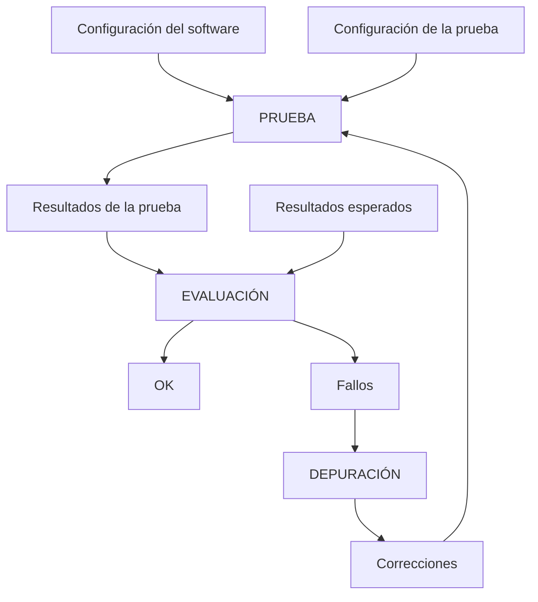

# UP10 y UP11: Diseño y Ejecución de Pruebas

> De acuerdo con la programación didáctica, este bloque de contenidos corresponde a la UP10 (*Diseño de pruebas*) y la UP11 (*Pruebas automáticas*). Se han agrupado en un mismo documento por su estrecha relación.

## ÍNDICE

- [OBJETIVOS](#objetivos)
- [PARTE 1 — UP10: DISEÑO DE PRUEBAS](#parte-1--up10-diseño-de-pruebas)
  - [1. Introducción: el valor de las pruebas](#1-introducción-el-valor-de-las-pruebas)
  - [2. Principios para un buen diseño de pruebas](#2-principios-para-un-buen-diseño-de-pruebas)
  - [3. Tipos de pruebas](#3-tipos-de-pruebas)
    - [3.1. Según el nivel de alcance](#31-según-el-nivel-de-alcance)
    - [3.2. Según el enfoque: caja negra y caja blanca](#32-según-el-enfoque-caja-negra-y-caja-blanca)
    - [3.3. Pruebas de regresión](#33-pruebas-de-regresión)
  - [4. Casos de prueba](#4-casos-de-prueba)
    - [4.1. Estructura de un caso de prueba](#41-estructura-de-un-caso-de-prueba)
    - [4.2. Plantilla de caso de prueba](#42-plantilla-de-caso-de-prueba)
  - [5. Técnicas de diseño de casos de prueba](#5-técnicas-de-diseño-de-casos-de-prueba)
    - [5.1. Clases de equivalencia](#51-clases-de-equivalencia)
    - [5.2. Análisis de valores límite](#52-análisis-de-valores-límite)
    - [5.3. Cobertura de código](#53-cobertura-de-código)
  - [6. El proceso de prueba y documentación de incidencias](#6-el-proceso-de-prueba-y-documentación-de-incidencias)
    - [6.1. Fases del proceso de prueba](#61-fases-del-proceso-de-prueba)
    - [6.2. Documentación de incidencias](#62-documentación-de-incidencias)
- [PARTE 2 — UP11: PRUEBAS AUTOMÁTICAS](#parte-2--up11-pruebas-automáticas)
  - [1. ¿Por qué automatizar? El principio FIRST](#1-por-qué-automatizar-el-principio-first)
  - [2. JUnit 5 en IntelliJ IDEA](#2-junit-5-en-intellij-idea)
    - [2.1. Configuración del proyecto](#21-configuración-del-proyecto)
    - [2.2. Mi primer test](#22-mi-primer-test)
    - [2.3. Ciclo de vida y anotaciones](#23-ciclo-de-vida-y-anotaciones)
    - [2.4. Aserciones](#24-aserciones)
    - [2.5. Tests parametrizados](#25-tests-parametrizados)
  - [3. Buenas prácticas](#3-buenas-prácticas)
    - [3.1. Given-When-Then](#31-given-when-then)
    - [3.2. Tests independientes y nomenclatura](#32-tests-independientes-y-nomenclatura)
    - [3.3. Importación estática](#33-importación-estática)
  - [4. Dobles de prueba](#4-dobles-de-prueba)
    - [4.1. ¿Por qué aislar componentes?](#41-por-qué-aislar-componentes)
    - [4.2. Tipos de dobles de prueba](#42-tipos-de-dobles-de-prueba)
    - [4.3. Ampliación: Mockito](#43-ampliación-mockito)
  - [5. Ampliación: TDD — Test Driven Development](#5-ampliación-tdd--test-driven-development)
  - [6. Ampliación: Más allá de las pruebas unitarias](#6-ampliación-más-allá-de-las-pruebas-unitarias)

---

## OBJETIVOS

Al finalizar esta unidad, el alumno será capaz de:

- **Identificar y clasificar los diferentes tipos de pruebas** según su nivel de alcance y su enfoque (CE3.a).
- Aplicar técnicas sistemáticas para el **diseño de casos de prueba**: clases de equivalencia y análisis de valores límite (CE3.b).
- **Configurar y utilizar JUnit 5** en IntelliJ IDEA para escribir pruebas unitarias automatizadas (CE3.f, CE3.g).
- Manejar las **anotaciones y aserciones principales** de JUnit 5, incluyendo tests parametrizados (CE3.f, CE3.g).
- **Documentar las incidencias** detectadas durante el proceso de prueba (CE3.h).
- Comprender el concepto de **dobles de prueba** y su utilidad para aislar componentes bajo prueba (CE3.i).

> **Nota**: La depuración de código (CE3.c, CE3.d, CE3.e) se trabaja en UP03. Esta unidad se centra en el diseño y la automatización de las pruebas.

---

## PARTE 1 — UP10: DISEÑO DE PRUEBAS

---

### 1. Introducción: el valor de las pruebas

El software raramente funciona bien a la primera. Según estudios de IBM, corregir un bug en producción cuesta entre **10 y 100 veces más** que haberlo detectado durante el desarrollo. Las pruebas son la herramienta fundamental para detectar errores cuanto antes en el ciclo de vida.

<!-- TODO ADD IMAGE: Gráfica del coste relativo de corrección de bugs según la fase del ciclo de vida (requisitos → diseño → codificación → pruebas → producción). Curva exponencial ascendente. Referencia clásica: IBM Systems Science Institute. -->

Pero las pruebas no son únicamente "encontrar bugs". Tienen un papel más amplio:

- **Control de calidad continuo**: aseguran que el software cumple los requisitos.
- **Red de seguridad ante cambios**: cuando modificamos código, las pruebas indican si hemos roto algo que funcionaba.
- **Documentación ejecutable**: una suite de tests bien escrita describe exactamente qué debe hacer el sistema.
- **Mejora del diseño**: escribir pruebas obliga a pensar en la interfaz pública antes que en la implementación interna.

El diseño de pruebas no es una fase final y aislada; es una actividad que se integra de forma transversal en todo el ciclo de desarrollo.

#### ¿Qué es formalmente un bug?

Un **bug** o **defecto** es una **desviación entre el comportamiento real del sistema y el comportamiento especificado**. Esta definición tiene una consecuencia importante: sin especificación, no hay bug. Si nadie ha definido cómo debe comportarse el sistema ante una entrada concreta, no podemos afirmar que lo que ocurre sea incorrecto.

En testing, el elemento que establece qué resultado es correcto se denomina **oráculo** (*test oracle*): puede ser un documento de requisitos, una historia de usuario con criterios de aceptación, una especificación técnica o, en BDD, directamente el escenario Gherkin.

> [!IMPORTANT]
> Un bug es una desviación frente a la especificación, no frente a las expectativas personales de quien prueba. Esta distinción es clave en la práctica: muchas peticiones de cambio se disfrazan de bugs cuando en realidad son **mejoras** (*enhancements*) — el sistema hace exactamente lo que se especificó, pero alguien quiere que haga algo diferente o adicional. Mezclar bugs y mejoras en el mismo flujo de trabajo distorsiona las métricas de calidad y las prioridades del equipo.

#### La realidad: las pruebas, primera víctima de la presión

Todo lo anterior suena razonable sobre el papel. La realidad de los proyectos de software es otra.

Las pruebas (y su compañera la documentación) son con frecuencia **lo primero que se sacrifica** cuando el tiempo o los recursos escasean. Los motivos son comprensibles: escribir un test no produce una pantalla nueva, no desbloquea una demo, no hace avanzar el marcador visible del proyecto. Managers y equipos sufren *FOMO* ante la sensación de que el proyecto no progresa y priorizan lo que se puede mostrar.

Hay además un escenario en que saltarse las pruebas tiene una lógica genuina: **la fase exploratoria**. Cuando todavía no está claro qué se quiere construir, escribir tests detallados es una *liability* — estás especificando con precisión un comportamiento que puede cambiar radicalmente mañana. En exploración, el código es desechable y los tests solo añaden inercia.

El problema real no es ese primer recorte, sino lo que ocurre después: **la excepción temporal se convierte en el estado permanente**. "Ahora no hay tiempo" se instala como norma en la vorágine de entregas, cambios de prioridad y deuda técnica acumulada. El proyecto sale de la fase exploratoria pero el hábito de no testear ya se ha consolidado.

Conocer este patrón no lo elimina, pero ayuda a reconocerlo cuando ocurre y a tomar decisiones conscientes sobre cuándo y dónde recuperar la cobertura perdida.

En casos extremos, lo que queda como única red de seguridad son las pruebas de sistema o de aceptación. El problema es que estas pruebas solo detectan que algo se rompió de forma **visible**: un flujo que falla, una pantalla que no carga. No detectan dónde ni por qué, porque no tienen acceso a las capas internas. El sistema no se rompe de golpe — se vuelve **progresivamente frágil**: cada cambio es un salto de fe, los bugs se acumulan silenciosamente en la lógica interna, y cuando algo explota en sistema es porque el daño ya se había propagado lejos del punto de origen.

Es el antipatrón de la pirámide invertida llevado al extremo: toda la cobertura en la punta, nada en la base. Paradójicamente, los proyectos que llegan aquí suelen ser los que menos tiempo tienen para recuperar la deuda — y los que más lo necesitan.

---

### 2. Principios para un buen diseño de pruebas

No todas las pruebas son igual de útiles. Una prueba mal diseñada consume tiempo sin aportar valor (aunque a veces pueden existir requisitos de cobertura que debemos satisfacer, pero eso es harina de otro costal). Los siguientes principios ayudan a diseñarlas de forma efectiva:

**Alta probabilidad de encontrar fallos**: Las pruebas deben apuntar a las zonas donde el código puede fallar: entradas extremas, combinaciones inusuales, condiciones de error. No tiene sentido diseñar pruebas que se sabe de antemano que van a pasar.

**Enfoque dual: lo que debe y no debe hacer el software**: Una prueba eficaz verifica tanto el comportamiento correcto como el manejo de situaciones incorrectas:

- **Probar que el software hace lo que debe**: verificar el comportamiento con entradas válidas.
- **Probar que el software no hace lo que no debe**: verificar que gestiona entradas inválidas y errores correctamente.

**No redundancia**: Cada caso de prueba debe aportar algo nuevo. Si dos casos verifican exactamente el mismo comportamiento, uno es redundante. Las clases de equivalencia (sección 5.1) ayudan a evitar esto.

**El testing exhaustivo es imposible**: No es viable probar todas las combinaciones posibles de entradas. Un método que recibe dos enteros de 32 bits tiene más de 18 quintillones de combinaciones posibles — probarlas todas no es una opción. A esto se le llama **explosión combinatoria**: al aumentar el número de parámetros o condiciones, el espacio de prueba crece exponencialmente. La consecuencia práctica es que el diseño de pruebas es siempre una decisión sobre qué casos representativos elegir, no un ejercicio de exhaustividad. Las técnicas de la sección 5 ofrecen estrategias sistemáticas para hacer esa elección de forma racional.

**Propósito único**: Cada prueba debe tener un objetivo claro y específico. Si un test verifica múltiples comportamientos a la vez, cuando falla es difícil saber cuál ha fallado. La regla práctica es: **un test, una afirmación o una responsabilidad**.

**Las pruebas no garantizan la ausencia de bugs**: Es fundamental comprender que **la ausencia de fallos en las pruebas no garantiza que el software esté libre de bugs**. Las pruebas son representativas de los escenarios que hemos imaginado, no de todos los posibles. Cuando aparece un bug en producción no cubierto, la respuesta correcta es:

1. Escribir un test que reproduzca el fallo (*prueba post-fallo*).
2. Corregir el código hasta que el test pase.
3. Re-ejecutar toda la suite para verificar que no hay regresiones.

Este proceso iterativo mejora progresivamente la cobertura de la suite.

---

### 3. Tipos de pruebas

#### 3.1. Según el nivel de alcance

Las pruebas se organizan en niveles según el tamaño del componente que verifican:

| Nivel | Qué prueba | Ejecutado por | Herramienta típica |
| ----- | --------- | ------------ | ------------------- |
| **Unitarias** | Un método o clase de forma aislada | Desarrollador | JUnit, Kotest |
| **De integración** | La interacción entre varios componentes | Desarrollador / QA | JUnit, Spring Test |
| **De sistema** | El sistema completo en un entorno real | QA | Selenium, Cypress |
| **De aceptación** | Si el sistema satisface los requisitos del usuario | Cliente / Product Owner | Cucumber |

Veamoslo con un ejemplo concreto.

**Ejemplo: los niveles de prueba en una tienda online**:

Imagina un e-commerce con un método `calcularDescuento(precio, cupon)`, una pantalla de checkout y un proceso completo de compra:

| Nivel | Qué se prueba en este ejemplo | Quién lo hace |
| -- | --- | --- |
| **Unitaria** | El método `calcularDescuento()` devuelve el precio correcto para cada tipo de cupón, de forma aislada | Desarrollador |
| **De integración** | El servicio de pedidos llama correctamente al servicio de descuentos y persiste el precio final en la base de datos | Desarrollador / QA |
| **De sistema** | El usuario navega desde el catálogo, añade productos al carrito, introduce un cupón y completa la compra en un entorno real | QA |
| **De aceptación** | El cliente valida que "dado un cupón de bienvenida, el descuento del 10% se aplica correctamente en el resumen de compra" | Cliente / Product Owner |

Cada nivel añade confianza sobre un ámbito más amplio, pero también es más lento y costoso de ejecutar. Esta relación inversa entre velocidad y alcance da lugar al modelo más influyente del testing moderno: la **pirámide de tests** de Mike Cohn.

<!-- TODO ADD IMAGE: Pirámide de tests de Mike Cohn con tres niveles coloreados (verde=unitarios, amarillo=integración, rojo=sistema/E2E), ejes laterales indicando velocidad (rápido↑/lento↓) y coste (barato↑/caro↓), y el antipatrón de pirámide invertida como contraste. -->

```text
            ___
           /   \          Sistema / E2E
          /     \         (pocos, lentos, caros)
         /-------\
        /         \       Integración
       /           \      (medios)
      /-------------\
     /               \    Unitarios
    /_________________\   (muchos, rápidos, baratos)
```

Nota: E2E significa "End to End" (de extremo a extremo), es decir, pruebas que cubren el flujo completo desde la interfaz de usuario hasta la base de datos.

La pirámide dice que la mayor parte de la cobertura debe venir de tests unitarios (base ancha), con una capa más delgada de tests de integración y una punta estrecha de tests de sistema o E2E. Invertir la pirámide — pocos tests unitarios y muchos E2E — es un antipatrón habitual: la suite se vuelve lenta, frágil y cara de mantener.

> [!NOTE]
> La pirámide es un modelo orientativo, no una norma rígida. En algunos dominios (p. ej. aplicaciones con mucha lógica de integración o APIs externas) puede tener más sentido un rombo o un panal. Lo importante es ser consciente del coste de cada nivel.

En este módulo nos centraremos en las **pruebas unitarias**, las más directamente relacionadas con el código que escribe el desarrollador. El resto de las pruebas las describiremos más sucintamente, porque a veces los desarrolladores también participan en otro tipo de pruebas en proyectos pequeños.

#### 3.2. Según el enfoque: caja negra y caja blanca

Independientemente del nivel, los tests se pueden diseñar desde dos perspectivas:

<!-- TODO ADD IMAGE: Diagrama comparativo caja negra vs caja blanca. Izquierda: caja opaca con flechas "entrada → [???] → salida". Derecha: caja transparente mostrando ramas if/else, bucles y caminos de ejecución internos. -->

**Pruebas de caja negra**:

El diseñador de pruebas trabaja **sin ver la implementación interna**. Solo conoce la especificación: qué entradas acepta el sistema y qué salida debe producir. El foco está en el comportamiento externo observable.

- Ventajas: independiente del código; la puede hacer alguien distinto al desarrollador.
- Técnicas asociadas: clases de equivalencia, valores límite.

**Pruebas de caja blanca**:

El diseñador de pruebas **tiene acceso al código fuente** y diseña casos que ejercitan caminos de ejecución específicos: ramas `if/else`, bucles, condiciones.

- Ventajas: mayor cobertura interna; útil para detectar bugs de lógica.
- Técnicas asociadas: cobertura de líneas, ramas, condiciones.

**Pruebas de caja gris**:

En la práctica muchas pruebas combinan ambos enfoques: se conoce parcialmente la implementación (por ejemplo, "sé que el constructor valida los parámetros") pero se prueba desde fuera usando la interfaz pública. Esto se denomina **caja gris**.

Veamos un ejemplo concreto. Supongamos que tenemos una clase `Station` con un constructor que exige `maxApproachSpeed > 0`.

- **Caja negra**: diseñamos casos de prueba basados solo en la especificación: "el constructor debe aceptar valores positivos y rechazar cero o negativos". No sabemos cómo se implementa esa validación, solo qué resultado se espera. Entonces diseñamos casos con `maxApproachSpeed = 30.0` (pasa), `maxApproachSpeed = 0.0` (falla) y `maxApproachSpeed = -5.0` (falla)
- **Caja blanca**: al revisar el código vemos que la validación se hace con `if (maxApproachSpeed <= 0) throw IllegalArgumentException()`. Diseñamos casos para cubrir esa rama: un caso con `maxApproachSpeed = 30.0` (pasa), otro con `maxApproachSpeed = 0.0` (falla) y otro con `maxApproachSpeed = -5.0` (falla).
- **Caja gris**: diseñamos los mismos casos que en caja negra, pero con la conciencia de que el código tiene esa validación explícita. No es necesario probar valores como `-1.0` y `-100.0` por separado, porque sabemos que cualquier valor negativo se comporta igual (lanza excepción).

La diferencia no es tanto en los casos diseñados, sino en el proceso mental: la caja blanca requiere entender la implementación para elegir casos que cubran caminos específicos, mientras que la caja negra se centra solo en la especificación.

#### 3.3. Pruebas de regresión

Las **pruebas de regresión** son aquellas que se re-ejecutan después de realizar cambios en el código para asegurarse de que la nueva versión no ha roto funcionalidad que antes funcionaba correctamente.

> [!IMPORTANT]
> La automatización cobra su mayor valor en las pruebas de regresión. Sin automatización, re-ejecutar manualmente todos los casos tras cada cambio sería inviable. Con una suite automatizada, basta con pulsar "Run All Tests".

Las pruebas de regresión no son un tipo especial de test, sino un **uso** de los tests existentes: cada vez que añadimos código o corregimos un bug, re-ejecutamos la suite completa para detectar efectos secundarios no deseados.

En el ecosistema que usaremos en este módulo (Java/Kotlin), las pruebas se escriben con **JUnit** y se ejecutan mediante las herramientas de construcción **Gradle** o **Maven** (`./gradlew test` / `mvn test`). Las herramientas de integración continua como Jenkins, GitHub Actions o GitLab CI automatizan esa ejecución en cada commit. En la misma pipeline suelen integrarse también herramientas de **análisis estático de código** como **SonarQube**, que evalúan la calidad del código (cobertura, duplicaciones, vulnerabilidades) y aplican *quality gates*: si el código no supera los umbrales definidos, la pipeline falla y el cambio no se integra.

---

### 4. Casos de prueba

Antes de definir la estructura de un caso de prueba conviene aclarar la jerarquía de conceptos del estándar ISTQB que con frecuencia se mezclan:

- Un **escenario** (*scenario*) es una narrativa de alto nivel que describe una situación de uso: un flujo de usuario, un contexto. Por ejemplo: "un usuario registrado intenta iniciar sesión". No especifica valores concretos ni resultados exactos — describe *qué está pasando*, no *cómo se verifica*.
- Una **condición de prueba** (*test condition*) es un aspecto concreto del sistema que merece ser verificado dentro de ese escenario: "el sistema acepta credenciales válidas", "el sistema rechaza una contraseña incorrecta", "el sistema bloquea la cuenta tras cinco intentos fallidos".
- Un **caso de prueba** (*test case*) es la concreción formal de cómo verificar una condición: incluye valores exactos de entrada, precondiciones y resultado esperado.

La relación es jerárquica: de un escenario se extraen varias condiciones de prueba, y de cada condición se derivan uno o más casos. Esto explica por qué el número de casos siempre supera con creces al número de escenarios identificados.

```text
             [ ESCENARIO ]
          "usuario inicia sesión"
                    |
          __________|__________
          |          |         |
      [Cond. 1]  [Cond. 2]  [Cond. 3]
       válidas   incorrecta  bloqueada
        |   |      |   |      |   |   |
       CP1 CP2   CP3  CP4   CP5  CP6  CP7
```

> [!NOTE]
> En BDD/Gherkin el término *Scenario* tiene un significado más acotado: es un bloque Given/When/Then que equivale prácticamente a un caso de prueba concreto. No confundir con el uso más amplio del término en la planificación de pruebas.

#### 4.1. Estructura de un caso de prueba

Un **caso de prueba** (*test case*) es la especificación formal de una condición que se va a verificar. Va más allá de "ejecutar y ver qué pasa": documenta el escenario, las entradas y el resultado esperado **antes** de ejecutar nada.

Según el estándar **ISTQB** (*International Software Testing Qualifications Board*), todo caso de prueba consta de los mismos elementos fundamentales, independientemente de si se ejecuta manualmente o de forma automatizada:

1. **Precondiciones**: el estado que debe tener el sistema antes de ejecutar la prueba. Sin estas condiciones, la prueba no es válida.
2. **Pasos / Acción**: lo que se hace sobre el sistema: llamar a un método, enviar un formulario, pulsar un botón...
3. **Resultado esperado**: el comportamiento correcto que debe observarse si el sistema funciona bien. Se define *antes* de ejecutar la prueba.
4. **Resultado obtenido**: lo que ocurre realmente al ejecutar. Se rellena *después*.
5. **Veredicto**: la comparación entre el resultado esperado y el obtenido. **Pass** si coinciden, **Fail** si no.

**Ejemplo:**

**Caso de prueba**: Verificar inicio de sesión con credenciales válidas.

- *Precondiciones*: el usuario `"alumno01"` existe en la base de datos y tiene cuenta activa.
- *Acción*: iniciar sesión con usuario `"alumno01"` y contraseña `"pass1234"`.
- *Resultado esperado*: el sistema inicia la sesión y redirige al panel principal.
- *Resultado obtenido*: (se rellena al ejecutar)
- *Veredicto*: Pass / Fail

Esta estructura es universal. Los distintos enfoques la expresan con vocabulario propio:

| Elemento | ISTQB (genérico) | Given/When/Then (BDD) | AAA (test automatizado) |
| --- | --- | --- | --- |
| Estado inicial | Precondiciones | *Given* | *Arrange* |
| Lo que se hace | Pasos / Acción | *When* | *Act* |
| Lo que debe ocurrir | Resultado esperado | *Then* | *Assert* |

> [!NOTE]
> En los tests automatizados (JUnit, pytest...) los campos "resultado obtenido" y "veredicto" no se rellenan a mano: el framework los calcula automáticamente al ejecutar el test y marca cada caso como Pass o Fail.

**La especificación como origen de los casos de prueba**:

Esta estructura solo tiene sentido si existe una especificación previa que diga qué debe hacer el sistema. Según el contexto del proyecto, esa especificación toma formas distintas:

- **Proyectos con requisitos formales**: documentos de especificación o casos de uso que definen el comportamiento esperado.
- **Agile / Scrum**: cada historia de usuario incluye **criterios de aceptación** (*acceptance criteria*) que describen las condiciones que deben cumplirse para considerar la historia terminada. Estos criterios son directamente casos de prueba.
- **BDD (Behavior-Driven Development)**: la especificación se escribe en lenguaje **Gherkin** con el formato Given/When/Then, que puede ejecutarse directamente como test con herramientas como Cucumber. La especificación *es* el test.

En los tres casos el principio es el mismo: **los casos de prueba se derivan de la especificación**, no se inventan después de escribir el código.

**Trazabilidad**:

Una consecuencia directa de este principio es la **trazabilidad** (*traceability*): cada caso de prueba debería poder vincularse al requisito o criterio de aceptación del que proviene. Si un caso de prueba no puede trazarse a ningún requisito, probablemente es redundante o está probando comportamiento no especificado. Si un requisito no tiene ningún caso de prueba asociado, hay un hueco de cobertura.

En la práctica, herramientas como Jira + Xray o TestRail mantienen esta matriz de trazabilidad. En proyectos pequeños basta con un comentario en el test o una nomenclatura que lo vincule (`CP_001_login_valido` → historia US-12).

> [!TIP]
> La trazabilidad también facilita el análisis de impacto: cuando cambia un requisito, la matriz permite identificar qué casos de prueba hay que revisar o actualizar.

#### 4.2. Plantilla de caso de prueba

En proyectos donde las pruebas se documentan formalmente, se usa una plantilla estructurada:

| Campo | Descripción |
| ----- | ----------- |
| **ID** | Identificador único del caso (ej: CP_001) |
| **Fecha / Autor / Versión** | Control de autoría |
| **Descripción** | Objetivo concreto del caso de prueba |
| **Precondiciones** | Estado del sistema antes de ejecutar |
| **Entrada** | Datos o eventos que se proporcionan |
| **Resultado esperado** | Comportamiento correcto que debe observarse |
| **Resultado obtenido** | Lo que ocurre realmente al ejecutar |
| **Evaluación** | ¿Pasa o falla? Conclusión sobre la validez |

La plantilla anterior representa el **formato compacto**, adecuado para test cases con una sola acción verificable. En la práctica, los test cases de flujos complejos se documentan en formato **paso a paso**: cada fila de la hoja Excel es un paso individual (acción → resultado esperado → resultado obtenido → pass/fail), y los campos de cabecera (ID, descripción, precondiciones) se comparten entre todos los pasos del mismo caso mediante celdas combinadas o repetición. Así es posible señalar con precisión en qué paso exacto falla el flujo.

Este formato es el habitual en herramientas especializadas de gestión de pruebas como TestRail o Xray, y en hojas Excel organizadas por módulo o funcionalidad — donde cada hoja agrupa los test cases de una área del sistema.

**Ejemplo: TC-001 — Inicio de sesión con credenciales válidas**:

*Precondiciones: el usuario `"alumno01"` existe en la base de datos con cuenta activa.*

| TC ID | Paso | Acción | Resultado esperado | Resultado obtenido | Pass/Fail |
| --- | --- | --- | --- | --- | --- |
| TC-001 | 1 | Navegar a `/login` | Se muestra el formulario de acceso | | |
| TC-001 | 2 | Introducir usuario `"alumno01"` y contraseña `"pass1234"` | Los campos quedan rellenados | | |
| TC-001 | 3 | Pulsar el botón "Entrar" | El sistema autentica al usuario | | |
| TC-001 | 4 | Observar la página resultante | Se muestra el panel principal con el nombre del usuario | | |

*Los campos "Resultado obtenido" y "Pass/Fail" se rellenan durante la ejecución.*

> [!TIP]
> En pruebas automáticas con JUnit, esta plantilla se "implementa" directamente en código: las precondiciones van en `@BeforeEach`, la entrada y la llamada forman el cuerpo del test, y el resultado esperado se expresa con aserciones (`assertEquals`, `assertThrows`...).

---

### 5. Técnicas de diseño de casos de prueba

La pregunta práctica es: ¿y cómo elegimos los datos de entrada? No podemos probar todos los valores posibles. Las técnicas que siguen ofrecen estrategias sistemáticas para seleccionar los casos más representativos.

#### 5.1. Clases de equivalencia

O *Equivalence Partitioning* (EP) es una técnica de diseño de casos de prueba que consiste en dividir el conjunto de valores posibles de entrada en subconjuntos tales que los valores dentro de cada subconjunto se comportan de manera similar. La idea central es que **si múltiples valores producen el mismo comportamiento, basta con probar uno de ellos**. Un conjunto de valores que produce el mismo comportamiento se llama **clase de equivalencia**.

<!-- TODO ADD IMAGE: Recta numérica con tres zonas coloreadas: rojo (< 0, inválida inferior), verde ([0,100], válida), rojo (> 100, inválida superior). Marcadores en los extremos 0 y 100. Un punto representativo en cada zona. -->

Por ejemplo, si un método valida que una puntuación esté entre 0 y 100, hay tres comportamientos distintos:

| Clase de equivalencia | Rango | Ejemplo |
| --------------------- | ----- | ------- |
| Válida | [0, 100] | 50 |
| No válida (inferior) | < 0 | -3 |
| No válida (superior) | > 100 | 107 |

Probar un valor de cada clase da una cobertura razonable sin redundancia.

**Reglas para identificar clases de equivalencia:**

Hay varias formas comunes de definir clases de equivalencia según el tipo de condición que se está probando. A continuación se muestran algunos patrones típicos:

| Condición de entrada | Clases válidas | Clases no válidas |
| -------------------- | -------------- | ----------------- |
| Rango de valores [a, b] | 1 clase: valores en [a, b] | 2 clases: valores < a y valores > b |
| Valor específico k | 1 clase: exactamente k | 2 clases: valores ≠ k |
| Conjunto {A, B, C} | 1 clase por cada elemento | 1 clase: elemento fuera del conjunto |
| Condición lógica | 1 clase: condición verdadera | 1 clase: condición falsa |

**Ejemplo aplicado al kotlin-train-simulator:**

El constructor de `Station` exige `maxApproachSpeed > 0`. Las clases de equivalencia son:

- **Válida**: cualquier valor positivo, p. ej. `30.0` m/s.
- **No válida**: cero o negativo, p. ej. `0.0` o `-5.0`.

No es necesario probar -1, -100 y -0.001 por separado: pertenecen a la misma clase y se comportan igual (lanzan excepción).

#### 5.2. Análisis de valores límite

O *Boundary Value Analysis* (BVA) es una técnica de prueba que complementa el análisis de clases de equivalencia. Los errores de programación se concentran con especial frecuencia en los **límites** entre clases de equivalencia. Un bucle que debería iterar de 0 a N-1 pero itera de 0 a N es el error de límite más clásico.

> [!NOTE]
> A modo de curiosidad: la concentración de errores en los límites es un patrón que aparece en muchos dominios. Los aviones concentran la mayoría de sus accidentes en las fases de despegue y aterrizaje — los momentos de transición entre estados — exactamente igual que el software falla con más frecuencia en los valores que marcan el borde entre un comportamiento y otro. Los errores de límite (*off-by-one*) son una de las causas más frecuentes de bugs difíciles de detectar.

<!-- TODO ADD IMAGE: Recta numérica con zoom en los bordes del rango [a, b]. Marcadores etiquetados para a-1, a, a+1 (límite inferior) y b-1, b, b+1 (límite superior), con colores indicando si el valor es válido o inválido. -->

El análisis de valores límite complementa las clases de equivalencia probando los valores **justo en el borde** de cada clase. Para un rango [a, b]:

| Valor | Descripción |
| ----- | ----------- |
| a − 1 | Justo fuera del límite inferior |
| a | Exactamente en el límite inferior |
| a + 1 | Justo dentro del límite inferior |
| b − 1 | Justo dentro del límite superior |
| b | Exactamente en el límite superior |
| b + 1 | Justo fuera del límite superior |

**Ejemplo para `maxApproachSpeed > 0` en `Station`:**

Retomando el software de simulación de trenes, el análisis de valores límite para el constructor de `Station` se centra en el límite `0.0`. Básicamente modela que una estación no puede obligar a los trenes a acercase a una velocidad de cero o negativa, lo que no tiene sentido físico. Entonces, los casos de prueba para el límite serían:

| Valor | Resultado esperado |
| ----- | ----------------- |
| -1.0 | Lanza excepción |
| 0.0 | Lanza excepción (el límite es `> 0`, no `>= 0`) |
| 0.001 | Construye correctamente |
| 100.0 | Construye correctamente |

> [!TIP]
> El análisis de valores límite revela el bug clásico de confundir `>` con `>=` en las validaciones. Probar el valor exacto del límite es imprescindible.

El análisis de valores límite no se limita a rangos numéricos. Cualquier dominio ordenado donde exista una frontera entre comportamientos distintos es susceptible de este análisis: por ejemplo, si un método acepta una cadena de texto con longitud máxima de 255 caracteres, los límites serían 254, 255 y 256 caracteres.

BVA y EP son técnicas complementarias con solapamiento parcial. La conexión es esta: los valores de borde interior de BVA (`a+1`, `b-1`) son simultáneamente representativos válidos de EP — el `0.001` del ejemplo anterior sirve como las dos cosas a la vez. Lo que BVA añade sobre EP es una directriz concreta: *cuando elijas el representativo de una clase, que sea el más cercano al borde*, porque es donde más probable es que haya un bug. EP podría elegir `30.0` como representativo válido y sería técnicamente correcto; BVA dice que `0.001` es una elección mejor.

Dicho esto, BVA genera casos adicionales que EP no requiere — el valor exacto en el límite (`0.0`) y el adyacente exterior (`-1.0`) — por lo que ninguna técnica sustituye a la otra. En la práctica se aplican juntas: EP para estructurar el espacio de prueba, BVA para refinar los puntos críticos.

#### 5.3. Cobertura de código

La **cobertura de código** (*code coverage*) es una métrica de las pruebas de caja blanca que indica qué porcentaje del código fuente ha sido ejecutado por los tests. IntelliJ IDEA incluye un medidor de cobertura integrado (botón "Run with Coverage").

<!-- TODO ADD IMAGE: Captura de pantalla de IntelliJ IDEA con la vista "Run with Coverage" activa: panel lateral con porcentajes por clase, y código fuente con líneas verdes (cubiertas) y rojas (no cubiertas). -->

Los principales tipos:

- **Cobertura de líneas** (*line coverage*): porcentaje de líneas ejecutadas. Es la métrica más básica.
- **Cobertura de ramas** (*branch coverage*): porcentaje de ramas `if/else` y `when` ejecutadas. Más exigente.
- **Cobertura de condiciones/decisiones**: cada condición booleana debe haber sido evaluada como `true` y como `false` al menos una vez.
- **Cobertura de bucles**: los bucles deben ejercitarse con cero, una y múltiples iteraciones.

> [!IMPORTANT]
> **Una cobertura del 100% no garantiza que el software sea correcto.** Solo garantiza que ese código se ejecutó al menos una vez. Un test puede ejecutar una línea sin verificar que produce el resultado correcto. La cobertura es una condición necesaria pero no suficiente para la calidad.

**Testing de mutación**: Contenido de ampliación

Para evaluar si los tests son realmente capaces de detectar fallos — y no solo de ejecutar código — existe una técnica avanzada llamada **testing de mutación** (*mutation testing*). La idea es sencilla: una herramienta introduce automáticamente pequeños cambios (*mutantes*) en el código fuente (cambiar `>` por `>=`, invertir un booleano, eliminar una línea...) y comprueba si algún test falla como consecuencia. Si un mutante "sobrevive" sin que ningún test lo detecte, hay un hueco real en la suite.

Herramientas como **PIT** (Java/Kotlin) o **Stryker** (JavaScript/TypeScript) automatizan este proceso. El resultado es la **puntuación de mutación** (*mutation score*): porcentaje de mutantes eliminados. Un score alto indica una suite robusta; uno bajo indica tests que ejecutan código pero no lo verifican de verdad.

---

### 6. El proceso de prueba y documentación de incidencias

#### 6.1. Fases del proceso de prueba

El proceso de prueba no es un acto puntual sino un **ciclo iterativo**: si la corrección introduce nuevos fallos, el ciclo vuelve a empezar.



1. **Prueba**: se configura el sistema en el estado requerido por las precondiciones y se ejecuta la acción definida en el caso de prueba.
2. **Evaluación**: se comparan los resultados obtenidos con los esperados. Si coinciden, el caso pasa; si no, se registra como fallo.
3. **Depuración**: se investiga la causa raíz del problema — no el síntoma, sino el origen del error en el código. Esta fase se trabaja en detalle en UP03.
4. **Corrección**: se implementa el cambio y se re-ejecutan las pruebas, tanto el caso que falló como toda la suite, para confirmar que el bug está resuelto y que no hay nuevas regresiones.

> [!TIP]
> En JUnit, las fases de prueba y evaluación se realizan automáticamente con cada ejecución. Lo que queda al desarrollador es la depuración y corrección cuando un test muestra el icono rojo — y la disciplina de re-ejecutar toda la suite antes de dar el bug por cerrado.

#### 6.2. Documentación de incidencias

Cuando una prueba detecta un fallo, este debe documentarse para permitir su seguimiento. Un buen **informe de incidencia** (*bug report*) incluye:

- **ID**: identificador único (ej: BUG-042).
- **Título**: descripción concisa del problema.
- **Severidad**: crítico / mayor / menor / cosmético.
- **Pasos para reproducir**: secuencia exacta que provoca el fallo.
- **Resultado esperado** y **resultado obtenido**.
- **Entorno**: versión del software, SO, versión del JDK.
- **Estado**: abierto / en progreso / resuelto / cerrado.

En proyectos profesionales se usan sistemas como **Jira**, **Azure DevOps**, **ALM Quality Center** (anteriormente HP Quality Center / HP-ALM, hoy de OpenText) o **GitLab Issues**. A nivel académico, **GitHub Issues** es una opción sencilla, profesional y accesible.

> [!WARNING]
> Es habitual que las mejoras (*enhancements* o *feature requests*) se registren como bugs para darles más urgencia o para saltarse el proceso de priorización. Esto distorsiona las métricas de calidad del proyecto (tasa de bugs, tiempo medio de resolución) y mezcla dos flujos de trabajo que deben ser independientes. Al documentar una incidencia, la primera pregunta debe ser: **¿el sistema se desvía de la especificación, o la especificación simplemente no contempla este caso?** En el primer caso es un bug; en el segundo, es una mejora.

Considera también el siguiente tip para escribir un buen bug report. Reconozco que muchas veces se siente tedioso documentar cada detalle, pero es un paso crucial para que el equipo pueda reproducir y resolver el problema sin perder tiempo en preguntas adicionales.

> [!TIP]
> Un buen bug report es aquel que permite a otra persona reproducir el fallo sin explicaciones adicionales. Si no puedes reproducirlo con los pasos descritos, el informe es incompleto.

**Heisenbugs: cuando el bug no se reproduce**:

En vuestra carrera es posible que os encontréis una situación como la siguiente: un usuario reporta que el sistema hizo algo incorrecto, pero cuando intentáis reproducirlo no pasa nada. O un test falla en el servidor de CI pero pasa en local. O el bug aparece una vez cada cien ejecuciones sin razón aparente.

Este tipo de bugs tiene nombre: **Heisenbugs**, en referencia al principio de incertidumbre de Heisenberg — el bug cambia de comportamiento, o directamente desaparece, en el momento en que intentas observarlo. También se les llama *intermittent bugs* o *flaky bugs*.

La respuesta correcta no es ignorarlos ni cerrarlos como "no reproducible". Se reportan y se documentan con todo lo que haya disponible en el momento del fallo:

- **Logs y stack traces**: son la evidencia más valiosa. De ahí la importancia de tener un buen sistema de logging en producción.
- **Contexto exacto**: hora, carga del sistema, número de usuarios concurrentes, datos concretos implicados.
- **Frecuencia observada**: "ocurrió una vez en producción" o "falla 1 de cada 200 ejecuciones en CI" son datos útiles para priorizar.
- **Severidad acorde al impacto**: un Heisenbug en un proceso de pago es crítico aunque aparezca una vez de cada diez mil ejecuciones.

Las causas más habituales orientan la investigación: **condiciones de carrera** entre hilos, dependencias de orden entre tests, recursos externos no deterministas (red, reloj del sistema) o estado compartido entre ejecuciones que no se limpia correctamente.

En pipelines de CI/CD, los *flaky tests* son especialmente peligrosos porque erosionan la confianza en la suite: si los tests fallan aleatoriamente, el equipo aprende a ignorarlos — y ahí está el verdadero riesgo. Es como el piloto del motor de un coche que se enciende y apaga sin razón aparente: al principio preocupa, pero con el tiempo el conductor deja de hacerle caso. El día que se enciende por un fallo real, nadie reacciona.

---

## PARTE 2 — UP11: PRUEBAS AUTOMÁTICAS

> [!IMPORTANT]
> Esta parte se encuentra en estado de borrador. El contenido es provisional y puede sufrir cambios significativos antes de la publicación final.

---

### 1. ¿Por qué automatizar? El principio FIRST

Ejecutar pruebas manualmente es posible en proyectos pequeños, pero inviable a escala. En un proyecto con decenas de clases, re-ejecutar todos los casos manualmente después de cada cambio sería lento y propenso a errores humanos. La **automatización de pruebas** resuelve esto.

Las pruebas automáticas bien diseñadas siguen el principio **FIRST**:

| Letra | Principio | Descripción |
| ----- | --------- | ----------- |
| **F** | *Fast* (Rápidas) | Milisegundos por test. Si son lentas, los desarrolladores dejan de ejecutarlas. |
| **I** | *Isolated* (Aisladas) | Cada test es independiente; no depende del estado dejado por otros tests. |
| **R** | *Repeatable* (Repetibles) | El resultado no depende del entorno, del orden de ejecución ni de la hora. |
| **S** | *Self-validating* (Autovalidantes) | El test dice claramente si ha pasado o fallado, sin interpretación manual. |
| **T** | *Timely* (Oportunas) | Se escriben al mismo tiempo que el código, no meses después. |

Una suite que respeta FIRST es una herramienta en la que confías: cuando pasa, puedes hacer commit con tranquilidad; cuando falla, sabes exactamente qué hay que arreglar.

---

### 2. JUnit 5 en IntelliJ IDEA

**JUnit 5** (también llamado *JUnit Jupiter*) es el framework de pruebas unitarias estándar para Java y Kotlin. Viene integrado en IntelliJ IDEA y tiene soporte nativo en Gradle y Maven.

#### 2.1. Configuración del proyecto

**Proyectos Gradle con Kotlin DSL** (como el kotlin-train-simulator):

En `build.gradle.kts` hay que incluir:

```kotlin
dependencies {
    testImplementation("org.junit.jupiter:junit-jupiter:5.11.0")
    testRuntimeOnly("org.junit.platform:junit-platform-launcher")
}

tasks.test {
    useJUnitPlatform()
}
```

**Proyectos Java sin Gradle/Maven (IntelliJ standalone):**

En el asistente de creación del test, IntelliJ detecta que JUnit 5 no está en el módulo y muestra un botón **Fix** para descargarlo automáticamente.

**Crear la clase de test desde IntelliJ:**

1. Coloca el cursor sobre el nombre de la clase que quieres testear.
2. Pulsa `Alt+Enter` → selecciona **Create Test**.
3. Elige **JUnit 5** como librería de testing.
4. Selecciona los métodos para los que quieres generar el esqueleto.
5. IntelliJ creará `NombreClaseTest.java` (o `.kt`) en el directorio `test/`.

> [!TIP]
> Es necesario marcar el directorio `test/` como **Test Sources Root** en IntelliJ (clic derecho → Mark Directory as → Test Sources Root) para que el IDE lo reconozca correctamente y pueda ejecutar los tests.

#### 2.2. Mi primer test

Un test en JUnit 5 es simplemente un método anotado con `@Test`:

```java
import org.junit.jupiter.api.Test;
import static org.junit.jupiter.api.Assertions.*;

class CalculadoraTest {

    @Test
    void suma_dosPositivos_devuelveResultadoCorrecto() {
        // Given
        Calculadora calc = new Calculadora();
        // When
        double resultado = calc.suma(3.0, 4.0);
        // Then
        assertEquals(7.0, resultado);
    }
}
```

En Kotlin la sintaxis es prácticamente idéntica. Además, Kotlin permite nombres de test con espacios usando *backticks*, lo que mejora la legibilidad:

```kotlin
import org.junit.jupiter.api.Test
import org.junit.jupiter.api.Assertions.*

class StationTest {

    @Test
    fun `velocidad maxima de aproximacion se convierte correctamente a kmh`() {
        // Given
        val station = Station("Alicante", 500.0, 500.0, 30.0, 20.0)
        // When
        val velocidadKmH = station.maxApproachSpeedKmH()
        // Then
        assertEquals(108.0, velocidadKmH, 0.001)
    }
}
```

#### 2.3. Ciclo de vida y anotaciones

JUnit 5 proporciona **anotaciones** que controlan el ciclo de vida de los tests y organizan su ejecución:

| Anotación | Cuándo se ejecuta | Uso típico |
|-----------|------------------|------------|
| `@Test` | Marca el método como test | Obligatoria en cada método de prueba |
| `@BeforeEach` | Antes de **cada** método de test | Crear/reiniciar el objeto bajo prueba |
| `@AfterEach` | Después de **cada** método de test | Liberar recursos (ficheros, conexiones) |
| `@BeforeAll` | Una vez antes de **todos** los tests de la clase | Setup costoso compartido |
| `@AfterAll` | Una vez después de **todos** los tests | Liberar recursos de clase |
| `@Disabled` | Desactiva temporalmente un test | Test en construcción o con dependencia bloqueante |
| `@Tag("nombre")` | Etiqueta un test | Organizar y filtrar tests por categoría |
| `@DisplayName` | Nombre legible en el informe | Mejorar la legibilidad de los resultados |

**Ejemplo del ciclo de vida completo:**

```java
class CalculadoraTest {

    static Calculadora calc;

    @BeforeAll
    static void inicializarClase() {
        calc = new Calculadora();
        System.out.println("Calculadora creada una sola vez para todos los tests");
    }

    @BeforeEach
    void reiniciarMemoria() {
        calc.inicializaMemoria(); // cada test empieza con memoria a 0
    }

    @Test
    void suma_dosPositivos_devuelveResultadoCorrecto() {
        assertEquals(7.0, calc.suma(3.0, 4.0));
    }

    @Test
    @Tag("boundary")
    void division_porCero_devuelveInfinity() {
        assertEquals(Double.POSITIVE_INFINITY, calc.division(1.0, 0.0));
    }

    @Test
    @Disabled("Pendiente de decidir el comportamiento esperado")
    void redondeo_negativos_pendienteDeEspecificar() {
        // TODO
    }
}
```

#### 2.4. Aserciones

Las **aserciones** verifican que el comportamiento del código es el esperado. Si una aserción falla, el test falla. Todas son métodos estáticos de la clase `Assertions`:

```java
import static org.junit.jupiter.api.Assertions.*;
```

**Tabla de aserciones principales:**

| Aserción | Qué verifica |
|----------|-------------|
| `assertEquals(esperado, actual)` | Los dos valores son iguales |
| `assertEquals(esperado, actual, delta)` | Igualdad con tolerancia (para `double`) |
| `assertNotEquals(noEsperado, actual)` | Los valores son distintos |
| `assertTrue(condicion)` | La condición booleana es verdadera |
| `assertFalse(condicion)` | La condición booleana es falsa |
| `assertNull(objeto)` | El objeto es `null` |
| `assertNotNull(objeto)` | El objeto no es `null` |
| `assertSame(esperado, actual)` | Son la **misma instancia** en memoria (misma referencia) |
| `assertThrows(Excepcion.class, () -> {...})` | El bloque lanza la excepción indicada |

> [!IMPORTANT]
> Cuando comparas valores `double`, **usa siempre** `assertEquals(esperado, actual, delta)` con una tolerancia. La comparación exacta de decimales en coma flotante es propensa a fallos por errores de redondeo acumulado.
>
> ```java
> // MAL — puede fallar por errores de representación en coma flotante
> assertEquals(5.0, 2.4 + 2.6);
>
> // BIEN — con tolerancia de 0.0001
> assertEquals(5.0, 2.4 + 2.6, 0.0001);
> ```
>
> Esto es especialmente importante en simulaciones físicas como el train simulator, donde los cálculos acumulan pequeñas imprecisiones.

**`assertThrows` — probar que el código lanza excepciones:**

```java
@Test
void constructor_approachSpeedNegativa_lanzaIllegalArgumentException() {
    assertThrows(IllegalArgumentException.class, () -> {
        new Station("Madrid", 500.0, 500.0, -10.0, 20.0);
    });
}
```

**Mensajes de error personalizados:**

Todas las aserciones aceptan un mensaje adicional que se muestra si el test falla:

```java
assertEquals(108.0, station.maxApproachSpeedKmH(), 0.001,
    "La conversión de m/s a km/h debe multiplicar por 3.6");
```

#### 2.5. Tests parametrizados

Los **tests parametrizados** permiten ejecutar el mismo test con múltiples conjuntos de datos, evitando duplicar código. Son la forma automática de aplicar las clases de equivalencia diseñadas en UP10.

Requieren la anotación `@ParameterizedTest` junto con una fuente de datos.

**`@ValueSource`** — para un único parámetro:

```java
@ParameterizedTest
@ValueSource(doubles = {-100.0, -1.0, 0.0})
void constructor_approachSpeedInvalida_lanzaExcepcion(double speed) {
    assertThrows(IllegalArgumentException.class, () ->
        new Station("Test", 500.0, 500.0, speed, 20.0)
    );
}
```

**`@CsvSource`** — para múltiples parámetros entrada/salida esperada:

```kotlin
@ParameterizedTest
@CsvSource(
    "0.0,   0.0",
    "10.0,  36.0",
    "27.78, 100.0"
)
fun `velocityKmH convierte correctamente de ms a kmh`(ms: Double, kmhEsperado: Double) {
    val train = crearTrenConVelocidad(ms)
    assertEquals(kmhEsperado, train.velocityKmH(), 0.1)
}
```

> [!TIP]
> Cada fila de `@CsvSource` equivale a un caso de prueba de la tabla de clases de equivalencia que diseñamos manualmente. La anotación conecta directamente el análisis de UP10 con la implementación de UP11.

---

### 3. Buenas prácticas

#### 3.1. Given-When-Then

El patrón **Given-When-Then** (también llamado *Arrange-Act-Assert*) estructura el cuerpo de cada test en tres bloques bien diferenciados:

- **Given** (*Dado*): configura el estado inicial — crea objetos, establece condiciones previas.
- **When** (*Cuando*): ejecuta la acción que se está probando — llama al método bajo prueba.
- **Then** (*Entonces*): verifica el resultado — comprueba con aserciones que el resultado es el esperado.

```kotlin
@Test
fun `segmentAt devuelve null cuando la posicion es anterior al primer entry`() {
    // Given
    val entry = RouteEntry(1000.0, segmentoNormal)
    val route = Route(listOf(entry))

    // When
    val result = route.segmentAt(500.0)

    // Then
    assertNull(result)
}
```

Este patrón hace que cada test sea legible sin necesidad de comentarios adicionales: la estructura dice exactamente qué se configura, qué se ejecuta y qué se verifica.

#### 3.2. Tests independientes y nomenclatura

**Tests independientes**

Cada test debe ser completamente independiente de los demás:

- No dejar estado compartido que se modifique entre tests (o usar `@BeforeEach` para reiniciarlo).
- No asumir un orden de ejecución: JUnit no garantiza el orden.
- No hacer que el resultado de un test dependa de que otro haya pasado antes.

Un test que falla porque otro anterior lo "contaminó" produce resultados no repetibles y es muy difícil de diagnosticar.

**Nomenclatura descriptiva**

El nombre de un método de test debe describir **qué se prueba y qué se espera**. Una convención habitual en Java es:

```
nombreMetodo_condicion_resultadoEsperado
```

Ejemplos:
- `suma_dosPositivos_devuelveResultadoCorrecto`
- `division_porCero_devuelveInfinity`
- `constructor_approachSpeedNegativa_lanzaExcepcion`

En Kotlin se prefieren los backticks para nombres naturales:
- `` `suma de dos positivos devuelve resultado correcto` ``
- `` `constructor lanza excepcion si approach speed es negativa` ``

Un test con un nombre claro es su propia documentación.

#### 3.3. Importación estática

Para simplificar el código de los tests, se importan estáticamente todos los métodos de `Assertions`:

```java
import static org.junit.jupiter.api.Assertions.*;
```

Esto permite escribir `assertEquals(...)` directamente en lugar de `Assertions.assertEquals(...)`, haciendo el código más limpio:

```java
// Sin importación estática — verbose
Assertions.assertEquals(7.0, calc.suma(3.0, 4.0));
Assertions.assertTrue(calc.esPar(4));

// Con importación estática — limpio
assertEquals(7.0, calc.suma(3.0, 4.0));
assertTrue(calc.esPar(4));
```

En Kotlin el equivalente es `import org.junit.jupiter.api.Assertions.*`.

---

### 4. Dobles de prueba

Los dobles de prueba (*test doubles*) son como los especialistas de cine. Se trata de objetos que sustituyen a las dependencias reales durante las pruebas, permitiendo aislar la unidad bajo prueba. Son fundamentales para cumplir el principio **I** de FIRST (tests aislados) y evitar que las pruebas se vuelvan lentas, frágiles o no reproducibles debido a dependencias externas.

#### 4.1. ¿Por qué aislar componentes?

Las pruebas unitarias deben probar **una sola unidad de código en aislamiento**. Pero en la práctica las clases tienen dependencias: una clase puede depender de una base de datos, un servicio web, u otra clase compleja.

Si para probar la clase A necesito tener funcionando también la clase B, la base de datos y el servidor web:

- El test es **lento** (BD y red son lentas).
- El test puede **fallar por problemas en B**, aunque A esté perfectamente bien.
- El test **no es reproducible** (el estado de la BD puede variar entre ejecuciones).

Los **dobles de prueba** (*test doubles*) son objetos que sustituyen a las dependencias reales durante las pruebas, permitiendo aislar la unidad bajo prueba y cumplir el principio **I** de FIRST.

#### 4.2. Tipos de dobles de prueba

| Tipo | Descripción | Cuándo usarlo |
|------|-------------|---------------|
| **Stub** | Devuelve respuestas predefinidas, sin lógica real | Para suministrar datos fijos a la clase bajo prueba |
| **Mock** | Graba las llamadas y permite verificar que se realizaron | Para verificar que la clase interactúa correctamente con sus dependencias |
| **Fake** | Implementación simplificada pero funcional | BD en memoria, servidor HTTP local para tests |
| **Spy** | Envuelve un objeto real y observa sus llamadas | Cuando quieres el comportamiento real pero también verificar las interacciones |
| **Dummy** | Objeto que se pasa pero nunca se usa | Parámetro requerido que no afecta al comportamiento testado |

**Ejemplo conceptual — Stub en Kotlin:**

Supongamos que `ArrivalChecker` necesita consultar `RouteRepository` para conocer la siguiente estación. En el test, en lugar del repositorio real (que lee ficheros), usamos un stub:

```kotlin
// En lugar del RouteRepository real (que lee ficheros del disco)...
val stubRepo = object : RouteRepository {
    override fun getRoute(id: String): Route = Route(emptyList())
}

val checker = ArrivalChecker(stubRepo, train)
// Ahora podemos probar ArrivalChecker sin depender de ficheros reales
```

#### 4.3. Ampliación: Mockito

> [!NOTE]
> Mockito no es explícitamente requerido por el currículo oficial, pero es la herramienta estándar de la industria para crear mocks y stubs. Se incluye como **Ampliación**.

**Mockito** es la biblioteca más popular para crear dobles de prueba en Java y Kotlin sin necesidad de implementar interfaces a mano.

```kotlin
// En build.gradle.kts:
// testImplementation("org.mockito.kotlin:mockito-kotlin:5.2.1")

import org.mockito.kotlin.*

@Test
fun `arrivalChecker consulta el repositorio exactamente una vez`() {
    // Crear mock de RouteRepository
    val mockRepo = mock<RouteRepository>()
    whenever(mockRepo.getRoute("R1")).thenReturn(Route(emptyList()))

    // Ejercitar la clase bajo prueba
    val checker = ArrivalChecker(mockRepo, train)
    checker.check()

    // Verificar que se llamó al repositorio exactamente una vez
    verify(mockRepo, times(1)).getRoute("R1")
}
```

---

### 5. Ampliación: TDD — Test Driven Development

> [!NOTE]
> Esta sección cubre contenido fuera del currículo oficial del RA3, incluida como **Ampliación** por su relevancia en la industria actual.

El **Desarrollo Guiado por Tests** (*Test Driven Development*, TDD) invierte el orden habitual de trabajo: **primero se escribe el test, luego el código que lo hace pasar**.

El ciclo TDD tiene tres fases, conocidas como **Red-Green-Refactor**:

```text
  🔴 RED              🟢 GREEN           🔵 REFACTOR
Escribir un      →  Escribir el      →  Mejorar el
test que falla      código mínimo       código sin
                    para que pase       romper los tests
```

1. **Red**: escribe un test para la funcionalidad que quieres implementar. En este momento el test falla (la funcionalidad no existe). Que falle confirma que el test es válido.

2. **Green**: escribe el código **mínimo** necesario para que el test pase. No te preocupes por la elegancia, solo por que funcione.

3. **Refactor**: ahora que los tests pasan, mejora el diseño: elimina duplicaciones, extrae métodos, mejora nombres. Los tests garantizan que no has roto nada.

**¿Por qué importa TDD?**

- Fuerza a pensar en la interfaz pública antes que en la implementación.
- Garantiza que cada línea de código tiene al menos un test.
- El código tiende a ser más modular y con menos acoplamiento.
- Elimina el miedo a refactorizar: si algo se rompe, los tests lo dicen de inmediato.

---

### 6. Ampliación: Más allá de las pruebas unitarias

> [!NOTE]
> Esta sección amplía la visión más allá del alcance del módulo. Se incluye como **Ampliación** para mostrar el ecosistema completo de pruebas automatizadas.

Las pruebas unitarias son solo el primer nivel de la **pirámide de pruebas**:

```text
          /\
         /  \   ← Tests end-to-end / UI (Selenium, Playwright, Cypress)
        /    \       pocos, lentos, frágiles
       /------\
      /        \ ← Tests de integración (Spring Test, Testcontainers)
     /          \     número moderado
    /------------\
   /              \ ← Tests unitarios (JUnit, Kotest)
  /________________\    muchos, rápidos, estables
```

La base ancha son los tests unitarios: muchos, rápidos y estables. Los tests de integración verifican que los componentes encajan correctamente. Los tests E2E simulan el comportamiento del usuario final en la aplicación completa, pero son más lentos y más frágiles.

**Herramientas destacadas:**

- **Selenium / Playwright**: automatizan acciones en el navegador (clics, formularios, navegación).
- **Testcontainers**: levanta contenedores Docker de bases de datos reales durante los tests.
- **REST-assured**: prueba APIs REST de forma declarativa.
- **LambdaTest**: plataforma cloud para ejecutar pruebas de navegador en múltiples entornos.

**Integración continua (CI)**

Todo esto cobra su máximo valor integrado en un pipeline de CI/CD (GitHub Actions, GitLab CI): cada push dispara automáticamente toda la suite de tests, y si algo falla, el merge queda bloqueado hasta que se corrija.

---