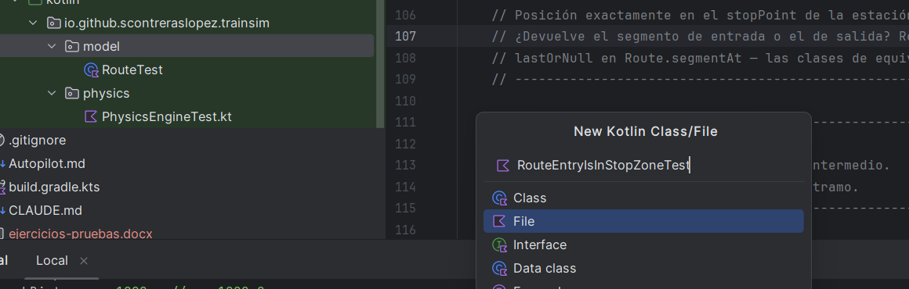

# Ejercicios de Testing (II) — JUnit 5 en Kotlin

**Proyecto de referencia:** `kotlin-train-simulator`
**Contenidos evaluados:** Implementación de tests unitarios con JUnit 5, `@ParameterizedTest`, `assertThrows`, diseño de tests desde cero.

---

## Antes de empezar

### Configuración del proyecto

1. Clona el repositorio en IntelliJ IDEA: `File → New → Project from Version Control` y pega la URL del repositorio: [https://github.com/scontreraslopez/kotlin-train-simulator.git](https://github.com/scontreraslopez/kotlin-train-simulator.git).
2. Espera a que Gradle descargue las dependencias (barra de progreso en la esquina inferior).
3. Abre `src/test/kotlin` y comprueba que existe la carpeta `io/github/scontreraslopez/trainsim/model/`.
4. Ejecuta los tests existentes (`RouteTest.kt`) con clic derecho → *Run Tests* para verificar que el entorno funciona.

El `build.gradle.kts` ya incluye JUnit 5; no necesitas tocar nada:

```kotlin
dependencies {
    testImplementation("org.junit.jupiter:junit-jupiter:5.14.3")
}
tasks.test {
    useJUnitPlatform()
}
```

### Usar la IA como copiloto

En este ejercicio vais a trabajar con código Kotlin. Si encontráis sintaxis que no reconocéis, está **totalmente permitido y recomendado** preguntar a la IA. Ejemplos de preguntas útiles:

- *"Tengo este código Kotlin con `data class`. ¿Cómo sería en Java?"*
- *"¿Qué hace el bloque `init` en una data class de Kotlin?"*
- *"¿Cómo se escribe un `@ParameterizedTest` con `@CsvSource` en Kotlin?"*
- *"¿Por qué en Kotlin se importa `assertThrows` de forma distinta que en Java?"*

La IA es vuestro intérprete de Kotlin, no vuestro resolvedor de ejercicios. Usadla para **entender** la sintaxis, no para que os dé las respuestas.

### Guía rápida: Java → Kotlin

Estas son las construcciones de Kotlin que aparecen en este ejercicio. Guardad esta referencia a mano.

| Kotlin | Equivalente en Java | Qué hace |
| ------ | ------------------- | -------- |
| `data class Foo(val x: Int)` | `record Foo(int x)` | Clase inmutable con `equals`, `hashCode` y `toString` automáticos |
| `val x: Double` | `final double x` | Campo de solo lectura |
| `var x: Double` | `double x` | Campo mutable |
| `init { require(x > 0) }` | Constructor con `if (!cond) throw new IAE(...)` | Bloque de inicialización con validación |
| `require(cond) { "msg" }` | `if (!cond) throw new IllegalArgumentException("msg")` | Precondición; lanza `IllegalArgumentException` si falla |
| `x in 0.0..1.0` | `x >= 0.0 && x <= 1.0` | Comprobación de pertenencia a un rango cerrado |
| `companion object { val X = ... }` | `static final X = ...` | Constantes o métodos estáticos de la clase |
| `assertThrows<Foo> { ... }` | `assertThrows(Foo.class, () -> ...)` | Verifica que el bloque lanza la excepción indicada |

Otra cuestión clave es que en Kotlin no hace falta usar `new` para crear objetos: `Station(...)` es suficiente, no `new Station(...)`. Tampoco el punto y coma al final de las líneas es obligatorio, de hecho lo normal es no usarlo.

---

## Ejercicio 1 — De la tabla al test: `isInStopZone`

### Contexto

En los ejercicios de Testing (I) diseñasteis sobre papel los casos de prueba para el método `isInStopZone` de `RouteEntry`. Ahora vais a **implementarlos en JUnit 5**.

El método que vais a probar es este:

```kotlin
// En RouteEntry.kt
data class RouteEntry(
    val station: Station,
    val position: Int,               // posición absoluta en la ruta (metros)
    val segmentToNext: TrackSegment? = null
) {
    fun isInStopZone(trainPosition: Double): Boolean =
        kotlin.math.abs(trainPosition - position) <= station.stopTolerance
}
```

`kotlin.math.abs(trainPosition - position)` calcula la distancia entre el tren y el punto de parada; si esa distancia es menor o igual que `stopTolerance`, el tren está en zona válida.

> **Para reflexionar (refactoring):** Si `position` fuera `Double` en lugar de `Int`, esta función podría escribirse como `trainPosition in (position - station.stopTolerance)..(position + station.stopTolerance)`, aprovechando el operador `in` de Kotlin con rangos. ¿Es esa versión más legible? ¿Justificaría cambiar el tipo de `position`? Lo retomaremos en el tema de refactoring.

El escenario es el mismo que en Testing (I):

- Estación **"Crevillente"**, `position = 44700`, `stopTolerance = 50`
- Zona de parada válida: **[44650.0, 44750.0]**

### Se pide

Crea el fichero `RouteEntryIsInStopZoneTest.kt` en el paquete `io.github.scontreraslopez.trainsim.model` dentro de `src/test/kotlin`.



Se te proporciona el esqueleto del test. Tu tarea es **completar los datos del `@CsvSource`** con los 7 casos de prueba que diseñaste en Testing (I):

```kotlin
package io.github.scontreraslopez.trainsim.model

import org.junit.jupiter.api.Assertions.assertEquals
import org.junit.jupiter.params.ParameterizedTest
import org.junit.jupiter.params.provider.CsvSource

class RouteEntryIsInStopZoneTest {

    // Configuración del escenario: estación Crevillente en posición 44700 m
    private val crevillente = Station(
        name = "Crevillente",
        approachDistance = 1000,
        departureDistance = 500,
        maxApproachSpeed = 13.89,
        maxDepartureSpeed = 13.89,
        stopTolerance = 50
    )
    private val entry = RouteEntry(
        station = crevillente,
        position = 44700,
        segmentToNext = null
    )

    @ParameterizedTest(name = "trainPosition={0} → esperado={1}")
    @CsvSource(
        // TODO: completad con los 7 casos de prueba de la tabla de Testing (I)
        // Formato de cada línea: "valor, resultado_esperado"
        // Ejemplo de sintaxis (no es un caso válido, es solo para ilustrar el formato):
        // "0.0, false"
    )
    fun `isInStopZone devuelve el resultado esperado`(trainPosition: Double, expected: Boolean) {
        assertEquals(expected, entry.isInStopZone(trainPosition))
    }
}
```

#### Apartado A — Completar los datos

Rellena el `@CsvSource` con los 7 casos de prueba (CP-01 a CP-07) de vuestra tabla de Testing (I). Cada línea es un caso: `"trainPosition, resultadoEsperado"`.

Recordad que debéis cubrir:

- Un valor claramente fuera por abajo (retorna `false`)
- Los tres valores de frontera del límite inferior
- Al menos un valor interior (retorna `true`)
- Los tres valores de frontera del límite superior
- Un valor claramente fuera por arriba (retorna `false`)

#### Apartado B — Ejecutar y verificar

Ejecuta el test. Los 7 casos deben aparecer en verde. Si alguno falla, revisa el valor que has puesto o la lógica del caso de prueba.

> **Pista si algo falla:** la condición `<= station.stopTolerance` es inclusiva en ambos extremos. `trainPosition = 44650.0` y `trainPosition = 44750.0` deben retornar `true`.

---

## Ejercicio 2 — Validación de `Station`: tests con `assertThrows`

### Contexto ejercicio 2

La clase `Station` valida sus parámetros en el bloque `init`:

```kotlin
data class Station(
    val name: String,
    val approachDistance: Int,
    val departureDistance: Int,
    val maxApproachSpeed: Double,
    val maxDepartureSpeed: Double,
    val stopTolerance: Int = 50
) {
    init {
        require(approachDistance >= 0)  { "approachDistance debe ser no negativa" }
        require(departureDistance >= 0) { "departureDistance debe ser no negativa" }
        require(maxApproachSpeed > 0)   { "maxApproachSpeed debe ser positiva" }
        require(maxDepartureSpeed > 0)  { "maxDepartureSpeed debe ser positiva" }
        require(stopTolerance > 0)      { "stopTolerance debe ser positiva" }
    }
}
```

Para comprobar que una `Station` con parámetros inválidos lanza `IllegalArgumentException`, en Kotlin se usa `assertThrows` con sintaxis de lambda:

```kotlin
import org.junit.jupiter.api.assertThrows   // ← importación específica de Kotlin
//...
// En el test:
assertThrows<IllegalArgumentException> {
    Station("Test", -1, 100, 10.0, 10.0)  // approachDistance negativa
}
```

En Java sería: `assertThrows(IllegalArgumentException.class, () -> new Station(...))`. La versión Kotlin es más concisa.

### Se pide ejercicio 2

Crea el fichero `StationValidationTest.kt` en el paquete `io.github.scontreraslopez.trainsim.model`.

#### Apartado A — Construcción válida ejercicio 2

Completa este test para verificar que una `Station` con valores válidos se construye correctamente. Usa los valores del escenario Crevillente del ejercicio anterior:

Acuérdate de añadir los imports y envolver el método en una clase de test, por ejemplo `StationValidationTest`.

```kotlin
@Test
fun `Station con valores válidos se construye correctamente`() {
    val station = Station(
        name = "Crevillente",
        approachDistance = 1000,
        departureDistance = 500,
        maxApproachSpeed = 13.89,
        maxDepartureSpeed = 13.89,
        stopTolerance = 100
    )
    // TODO: añade aserciones para verificar que los campos tienen los valores esperados
    // Pista: usa assertEquals(esperado, station.name), assertEquals(esperado, station.stopTolerance), etc.
    // Pistas adicionales I: Puedes usar assertAll para agrupar varias aserciones, que ejecuta todas las aserciones aunque alguna falle.
    // Pistas adicionales II: En los doubles, recuerda el tema de la tolerancia. assertEquals(esperado, actual, delta)
}
```

#### Apartado B — Validación de `maxApproachSpeed`

Se proporciona el esqueleto. Completa el `@ValueSource` con los valores inválidos para `maxApproachSpeed` (condición: `> 0`). Aplica BVA: ¿qué valores debéis incluir?

```kotlin
import org.junit.jupiter.api.assertThrows   // en Kotlin, NO es Assertions.assertThrows. Esto es una diferencia importante con Java.

@ParameterizedTest(name = "maxApproachSpeed={0} debe lanzar excepción")
@ValueSource(doubles = [
    // TODO: completad con valores inválidos para maxApproachSpeed
    // Pista: la condición es > 0, así que el cero ya es inválido.
    //        Usad BVA: el límite exacto y valores claramente inválidos.
])
fun `Station con maxApproachSpeed inválida lanza IllegalArgumentException`(speed: Double) {
    assertThrows<IllegalArgumentException> {
        Station("Test", 100, 100, speed, 10.0)
    }
}
```

#### Apartado C — Validación de `approachDistance`

Ahora sin esqueleto: escribe un `@ParameterizedTest` similar al del apartado B pero para `approachDistance` (condición: `>= 0`).

> **Atención al cambio de condición:** `approachDistance` usa `>= 0` (el cero es válido), mientras que `maxApproachSpeed` usa `> 0` (el cero es inválido). ¿Cómo afecta esto a los valores de prueba? Ten también en cuenta que el tipo de datos es `Int`.

#### Apartado D — Valor por defecto de `stopTolerance`

`stopTolerance` tiene un valor por defecto en el constructor. Escribe un test que verifique que, al construir una `Station` **sin** especificar `stopTolerance` tiene este valor por defecto. Mira su código fuente para ver cuál es el valor por defecto y construye este test.

```kotlin
@Test
fun `Station usa stopTolerance por defecto`() {
    val station = Station(
        name = "Elche",
        approachDistance = 800,
        departureDistance = 400,
        maxApproachSpeed = 13.89,
        maxDepartureSpeed = 13.89
        // stopTolerance no se especifica -> debe usar el valor por defecto 
    )
    // TODO: aserción
}
```

---

## Ejercicio 3 — `DriveCommand`: tests desde cero

### Contexto ejercicio 3

`DriveCommand` representa una orden de conducción con dos campos: `throttle` (tracción) y `brake` (freno), ambos en el rango `[0.0, 1.0]`. El bloque `init` valida que ningún valor esté fuera de ese rango:

```kotlin
data class DriveCommand(
    val throttle: Double,  // 0.0 = sin tracción, 1.0 = tracción máxima
    val brake: Double      // 0.0 = sin freno, 1.0 = freno máximo
) {
    init {
        require(throttle in 0.0..1.0) { "Throttle must be between 0.0 and 1.0" }
        require(brake in 0.0..1.0)    { "Brake must be between 0.0 and 1.0" }
    }

    companion object {
        val COAST        = DriveCommand(0.0, 0.0)   // marcha libre
        val FULL_THROTTLE = DriveCommand(1.0, 0.0)  // tracción máxima
        val FULL_BRAKE    = DriveCommand(0.0, 1.0)  // freno máximo
    }
}
```

El `companion object` es el equivalente Kotlin de los miembros `static` de Java. `DriveCommand.COAST` equivale a `DriveCommand.COAST` en Java (se accede igual).

### Se pide ejercicio 3

Crea el fichero `DriveCommandTest.kt` en el paquete `io.github.scontreraslopez.trainsim.control` dentro de `src/test/kotlin`. En este ejercicio **no se proporciona esqueleto**: diseñad e implementad los tests vosotros.

#### Apartado A — Construcción válida ejercicio 3

Escribe un `@ParameterizedTest` que verifique que `DriveCommand` se construye sin lanzar excepción para los valores límite del rango válido. Aplica BVA sobre ambos parámetros: ¿cuáles son los valores frontera para un rango `[0.0, 1.0]`? Fíjate que hay dos parámetros, así que el test debe cubrir casos válidos para ambos (combinaciones de `throttle` y `brake`). ¿Cuántos casos resultan al cruzar los valores frontera de los dos parámetros?

> **Pista:** si el test solo comprueba que no lanza excepción, basta con que el objeto se construya dentro del bloque de test. JUnit marcará el caso como fallido si se lanza una excepción inesperada.

#### Apartado B — Valores inválidos con `assertThrows`

Escribe un `@ParameterizedTest` que verifique que `DriveCommand` lanza `IllegalArgumentException` para valores fuera del rango. Tened en cuenta que hay **dos parámetros** (`throttle` y `brake`): el test debe cubrir casos inválidos en ambos.

> **Pista de diseño:** podéis usar un `@CsvSource` donde la primera columna sea el `throttle` y la segunda el `brake`. Un caso inválido puede tener un solo parámetro fuera de rango; no hace falta que ambos sean inválidos a la vez.

#### Apartado C — Constantes del companion object

Escribe tests individuales (`@Test`) que verifiquen los valores de las tres constantes del `companion object`:

- `DriveCommand.COAST` → `throttle = 0.0`, `brake = 0.0`
- `DriveCommand.FULL_THROTTLE` → `throttle = 1.0`, `brake = 0.0`
- `DriveCommand.FULL_BRAKE` → `throttle = 0.0`, `brake = 1.0`

> [!NOTE]
> Un `companion object` es el equivalente a los miembros `static` de Java. En Kotlin, se accede a estas constantes como `DriveCommand.COAST`, igual que en Java.

#### Apartado D — Reflexión (sin código)

Responde brevemente en un comentario al final del fichero de test:

1. ¿Por qué no tiene sentido un `DriveCommand` con `throttle = 0.8` y `brake = 0.8` a la vez, aunque técnicamente sea válido según la validación actual?
2. Si quisiéramos añadir esa restricción al código de producción, ¿dónde la añadiríais y cómo? Si con Kotlin todavía no te sientes cómodo, responde a esta pregunta pensando desde Java. Investiga luego qué opciones ofrece Kotlin para implementar esta restricción de forma elegante.

---

## Entrega

> [!IMPORTANT]
> Esta vez la entrega es en PDF lee por favor las instrucciones con atención. No se entrega el código fuente por separado: la memoria debe mostrar el código y los resultados.

La entrega consiste en una **memoria en PDF** que documente el trabajo realizado. No se entrega el código fuente por separado: la memoria debe mostrar el código y los resultados.

### Qué debe incluir la memoria

Para cada ejercicio:

1. **El código de los tests** — pegado directamente en la memoria con formato de código (no como captura de pantalla).
2. **Captura de la ejecución en IntelliJ** — la ventana de resultados de JUnit mostrando todos los tests en verde. Debe verse claramente el nombre de cada caso de prueba y el resultado.
3. **Breve explicación** — dos o tres líneas indicando qué habéis probado y por qué habéis elegido esos valores (especialmente en el ejercicio 3, donde el diseño es libre).

Para el ejercicio 3, apartado D, incluir también la respuesta a las preguntas de reflexión.

### Cómo hacer una memoria que no parezca un borrador

Estas son las reglas mínimas para que la memoria sea legible y profesional:

- **Una portada** con nombre completo, grupo, módulo y fecha. Sin portada, la memoria no se evalúa.
- **Índice o estructura visible** — usa títulos para separar cada ejercicio. El lector debe poder localizar cualquier parte en segundos.
- **Las capturas, legibles** — si no se lee el texto de la captura, no sirve. Haz zoom en IntelliJ antes de capturar, o recorta la imagen para que el contenido relevante ocupe toda la imagen. Una captura borrosa o en miniatura no acredita nada.
- **El código, como texto** — copia el código desde IntelliJ y pégalo en el procesador de textos usando una fuente monoespaciada (Courier New, Consolas…) y formateado con un estilo de código (por ejemplo sin interlineado, fuente más pequeña, ...). No hagas capturas del código: no se puede leer bien y no permite valorar los detalles.
- **PDF, no .docx ni .pages** — exporta siempre a PDF antes de entregar. Un documento que se ve distorsionado porque lo he abierto en otro programa es un problema tuyo, no mío.

---

## Criterios de evaluación

| Criterio | Peso |
| -------- | ---- |
| Ej. 1 — Los 7 casos de Testing (I) están correctamente trasladados a `@CsvSource` y pasan | 25% |
| Ej. 2 — Aserciones correctas, cobertura de BVA en apartados B y C, valor por defecto en D | 35% |
| Ej. 3 — Diseño propio correcto: casos válidos, inválidos, constantes y reflexión | 30% |
| Memoria — Portada, estructura, capturas legibles, código como texto, PDF | 10% |

> **Sobre la memoria:** los 10 puntos de memoria se aplican como penalización si no se cumplen los requisitos mínimos, no como bonus. Una memoria sin portada, con capturas ilegibles o entregada en formato distinto a PDF puede restar hasta ese 10% del total.
