# UP12: Optimización de código — Refactorización y análisis de código

## ÍNDICE

- [OBJETIVOS](#objetivos)
- [1. Introducción: qué es refactorizar y por qué importa](#1-introducción-qué-es-refactorizar-y-por-qué-importa)
  - [1.1. Definición precisa](#11-definición-precisa)
  - [1.2. La conexión con los tests](#12-la-conexión-con-los-tests)
  - [1.3. Código limpio vs código que funciona](#13-código-limpio-vs-código-que-funciona)
- [2. Deuda técnica](#2-deuda-técnica)
  - [2.1. La metáfora financiera](#21-la-metáfora-financiera)
  - [2.2. Causas reales de la deuda técnica](#22-causas-reales-de-la-deuda-técnica)
  - [2.3. No toda deuda técnica es mala](#23-no-toda-deuda-técnica-es-mala)
- [3. Code smells: señales de que algo necesita atención](#3-code-smells-señales-de-que-algo-necesita-atención)
  - [3.1. Bloaters — el código que engorda](#31-bloaters--el-código-que-engorda)
  - [3.2. Abusos de orientación a objetos](#32-abusos-de-orientación-a-objetos)
  - [3.3. Dispensables — lo que sobra](#33-dispensables--lo-que-sobra)
  - [3.4. Acopladores](#34-acopladores)
- [4. Analizadores de código: detectar problemas automáticamente](#4-analizadores-de-código-detectar-problemas-automáticamente)
  - [4.1. Análisis estático vs pruebas](#41-análisis-estático-vs-pruebas)
  - [4.2. SonarQube for IDE en IntelliJ IDEA](#42-sonarqube-for-ide-en-intellij-idea)
  - [4.3. Panorámica de otras herramientas](#43-panorámica-de-otras-herramientas)
  - [4.4. Inspecciones nativas de IntelliJ](#44-inspecciones-nativas-de-intellij)
- [5. Técnicas de refactorización en el IDE](#5-técnicas-de-refactorización-en-el-ide)
  - [5.1. Métodos de composición](#51-métodos-de-composición)
  - [5.2. Mover funcionalidades entre clases](#52-mover-funcionalidades-entre-clases)
  - [5.3. Simplificar condicionales](#53-simplificar-condicionales)
  - [5.4. Simplificar llamadas a métodos](#54-simplificar-llamadas-a-métodos)
  - [5.5. Generalización y jerarquías](#55-generalización-y-jerarquías)
- [6. El flujo completo: refactorización con tests y control de versiones](#6-el-flujo-completo-refactorización-con-tests-y-control-de-versiones)
- [7. Introducción a la integración continua](#7-introducción-a-la-integración-continua)
- [8. Cuándo (y cuándo no) refactorizar](#8-cuándo-y-cuándo-no-refactorizar)

---

## OBJETIVOS

Al finalizar esta unidad, el alumno será capaz de:

- **Identificar los code smells más habituales** en código Java y clasificarlos por categoría (CE4.a).
- **Seleccionar y aplicar la técnica de refactorización adecuada** para cada tipo de code smell usando las herramientas automáticas de IntelliJ IDEA (CE4.a, CE4.e).
- **Comprender el papel de los tests como red de seguridad** y elaborar las pruebas necesarias antes de iniciar una refactorización (CE4.b).
- **Instalar y configurar SonarQube for IDE** en IntelliJ IDEA y utilizar sus resultados para detectar problemas en el código fuente (CE4.c, CE4.d).
- **Conocer las posibilidades de configuración** de un analizador de código: activar, desactivar y personalizar reglas (CE4.d).
- **Integrar el control de versiones Git** en el flujo de refactorización: rama dedicada, commits atómicos, push y merge desde IntelliJ (CE4.f, CE4.h).
- **Entender qué es la integración continua** y por qué es especialmente relevante cuando se refactoriza (CE4.i).
- **Tomar decisiones informadas** sobre cuándo refactorizar y cuándo no hacerlo.

---

## 1. Introducción: qué es refactorizar y por qué importa

### 1.1. Definición precisa

Refactorizar es **modificar la estructura interna de un código sin cambiar su comportamiento externo**.

La definición parece sencilla, pero sus implicaciones son importantes. No se trata de añadir funcionalidad, ni de corregir bugs, ni de mejorar el rendimiento. Se trata exclusivamente de mejorar la legibilidad, la estructura y la mantenibilidad del código, de forma que el software sea más fácil de entender y de modificar en el futuro, sin que cambie ni una coma de lo que hace.

Esta restricción ("sin cambiar el comportamiento externo") no es retórica. Es la condición que hace que la refactorización sea segura. Si al refactorizar también cambias el comportamiento, ya no estás refactorizando: estás modificando software, y eso requiere un proceso diferente (con pruebas funcionales, revisión de requisitos, etc.).

> [!IMPORTANT]
> Refactorizar no es reescribir. Refactorizar es un conjunto de transformaciones pequeñas, seguras e incrementales. Reescribir desde cero es una operación completamente diferente, y casi siempre más arriesgada de lo que parece.

Martin Fowler, autor del libro de referencia sobre el tema (*Refactoring: Improving the Design of Existing Code*, 1999, con segunda edición en 2018), define la refactorización de forma similar: "*a disciplined technique for restructuring an existing body of code, altering its internal structure without changing its external behavior*".

### 1.2. La conexión con los tests

Como visteis en UP10-11, los tests son la herramienta fundamental para verificar que el software hace lo que debe. En el contexto de la refactorización, los tests cumplen un papel específico e irremplazable: son **la red de seguridad que permite refactorizar con confianza**.

La lógica es directa: si tienes una suite de tests que pasan antes de refactorizar, y siguen pasando después, tienes evidencia objetiva de que no has roto nada. Si algún test falla después de un cambio estructural, sabes exactamente qué se ha roto y cuándo ha ocurrido (en el último cambio).

Sin tests, refactorizar es un salto de fe. Puedes creer que has mejorado el código, pero no tienes forma de verificarlo objetivamente salvo ejecutar el programa manualmente y esperar no olvidarte de ningún caso. En proyectos reales con cientos de clases y miles de líneas, esa verificación manual es impracticable.

> [!WARNING]
> Si alguien te dice que va a "refactorizar" código que no tiene tests, en realidad está tomando un riesgo significativo. Puede que salga bien, o puede que introduzca un bug sutil que no se detecte hasta semanas después. El primer paso antes de refactorizar código sin tests debería ser **escribir los tests**. Del mismo modo que te advierto de este riesgo, te confieso también que luego en la práctica a menudo se refactoriza código sin tests, pero es importante ser consciente de lo que eso implica.

#### La refactorización en TDD

Si visteis TDD como ampliación en UP10-11, recordaréis el ciclo **Red-Green-Refactor**:

```text
Red     → Escribe un test que falla (porque la funcionalidad no existe todavía).
Green   → Escribe el mínimo código para que el test pase (sin importar si es feo).
Refactor → Mejora la estructura del código sin cambiar el comportamiento.
          Los tests siguen en verde durante todo este paso.
```

La fase "Refactor" de TDD es exactamente refactorización. El ciclo TDD no dice "haz el código bonito desde el principio": dice "primero hazlo funcionar (Green), luego hazlo bien (Refactor)". Esto tiene una implicación práctica: en TDD, la refactorización no es opcional ni un lujo, es parte del proceso normal de desarrollo.

Fuera de TDD, la refactorización ocurre igualmente, pero con mayor frecuencia como respuesta a código que ya existe y en el que se ha acumulado deuda técnica.

### 1.3. Código limpio vs código que funciona

"Código que funciona" y "código limpio" no son lo mismo. Un código puede funcionar correctamente y ser, a la vez, muy difícil de entender, modificar o extender. Los principios de código limpio que ya conocéis de Programación (y que aquí solo recordamos brevemente) son:

- **DRY** (*Don't Repeat Yourself*): si la misma lógica aparece en dos sitios, está esperando a que alguien la modifique en uno y se olvide del otro. Si te encuentras a ti mismo copiando y pegando código, debería al menos dispararse tu *sentido arácnido* de código limpio.
- **KISS** (*Keep It Simple, Stupid*): la solución más simple que funciona es casi siempre la mejor. La complejidad innecesaria es una forma de deuda técnica. Hay quien pierde la cabeza con patrones de diseño, arquitecturas sofisticadas, microservicios, genéricos o lambdas. Todo eso tiene su lugar, pero si el resultado es un código que solo entiende quien domina esos temas, *hemos hecho un pan con unas tortas*. El código limpio es simple, directo, y fácil de entender.
- **Single Responsibility Principle**: cada clase o método debe tener una única razón para cambiar. Una clase que hace muchas cosas distintas es frágil: un cambio en cualquiera de esas responsabilidades puede afectar a las demás.

Estos principios no son reglas absolutas. Son guías que ayudan a tomar decisiones de diseño. La refactorización es el proceso de aplicarlos, de forma disciplinada y segura, a código que ya existe.

---

## 2. Deuda técnica

### 2.1. La metáfora financiera

Ward Cunningham, uno de los pioneros del software ágil, acuñó el término **deuda técnica** (*technical debt*) en 1992. La metáfora es financiera:

- **El principal** es el trabajo que habría que hacer para poner el código en el estado "correcto" (bien estructurado, sin duplicaciones, bien documentado).
- **Los intereses** son el esfuerzo adicional que pagas en cada intervención futura porque el código no está en ese estado ideal: más tiempo para entender qué hace, más riesgo al modificarlo, más bugs por efectos secundarios inesperados.

Como en las deudas financieras, la deuda técnica no es necesariamente mala. A veces tiene sentido endeudarse: si necesitas salir al mercado antes que la competencia, sacrificar algo de calidad interna puede ser una decisión racional. El problema no es la deuda en sí, sino la que **se ignora** o la que **crece sin control**.

Además, la gente de negocio, y por paradójico que parezca a pesar de la analogía financiera, no suele entender este concepto y no suele valorar el trabajo de devolver la deuda técnica, lo que hace que los equipos tengan una tendencia natural a acumularla. *¿Y por qué no se hizo bien a la primera?* Pues porque no había tiempo, o porque no se sabía cómo hacerlo bien, o porque los requisitos cambiaron después de escribir el código.

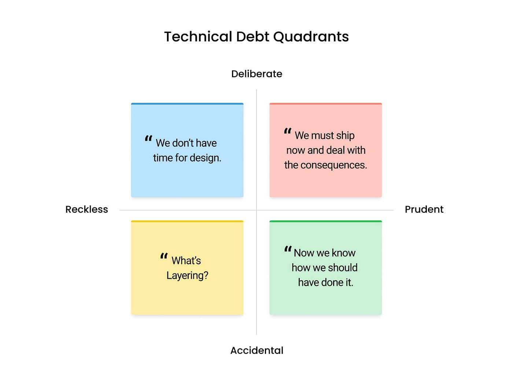

Martin Fowler propuso un cuadrante para clasificar la deuda técnica:

| | **Deliberada** | **Inadvertida** |
| --- | --- | --- |
| **Imprudente** | *"No hay tiempo para diseñar bien"* | *"¿Qué son las capas de la aplicación?"* |
| **Prudente** | *"Publicamos ahora y lo arreglamos después"* | *"Ahora entendemos cómo deberíamos haberlo hecho"* |

La deuda **prudente y deliberada** es la que tiene sentido: tomas una decisión consciente, la documentas, y la devuelves después. La deuda **imprudente** es la que destruye los proyectos a largo plazo, tanto si es deliberada ("no tenemos tiempo para hacerlo bien") como si es inadvertida (no saber qué es "bien").

### 2.2. Causas reales de la deuda técnica

La deuda técnica no aparece sola. Tiene causas concretas que merece la pena conocer porque las vais a encontrar en cualquier proyecto real:

**Presión de plazos**: La causa más común. Cuando hay una fecha de entrega inamovible, el código sufre. Se copian bloques en lugar de extraer funciones, se añaden condiciones en lugar de rediseñar, se hacen suposiciones en lugar de analizar. Esto es comprensible. El problema viene cuando la presión es permanente y nunca hay tiempo para devolver la deuda. *More projects have gone awry for lack of calendar time than for all other reasons combined* - Frederick Brooks, The Mythical Man-Month.

**Desconocimiento**: Un equipo que no conoce los principios de diseño o que no tiene experiencia con el dominio del problema acaba produciendo código con deuda inadvertida. No es mala voluntad, sino falta de conocimiento. Por eso la formación continua es relevante. En este punto nos podemos apoyar en la inteligencia artificial, pero no como sustituto del conocimiento, sino como herramienta para adquirirlo. Nos da un *brainstorming* de ideas, casi a coste 0, pero luego hay que entender esas ideas, evaluarlas críticamente, y aplicarlas con criterio. No tanto por que la IA no se equivoque (que también), sino porque la experiencia no viene en pastillas, hay que vivirla, tener curiosidad y dejarse aconsejar por el camino, siempre con un espíritu crítico.

**Cambio de requisitos**: Un diseño que era correcto para los requisitos originales puede volverse torpe cuando los requisitos evolucionan. El código que sirvió bien para una versión inicial puede convertirse en un obstáculo para la siguiente. Evidentemente parte del *daño* viene por dónde se están planteando los cambios, no es lo mismo un cambio en la presentación de los datos (poco riesgo), que un cambio en la lógica de negocio (riesgo medio), que un cambio en la arquitectura o en el modelo de datos (riesgo alto). Pero el cambio es inevitable, y el código que no se adapta a él se convierte en deuda técnica.

**Ausencia de revisión de código**: Cuando nadie revisa el código de los demás, los problemas de diseño no se detectan y se consolidan. El *code review* es una de las herramientas más efectivas para prevenir la acumulación de deuda, pero también es una de las primeras en sacrificarse: consume tiempo, requiere que alguien con criterio suficiente lo lidere, y no produce ningún resultado visible que pueda justificarse fácilmente ante negocio. Una solución intermedia razonable es delegar la detección de problemas rutinarios a herramientas (linters de estilo, SonarLint en el IDE, SonarQube integrado en el pipeline de CI), y reservar la revisión humana para los aspectos de diseño más complejos o subjetivos. SonarQube, en particular, puede analizar automáticamente cada pull request y publicar sus resultados como un check de estado directamente en GitHub, GitLab o Bitbucket, antes de que se apruebe el merge, actuando como una primera capa de revisión sin coste de atención humana.

**Rotación del equipo**: Cuando los que conocen el código se van, los que llegan tienen que adivinarlo. Esto suele llevar a soluciones parche en lugar de soluciones estructurales. El código se vuelve cada vez más difícil de entender y modificar, lo que a su vez hace que los nuevos miembros del equipo tengan más dificultades para contribuir, lo que a su vez aumenta la rotación... es un círculo vicioso.

### 2.3. No toda deuda técnica es mala

Es fácil caer en el extremo opuesto: pensar que toda deuda técnica es un fracaso y que el objetivo es el código perfecto. No es así.

El código perfecto no existe. Todo código es una aproximación a la solución de un problema que además evoluciona. Un equipo que dedica el 40% del tiempo a refactorizar en lugar de entregar funcionalidad está tomando decisiones de negocio discutibles.

El objetivo pragmático es:

1. **Reconocer la deuda cuando se contrae**: ser consciente de cuándo se está tomando un atajo y por qué.
2. **Registrarla**: si la deuda es deliberada y prudente, apuntarla (un comentario `// TODO`, un ticket, lo que sea) para no olvidarla.
3. **Devolverla de forma planificada**: no intentar eliminar toda la deuda de golpe, sino reducirla progresivamente.

La regla del escultismo (*Boy Scout Rule*, de Robert C. Martin): *deja el código un poco mejor de lo que lo encontraste*. No hace falta reescribir la clase entera: basta con mejorar algo cada vez que tocas un fichero.

---

## 3. Code smells: señales de que algo necesita atención

Un **code smell** (*olor a código*) es una característica del código fuente que indica un posible problema de diseño. Los code smells no son bugs: el código puede funcionar correctamente y aún así tener smells. Son señales de que algo podría estar mal estructurado, de que hay deuda técnica acumulada, de que el código será difícil de mantener o extender.

El término fue popularizado también por Martin Fowler, que los catalogó junto con Kent Beck. El catálogo completo está en [refactoring.guru](https://refactoring.guru/refactoring/smells), una referencia excelente para consultar cuando identifiques algo que "huele mal" pero no sabes cómo llamarlo.

> [!NOTE]
> Los code smells son indicadores, no veredictos. Que un método tenga 30 líneas no significa necesariamente que esté mal. Significa que merece atención. El contexto siempre importa.

### 3.1. Bloaters — el código que engorda

Los *bloaters* son elementos de código que han crecido demasiado: demasiadas líneas, demasiados parámetros, demasiadas responsabilidades. Suelen aparecer de forma gradual (nadie escribe un método de 200 líneas de golpe; empieza con 20 y va creciendo con cada feature añadida).

#### Método largo (*Long Method*)

Un método que hace demasiadas cosas. No hay una regla universal de cuántas líneas son "demasiadas" (10, 20, 30...), pero si tienes que desplazarte para leerlo entero, es una señal.

El problema no es la longitud en sí, sino lo que suele implicar: el método tiene múltiples responsabilidades, mezcla diferentes niveles de abstracción, y es difícil de entender de un vistazo.

```java
// Antes: método que hace demasiadas cosas
public void procesarPedido(Pedido pedido) {
    // Validar
    if (pedido.getItems().isEmpty()) {
        throw new IllegalArgumentException("El pedido está vacío");
    }
    if (pedido.getCliente() == null) {
        throw new IllegalArgumentException("El cliente es obligatorio");
    }
    if (pedido.getDireccionEntrega() == null) {
        throw new IllegalArgumentException("Se necesita dirección de entrega");
    }

    // Calcular total
    double total = 0;
    for (Item item : pedido.getItems()) {
        total += item.getPrecio() * item.getCantidad();
    }
    if (pedido.getCliente().esPremium()) {
        total *= 0.9;
    }
    pedido.setTotal(total);

    // Notificar
    String mensaje = "Pedido confirmado. Total: " + total + "€";
    emailService.enviar(pedido.getCliente().getEmail(), mensaje);
    smsService.enviar(pedido.getCliente().getTelefono(), mensaje);
}
```


```java
// Después: cada responsabilidad tiene su propio método
public void procesarPedido(Pedido pedido) {
    validarPedido(pedido);
    double total = calcularTotal(pedido);
    pedido.setTotal(total);
    notificarConfirmacion(pedido, total);
}

private void validarPedido(Pedido pedido) {
    if (pedido.getItems().isEmpty()) {
        throw new IllegalArgumentException("El pedido está vacío");
    }
    if (pedido.getCliente() == null) {
        throw new IllegalArgumentException("El cliente es obligatorio");
    }
    if (pedido.getDireccionEntrega() == null) {
        throw new IllegalArgumentException("Se necesita dirección de entrega");
    }
}

private double calcularTotal(Pedido pedido) {
    double total = 0;
    for (Item item : pedido.getItems()) {
        total += item.getPrecio() * item.getCantidad();
    }
    return pedido.getCliente().esPremium() ? total * 0.9 : total;
}

private void notificarConfirmacion(Pedido pedido, double total) {
    String mensaje = "Pedido confirmado. Total: " + total + "€";
    emailService.enviar(pedido.getCliente().getEmail(), mensaje);
    smsService.enviar(pedido.getCliente().getTelefono(), mensaje);
}
```
**Técnica**: **Extract Method.** Extraer cada bloque en su propio método con un nombre que describa su propósito.

#### Clase grande (*Large Class*)

Una clase con demasiados campos y métodos. Suele ser señal de que la clase tiene múltiples responsabilidades (viola el Principio de Responsabilidad Única, SRP).

**Técnica**: **Extract Class.** Identificar las responsabilidades distintas y separarlas en clases propias. Veremos un ejemplo concreto en la [sección 5.2](#52-mover-funcionalidades-entre-clases), donde el patrón es exactamente este.

#### Lista de parámetros larga (*Long Parameter List*)

Un método con 4 o más parámetros es difícil de llamar correctamente y de entender. Suele ser señal de que los parámetros relacionados deberían estar agrupados en un objeto.

```java
// Antes
public Factura generarFactura(String nombre, String apellidos,
                              String calle, String ciudad, String cp,
                              List<Item> items, double descuento) { ... }

// Después: los datos del cliente y la dirección se agrupan
public Factura generarFactura(Cliente cliente, Direccion direccion,
                              List<Item> items, double descuento) { ... }
```

**Técnica**: **Introduce Parameter Object.** Agrupar parámetros relacionados en un objeto.

#### Obsesión por primitivos (*Primitive Obsession*)

Usar tipos primitivos (`String`, `int`, `double`) para representar conceptos del dominio que merecen su propia clase. El ejemplo clásico: representar un número de teléfono, un email, o un código postal como `String`.

```java
// Con obsesión por primitivos: ¿qué formato? ¿válido? ¿con prefijo internacional?
String telefono = "634123456";

// Con un tipo propio: el tipo garantiza la validez y centraliza la lógica
Telefono telefono = new Telefono("634123456"); // lanza excepción si el formato es inválido
```

**Técnica**: **Replace Primitive with Object.** Crear una clase pequeña para el concepto del dominio.

#### Grupos de datos (*Data Clumps*)

Si el mismo conjunto de datos aparece siempre juntos en múltiples lugares (como campos en varias clases, o parámetros en varios métodos), probablemente merecen vivir en su propia clase.

```java
// Señal: calle, ciudad y cp aparecen como campos en varias clases sin relación entre sí
class Cliente {
    String nombre;
    String calle;
    String ciudad;
    String cp;
}

class Almacen {
    String nombre;
    String calle;
    String ciudad;
    String cp;
}

class PuntoDeRecogida {
    String calle;
    String ciudad;
    String cp;
    LocalTime horario;
}

// Después: el grupo de datos tiene nombre propio y existe en un único lugar
class Direccion {
    String calle;
    String ciudad;
    String cp;
}

class Cliente {
    String nombre;
    Direccion direccion;
}

class Almacen {
    String nombre;
    Direccion direccion;
}
```

**Técnica**: **Extract Class** o **Introduce Parameter Object**.

### 3.2. Abusos de orientación a objetos

Estos smells aparecen cuando el código no aprovecha correctamente los mecanismos de la orientación a objetos, especialmente el polimorfismo.

#### Sentencias switch sobre tipo (*Switch Statements*)

Un bloque `switch` (o una cadena de `if-else if`) que ramifica según el tipo de un objeto suele ser señal de que el polimorfismo debería estar haciendo ese trabajo.

```java
// Antes: switch que se repetirá en distintos métodos
public double calcularDescuento(String tipoCliente, double precio) {
    switch (tipoCliente) {
        case "normal":  return 0;
        case "premium": return precio * 0.1;
        case "vip":     return precio * 0.2;
        default:        return 0;
    }
}
```

Cada vez que se añade un nuevo tipo de cliente, hay que buscar todos los `switch` del programa y añadir el caso. Con polimorfismo, solo hay que añadir una clase nueva.

```java
// Después: cada tipo de cliente implementa su propio descuento
abstract class Cliente {
    abstract double calcularDescuento(double precio);
}

class ClienteNormal extends Cliente {
    @Override
    double calcularDescuento(double precio) { return 0; }
}

class ClientePremium extends Cliente {
    @Override
    double calcularDescuento(double precio) { return precio * 0.1; }
}

class ClienteVip extends Cliente {
    @Override
    double calcularDescuento(double precio) { return precio * 0.2; }
}
```

Añadir un tipo `ClienteEmpresa` ahora no requiere tocar ninguna clase existente: basta con crear una nueva subclase.

**Técnica**: **Replace Conditional with Polymorphism.** Crear una jerarquía de clases con un método `calcularDescuento()` en cada una.

#### Campos temporales (*Temporary Field*)

Un campo de instancia que solo tiene valor en determinadas circunstancias. Cuando está vacío, hay que saber que no hay que usarlo. Esto es confuso y frágil.

```java
// Señal: rutaOptima y tiempoEstimado solo se calculan si el pedido es urgente;
// el resto del tiempo están a null y no deben usarse
class GestorPedidos {
    private Pedido pedido;
    private Ruta rutaOptima;       // solo válido si pedido.esUrgente()
    private int tiempoEstimado;    // solo válido si pedido.esUrgente()

    public void procesar() {
        if (pedido.esUrgente()) {
            rutaOptima = calcularRutaOptima(pedido);
            tiempoEstimado = estimarTiempo(rutaOptima);
            // ... lógica urgente
        }
        // fuera del if, rutaOptima y tiempoEstimado no tienen sentido y NO debemos usarlo bajo riesgo de null pointer exception o de usar datos obsoletos
        // por ejemplo
        // println("Tiempo estimado: " + tiempoEstimado); // esto es un error, porque tiempoEstimado solo tiene sentido dentro del if.
    }
}

// Después: los campos temporales y su lógica se extraen a su propia clase
class GestorPedidos {
    private Pedido pedido;

    public void procesar() {
        if (pedido.esUrgente()) {
            new GestorPedidoUrgente(pedido).procesar();
        }
        // ...
    }
}

class GestorPedidoUrgente {
    private Pedido pedido;
    private Ruta rutaOptima;
    private int tiempoEstimado;
    // aquí estos campos siempre tienen sentido
}
```

**Técnica**: **Extract Class.** Los campos temporales y la lógica que los usa suelen pertenecer a una clase propia, quizás con un patrón de *Special Case*.

#### Legado rechazado (*Refused Bequest*)

Una subclase que hereda métodos del padre pero no los usa (o peor, los sobreescribe para no hacer nada o lanzar una excepción).

```java
// Señal: Circulo hereda rotar() de Figura, pero rotarlo no tiene ningún efecto.
// La subclase se ve obligada a "rechazar" parte del contrato del padre.
abstract class Figura {
    abstract void dibujar();
    abstract void rotar(int grados);  // tiene sentido para Rectangulo, no para Circulo
}

class Rectangulo extends Figura {
    @Override void dibujar() { ... }
    @Override void rotar(int grados) { ... }  // tiene sentido
}

class Circulo extends Figura {
    @Override void dibujar() { ... }
    @Override void rotar(int grados) { }  // no hace nada — legado rechazado
}
```

La solución más limpia en este caso es separar el comportamiento en una interfaz `Rotable` que solo implementen las figuras que realmente se puedan rotar:

```java
interface Rotable {
    void rotar(int grados);
}

abstract class Figura {
    abstract void dibujar();
}

class Rectangulo extends Figura implements Rotable {
    @Override public void dibujar() { ... }
    @Override public void rotar(int grados) { ... }
}

class Circulo extends Figura {
    @Override public void dibujar() { ... }
    // no implementa Rotable — no necesita rechazar nada
}
```

**Técnica**: **Extract Interface** o **Replace Inheritance with Delegation.** Si la subclase no quiere heredar el comportamiento del padre, probablemente ese comportamiento debería separarse en una interfaz que solo implementen quienes lo necesiten.

### 3.3. Dispensables — lo que sobra

Código que no aporta nada y que solo añade ruido o complejidad.

#### Código duplicado (*Duplicate Code*)

El smell más común y el más costoso a largo plazo. Si la misma lógica existe en dos sitios, cuando haya que cambiarla habrá que hacerlo en ambos, y alguien se olvidará de uno.

```java
// En la clase PedidoOnline:
double total = 0;
for (Item item : items) {
    total += item.getPrecio() * item.getCantidad();
}

// En la clase PedidoTiendaFisica: exactamente el mismo bucle
double total = 0;
for (Item item : items) {
    total += item.getPrecio() * item.getCantidad();
}
```

```java
// Después (con Pull Up Method): la lógica sube a la clase padre y desaparece la duplicación
abstract class Pedido {
    protected List<Item> items;

    double calcularTotal() {
        double total = 0;
        for (Item item : items) {
            total += item.getPrecio() * item.getCantidad();
        }
        return total;
    }
}

class PedidoOnline extends Pedido { ... }
class PedidoTiendaFisica extends Pedido { ... }
```

**Técnica**: **Extract Method** y mover a una clase común, o **Pull Up Method** si las clases comparten una jerarquía.

#### Código muerto (*Dead Code*)

Código que nunca se ejecuta: métodos que nadie llama, variables que se asignan pero no se leen, condiciones que nunca son ciertas. Los IDEs modernos lo marcan con un aviso de "never used". SonarQube for IDE también lo detecta.

**Técnica**: Eliminarlo. Sin remordimientos.

#### Comentarios que explican código malo (*Comments*)

Los comentarios no son un smell en sí mismos: los que explican el *por qué* de una decisión son valiosos. Pero los comentarios que explican *qué hace* el código suelen ser señal de que el código es demasiado complejo o tiene nombres poco claros.

```java
// Mal: comentario que explica lo que debería ser obvio por el nombre
// Incrementar el contador de intentos
intentos++;

// Mal: comentario que justifica código complicado en lugar de simplificarlo
// Si el usuario es premium y lleva más de 30 días y no ha comprado en los últimos 7...
if (u.tipo.equals("P") && dias(u.fecha) > 30 && dias(u.ultimaCompra) > 7) { ... }

// Bien: refactoriza el código para que se explique solo
if (esClientePremiumInactivo(usuario)) { ... }
```

**Técnica**: Renombrar variables y métodos para que sean autoexplicativos. Extract Method para dar nombre a bloques de lógica compleja.

### 3.4. Acopladores

Smells que implican un acoplamiento excesivo entre clases (dependencias que hacen que cambiar una clase obligue a cambiar otras).

#### Envidia de funcionalidad (*Feature Envy*)

Un método que usa más datos o métodos de otra clase que de la suya propia. Suele ser señal de que el método está en el lugar equivocado.

```java
class Pedido {
    // Este método está en Pedido pero trabaja casi exclusivamente con datos de Cliente
    public boolean esEnvioGratuito(Cliente cliente) {
        return cliente.getAñosDeCliente() > 2
            && cliente.getNumPedidos() > 10
            && cliente.getSaldoPuntos() > 500;
    }
}
```

```java
// Después: el método se mueve a Cliente, donde tiene acceso directo a sus propios datos
class Cliente {
    public boolean esEnvioGratuito() {
        return getAñosDeCliente() > 2
            && getNumPedidos() > 10
            && getSaldoPuntos() > 500;
    }
}

class Pedido {
    // ahora Pedido simplemente delega en el cliente
    public boolean esEnvioGratuito(Cliente cliente) {
        return cliente.esEnvioGratuito();
    }
}
```

**Técnica**: **Move Method.** Mover el método a la clase cuyos datos usa.

#### Intimidad inapropiada (*Inappropriate Intimacy*)

Dos clases que se conocen demasiado: acceden mutuamente a sus campos internos, dependen de los detalles de implementación de la otra. Esto hace que cualquier cambio interno en una afecte a la otra.

```java
// Señal: Pedido y LineaDeCredito se manipulan mutuamente los campos directamente
class Pedido {
    double importe;
    boolean aprobado;

    void aprobar(LineaDeCredito credito) {
        if (credito.saldoDisponible >= importe) {  // accede al interno de LineaDeCredito
            credito.saldoDisponible -= importe;    // modifica el interno de LineaDeCredito
            this.aprobado = true;
        }
    }
}

class LineaDeCredito {
    double saldoDisponible;

    void registrarDevolucion(Pedido pedido) {
        if (pedido.aprobado) {                     // accede al interno de Pedido
            saldoDisponible += pedido.importe;     // accede al interno de Pedido
            pedido.aprobado = false;               // modifica el interno de Pedido
        }
    }
}
```

```java
// Después: cada clase encapsula su propio estado y expone operaciones con significado
class Pedido {
    private double importe;
    private boolean aprobado;

    double getImporte() { return importe; }
    boolean isAprobado() { return aprobado; }
    void marcarAprobado() { this.aprobado = true; }
    void marcarDevuelto() { this.aprobado = false; }
}

class LineaDeCredito {
    private double saldoDisponible;

    boolean tieneSaldoSuficiente(double importe) { return saldoDisponible >= importe; }
    void cargar(double importe) { saldoDisponible -= importe; }
    void abonar(double importe) { saldoDisponible += importe; }
}

// Un servicio coordina la interacción sin que las clases se conozcan internamente
class ServicioCredito {
    void aprobarPedido(Pedido pedido, LineaDeCredito credito) {
        if (credito.tieneSaldoSuficiente(pedido.getImporte())) {
            credito.cargar(pedido.getImporte());
            pedido.marcarAprobado();
        }
    }
}
```

**Técnica**: **Move Method / Move Field** para redistribuir responsabilidades, o **Extract Class** para crear una clase intermediaria (como `ServicioCredito` en el ejemplo).

#### Cadenas de mensajes (*Message Chains*)

Una secuencia de llamadas encadenadas: `pedido.getCliente().getDireccion().getCiudad().getNombre()`. Cada `.get()` añade una dependencia: el código que hace esta llamada debe conocer la estructura interna de `Pedido`, de `Cliente`, de `Direccion` y de `Ciudad`.

```java
// Antes: cadena frágil
String ciudad = pedido.getCliente().getDireccion().getCiudad();

// Después: Pedido expone directamente lo que sus clientes necesitan (Ley de Demeter)
String ciudad = pedido.getCiudadEntrega();
```

**Técnica**: **Hide Delegate.** Añadir un método en la clase intermedia que oculte la cadena, o **Extract Method** para encapsular la navegación.

> [!TIP]
> La **Ley de Demeter** (*Law of Demeter*) o principio del "mínimo conocimiento" dice que un objeto solo debería hablar con sus amigos directos: los objetos que tiene como campos, los que recibe como parámetros, los que crea, o sí mismo. Una cadena de mensajes viola esta ley porque atraviesa la estructura interna de múltiples objetos.

---

## 4. Analizadores de código: detectar problemas automáticamente

### 4.1. Análisis estático vs pruebas

Los tests y los analizadores de código son herramientas complementarias. Hacen cosas distintas:

| | **Pruebas (JUnit)** | **Análisis estático (SonarQube for IDE)** |
| --- | --- | --- |
| **Qué verifican** | El comportamiento en ejecución | La estructura y el estilo del código fuente |
| **Cuándo se ejecutan** | Al compilar / ejecutar los tests | Al editar el código (tiempo real) |
| **Qué detectan** | Fallos funcionales, regresiones | Code smells, bugs potenciales, problemas de seguridad |
| **Requieren código ejecutable** | Sí | No |
| **Requieren casos de prueba** | Sí | No |

Las pruebas verifican que el software hace lo que debe hacer. El análisis estático verifica que el código está escrito como debería estar escrito. Un análisis estático limpio no garantiza que el software funcione correctamente, y una suite de tests en verde no garantiza que el código sea mantenible.

> [!IMPORTANT]
> Los analizadores de código no reemplazan a las pruebas. Son complementarios. Un equipo que solo usa uno de los dos está viendo solo la mitad del cuadro.

El análisis estático se llama "estático" porque analiza el código fuente **sin ejecutarlo**. Recorre el AST (*Abstract Syntax Tree*, el árbol de sintaxis abstracta que el compilador construye a partir del código) y aplica reglas para detectar patrones problemáticos. Esto lo hace muy rápido y le permite dar feedback en tiempo real mientras escribes.

### 4.2. SonarQube for IDE en IntelliJ IDEA

**SonarQube for IDE** es el plugin de análisis estático de SonarSource para el IDE. En 2024, SonarSource renombró sus productos para unificar la marca bajo el paraguas de SonarQube: lo que conocíais como **SonarLint** pasó a llamarse **SonarQube for IDE**. El plugin es el mismo; solo ha cambiado el nombre. Es el cliente local que funciona directamente en el IDE, gratuito y sin necesidad de servidor.

> [!NOTE]
> Si buscas documentación o tutoriales antiguos, los encontrarás bajo el nombre SonarLint. El ecosistema completo quedó así: SonarLint → **SonarQube for IDE**, SonarCloud → **SonarQube Cloud**, SonarQube (self-hosted) → **SonarQube Server**.
>
> **SonarQube Cloud** ofrece un tier gratuito: proyectos privados hasta 50.000 líneas de código y hasta 5 usuarios. Podría ser interesante como práctica: conectar el plugin local con un proyecto real en la nube y ver el análisis integrado con GitHub. Queda pendiente de valorar para cursos futuros.

#### Instalación

1. Abre IntelliJ IDEA.
2. Ve a **File → Settings** (Windows/Linux) o **IntelliJ IDEA → Preferences** (Mac).
3. En el menú lateral, selecciona **Plugins**.
4. Busca "SonarQube for IDE" en la pestaña **Marketplace**.
5. Haz clic en **Install** y reinicia el IDE.

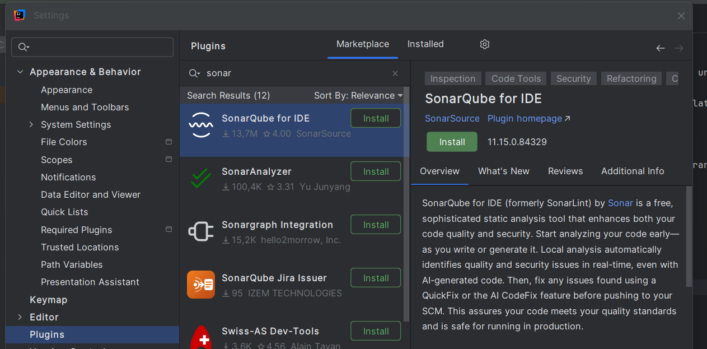

Una vez instalado, aparecerá el panel de SonarQube for IDE en la parte inferior del IDE.
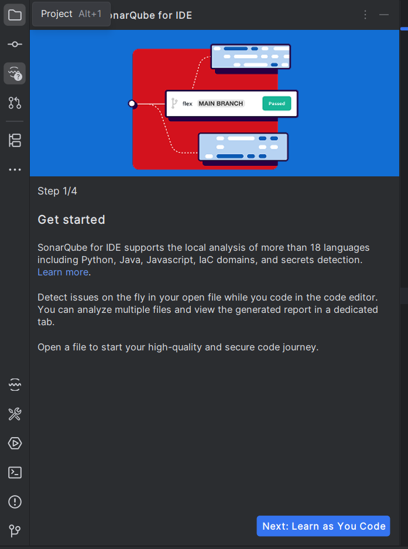

#### Cómo funciona: análisis en tiempo real

El plugin analiza el fichero que tienes abierto mientras lo editas y subraya los problemas directamente en el editor, igual que un corrector ortográfico. Al pasar el ratón por encima, muestra una explicación del problema y, en muchos casos, una sugerencia de cómo corregirlo.

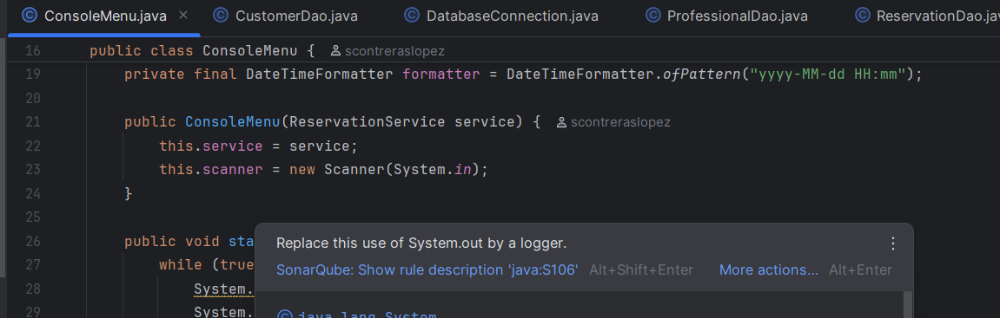
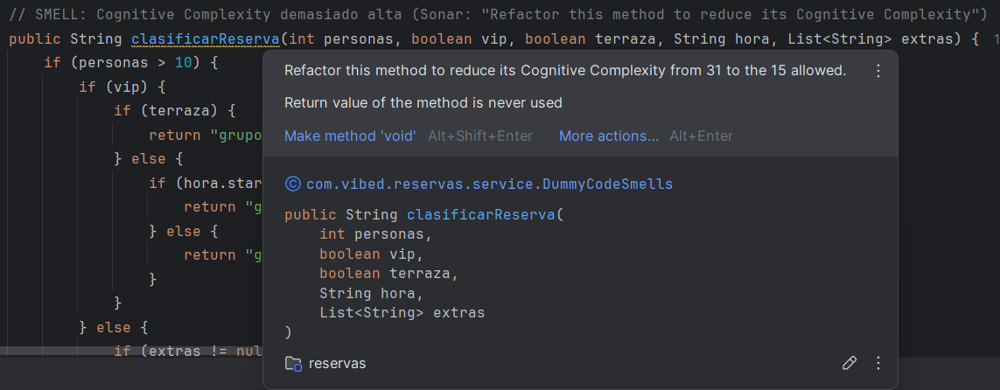

Para lanzar un análisis manual de todo el proyecto, vamos a View -> Tool Windows -> SonarQube for IDE → Analyze with SonarQube. Pinchamos en el botón de "Analyze All Files in Project" (qué disparará una confirmación debido a que en proyectos grandes puede tardar). Cuando aceptemos empezará a analizar el proyecto y generará un reporte. Esto es útil para detectar problemas que no estén en el fichero abierto, o para obtener una visión global de la calidad del código.

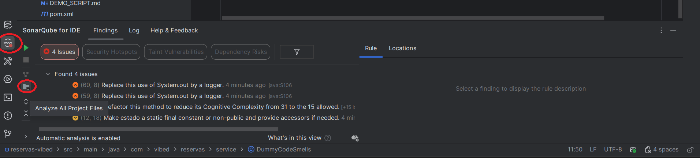

En el panel los problemas aparecen organizados por tipo y severidad. Verás cuatro botones: **Issues** (Bug, Vulnerability, Code Smell), **Security Hotspots**, **Security Taint** y **Dependency Risks**. En modo local (sin servidor), solo la pestaña **Issues** funciona con normalidad; las otras tres aparecen deshabilitadas con el aviso *«Connect to SonarQube (Server, Cloud) to enable [...]»*: requieren conexión con un servidor.

En cuanto a la severidad, SonarSource migró al sistema **MQR** (*Multi-Quality Rule*) como estándar desde finales de 2024, con los niveles **Blocker / High / Medium / Low / Info**. Si el plugin muestra el sistema antiguo (Blocker / Critical / Major / Minor / Info) es porque está en modo de compatibilidad. El mapeo es directo: Critical → High, Major → Medium, Minor → Low.

Al hacer clic en cada problema, el IDE te lleva al código afectado y muestra la explicación detallada.

#### Tipos de reglas

Con el sistema **MQR** activo, cada issue se describe por su impacto en una o más cualidades del software:

- **Reliability**: fallos que pueden causar comportamiento incorrecto en tiempo de ejecución (lo que antes se llamaba Bug).
- **Security**: código que introduce un riesgo de seguridad (lo que antes era Vulnerability).
- **Maintainability**: código que dificulta el mantenimiento: complejidad, duplicación, mal nombrado... (equivale a Code Smell).

El impacto sobre cada cualidad se valora como **High / Medium / Low**, y la severidad global del issue puede ser **Blocker / High / Medium / Low / Info**.

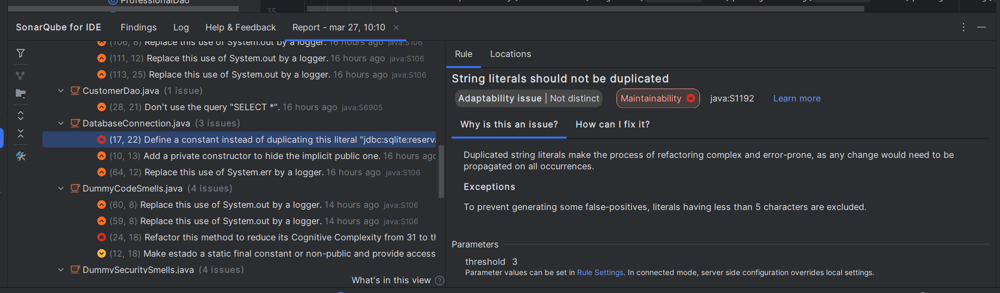

#### Interpretar los resultados

Al hacer clic en un problema en el panel del plugin, el IDE te lleva al código afectado y muestra:

- **El nombre de la regla** (por ejemplo, "Methods should not be too complex").
- **Por qué es un problema**: una explicación didáctica, a menudo con referencias a buenas prácticas.
- **Cómo corregirlo**: sugerencias concretas.
- **Ejemplos**: código "No conforme" y código "Conforme".

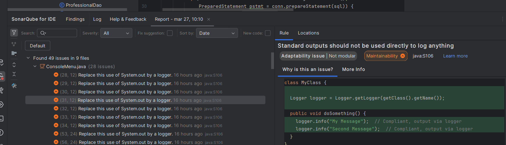

No todos los problemas marcados son urgentes. Aprende a priorizar: empieza por los Bugs y Vulnerabilities, luego los Code Smells de severidad Major o Critical. Los Minor e Info son ruido de fondo que se puede abordar más adelante. *Suponiendo que que has conectado el SonarQube server, hay una community edition que se puede montar relativamente fácil con docker, pero lo he dejado fuera del alcance de esta unidad por no complicarla demasiado.*

#### Configuración: activar, desactivar y ajustar reglas

Por defecto, el plugin viene con un conjunto estándar de reglas activas para cada lenguaje. Puedes personalizar cuáles están activas:

1. Ve a **File → Settings → Tools → SonarQube for IDE**.
2. En la pestaña **Rules**, verás la lista de todas las reglas disponibles.
3. Puedes activar o desactivar reglas individualmente, o filtrar por tipo o severidad.

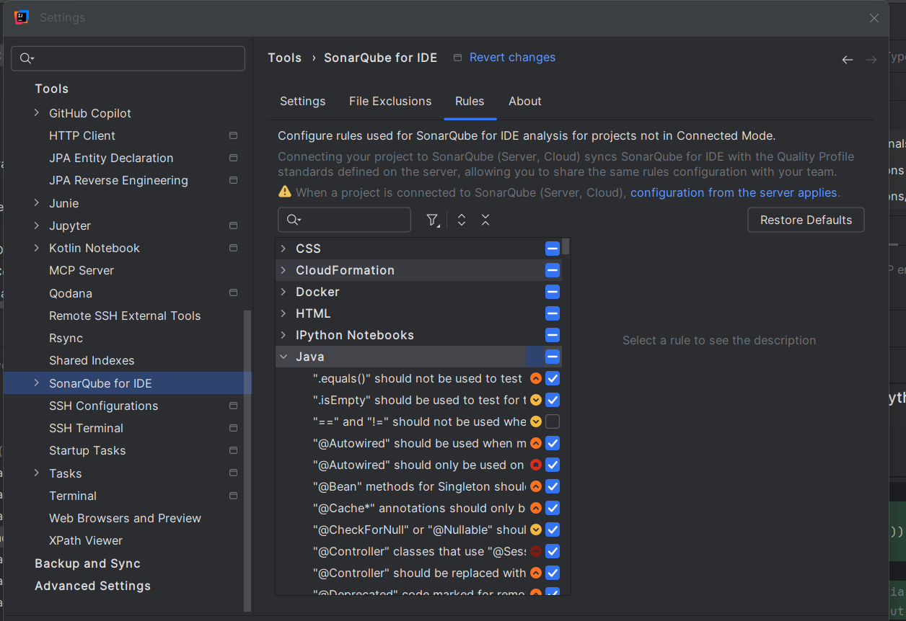

También puedes suprimir un problema concreto añadiendo una anotación o comentario especial, cuando hay una razón legítima para no seguir la regla en ese punto. El plugin lo marcará como "suprimido" y no aparecerá en el panel.

#### Conexión con SonarQube Server

En entornos profesionales, el equipo configura un servidor **SonarQube Server** (o la versión en la nube, **SonarQube Cloud**) que analiza el repositorio completo en cada pull request. SonarQube for IDE puede conectarse a ese servidor para usar exactamente las mismas reglas que el equipo ha configurado centralmente, garantizando coherencia.

Esta conexión se configura en **SonarQube for IDE → Connected Mode**. En el contexto de este módulo trabajamos en modo local (sin servidor), que es suficiente para aprender los conceptos y detectar los problemas más habituales, pero que sepas que tienes una versión *Community* de SonarQube Server que puedes montar con Docker para practicar la conexión y ver cómo se integran ambos productos. Esto es muy común en la industria: el plugin local para el desarrollo diario, y el servidor para el análisis global en CI.

### 4.3. Panorámica de otras herramientas

El ecosistema Java tiene varias herramientas de análisis estático. SonarQube for IDE integra muchas de sus reglas, pero es útil saber que existen. Las puedes encontrar en el marketplace de plugins de IntelliJ:

**Checkstyle**: Se centra en las **convenciones de estilo y formato**: nomenclatura, indentación, longitud de líneas, ubicación de llaves, etc. Es especialmente útil cuando el equipo quiere imponer un estilo de código uniforme. Puede generar informes de cumplimiento.

**PMD**: Detecta **patrones problemáticos a nivel de código fuente**: código duplicado, variables no usadas, clases innecesariamente complejas, problemas con null. Tiene reglas que solapan con SonarQube for IDE y otras específicas.

**SpotBugs** (sucesor de FindBugs): Analiza el **bytecode compilado** (los `.class`) en lugar del código fuente. Esto le permite detectar bugs que solo son visibles a nivel de bytecode: problemas con concurrencia, null pointer dereferences, comparaciones incorrectas entre objetos, etc.

> [!NOTE]
> En la práctica, muchos equipos usan SonarQube for IDE + SonarQube Server como herramienta principal porque integra reglas de los tres estilos (estilo, patrones, bugs) en una única interfaz. Checkstyle, PMD y SpotBugs se pueden integrar también como plugins de Maven o Gradle y ejecutarse en el pipeline de CI. Recuerda que el CI significa *Continuous Integration*, consiste en fusionar el código con mucha frecuencia, para lo que se apoya en una potente suite de pruebas automáticas y un análisis estático como garante de calidad.

### 4.4. Inspecciones nativas de IntelliJ

IntelliJ IDEA tiene su propio motor de inspecciones, independiente de SonarQube for IDE. Para ejecutarlo sobre todo el proyecto:

1. Ve a **Code → Inspect Code...**.
2. Selecciona el scope (el proyecto completo, un módulo, o un fichero).
3. Selecciona el perfil de inspección (Default es suficiente para empezar).
4. IntelliJ genera un informe con todos los problemas detectados, organizados por categoría.

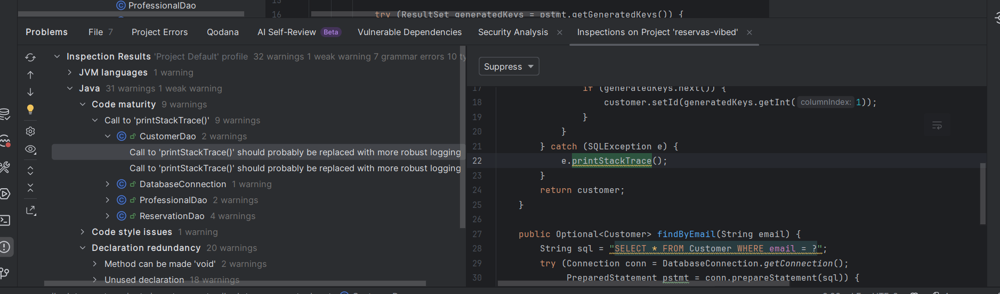

Las inspecciones de IntelliJ y SonarQube for IDE son complementarias: detectan cosas distintas. IntelliJ conoce mejor las particularidades del lenguaje (especialmente Kotlin) y el contexto del proyecto (tipos inferidos, configuración de frameworks). SonarQube for IDE tiene un catálogo de reglas más orientado a buenas prácticas de ingeniería de software. De hecho, si limitamos la comparación a las versiones en local, el motor de inspecciones nativo de IntelliJ encuentra más *warnings* que SonarQube for IDE, por lo que lo descartéis tan a la ligera.

**Qodana** es la plataforma de análisis estático de JetBrains pensada para integrarse en el pipeline de CI, el equivalente a SonarQube Server pero dentro del ecosistema JetBrains. Usa el mismo motor de inspecciones que IntelliJ IDEA, de modo que los resultados en el servidor son consistentes con lo que ves en el IDE. Se ejecuta como un contenedor Docker o como paso de GitHub Actions, genera un informe web con todos los problemas detectados y puede configurarse para romper el pipeline si se supera un umbral de calidad. Para quienes no quieran gestionar infraestructura propia, JetBrains ofrece también **Qodana Cloud**, la versión SaaS alojada por JetBrains, con la misma funcionalidad pero sin necesidad de desplegar nada.

---

## 5. Técnicas de refactorización en el IDE

Esta es la sección central de la unidad. Las técnicas de refactorización no son magia: son transformaciones concretas y bien definidas que IntelliJ puede aplicar de forma automática y segura. Aprende a reconocer cuándo aplicar cada una.

El acceso a las refactorizaciones en IntelliJ se hace principalmente a través de:
- **Click derecho → Refactor**: la forma más habitual; muestra las opciones disponibles para el elemento seleccionado.
- Menú **Refactor** en la barra de menús: equivalente al click derecho pero desde el menú superior.
- **Ctrl+Alt+Shift+T** (Windows/Linux) o **Ctrl+T** (Mac): atajo de teclado que abre el mismo menú de refactorizaciones.
- **Alt+Enter**: menú de intenciones e inspecciones, que a menudo sugiere refactorizaciones puntuales.

### 5.1. Métodos de composición

Técnicas para mejorar la estructura interna de un método: descomponerlo, simplificarlo, o darle nombres más expresivos a sus partes.

#### Extract Method

**Problema que resuelve**: método largo, código que no se explica solo, lógica duplicada.

Selecciona un bloque de código, activa Extract Method, y el IDE crea un nuevo método con ese código y lo reemplaza con una llamada al nuevo método. Si el bloque aparece en otro sitio del fichero, el IDE detecta los duplicados y te pregunta si quieres reemplazarlos también. 

> [!NOTE]
> SonarQube for IDE no tiene *Copy-Paste Detection* en modo local, pero IntelliJ sí detecta el código duplicado dentro del mismo fichero. Si el bloque que quieres extraer se repite en otro sitio del mismo fichero, el IDE te ofrecerá automáticamente la opción de reemplazar ambos con el nuevo método.

```java
// Antes
public void procesarPedido(Pedido pedido) {
    if (pedido.getItems().isEmpty()) {
        throw new IllegalArgumentException("El pedido está vacío");
    }
    if (pedido.getCliente() == null) {
        throw new IllegalArgumentException("El cliente es obligatorio");
    }

    double total = 0;
    for (Item item : pedido.getItems()) {
        total += item.getPrecio() * item.getCantidad();
    }
    if (pedido.getCliente().esPremium()) {
        total *= 0.9;
    }
    pedido.setTotal(total);

    String mensaje = "Pedido confirmado. Total: " + total + "€";
    emailService.enviar(pedido.getCliente().getEmail(), mensaje);
}
```

```java
// Después: cada responsabilidad tiene su propio método con nombre descriptivo
public void procesarPedido(Pedido pedido) {
    validarPedido(pedido);
    double total = calcularTotal(pedido);
    pedido.setTotal(total);
    notificarConfirmacion(pedido, total);
}

private void validarPedido(Pedido pedido) {
    if (pedido.getItems().isEmpty()) {
        throw new IllegalArgumentException("El pedido está vacío");
    }
    if (pedido.getCliente() == null) {
        throw new IllegalArgumentException("El cliente es obligatorio");
    }
}

private double calcularTotal(Pedido pedido) {
    double total = 0;
    for (Item item : pedido.getItems()) {
        total += item.getPrecio() * item.getCantidad();
    }
    return pedido.getCliente().esPremium() ? total * 0.9 : total;
}

private void notificarConfirmacion(Pedido pedido, double total) {
    String mensaje = "Pedido confirmado. Total: " + total + "€";
    emailService.enviar(pedido.getCliente().getEmail(), mensaje);
}
```

**Atajo en IntelliJ**: selecciona el bloque → **Ctrl+Alt+M** (Windows/Linux) o **Cmd+Alt+M** (Mac).

[Descargar vídeo: Extract Method en IntelliJ](./media/extract-method-compressed.mp4)

> [!TIP]
> Para descargar tendrás que darle al icono de descarga

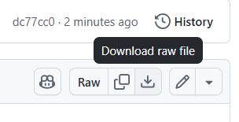

#### Inline Method

La operación inversa de Extract Method. Cuando un método solo se llama desde un sitio y su cuerpo es tan simple que la indirección no aporta claridad, se puede "inlinear" (sustituir la llamada por el cuerpo directamente).

**Atajo en IntelliJ**: cursor sobre el nombre del método → **Ctrl+Alt+N** (Windows/Linux) o **Cmd+Alt+N** (Mac).

#### Introduce Variable / Introduce Constant

Cuando una expresión compleja aparece en medio del código, darle nombre mejora la legibilidad y elimina el smell de *magic numbers* o expresiones opacas.

```java
// Antes
if (usuario.getSaldo() > 100 * 1.21 && usuario.getAntiguedad() > 365) { ... }

// Después: las expresiones tienen nombre y significado
double minimoSaldoConIva = 100 * 1.21;
int diasMinimoAntiguedad = 365;
if (usuario.getSaldo() > minimoSaldoConIva && usuario.getAntiguedad() > diasMinimoAntiguedad) { ... }
```

Si el valor es una constante que no cambia, Introduce Constant la convierte en un campo `static final` de la clase.

**Atajos en IntelliJ**: **Ctrl+Alt+V** (variable) o **Ctrl+Alt+C** (constante).

#### Inline Variable

La operación inversa: cuando una variable temporal solo se usa una vez y el valor no mejora la legibilidad, se puede eliminar.

```java
// Antes
String resultado = calcularResultado();
return resultado;

// Después
return calcularResultado();
```

**Atajo en IntelliJ**: cursor sobre la variable → **Ctrl+Alt+N**.

### 5.2. Mover funcionalidades entre clases

Técnicas para cuando el código está en el sitio equivocado: cuando los métodos o campos de una clase "envidian" a otra, o cuando la clase ha crecido demasiado.

#### Move Method / Move Field

Mueve un método o campo a la clase donde realmente pertenece. IntelliJ actualiza automáticamente todas las referencias.

**Cómo hacerlo**: clic derecho sobre el método → **Refactor → Move** → seleccionar la clase de destino.

#### Extract Class

Cuando una clase tiene demasiadas responsabilidades, se identifican los campos y métodos que pertenecen a una responsabilidad distinta y se extraen a una nueva clase.

```java
// Antes: Empleado gestiona datos personales Y datos de nómina
class Empleado {
    String nombre;
    String apellidos;
    LocalDate fechaNacimiento;
    double salarioBase;
    double complementos;
    double calcularNomina() { ... }
    double calcularIRPF() { ... }
}

// Después: cada clase tiene una responsabilidad clara
class Empleado {
    String nombre;
    String apellidos;
    LocalDate fechaNacimiento;
    Nomina nomina;  // Composición
}

class Nomina {
    double salarioBase;
    double complementos;
    double calcularNomina() { ... }
    double calcularIRPF() { ... }
}
```

**Cómo hacerlo**: **Refactor → Extract Delegate** en IntelliJ.

[Descargar vídeo: Extract Delegate en IntelliJ](./media/extract-delegate-compressed.mp4)

#### Inline Class

La operación inversa: cuando una clase apenas tiene contenido o su responsabilidad puede absorberse en otra clase sin problema. Mueve todo el contenido a la clase objetivo y elimina la clase original.

### 5.3. Simplificar condicionales

Técnicas para hacer más legible la lógica condicional, especialmente cuando resulta compleja.

#### Decompose Conditional

Cuando la condición de un `if` es compleja, Extract Method sobre la condición y sobre cada rama la hace mucho más legible.

```java
// Antes: hay que leer la condición entera para entender qué está verificando
if (fecha.isAfter(verano.getInicio()) && fecha.isBefore(verano.getFin())
        && temperatura > 35 && humedad > 70) {
    // activar sistema de emergencia
} else {
    // funcionamiento normal
}

// Después: los nombres explican la intención
if (esOlaDeCalorVeraniega(fecha, temperatura, humedad)) {
    activarProtocoloEmergencia();
} else {
    funcionamientoNormal();
}
```

> [!NOTE]
> La complejidad asociada a los condicionales anidados se conoce como **Complejidad Ciclomática** (*Cyclomatic Complexity*) y es uno de los factores que SonarQube for IDE tiene en cuenta para evaluar la mantenibilidad del código. Decompose Conditional es una técnica clave para reducir esta complejidad.

#### Replace Conditional with Polymorphism

El smell de *Switch Statements* tiene su solución natural aquí. En lugar de un `switch` que ramifica según el tipo, cada tipo tiene su propia clase con el método que implementa el comportamiento correcto.

```java
// Antes: switch sobre tipo de empleado
public double calcularBonus(Empleado e) {
    switch (e.getTipo()) {
        case "COMERCIAL":   return e.getVentas() * 0.05;
        case "TECNICO":     return e.getProyectosEntregados() * 200;
        case "DIRECTIVO":   return 5000;
        default:            return 0;
    }
}
```

```java
// Después: cada tipo de empleado sabe calcular su propio bonus
abstract class Empleado {
    abstract double calcularBonus();
}

class EmpleadoComercial extends Empleado {
    double ventas;
    @Override
    double calcularBonus() { return ventas * 0.05; }
}

class EmpleadoTecnico extends Empleado {
    int proyectosEntregados;
    @Override
    double calcularBonus() { return proyectosEntregados * 200; }
}

class Directivo extends Empleado {
    @Override
    double calcularBonus() { return 5000; }
}
```

Ahora añadir un nuevo tipo de empleado solo requiere crear una nueva clase, sin tocar el switch (porque ya no existe).

> [!NOTE]
> Esta técnica es una de las más poderosas pero también requiere más trabajo que un Extract Method. IntelliJ tiene soporte parcial para guiarla, pero en proyectos reales suele hacerse de forma semi-manual. Vale la pena el esfuerzo cuando el switch se repite en varios sitios o cuando se espera añadir más tipos en el futuro. Este principio de diseño se conoce como **Open/Closed Principle**: el código debe estar abierto a la extensión (añadir nuevos tipos) pero cerrado a la modificación (no tocar el código existente).

### 5.4. Simplificar llamadas a métodos

#### Rename

La refactorización más simple y más usada. Cambia el nombre de una variable, método, clase o parámetro, y actualiza automáticamente todas las referencias en el proyecto. Hacer un rename sin utilizar la función de refactorización del IDE es un error común que puede introducir bugs si se te escapa alguna referencia. Siempre usa Rename para garantizar que el cambio es seguro y completo.

> [!TIP]
> Usa Rename con frecuencia. Un nombre que era correcto cuando escribiste el código puede dejar de serlo cuando el código evoluciona. No temas renombrar: IntelliJ lo hace de forma segura en milisegundos.

**Atajo en IntelliJ**: **Shift+F6**.

#### Introduce Parameter Object

Cuando un método tiene una lista larga de parámetros relacionados, se agrupan en un objeto. IntelliJ crea la clase automáticamente con los campos y el constructor correspondientes.

```java
// Antes
public void reservarHabitacion(String nombre, String email,
                                LocalDate llegada, LocalDate salida,
                                int numPersonas) { ... }

// Después
public void reservarHabitacion(DatosReserva reserva) { ... }

// IntelliJ crea automáticamente:
class DatosReserva {
    final String nombre;
    final String email;
    final LocalDate llegada;
    final LocalDate salida;
    final int numPersonas;
    // constructor...
}
```

**Cómo hacerlo**: **Refactor → Introduce Parameter Object**.

### 5.5. Generalización y jerarquías

Técnicas para trabajar con jerarquías de clases: mover comportamiento hacia arriba (a la clase padre) o hacia abajo (a las subclases), y extraer interfaces.

#### Pull Up Method / Push Down Method

**Pull Up**: mueve un método de una subclase a la clase padre cuando todas las subclases tienen el mismo método (o deberían tenerlo).

**Push Down**: mueve un método de la clase padre a las subclases cuando el método solo es relevante para alguna de ellas.

**Cómo hacerlo**: clic derecho sobre el método → **Refactor → Pull Members Up** o **Push Members Down**.

#### Extract Interface

Cuando una clase declara un campo, el tipo de ese campo determina exactamente qué puede entrar ahí. Si el campo es `private ServicioEmail email`, el compilador solo acepta un `ServicioEmail`: no puede entrar un `ServicioSMS`, aunque tenga el mismo método `enviar()`. Esto tiene dos consecuencias prácticas molestas:

- **En producción**: si la empresa decide pasar de email a SMS, hay que abrir `GestorPedidos` y cambiarlo, cuando en realidad ese cambio no le incumbe.
- **En los tests**: cuando el test llama a `confirmarPedido()`, se envía un email real. No hay forma de sustituir `ServicioEmail` por un doble que no haga nada.

```java
// Antes: el campo es de tipo ServicioEmail — solo cabe un ServicioEmail
class GestorPedidos {
    private ServicioEmail email;
    void confirmarPedido(Pedido p) {
        email.enviar(p.getCliente(), "Tu pedido está confirmado");
    }
}
```

La solución es extraer una interfaz que declare únicamente el método que `GestorPedidos` necesita, y cambiar el tipo del campo a esa interfaz. El compilador ya no exige un tipo concreto: acepta cualquier clase que implemente la interfaz.

```java
// Se extrae la interfaz con el método que GestorPedidos necesita
interface Notificador {
    void enviar(String destinatario, String mensaje);
}

// Después: el campo es de tipo Notificador — cabe cualquier implementación
class GestorPedidos {
    private Notificador notificador;
    void confirmarPedido(Pedido p) {
        notificador.enviar(p.getCliente(), "Tu pedido está confirmado");
    }
}

class ServicioEmail implements Notificador { ... }    // producción: envía email
class ServicioSMS implements Notificador { ... }      // alternativa: envía SMS
class NotificadorFalso implements Notificador { ... } // tests: no hace nada real
```

`GestorPedidos` no cambia en ninguno de los tres casos. Lo único que varía es qué objeto se le pasa al construirlo, y eso se decide fuera de la clase.

**Cómo hacerlo**: **Refactor → Extract Interface**.

---

## 6. El flujo completo: refactorización con tests y control de versiones

Las técnicas de las secciones anteriores son herramientas. Esta sección describe cómo combinarlas en un flujo de trabajo profesional. Porque la refactorización no es una acción puntual: es un proceso disciplinado que combina análisis, pruebas y control de versiones.

> [!IMPORTANT]
> El flujo que se describe aquí asume que el proyecto ya tiene una suite de tests que pasan. Si no los tiene, el primer paso es escribirlos. Refactorizar sin tests es como hacer malabares sobre una cuerda floja sin red; puede salir bien, pero el riesgo es innecesario.

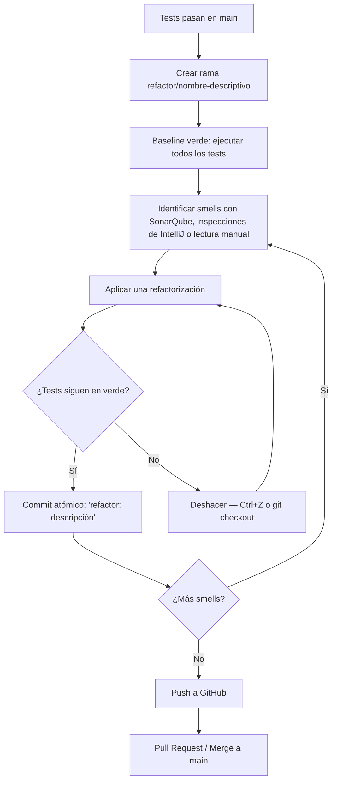

#### Paso 1: Crear una rama de refactorización

Nunca refactorices directamente en `main`. Crea una rama dedicada desde IntelliJ, puedes usar el IDE o la terminal:

1. En la barra superior del IDE, haz clic en el nombre de la rama actual.
2. Selecciona **New Branch**.
3. Usa una convención de nombre clara: `refactor/extract-metodo-calcular-total` o simplemente `refactor/clase-pedido`.

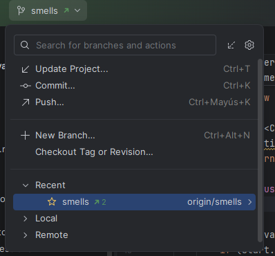

Trabajar en una rama separada tiene dos ventajas: si la refactorización se tuerce, puedes descartarla sin afectar a `main`; y si alguien más está trabajando en `main`, no os pisáis.

#### Paso 2: Baseline verde — todos los tests pasan

Antes de tocar una sola línea de código, ejecuta toda la suite de tests. Deben pasar todos. Si alguno falla antes de empezar, ese fallo no es tuyo, pero si refactorizas sin saberlo y luego falla, no sabrás si lo has roto tú o ya estaba roto.

Desde IntelliJ: **clic derecho sobre la carpeta `test`** → **Run 'All Tests'**, o desde el menú **Run → Run...**.

#### Paso 3: Identificar smells

Revisa el panel de SonarQube for IDE, las inspecciones de IntelliJ (**Analyze → Inspect Code**), o simplemente lee el código con los ojos bien abiertos buscando los antipatrones que hemos comentado en la sección 3. Prioriza los smells que más afectan a la legibilidad o mantenibilidad.

No intentes resolver todos a la vez. Elige uno.

#### Paso 4: Aplicar una refactorización y verificar

Aplica la refactorización elegida usando las herramientas del IDE (sección 5). Cuando termines:

- Ejecuta los tests inmediatamente.
- Si todos pasan: la refactorización es correcta. Pasa al paso 5.
- Si algún test falla: algo ha cambiado en el comportamiento. Deshaz con **Ctrl+Z** (o con `git checkout` si has guardado) y analiza qué ha ido mal.

> [!WARNING]
> Si aplicas múltiples refactorizaciones antes de ejecutar los tests y algo falla, no sabrás cuál de ellas ha causado el problema. La disciplina de "una refactorización, una verificación" es lo que hace que el proceso sea seguro.

#### Paso 5: Commit atómico

Después de cada refactorización verificada, haz un commit. Un commit por refactorización, no un commit al final del día con veinte cambios mezclados.

La convención de mensaje de commit para refactorizaciones:

```
refactor: extraer método calcularTotal de procesarPedido
```

O siguiendo el estándar *Conventional Commits*:

```
refactor(pedido): extraer lógica de descuento a calcularDescuento()
```

Desde IntelliJ: panel **Commit** (o **Ctrl+K**) → selecciona los ficheros modificados → escribe el mensaje → **Commit** (solo local) o **Commit and Push**. También puedes usar la terminal y pasarle el mensaje a `git commit -m "refactor: extraer método calcularTotal de procesarPedido"`.

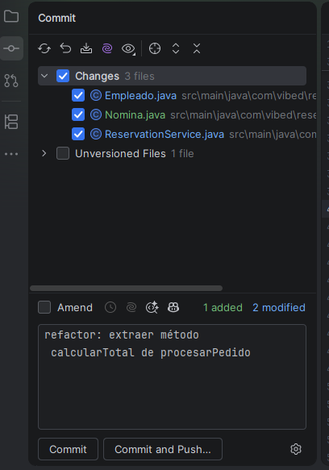

> [!IMPORTANT]
> **Nunca mezcles refactorización con cambios funcionales en el mismo commit**. Si mientras refactorizas ves un bug y lo corriges, ese arreglo va en un commit separado con mensaje `fix: ...`. Mezclarlos dificulta el historial, las revisiones de código y la posibilidad de hacer revert si algo sale mal.

#### Paso 6: Repetir

Vuelve al paso 3. Identifica el siguiente smell, aplica la refactorización, verifica, commit. Así hasta que la sesión de refactorización esté completa.

#### Paso 7: Push y Pull Request

Cuando hayas terminado la sesión de refactorización, suponiendo que sois un equipo con control de versiones centralizado en GitHub, el siguiente paso es compartir tu trabajo:

1. **Push** de la rama a GitHub: desde IntelliJ, **Git → Push** (o **Ctrl+Shift+K**).
2. En GitHub, abre un **Pull Request** desde tu rama de refactorización hacia `main`.
3. En el PR, describe qué smells has resuelto y qué técnicas has aplicado. Esto facilita la revisión.
4. Si tienes un compañero de equipo, pídele que lo revise.
5. **Merge** a `main` cuando sea aprobado.

Si se trata exclusivamente de un proyecto personal, lo normal es hacer merge directo a `main` después de verificar que los tests pasan, sin necesidad de un PR. Sin embargo, el PR es una buena práctica incluso en proyectos personales porque te obliga a escribir una descripción clara de lo que has hecho, y te da la oportunidad de revisar los cambios antes de fusionarlos.

#### El historial de Git como documentación

Un efecto secundario valioso de este flujo es el historial de Git. Si cada commit de refactorización tiene un mensaje descriptivo, el historial se convierte en una narración de cómo ha evolucionado el diseño del código. Cualquier miembro del equipo (o tú mismo en seis meses) puede seguir esa narración con `git log` y entender no solo qué cambió, sino por qué.

---

## 7. Introducción a la integración continua

### El concepto

La **integración continua** (*Continuous Integration*, CI) es una práctica de desarrollo en la que cada vez que un desarrollador hace push de código a un repositorio compartido, **un sistema automatizado compila el proyecto y ejecuta los tests**. Si algo falla, el equipo recibe una notificación inmediatamente.

El nombre viene de la práctica de "integrar" (combinar) el código de todos los miembros del equipo de forma frecuente, idealmente varias veces al día. El contrario es el anti-patrón de *"big bang integration"*: cada desarrollador trabaja durante semanas en su rama y luego trata de fusionar todo a la vez, con los conflictos y sorpresas que eso trae.

> [!NOTE]
> CI es el primer escalón de un conjunto de prácticas conocido como **CI/CD** (*Continuous Integration / Continuous Delivery*). Veréis CI/CD mencionado en múltiples contextos a lo largo de vuestra carrera; es una de las prácticas de ingeniería de software más extendidas en la industria actualmente.

### Por qué importa especialmente al refactorizar

Cuando refactorizas, tu objetivo es que el comportamiento no cambie. Los tests en tu máquina verifican esto, pero solo en tu máquina, con tu configuración, tu versión de JDK, y tus dependencias. La CI ejecuta los tests en un **entorno limpio y reproducible**, lo que elimina el clásico problema de "en mi máquina funciona".

Si los tests pasan en CI, tienes una garantía mucho más sólida que si solo pasan en local. Si fallan en CI pero pasaban en local, tienes un problema de entorno o de dependencias que descubrir antes de que llegue a `main`.

### Ampliación: GitHub Actions: un ejemplo mínimo

GitHub Actions es el sistema de CI/CD integrado en GitHub. Se configura mediante ficheros YAML en el directorio `.github/workflows/` del repositorio. Es gratuito para repositorios públicos y con un límite generoso para repositorios privados.

El siguiente workflow ejecuta los tests JUnit de un proyecto Maven en cada push y en cada pull request:

```yaml
# .github/workflows/ci.yml
name: CI — Tests

on:
  push:
    branches: [ "main", "refactor/**" ]
  pull_request:
    branches: [ "main" ]

jobs:
  test:
    runs-on: ubuntu-latest

    steps:
      - name: Obtener el código
        uses: actions/checkout@v4

      - name: Configurar Java 21
        uses: actions/setup-java@v4
        with:
          java-version: '21'
          distribution: 'temurin'

      - name: Ejecutar los tests con Maven
        run: mvn test
```

Línea por línea:

- **`on: push / pull_request`**: el workflow se activa cuando se hace push a `main` o a cualquier rama `refactor/**`, y cuando se abre un pull request hacia `main`.
- **`runs-on: ubuntu-latest`**: los tests se ejecutan en una máquina virtual Ubuntu limpia en los servidores de GitHub.
- **`actions/checkout@v4`**: descarga el código del repositorio en la máquina virtual.
- **`actions/setup-java@v4`**: instala el JDK 21 (Temurin, la distribución de Eclipse Adoptium).
- **`mvn test`**: ejecuta los tests con Maven. Si algún test falla, Maven termina con un código de error no-cero, y GitHub Actions marca el workflow como fallido.

<!-- TODO ADD IMAGE: Captura de la pestaña "Actions" de GitHub mostrando un workflow ejecutado con éxito (checkmark verde) junto a uno fallido (X roja), con el detalle de los pasos ejecutados visible al expandir el job. -->

Cuando el workflow se ejecuta, aparece en la pestaña **Actions** del repositorio de GitHub. Si falla, GitHub envía una notificación por email y marca el commit o el PR con una X roja. Si un pull request de refactorización no pasa la CI, no se debería hacer merge; ese es el punto: la CI actúa como una puerta de calidad automática.

> [!TIP]
> Los proyectos de Gradle funcionan igual, solo cambia el comando: `./gradlew test` en lugar de `mvn test`. IntelliJ crea proyectos con Gradle o Maven según tu elección al crear el proyecto.

---

## 8. Cuándo (y cuándo no) refactorizar

La refactorización es una herramienta, no un fin en sí misma. Saber cuándo aplicarla es tan importante como saber cómo hacerlo.

### Cuándo sí refactorizar

A continuación se presentan algunos escenarios comunes en los que la refactorización es la respuesta correcta:

#### La regla del tres

Esta regla, popularizada por Martin Fowler, dice: la primera vez que haces algo, simplemente hazlo. La segunda vez, hazlo con un poco de conciencia de que estás repitiendo algo. La tercera vez, refactoriza.

Es una heurística práctica para evitar abstracciones prematuras (crear una función para código que solo existe en un sitio) y también para evitar la duplicación crónica (dejar que la misma lógica se repita indefinidamente).

#### Antes de añadir funcionalidad

Si necesitas añadir una funcionalidad nueva a un área del código que está desordenada, la estrategia correcta es:

1. Primero, refactoriza el área hasta que sea fácil añadir lo nuevo.
2. Luego, añade la funcionalidad.

Esta secuencia la resume bien Kent Beck: *"For each desired change, make the change easy (warning: this may be hard), then make the easy change."*

Intentar añadir funcionalidad a código desordenado es más difícil, más lento y más propenso a errores. El tiempo invertido en limpiar primero se recupera con creces.

#### Cuando corriges un bug

Cuando encuentras un bug, suele ser señal de que hay un problema de diseño en esa área. Corregir el bug es urgente, pero después de corregirlo (y mientras el contexto está fresco) es buen momento para dejar el código un poco más limpio que como lo encontraste.

### Cuándo no refactorizar

Hay situaciones en las que refactorizar no es lo correcto, por más que el código tenga smells evidentes:

#### Código estable que no va a cambiar

Si hay un módulo que funciona correctamente desde hace años, nadie lo toca, y no hay previsión de que cambie, el riesgo de refactorizarlo no se justifica. El principio de "si no está roto, no lo arregles" tiene su aplicación aquí. Cada cambio (por bien intencionado que sea) introduce riesgo.

#### Sin tests

Refactorizar código sin tests es arriesgado. Si el código no tiene tests y no es factible escribirlos (por la complejidad del código o por falta de tiempo), el coste de la refactorización puede ser mayor que el beneficio. En ese caso, lo correcto es escribir primero los tests (aunque sea una cobertura básica) y luego refactorizar.

#### En medio de una entrega urgente

Si hay una fecha de entrega en 24 horas y el código funciona, no es momento de refactorizar. Apunta la deuda técnica, entrega, y vuelve después. Intentar refactorizar bajo presión de tiempo suele producir más deuda, no menos.

#### Cuando la refactorización se convierte en una excusa para reescribir

La trampa más común: el desarrollador empieza a "refactorizar" un componente y gradualmente lo va reescribiendo desde cero. Esto no es refactorización: es una reescritura que suele tomar mucho más tiempo del estimado, mezcla cambios estructurales con cambios funcionales, y puede introducir regresiones sutiles.

Si el código es tan problemático que la única solución viable es reescribirlo, que sea una decisión explícita y planificada, no un deslizamiento progresivo que empieza como "solo voy a limpiar un poco esto".

> [!WARNING]
> La "segunda versión del sistema" (el proyecto de reescritura desde cero) es uno de los errores más documentados en la historia del software. Joel Spolsky lo describió en 2000 como la peor decisión estratégica que puede tomar un equipo. La deuda técnica que acumula un proyecto mientras se reescribe, la pérdida de conocimiento implícito en el código original, y la tendencia a subestimar la complejidad de los requisitos hacen que las reescrituras rara vez terminen según lo planeado. Una idea similar se desliza en el libro del *Mythical Man-Month* de Fred Brooks, donde dice que el **Second-System Effect** es la tendencia a sobrecomplicar la segunda versión de un sistema porque los desarrolladores, al haber aprendido de la primera versión, intentan hacerla "perfecta" y terminan añadiendo características innecesarias o complicando el diseño.

### Un criterio integrador

La pregunta correcta no es "¿debería refactorizar este código?" sino **"¿este código va a tener que cambiar pronto, y si es así, será más fácil cambiarlo si lo limpio primero?"**. Si la respuesta a las dos partes es sí, refactoriza. Si el código no va a cambiar en el futuro previsible, quizás no vale la pena.

La refactorización es una inversión: consumes tiempo ahora para ahorrar tiempo después. Como cualquier inversión, hay que evaluar si el retorno justifica el coste. A veces sí. A veces no.

---

> [!NOTE]
> **Recursos para profundizar:**
> - *Refactoring: Improving the Design of Existing Code* — Martin Fowler (2ª edición, 2018). El libro de referencia. Los ejemplos están en JavaScript en la 2ª edición, pero los conceptos son universales.
> - [refactoring.guru](https://refactoring.guru) — Catálogo online de smells y técnicas con ejemplos visuales. Muy recomendable para repasar.
> - [SonarQube for IDE docs](https://docs.sonarsource.com/sonarqube-for-ide/intellij/) — Documentación oficial del plugin para IntelliJ.
> - *Clean Code* — Robert C. Martin. Menos sobre técnicas concretas y más sobre principios y hábitos. Lectura complementaria recomendada.