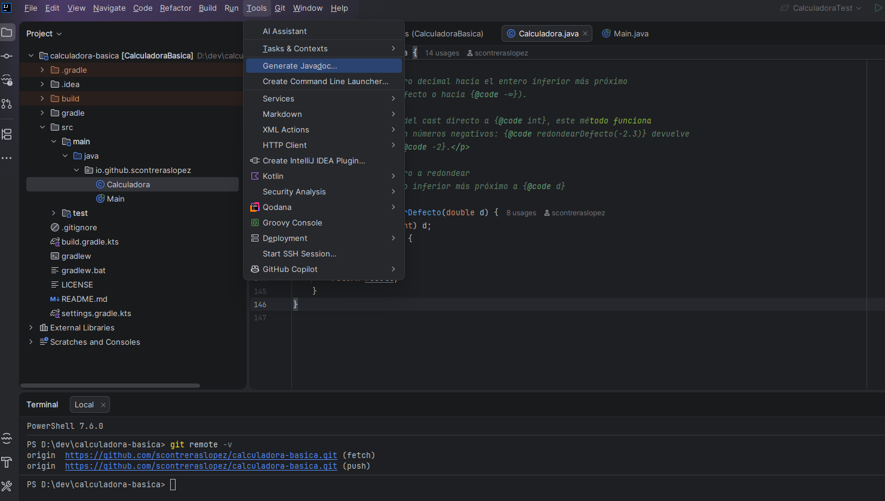
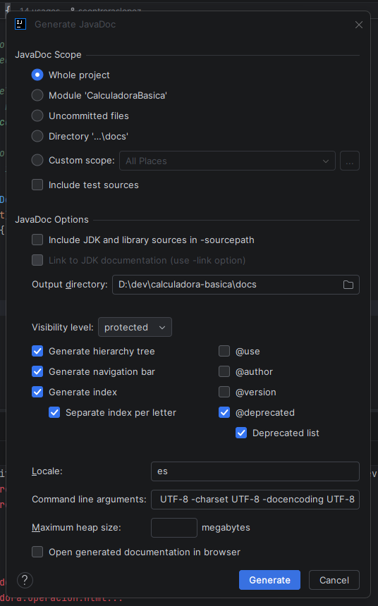
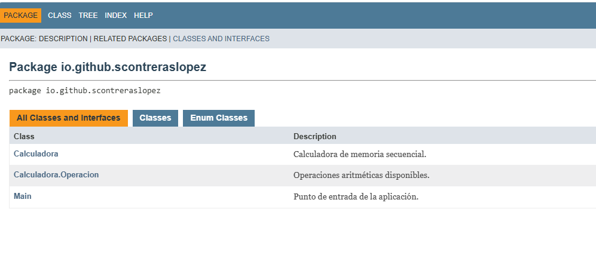
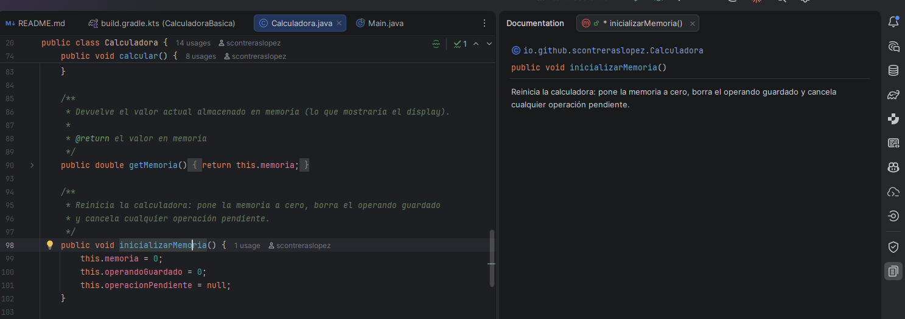
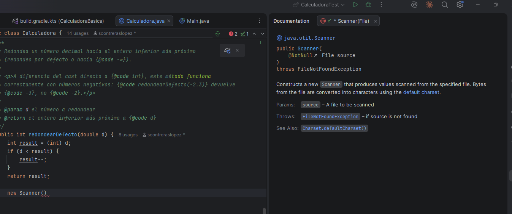
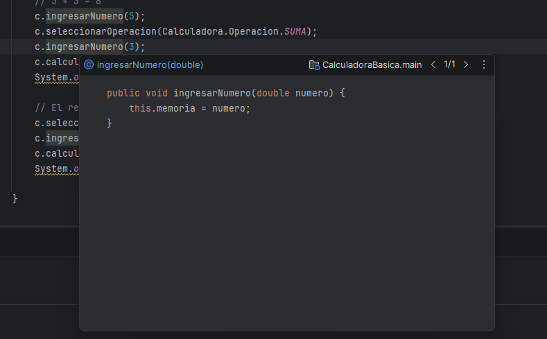
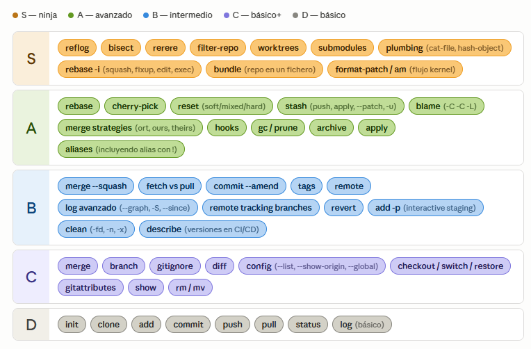

# UP13: Documentación del código

## ÍNDICE

- [OBJETIVOS](#objetivos)
- [1. Introducción: por qué documentar el código](#1-introducción-por-qué-documentar-el-código)
  - [1.1. Dos niveles: documentación de usuario y documentación del código](#11-dos-niveles-documentación-de-usuario-y-documentación-del-código)
  - [1.2. La documentación como parte del producto](#12-la-documentación-como-parte-del-producto)
  - [1.3. Relación con UP12](#13-relación-con-up12)
- [2. Qué documentar y qué no](#2-qué-documentar-y-qué-no)
  - [2.1. El código dice QUÉ; los comentarios dicen POR QUÉ](#21-el-código-dice-qué-los-comentarios-dicen-por-qué)
  - [2.2. Documentar la API pública, no los internos triviales](#22-documentar-la-api-pública-no-los-internos-triviales)
  - [2.3. Tipos de comentarios útiles](#23-tipos-de-comentarios-útiles)
  - [2.4. Comentarios que sobran](#24-comentarios-que-sobran)
- [3. Javadoc](#3-javadoc)
  - [3.1. Qué es Javadoc](#31-qué-es-javadoc)
  - [3.2. Sintaxis del bloque de documentación](#32-sintaxis-del-bloque-de-documentación)
  - [3.3. Etiquetas Javadoc](#33-etiquetas-javadoc)
  - [3.4. HTML dentro de Javadoc](#34-html-dentro-de-javadoc)
  - [3.5. Ejemplo completo: clase Station](#35-ejemplo-completo-clase-station)
- [4. Generar la documentación con IntelliJ IDEA](#4-generar-la-documentación-con-intellij-idea)
  - [4.1. Tools / Generate JavaDoc: opciones principales](#41-tools--generate-javadoc-opciones-principales)
  - [4.2. El HTML generado](#42-el-html-generado)
  - [4.3. Visualización en el editor: Quick Documentation](#43-visualización-en-el-editor-quick-documentation)
  - [4.4. Ampliación: generación con Maven o Gradle](#44-ampliación-generación-con-maven-o-gradle)
- [5. Buenas prácticas](#5-buenas-prácticas)
  - [5.1. Documenta la API pública, no lo trivial](#51-documenta-la-api-pública-no-lo-trivial)
  - [5.2. El POR QUÉ, no el QUÉ](#52-el-por-qué-no-el-qué)
  - [5.3. @author y @version: Git ya lo hace mejor](#53-author-y-version-git-ya-lo-hace-mejor)
  - [5.4. Mantén la documentación viva](#54-mantén-la-documentación-viva)
  - [5.5. Ejemplos de código con {@code}](#55-ejemplos-de-código-con-code)
  - [5.6. Enlazar, no copiar](#56-enlazar-no-copiar)
- [6. Ampliación](#6-ampliación)
  - [6.1. Javadoc con Markdown (JEP 467, Java 23+)](#61-javadoc-con-markdown-jep-467-java-23)
  - [6.2. Publicar la documentación](#62-publicar-la-documentación)
  - [6.3. Doc-as-code más allá del API](#63-doc-as-code-más-allá-del-api)
  - [6.4. El mismo espíritu en otros lenguajes](#64-el-mismo-espíritu-en-otros-lenguajes)
- [7. Cierre: documentación + refactorización + tests = código sostenible](#7-cierre-documentación--refactorización--tests--código-sostenible)

> **Recursos complementarios (vídeos)**
>
> Para reforzar el contenido de esta unidad, puedes consultar:
>
> - [Cómo generar JavaDocs desde IntelliJ o la línea de comandos](https://www.youtube.com/watch?v=fWqyzU6Ba7A) — vídeo corto sobre generación de Javadoc en IntelliJ IDEA.
> - [Playlist: Javadoc en detalle](https://www.youtube.com/playlist?list=PLSxN_97yth53ALqSkShekak0WK4jebcai) — serie de vídeos que, aunque usa Eclipse, explica en detalle las etiquetas Javadoc y la estructura de la API de Java (paquetes, clases, métodos, jerarquías). Las etiquetas y el concepto son idénticos en IntelliJ.

---

## OBJETIVOS

Al finalizar esta unidad, el alumno será capaz de:

- **Identificar qué código necesita documentación** y qué comentarios aportan valor real (CE4.g).
- **Escribir Javadoc completa y correcta** en clases, métodos y campos Java, usando las etiquetas estándar: `@param`, `@return`, `@throws`, `@deprecated`, `@see`, `{@link}`, `{@code}` y `{@inheritDoc}` (CE4.g).
- **Generar documentación HTML navegable** desde IntelliJ IDEA usando la herramienta integrada de generación de Javadoc (CE4.g).
- **Evaluar la calidad de una documentación existente**: detectar comentarios redundantes, documentación desactualizada y contratos incompletos (CE4.g).
- **Comprender que Javadoc no es la única herramienta de documentación** y que cada lenguaje tiene su equivalente con el mismo espíritu (ampliación).

---

## 1. Introducción: por qué documentar el código

### 1.1. Dos niveles: documentación de usuario y documentación del código

Cuando hablamos de "documentar software" nos referimos a dos cosas distintas:

- **Documentación de usuario**: manuales, guías de instalación, tutoriales. Está dirigida a quien **usa** el programa sin necesidad de ver su código. Aunque es fundamental, también arrastra problemas habituales: a menudo describe más de lo que orienta, no siempre se mantiene al día y termina quedándose atrás respecto al producto. Con la llegada de los LLM, parte de esta fricción se ha reducido, pero su revisión y mantenimiento sigue siendo una tarea habitual para facilitar el *onboarding* de nuevos desarrolladores en proyectos grandes.
- **Documentación del código**: comentarios estructurados dentro del código fuente que explican qué hace cada clase, qué acepta cada método, qué condiciones de error existen, y por qué se tomaron ciertas decisiones. Está dirigida a **desarrolladores** que leen, mantienen o extienden el código. Como en el punto anterior, esto solía ser una tarea que se posponía o se hacía a medias, pero con la llegada de los LLM, la documentación del código se ha simplificado a un punto en que no hay excusa para no mantenerla al día.

Esta unidad se centra en el segundo tipo, y en concreto en la documentación **generada a partir del código fuente** mediante herramientas como Javadoc.

> [!NOTE]
> En algunas empresas el uso el de la Inteligencia Artificial está fuertemente limitado por la naturaleza sensible de la información y otras cuestiones de gobernanza de la propiedad intelectual y los datos. A veces ofrecen modelos en local (o dentro de la red interna de la empresa) pero no siempre es así. Además, en las empresas grandes se trabaja en ordenadores corporativos en las cuales no es posible instalar software *motu proprio*. Si bien soy de la opinión de que esta tendencia se impondrá por simples *economics*, es importante que tengáis al menos unas nociones básicas para poder auditar la calidad de la documentación que se genera, y para poder escribirla vosotros mismos cuando no sea posible usar un LLM.

### 1.2. La documentación como parte del producto

Piensa en el ciclo de vida del software. Un programa puede pasar meses o años en producción, y durante ese tiempo será mantenido por desarrolladores que no participaron en su creación original. Según datos de la industria, y tal y cómo hemos comentado en unidades anteriores, la **fase de mantenimiento consume entre el 60% y el 80% del coste total** del software.

¿Qué facilita ese mantenimiento? Código limpio ayuda, pero no basta. Cuando un desarrollador abre una clase que no conoce, necesita saber:

- Qué **contrato** tiene cada método público (qué acepta, qué devuelve, qué errores lanza).
- Por qué se tomaron ciertas **decisiones de diseño** que no son evidentes.
- Qué **restricciones** existen (por ejemplo, que un parámetro no puede ser nulo o que un valor debe estar en un rango concreto).
- Otras **consideraciones** interesantes, como pudiera ser coste computacional, requisitos de concurrencia, o referencias a documentación externa.

Sin esa información, el mantenimiento se convierte en arqueología de código: leer líneas y líneas tratando de inferir intención. La documentación bien hecha reduce ese coste drásticamente.

### 1.3. Relación con UP12

En la UP12 viste el code smell *Comments*: comentarios que explican **qué hace** el código en lugar de dejar que el código hable por sí mismo. Puede parecer contradictorio que ahora dediquemos una unidad entera a documentar. Pero no lo es.

La clave está en **qué se documenta y cómo**:

- UP12 te enseñó a **evitar comentarios redundantes** dentro de la lógica (por ejemplo, `// Incrementa i` antes de `i++`).
- UP13 te enseña a **documentar la API pública**: el contrato de uso de tus clases y métodos, usando un formato estructurado que una herramienta puede transformar en documentación navegable.

> [!NOTE]
> Para evitar tomar la parte por el todo: la firma de un método forma parte del contrato, pero no es el contrato completo. La firma te dice cómo invocarlo (nombre y parámetros); el contrato además especifica precondiciones, resultado esperado, excepciones, efectos laterales y límites de uso.

No son cosas opuestas. Son dos caras de la misma moneda: código limpio y documentación útil van juntos.

---

## 2. Qué documentar y qué no

Antes de aprender la sintaxis de Javadoc, necesitas entender **qué merece ser documentado**. Documentar mal es peor que no documentar: crea ruido, información falsa y una falsa sensación de calidad.

### 2.1. El código dice QUÉ y los comentarios dicen POR QUÉ

Un código bien escrito explica por sí mismo **qué hace**. Nombres descriptivos de variables, métodos y clases hacen que muchos comentarios descriptivos sean simple ruido visual:

```java
// Mal: el código ya dice exactamente esto y no aporta nada
// Le suma 2 días a la fecha de entrega calculada
fechaEstimada = fechaEstimada.plusDays(2);
```

Lo que el código **no** puede expresar, por muy limpio que sea, es el **por qué** de ciertas decisiones. Ese por qué puede venir de negocio (reglas no evidentes) o de contexto técnico (limitaciones y bugs externos).

Ejemplo 1, regla de negocio antiintuitiva:

```java
// Bien: explica el POR QUÉ (contexto de negocio que el código no revela)
// El proveedor logístico principal no computa fines de semana en su SLA.
// Añadimos 2 días de margen para evitar falsas alertas de retraso
// en el panel de atención al cliente (Ref: Ticket #845).
fechaEstimada = fechaEstimada.plusDays(2);
```
La referencia del ticket se refiere al id de este requisito dentro del sistema de gestión de incidencias que use la empresa (Jira, GitHub Issues, etc.) y es un buen ejemplo de cómo enlazar documentación con otras fuentes de información relevantes para el mantenimiento.

Ejemplo 2, workaround técnico ante un sistema externo:

```java
// Bien: documenta una decisión técnica que parece un error a simple vista
// El API de la pasarela de pagos legacy (v1.2) devuelve el string
// literal "null" en lugar de HTTP 404 o JSON vacío cuando no hay historial.
// Lo interceptamos aquí para evitar NullPointerException y respuestas inconsistentes.
if ("null".equals(apiResponse)) {
    return new ArrayList<>();
}
```

La regla práctica es simple: si al borrar el comentario se pierde una decisión relevante de negocio, de operación o de arquitectura, ese comentario aporta valor. Si no se pierde nada, probablemente sobra.

### 2.2. Documentar la API pública, no los internos triviales

La documentación de mayor valor se centra en la **API pública**: lo que otros desarrolladores van a usar. Por orden de prioridad:

1. **Clases públicas**: qué representan, qué responsabilidad tienen.
2. **Métodos públicos**: qué aceptan, qué devuelven, qué errores pueden lanzar.
3. **Interfaces y contratos**: qué debe implementar quien las use.
4. **Constantes públicas**: qué representan esos valores.

Los atributos privados, los métodos auxiliares internos y la lógica trivial no necesitan Javadoc. Si el código está bien nombrado, su lectura directa es más rápida que leer un comentario. Eso sí, cualquier decisión interna no obvia (un algoritmo elegido por razones de rendimiento, una restricción de la que no se ve el origen) sí merece un comentario `//` que explique el *por qué*, no el *qué*.

### 2.3. Tipos de comentarios útiles

No todos los comentarios son Javadoc. Existen varios tipos con distinto propósito:

#### Comentarios de licencia o legales

Algunos proyectos requieren incluir un bloque de licencia al inicio de cada fichero fuente. No es Javadoc: es un comentario de bloque normal.
```java
/*
 * Copyright 2026 IES Severo Ochoa
 * Licencia MIT — ver LICENSE para detalles.
 */
```

Lo habitual es que la licencia viva en un fichero `LICENSE` en la raíz del repositorio, pero en contextos con requisitos legales estrictos (auditorías, compliance, contratos con terceros) se exige además repetir la cabecera en cada fichero.


#### Cabecera de clase o fichero

Un comentario breve al inicio que describe la responsabilidad de la clase. Este **sí** suele ser Javadoc. Ejemplo:

```java
/**
 * Representa una estación de tren en la simulación.
 *
 * <p>Cada estación tiene un nombre único, coordenadas GPS
 * y forma parte de una o más rutas. Las instancias son
 * inmutables: una vez creadas, no se pueden modificar.</p>
 *
 * @author Sergio Contreras
 * @version 1.0
 * @since 1.0
 */
public class Station {
    // ...
}
```

#### TODO y FIXME

Marcadores que indican deuda técnica conocida o trabajo pendiente. Ya los viste en UP12 en el contexto de deuda técnica.

```java
// TODO: extraer esta lógica a un servicio cuando tengamos más proveedores
// FIXME: falla con fechas anteriores a 1970 — corregir en sprint 4
// TODO: reemplazar la ordenación por un algoritmo similar a QuickSort para mejorar rendimiento en listas grandes
```

Su utilidad depende de que sean **concretos y revisables**. Un `TODO: mejorar esto` que lleva dos años en el código es otro nombre para "nunca".

#### Comentarios de intención

Explican por qué existe un bloque de código o por qué se eligió un enfoque. Son los más valiosos después de la Javadoc de API.

```java
// Usamos BigDecimal en vez de double porque la normativa bancaria
// exige precisión decimal exacta en cálculos de importes.
BigDecimal total = precio.multiply(cantidad);
```

### 2.4. Comentarios que sobran

Aunque se ha tratado en la UP12 dentro de la sección de *dispensables*, recogemos de nuevo aquí los principales tipos de comentarios que sobran:

- Comentarios que explican **qué hace** el código en lugar de mejorar el código.
- Comentarios que **repiten** lo que ya dice el nombre del método o variable.
- Comentarios que **contradicen** el código actual (desactualizados).
- Bloques de código comentado que nadie se atreve a borrar.

> [!TIP]
> Si necesitas un comentario para explicar qué hace tu código, probablemente necesitas mejorar los nombres de tus variables o extraer un método con un nombre descriptivo.

---

## 3. Javadoc

### 3.1. Qué es Javadoc

**Javadoc** es la herramienta oficial de Java para generar documentación a partir del código fuente. Fue creada por Sun Microsystems junto con el lenguaje en 1995 y sigue siendo el estándar hoy en día.

Su funcionamiento es sencillo: escribes comentarios estructurados con un formato especial (`/** ... */`) y la herramienta Javadoc los extrae y los transforma en **páginas HTML navegables** que describen tu API: clases, métodos, parámetros, excepciones, relaciones entre clases. La página *javadoc* más famosa es la propia documentación oficial de Java, que puedes consultar en [https://docs.oracle.com/en/java/javase/21/docs/api/index.html](https://docs.oracle.com/en/java/javase/21/docs/api/index.html).

Esto significa que tu documentación vive **junto al código**. Cuando cambias un método, la documentación está justo encima. Si la mantienes al día (y deberías), la documentación generada siempre refleja el estado real del código.

> [!NOTE]
> Javadoc no es la única herramienta de este tipo. Cada lenguaje tiene su equivalente: Kotlin usa **KDoc** (procesado por Dokka), Python tiene **docstrings**, C# usa **XML Documentation Comments**, JavaScript/TypeScript usa **JSDoc/TSDoc**, y C/C++ usa **Doxygen**. La sintaxis cambia, pero el espíritu es el mismo: comentarios estructurados con etiquetas que describen contrato e intención, desde los que una herramienta genera documentación navegable. En la sección de ampliación puedes encontrar una tabla comparativa.

### 3.2. Sintaxis del bloque de documentación

Un bloque Javadoc se escribe con `/** ... */` (con doble asterisco de apertura, no confundir con `/*` de comentario normal). Se coloca **justo encima** de lo que documenta: clase, método, campo o constructor.

```java
/**
 * Descripción principal de lo que hace el elemento.
 *
 * Párrafos adicionales si se necesita más detalle.
 * Cada línea puede contener etiquetas especiales.
 *
 * @param nombre  descripción del parámetro
 * @return        descripción del valor de retorno
 * @throws TipoExcepcion  cuándo se lanza
 */
```

Reglas básicas:

- La **primera línea** o párrafo es la descripción resumida. Javadoc la usa como resumen en los índices.
- Las **etiquetas** (`@param`, `@return`, etc.) van al final, una por línea.
- Las etiquetas sin contenido se ignoran; no hace falta incluir todas si no aplican.
- Si el bloque queda en un fichero que no tiene nada más que documentar, se aplica a la clase. Si está encima de un método, se aplica a ese método.

### 3.3. Etiquetas Javadoc

Vamos a ver las etiquetas más importantes con ejemplos reales. Para mantener la coherencia con lo que ya viste en UP10-11, usaremos una **reinterpretación en Java** de algunas clases del repositorio `kotlin-train-simulator` que ya vimos. La lógica es la misma; cambia la sintaxis a Java para que Javadoc sea coherente.

> [!NOTE]
> Esta reinterpretación no es una traducción fiel: se toman algunas licencias para que los ejemplos sean más ilustrativos. En particular, la clase `Station` aquí tiene coordenadas GPS (latitud/longitud), cuando en el simulador original las estaciones no tienen posición geográfica propia sino que su posición es relativa a la ruta en la que viven. Del mismo modo, las distancias aquí se expresan en kilómetros, mientras que en el simulador original se usan metros.

#### `@param`, `@return` y `@throws` — el trío fundamental

Son las tres etiquetas que usarás el 90% de las veces. Juntas describen el **contrato** completo de un método:

- `@param nombre descripción` — documenta un parámetro de entrada: qué representa y qué restricciones tiene (si acepta nulos, rango válido, etc.). Se repite una vez por cada parámetro.
- `@return descripción` — documenta el valor de retorno: qué es, qué rango puede tener, si puede ser nulo. Solo puede aparecer una vez (un método tiene un único valor de retorno) y no se usa en métodos `void`.
- `@throws TipoExcepcion condición` — documenta bajo qué condición el método lanza esa excepción. Se repite una vez por cada excepción declarada o relevante.

```java
/**
 * Crea una estación de tren con el nombre y coordenadas indicadas.
 *
 * @param nombre      nombre de la estación (no puede ser nulo ni vacío)
 * @param latitud     coordenada GPS en grados decimales (-90 a 90)
 * @param longitud    coordenada GPS en grados decimales (-180 a 180)
 * @throws IllegalArgumentException si el nombre es nulo o vacío,
 *         o si las coordenadas están fuera de rango
 */
public Station(String nombre, double latitud, double longitud) {
    if (nombre == null || nombre.isBlank()) {
        throw new IllegalArgumentException("El nombre no puede ser nulo ni vacío");
    }
    if (latitud < -90 || latitud > 90) {
        throw new IllegalArgumentException("Latitud fuera de rango: " + latitud);
    }
    if (longitud < -180 || longitud > 180) {
        throw new IllegalArgumentException("Longitud fuera de rango: " + longitud);
    }
    this.nombre = nombre;
    this.latitud = latitud;
    this.longitud = longitud;
}
```

Este constructor documenta exactamente qué acepta, qué restricciones tiene y bajo qué condiciones falla. Un desarrollador que lea esta Javadoc sabe usar la clase sin necesidad de leer la implementación. Fíjate que sin estas aclaraciones podría no quedar claro el rango de las coordenadas o que el nombre no puede ser nulo ni vacío.

Veamos un método que devuelve valor y lanza excepción:

```java
/**
 * Devuelve el segmento de la ruta que contiene el kilómetro indicado.
 *
 * @param kilometro posición en kilómetros desde el inicio de la ruta
 * @return el segmento que contiene ese punto
 * @throws IllegalArgumentException si el kilómetro es negativo o
 *         excede la longitud total de la ruta
 * @see #longitudTotal()
 */
public RouteSegment segmentAt(double kilometro) {
    if (kilometro < 0 || kilometro > longitudTotal) {
        throw new IllegalArgumentException("Kilómetro fuera de ruta: " + kilometro);
    }
    // ... búsqueda del segmento
}
```

Observa que `@see` enlaza con el método `longitudTotal()` porque están relacionados. Veremos más sobre enlaces en breve.

#### `@deprecated` — marcar lo obsoleto

Cuando un método o clase queda obsoleto pero no se elimina (porque rompería código existente), se marca con `@deprecated` para avisar a quienes lo usan.

```java
/**
 * Obtiene la velocidad del tren en km/h.
 *
 * @return velocidad en kilómetros por hora
 * @deprecated desde la versión 2.0, usar {@link #getVelocityKmH()} en su lugar.
 *             Este método se eliminará en la versión 3.0.
 */
@Deprecated
public double velocityKmH() {
    return velocityMs * 3.6;
}

/**
 * Obtiene la velocidad del tren en km/h.
 *
 * <p>Método preferido sobre {@link #velocityKmH()} (obsoleto).</p>
 *
 * @return velocidad en kilómetros por hora
 * @since 2.0
 */
public double getVelocityKmH() {
    return velocityMs * 3.6;
}
```

La anotación `@Deprecated` (Java) hace que el compilador genere warnings al usar el método. La Javadoc `@deprecated` (minúsculas) explica **por qué** se deprecó y **qué usar en su lugar**. Se usan juntas. Es bastante habitual que el método obsoleto siga funcionando durante varias versiones para dar tiempo a los usuarios a migrar, pero la documentación debe ser clara sobre su estado y su futuro.

#### `@see` y `{@link}` — crear referencias

`@see` crea una sección "Ver también" en la documentación HTML. `{@link}` inserta un enlace en línea dentro de la descripción. La diferencia es de posición: `@see` va al final del bloque como etiqueta independiente; `{@link}` se incrusta dentro del texto.

Ambos usan la misma sintaxis para apuntar al destino:

| Forma | Ejemplo | Apunta a |
|---|---|---|
| `ClassName` | `Route` | clase del mismo paquete |
| `package.ClassName` | `com.example.Route` | clase de otro paquete |
| `ClassName#method()` | `Route#distanciaTotal()` | método de otra clase |
| `#method()` | `#longitudTotal()` | método de esta misma clase |
| `#field` | `#nombre` | campo de esta misma clase |
| `"texto"` | `"Haversine formula"` | referencia textual sin enlace (solo `@see`) |
| `<a href="url">texto</a>` | `<a href="...">RFC 7231</a>` | URL externa |

```java
/**
 * Calcula la distancia entre dos estaciones usando la fórmula de Haversine.
 *
 * <p>Para calcular distancias a lo largo de una ruta completa,
 * usar {@link Route#distanciaTotal()} en su lugar.</p>
 *
 * @param origen  estación de partida
 * @param destino estación de llegada
 * @return distancia en kilómetros
 * @see Route#distanciaTotal()
 */
public static double distancia(Station origen, Station destino) {
    // ...
}
```

Fíjate en el uso de `#`: el prefijo `#` indica que el destino está en la misma clase; sin él, Javadoc busca en otra clase o paquete.

#### `{@code}` y `{@inheritDoc}`

`{@code}` inserta texto con formato de código fuente sin necesidad de usar `<code>` HTML. Es útil para mostrar fragmentos de código o nombres técnicos dentro de la descripción.

```java
/**
 * Convierte una cadena de texto en una estación.
 *
 * <p>El formato esperado es {@code "nombre;latitud;longitud"},
 * por ejemplo {@code "Madrid Atocha;40.4065;-3.6893"}.</p>
 *
 * @param texto cadena en formato nombre;latitud;longitud
 * @return la estación correspondiente
 * @throws IllegalArgumentException si el formato no es válido
 */
public static Station parse(String texto) {
    // ...
}
```

`{@inheritDoc}` copia la documentación de un método de la clase padre o de la interfaz que se implementa. Útil cuando la implementación no añade información nueva al contrato:

```java
/**
 * Interfaz que notifica eventos de la simulación.
 */
public interface SimulationObserver {

    /**
     * Se invoca cuando la simulación avanza un paso.
     *
     * @param time instante de simulación actual
     */
    void onStep(double time);

    /**
     * Se invoca cuando la simulación se detiene por cualquier causa.
     *
     * @param reason razón de la parada
     */
    void onStop(String reason);
}
```

```java
/**
 * Registra eventos de la simulación en consola.
 * {@inheritDoc}
 */
public class ConsoleLogger implements SimulationObserver {

    /** {@inheritDoc} */
    @Override
    public void onStep(double time) {
        System.out.println("Paso: t=" + time);
    }

    /** {@inheritDoc} */
    @Override
    public void onStop(String reason) {
        System.out.println("Parada: " + reason);
    }
}
```

#### `@author`, `@version` y `@since` — metadatos de autoría

Estas etiquetas van en la cabecera de la clase e indican quién la escribió, en qué versión del proyecto se introdujo y desde cuándo existe en la API. Forman parte del estándar Javadoc y las encontrarás documentadas en cualquier referencia oficial.

```java
/**
 * Representa una estación de tren en la simulación.
 *
 * @author Sergio Contreras
 * @version 1.2
 * @since 1.0
 */
public class Station { ... }
```

En la práctica, si buscas en proyectos open source relevantes en GitHub verás que `@author` y `@version` han desaparecido casi por completo: Git ya registra quién cambió qué y cuándo, con mucho más detalle que un comentario estático. `@since` tiene más sentido en librerías con versionado semántico, para indicar desde qué versión existe una API, pero en código de aplicación tampoco aporta gran cosa. Son etiquetas históricas del estándar Javadoc; las encontrarás en referencias oficiales, pero en proyectos reales con control de versiones su uso está en declive.

### 3.4. HTML dentro de Javadoc

El texto dentro de un bloque Javadoc se renderiza como HTML. Un error típico es escribir listas o párrafos en texto plano y luego sorprenderse de que el resultado aparezca como una línea continua: Javadoc no detecta saltos de línea ni guiones como estructura. Para dar formato hay que usar etiquetas HTML explícitas.

Los elementos más útiles son:

| Elemento HTML | Uso |
|---|---|
| `<p>` | Separar párrafos (Javadoc no detecta saltos de línea como párrafos) |
| `<ul>` / `<li>` | Listas sin numerar |
| `<ol>` / `<li>` | Listas numeradas |
| `<pre>` | Bloques de código preformateado (respeta espacios y saltos) |
| `<code>` | Código en línea (alternativa a `{@code}`) |
| `<b>`, `<i>` | Énfasis (usar con moderación) |

Ejemplo con varios de estos elementos:

```java
/**
 * Ejecuta un paso de la simulación física.
 *
 * <p>En cada paso, el motor realiza las siguientes operaciones
 * en orden:</p>
 *
 * <ol>
 *   <li>Calcula las fuerzas aplicadas a cada tren.</li>
 *   <li>Integra la aceleración para obtener la nueva velocidad.</li>
 *   <li>Integra la velocidad para obtener la nueva posición.</li>
 *   <li>Comprueba colisiones y eventos.</li>
 * </ol>
 *
 * <p>Si se detecta una colisión, la simulación se detiene
 * automáticamente. Ejemplo de uso:</p>
 *
 * <pre>
 * PhysicsEngine engine = new PhysicsEngine();
 * while (!engine.isStopped()) {
 *     engine.step(0.016);  // paso de ~16ms
 * }
 * </pre>
 *
 * @param dt intervalo de tiempo en segundos (debe ser positivo)
 * @throws IllegalStateException si la simulación ya se ha detenido
 */
public void step(double dt) {
    // ...
}
```

> [!NOTE]
> `{@code}` es más cómodo que `<code>` para código en línea porque no necesitas escapar caracteres HTML como `<` o `>`. Usa `<pre>` cuando necesites un bloque multilínea con formato preservado.

### 3.5. Ejemplo completo: clase Station

Veamos la clase `Station` completa con Javadoc "de libro". Este es el tipo de documentación que deberías aspirar a escribir en un proyecto real.

```java
/**
 * Representa una estación de tren en la simulación.
 *
 * <p>Cada estación tiene un nombre único, coordenadas GPS
 * y forma parte de una o más rutas. Las instancias son
 * inmutables: una vez creadas, no se pueden modificar.</p>
 *
 * <p>Ejemplo de creación:</p>
 * <pre>
 * Station madrid = new Station("Madrid Atocha", 40.4065, -3.6893);
 * Station valencia = new Station("Valencia Joaquín Sorolla", 39.4589, -0.3765);
 * double dist = Station.distancia(madrid, valencia);
 * </pre>
 *
 * @author Sergio Contreras
 * @version 1.0
 * @since 1.0
 * @see Route
 */
public class Station {

    /** Nombre de la estación (identificador único). */
    private final String nombre;

    /** Latitud en grados decimales (WGS84). */
    private final double latitud;

    /** Longitud en grados decimales (WGS84). */
    private final double longitud;

    /**
     * Crea una estación con las coordenadas indicadas.
     *
     * @param nombre   nombre de la estación (no puede ser nulo ni vacío)
     * @param latitud  coordenada GPS en grados (-90 a 90)
     * @param longitud coordenada GPS en grados (-180 a 180)
     * @throws IllegalArgumentException si el nombre es nulo/vacío o
     *         las coordenadas están fuera de rango
     */
    public Station(String nombre, double latitud, double longitud) {
        if (nombre == null || nombre.isBlank()) {
            throw new IllegalArgumentException("El nombre no puede ser nulo ni vacío");
        }
        if (latitud < -90 || latitud > 90) {
            throw new IllegalArgumentException("Latitud fuera de rango: " + latitud);
        }
        if (longitud < -180 || longitud > 180) {
            throw new IllegalArgumentException("Longitud fuera de rango: " + longitud);
        }
        this.nombre = nombre;
        this.latitud = latitud;
        this.longitud = longitud;
    }

    /**
     * Devuelve el nombre de la estación.
     *
     * @return nombre (nunca nulo ni vacío)
     */
    public String getNombre() {
        return nombre;
    }

    /**
     * Calcula la distancia en kilómetros a otra estación
     * usando la fórmula de Haversine sobre el elipsoide WGS84.
     *
     * @param otra estación de destino (no puede ser nula)
     * @return distancia en kilómetros (siempre positiva)
     * @throws IllegalArgumentException si {@code otra} es nula
     * @see <a href="https://es.wikipedia.org/wiki/F%C3%B3rmula_del_semiverseno">
     *       Fórmula del semiverseno (Wikipedia)</a>
     */
    public double distanciaA(Station otra) {
        if (otra == null) {
            throw new IllegalArgumentException("La estación destino no puede ser nula");
        }
        // Implementación de Haversine...
        return 0.0; // placeholder
    }

    /**
     * Representación de la estación en formato {@code "nombre (lat, lon)"}.
     *
     * @return cadena con nombre y coordenadas, nunca nula
     */
    @Override
    public String toString() {
        return String.format("%s (%.4f, %.4f)", nombre, latitud, longitud);
    }
}
```

Observa los puntos clave:

- La **cabecera de clase** explica qué es y cómo se usa, con un ejemplo.
- El **constructor** documenta cada parámetro y las condiciones de error.
- Los **getters triviales** tienen una línea, no un párrafo innecesario.
- `distanciaA()` documenta el algoritmo usado y enlaza a una referencia externa con `<a>`.
- `toString()` describe el formato exacto de la salida.

---

## 4. Generar la documentación con IntelliJ IDEA

Escribir Javadoc en el código es solo la primera mitad. La segunda es **generar la documentación HTML navegable** a partir de esos comentarios. IntelliJ IDEA lo hace con unos pocos clics.

### 4.1. Tools / Generate JavaDoc: opciones principales

Para generar la documentación:

1. Abre tu proyecto en IntelliJ IDEA.
2. Ve al menú **Tools** / **Generate JavaDoc...**.



3. Se abre un diálogo dividido en dos secciones:

**JavaDoc Scope** — qué documentar:

| Opción | Qué hace |
|---|---|
| **Whole project / Module / Directory / Custom scope** | Qué clases documentar. Para empezar, selecciona el módulo o el proyecto completo. |
| **Include test sources** | Si quieres documentar también las clases de test. Normalmente no vas a querer incluirlas, no son parte de la API pública. |

**JavaDoc Options** — cómo generarlo:

| Opción | Qué hace |
|---|---|
| **Output directory** | Carpeta donde se guardará el HTML generado. Usa el botón selector para elegir una carpeta `docs` en la raíz del proyecto (al mismo nivel que `src/`). Evita escribir rutas relativas como `./docs`: IntelliJ no ejecuta javadoc desde el directorio del proyecto y la ruta no resolverá donde esperas. |
| **Visibility level** | Qué miembros incluir. `public` solo documenta la API pública; `protected` incluye también lo heredable. |
| **Locale** | Idioma de las etiquetas generadas ("Parameters", "Returns"...). Puedes poner `es` para que aparezcan en español, aunque las etiquetas Javadoc (`@param`, `@return`) siempre se escriben en inglés. |
| **Command line arguments** | Opciones adicionales. Recomendado: `-encoding UTF-8 -charset UTF-8 -docencoding UTF-8` para que los caracteres especiales (tildes, ñ) se rendericen bien. |
| **Open generated documentation in browser** | Abre automáticamente el `index.html` al terminar. Útil para comprobar el resultado al momento pero a veces da problemas. |

4. Pulsa **OK**. IntelliJ ejecutará la herramienta `javadoc` del JDK y generará el HTML.




> [!TIP]
> Si al generar aparecen warnings como "no description for @param", es señal de que te falta documentar algún parámetro. Esos warnings son tu aliado: te están diciendo dónde está incompleta tu documentación.

### 4.2. El HTML generado

Abre el fichero `index.html` de la carpeta de salida. Lo que verás es la documentación estándar de Javadoc, con esta estructura:

- **Barra superior**: enlaces a PACKAGE, CLASS, TREE, INDEX y HELP para moverse entre vistas.
- **Página de paquete**: lista todas las clases del paquete con su descripción resumida (la primera línea de su Javadoc).
- **Página de clase**: al hacer clic en una clase, muestra su descripción completa, seguida de tablas resumen de campos, constructores y métodos, y al final el detalle de cada uno con sus etiquetas (`@param`, `@return`, `@throws`, etc.).
- **Barra de búsqueda** (esquina superior derecha): permite buscar clases y métodos por nombre.

Este formato es el mismo que usa la [documentación oficial de Java (API de Java SE)](https://docs.oracle.com/en/java/javase/21/docs/api/), la cual no es otra cosa que Javadoc generada a partir del código fuente del JDK.



La ventaja de la documentación HTML frente a leer el `.java` directamente es la **navegabilidad**: puedes saltar entre clases, ver la jerarquía de herencia, buscar métodos por nombre, y leer solo la interfaz pública sin que te distraiga la implementación interna.

### 4.3. Visualización en el editor: Quick Documentation

No necesitas generar HTML cada vez que quieras consultar la documentación. IntelliJ tiene un visor integrado:

- **Ctrl+Q** (Windows/Linux) o **F1** (Mac) una vez hayamos hecho click (y aparezca el cursor de edición) sobre cualquier clase, método o campo abre un popup con su Javadoc renderizada.



Esto funciona **sin necesidad de generar HTML**: IntelliJ parsea la Javadoc del fuente y la muestra formateada. Es la forma más rápida de consultar documentación mientras programas.

> [!TIP]
> También funciona con clases de librerías externas (como las del JDK) siempre que tengas el código fuente o la documentación Javadoc de esa librería configurada en tu proyecto. Por eso es importante añadir el JDK con fuentes a tu proyecto: así puedes consultar la documentación de las clases estándar de Java sin salir del editor.

Ejemplo con la clase `Scanner` del JDK:



Otros atajos útiles:

- **Ctrl+P** sobre una llamada a método: muestra los parámetros esperados (sin necesidad de Javadoc, pero la Javadoc aparece si existe).
- **Ctrl+Shift+I**: abre una vista previa del código de la definición sin salir del fichero actual.



### 4.4. Ampliación: generación con Maven o Gradle

En proyectos que usan Maven o Gradle, la generación de Javadoc se automatiza como parte del ciclo de build:

```bash
# Maven
mvn javadoc:javadoc

# Gradle
./gradlew javadoc
```

Esto genera la documentación en `target/site/apidocs` (Maven) o `build/docs/javadoc` (Gradle). La ventaja es que se puede integrar en un pipeline de **integración continua**: cada vez que se construye el proyecto, la documentación se regenera automáticamente.

Esta automatización es especialmente útil en equipos grandes donde la documentación debe mantenerse al día sin depender de que alguien recuerde ejecutar el generador manualmente. Además, herramientas como **GitHub Pages** o **Read the Docs** pueden publicar automáticamente la documentación generada en línea, facilitando su acceso a todo el equipo o a los usuarios de una librería.

No nos detenemos más, simplemente para que sepas que esta opción existe y es común en proyectos profesionales.

---

## 5. Buenas prácticas

### 5.1. Documenta la API pública, no lo trivial

Ya lo mencionamos anteriormente, pero merece repetirse como principio general.

```java
// Mal: no aporta nada que no diga el nombre
/**
 * Incrementa los intentos.
 */
public void incrementarIntentos() { intentos++; }

// Mejor: si el método es tan obvio que no necesitas explicar
// su contrato, no necesita Javadoc
public void incrementarIntentos() { intentos++; }
```

Los getters y setters triviales no necesitan Javadoc. Un método que solo hace `return campo;` no tiene contrato interesante que documentar. Si el getter tiene lógica (validación, cálculo perezoso, efectos secundarios), entonces sí merece documentación.

### 5.2. El POR QUÉ, no el QUÉ

Igual que con los comentarios normales, la Javadoc debe explicar **por qué** existe algo y **qué contrato** cumple, no **qué hace** línea a línea.

```java
// Mal: dice QUÉ hace (y eso ya se ve en el código)
/**
 * Compara dos precios usando compareTo.
 * Devuelve un entero negativo, cero o positivo.
 */
public int compararPrecios(Price a, Price b) { ... }

// Mejor: dice POR QUÉ y qué restricción tiene
/**
 * Compara dos precios para ordenación.
 *
 * <p>La comparación ignora la moneda: 10 EUR y 10 USD se
 * consideran iguales. Para comparación con conversión
 * monetaria, usar {@link #compararConConversion(Price, Price)}.</p>
 */
public int compararPrecios(Price a, Price b) { ... }
```

### 5.3. @author y @version: Git ya lo hace mejor

En un proyecto con Git, el historial de commits sabe:

- **Quién** modificó cada línea (`git blame`).
- **Cuándo** se modificó (fecha del commit).
- **Qué** cambió exactamente (`git diff`).
- **Por qué** se cambió (mensaje del commit).

Ningún comentario estático puede competir con eso. `@version 1.2` no te dice qué cambió respecto a 1.1, ni cuándo, ni por qué. Git sí.

Esto no significa que `@author` y `@version` estén prohibidos. En proyectos sin Git, en código que se distribuye como librería sin el repositorio, o en contextos académicos donde el objetivo es aprender la etiqueta, tienen sentido. Pero en un proyecto profesional con control de versiones, confía en Git para esos metadatos.

Nota al márgen: **Git** tiene mucha tela que cortar. Sólo hemos visto lo más básico y es una herramienta core en el desarrollo profesional. Si quieres profundizar, cosa que te recomiendo, hay cursos completos dedicados a Git. Abajo te dejo un tier list de algunas funcionalidades de git, ordenadas de básico a ninja. Por supuesto no todas se usan por igual, algunas son muy nicho. 



### 5.4. Mantén la documentación viva

Documentación desactualizada es **peor** que no tener documentación. Si tu Javadoc dice que un método devuelve `null` en caso de error, pero desde la última refactorización lanza una excepción, acabas de inducir a un error a cada desarrollador que lea la documentación.

Regla simple: **si tocas el código, toca la Javadoc**. El mismo commit que cambia el comportamiento debe actualizar la documentación.

### 5.5. Ejemplos de código con `{@code}`

Los ejemplos de uso en la documentación son muy valiosos. `{@code}` es la forma más limpia de incluirlos:

```java
/**
 * Parsea un rango de fechas en formato {@code "inicio/fin"}.
 *
 * <p>Ejemplos:</p>
 * <ul>
 *   <li>{@code "2026-01-01/2026-12-31"} — rango completo del año</li>
 *   <li>{@code "2026-03-15/2026-03-15"} — un solo día</li>
 * </ul>
 *
 * @param texto cadena con formato {@code "yyyy-MM-dd/yyyy-MM-dd"}
 * @return rango de fechas (inicio inclusive, fin inclusive)
 * @throws DateTimeParseException si el formato no es válido
 */
public DateRange parse(String texto) { ... }
```

### 5.6. Enlazar, no copiar

Si dos métodos documentan lo mismo, el día que uno cambia el otro queda desactualizado. Usa `{@link}` y `@see` para crear referencias en lugar de duplicar información:

```java
/**
 * Calcula el precio final aplicando los descuentos acumulados.
 *
 * <p>La lógica de descuentos se describe en {@link #aplicarDescuentos(List)}.
 * Para el cálculo sin descuentos, ver {@link #precioBase()}.</p>
 */
public BigDecimal precioFinal(List<Descuento> descuentos) { ... }
```

---

## 6. Ampliación

El contenido de esta sección va más allá del currículo oficial, pero hay algunas cuestiones interesantes. Está aquí para darte contexto sobre el ecosistema real de documentación de software.

### 6.1. Javadoc con Markdown (JEP 467, Java 23+)

Desde Java 23 (septiembre 2024), se puede usar **Markdown** en lugar de HTML dentro de los bloques Javadoc, gracias al JEP 467 (*Markdown Documentation Comments*). La sintaxis es:

```java
/// Crea una estación con las coordenadas indicadas.
///
/// El nombre debe ser único dentro del sistema.
///
/// - `nombre`: nombre de la estación (no nulo)
/// - `latitud`: coordenada GPS (-90 a 90)
///
/// @param nombre   nombre de la estación
/// @param latitud  coordenada GPS
/// @param longitud coordenada GPS
public Station(String nombre, double latitud, double longitud) { ... }
```

Nota que se usa `///` en vez de `/**`, y que las listas y el formato se escriben con sintaxis Markdown en vez de HTML. Las etiquetas `@param`, `@return`, etc. se mantienen igual: solo cambia el formato del texto libre.

Esta funcionalidad es muy reciente. En 2026, la mayoría de proyectos todavía usan la sintaxis clásica con HTML. Pero es bueno saber que el formato evoluciona hacia algo más legible en el fuente.

### 6.2. Publicar la documentación

Una vez generado el HTML, puedes publicarlo para que tu equipo o usuarios lo consulten sin necesidad de tener el código fuente. Opciones comunes:

- **GitHub Pages**: sube la carpeta `docs/` a una rama `gh-pages` o configúralo desde la pestaña Settings de tu repositorio. La documentación queda accesible en `https://<usuario>.github.io/<repo>/`.
- **javadoc.io**: servicio gratuito que genera Javadoc automáticamente para librerías publicadas en Maven Central. Solo necesitas publicar tu librería en Maven Central y javadoc.io se encarga de generar y alojar la documentación.
- **Maven Site**: genera un sitio completo del proyecto que incluye la Javadoc junto con otros reportes (cobertura, dependencias, etc.).

### 6.3. Doc-as-code más allá del API

La documentación del código es una parte del concepto más amplio **doc-as-code**: tratar la documentación como código fuente (versionada, revisada, testeada, generada automáticamente). Otros tipos de documentación que siguen este enfoque:

- **README.md**: primera página de tu repositorio. Qué es el proyecto, cómo se instala, cómo se ejecuta.
- **ADRs (Architecture Decision Records)**: documentos cortos que registran decisiones de diseño importantes y su contexto. Por ejemplo: "ADR-003: usar BigDecimal para importes monetarios". Similar a lo que hacen lenguajes como python con sus PEPs (Python Enhancement Proposals), pero a nivel de proyecto en vez de lenguaje.
- **Diátaxis**: un framework para organizar documentación en cuatro tipos: tutoriales, guías prácticas, referencia técnica y explicación conceptual. Puede parecer un detalle trivial, pero evita los problemas que hemos mencionado antes de guías de usuario escritas como referencia técnica o viceversa.

No es contenido de esta unidad, pero saber que existe te ayuda a entender que documentar un proyecto va mucho más allá de los comentarios en el código.

### 6.4. El mismo espíritu en otros lenguajes

Como se mencionó en secciones anteriores, Javadoc no es la única herramienta de documentación de API. Cada lenguaje tiene su equivalente:

| Lenguaje | Herramienta | Sintaxis del comentario | Formato de salida |
|---|---|---|---|
| Java | **Javadoc** | `/** ... */` + `@tag` | HTML |
| Kotlin | **KDoc** / Dokka | `/** ... */` + `@tag` | HTML, Markdown |
| Python | **docstrings** | `"""triple comillas"""` | HTML (Sphinx, mkdocs) |
| C# | **XML Documentation** | `/// <summary> ...` | HTML (DocFX, Sandcastle) |
| JS / TS | **JSDoc / TSDoc** | `/** ... */` + `@tag` | HTML |
| C / C++ | **Doxygen** | `/** ... */` + `@tag` | HTML, PDF, LaTeX |

La sintaxis cambia, pero el **propósito** es idéntico en todos: documentar el contrato de uso de tu código de forma estructurada, con etiquetas que describen parámetros, retorno y excepciones, y desde la que una herramienta genera documentación navegable. Si aprendes Javadoc, el salto a KDoc o JSDoc es cuestión de una tarde de adaptación.

---

## 7. Cierre: documentación + refactorización + tests = código sostenible

Esta unidad cierra el módulo de EDE con tres pilares que trabajan juntos:

- **Tests** (UP10-11): verifican que el código hace lo que debe. Son la red de seguridad.
- **Refactorización** (UP12): mejora la estructura del código sin cambiar su comportamiento. Es la disciplina de mantenerlo limpio.
- **Documentación** (UP13): explica el contrato, la intención y el uso de tu código. Es la comunicación con el desarrollador que vendrá después.

Los tres son necesarios. Tests sin documentación son difíciles de entender y mantener. Documentación sin tests puede mentir sin que nadie se dé cuenta. Código sin refactorización acumula deuda técnica hasta que ni tests ni documentación puedan salvarlo.

El software sostenible es el que combina los tres: código que funciona (tests), código limpio (refactorización) y código que se explica (documentación).
